# Technical Specification

# 1. Introduction

## 1.1 EXECUTIVE SUMMARY

### 1.1.1 Project Overview

The repository under specification is identified as **Artifact12**, hosted at `https://github.com/shalini690/Artifact12.git` on the `main` branch. At the time of this Technical Specification's authoring, the repository exists in an **initial, pre-implementation state**. Its entire tracked content consists of a single `README.md` file containing only the project's title as a level-one Markdown heading (`# Artifact12`), with no accompanying descriptive text, usage instructions, architectural diagrams, source modules, configuration manifests, or supporting documentation.

This Introduction therefore serves a dual purpose: (1) to document the **verifiable factual state** of the Artifact12 repository as of its initial commit, and (2) to **explicitly demarcate the boundaries** of what can and cannot be specified given the absence of implementable artifacts. All statements throughout this document are constrained to evidence directly observable in the repository; no business intent, technical approach, or system behavior has been inferred or fabricated.

| Attribute | Value | Evidentiary Source |
|-----------|-------|--------------------|
| Repository Name | Artifact12 | `README.md` (H1 heading) |
| Origin URL | `https://github.com/shalini690/Artifact12.git` | Git remote configuration |
| Default Branch | `main` | Git branch metadata |
| Repository State | Initial / Skeletal / Placeholder | Repository content inventory |

### 1.1.2 Core Business Problem Being Solved

The repository, in its current state, **does not document any business problem, market need, or domain challenge**. The single tracked file (`README.md`) contains only the project title and provides no problem statement, mission narrative, or contextual framing.

| Aspect | Status in Repository | Notes |
|--------|---------------------|-------|
| Problem Statement | Not present | No descriptive content in `README.md` |
| Domain or Industry Context | Not present | No business documentation exists |
| Target Use Case | Not present | No functional code or specifications |
| Value Hypothesis | Not present | No requirements artifacts exist |

This section will be populated as upstream product discovery, requirements elicitation, and business analysis artifacts are committed to the repository.

### 1.1.3 Key Stakeholders and Users

The repository contains **no stakeholder register, persona documentation, user research, or role-based access definitions**. The only individual associated with the repository in its current state is the original committer identified through Git metadata.

| Stakeholder Role | Identified? | Source of Evidence |
|------------------|-------------|--------------------|
| Repository Author / Initial Committer | Yes — `shalini690` (`shalini@blitzy.io`) | Git commit author metadata |
| Product Owner / Sponsor | Not documented | No business artifacts present |
| End Users / Customer Personas | Not documented | No persona or user-research files |
| Operations / Maintenance Owners | Not documented | No `CODEOWNERS`, `MAINTAINERS`, or runbook files |

### 1.1.4 Expected Business Impact and Value Proposition

Because the repository contains no source code, no functional specifications, no design documents, and no business narrative, **no business impact, value proposition, return-on-investment estimate, or qualitative benefit can be ascribed to it at this stage**. Any such statement at this point would constitute fabrication.

This subsection will be authored once stakeholder-approved business objectives are introduced into the repository.

---

## 1.2 SYSTEM OVERVIEW

### 1.2.1 Project Context

#### 1.2.1.1 Business Context and Market Positioning

No market analysis, competitive landscape documentation, strategic positioning statement, or business-context narrative is present in the repository. The single `README.md` file does not establish any business context. Consequently, market positioning is **undefined**.

#### 1.2.1.2 Current System Limitations

The repository is a **greenfield initialization** rather than a replacement or upgrade of an existing system. There is no migration plan, no documentation of legacy capabilities, and no reference to a predecessor platform. Limitations of a prior or external system cannot be enumerated because none are referenced in any tracked file.

#### 1.2.1.3 Integration with Existing Enterprise Landscape

No integration documentation, API definitions (OpenAPI, GraphQL, gRPC/Protocol Buffers), event-schema descriptors, message-broker configurations, identity-provider settings, or enterprise-service-bus declarations exist in the repository. The repository, in its current state, **declares no integration surface** with any external system, internal platform, or third-party service.

| Integration Category | Present in Repository? |
|----------------------|------------------------|
| Inbound API Definitions | No |
| Outbound Service Clients | No |
| Event / Messaging Schemas | No |
| Identity / Authentication Providers | No |
| Data Source / Sink Connectors | No |

### 1.2.2 High-Level Description

#### 1.2.2.1 Primary System Capabilities

No system capabilities are implemented or specified. The repository contains no executable code, no domain logic, no user-facing surfaces, and no service endpoints. A capability enumeration is **not derivable** from the current repository state and is deferred to subsequent revisions of this Technical Specification.

#### 1.2.2.2 Major System Components

A complete inventory of the repository's contents is provided below. No application components, modules, packages, libraries, or services exist beyond Git's internal metadata and the placeholder README.

| Path | Type | Purpose | Size |
|------|------|---------|------|
| `README.md` | File | Repository title placeholder | 12 bytes |
| `.git/` | Directory | Git version-control metadata | (system-managed) |

Notably absent from the repository are: source directories (e.g., `src/`, `lib/`, `app/`), test directories, build manifests (e.g., `package.json`, `requirements.txt`, `pom.xml`, `go.mod`, `Cargo.toml`, `Gemfile`), container or orchestration descriptors (e.g., `Dockerfile`, Kubernetes manifests, `docker-compose.yml`), continuous-integration definitions (e.g., GitHub Actions workflows under `.github/workflows/`), configuration files (e.g., `.env`, `*.yaml`, `*.toml`, `*.ini`), licensing files (e.g., `LICENSE`), and contribution-governance files (e.g., `CONTRIBUTING.md`, `CODE_OF_CONDUCT.md`, `CODEOWNERS`).

#### 1.2.2.3 Core Technical Approach

The repository commits no technology decisions. Programming language, runtime environment, framework selection, persistence strategy, deployment topology, and architectural style (monolith, microservices, serverless, event-driven, etc.) are **all undetermined** because no source or configuration files exist to evidence them. Any technical approach statement at this stage would be unfounded.

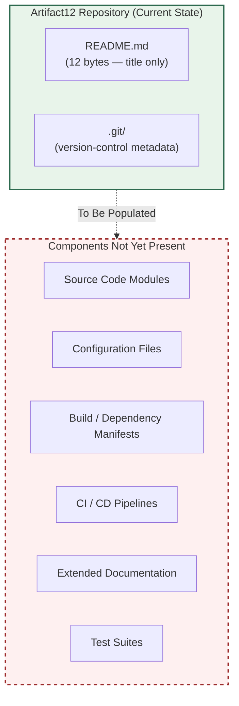

### 1.2.3 Success Criteria

#### 1.2.3.1 Measurable Objectives

No measurable objectives are recorded in the repository. The `README.md` file contains no goals, no acceptance criteria, no service-level objectives, and no operational targets.

#### 1.2.3.2 Critical Success Factors

No critical success factors have been authored into any tracked file. This subsection will be populated when product or program documentation is introduced.

#### 1.2.3.3 Key Performance Indicators (KPIs)

No KPIs — neither product KPIs (e.g., adoption, activation, retention), technical KPIs (e.g., availability, latency, throughput, error rate), nor business KPIs (e.g., revenue impact, cost reduction) — are defined in the repository. The following placeholder table records the absence:

| KPI Category | Defined in Repository? | Source |
|--------------|------------------------|--------|
| Product / Adoption Metrics | No | — |
| Reliability / Availability Targets | No | — |
| Performance / Latency Targets | No | — |
| Business / Financial Outcomes | No | — |

---

## 1.3 SCOPE

The scope of a system can only be defined with reference to documented capabilities, requirements, or design intent. As established in the preceding subsections, the Artifact12 repository contains **no such documentation**. The scope statements below are therefore framed in terms of what is **observable** in the repository, while explicitly preserving the placeholder nature of in-scope and out-of-scope enumerations.

### 1.3.1 In-Scope Elements

#### 1.3.1.1 Core Features and Functionalities

No features or functionalities are implemented in the repository. The repository inventory (Section 1.2.2.2) confirms the absence of any executable artifact. Consequently, the in-scope feature set is currently empty.

| Feature Category | Items Currently In Scope |
|------------------|--------------------------|
| Must-Have Capabilities | None defined |
| Primary User Workflows | None defined |
| Essential Integrations | None defined |
| Key Technical Requirements | None defined |

#### 1.3.1.2 Implementation Boundaries

Implementation boundaries presuppose an implementation. Because no implementation exists, boundaries cannot be drawn from artifacts present in the repository.

| Boundary Dimension | Defined in Repository? | Observed Evidence |
|--------------------|------------------------|-------------------|
| System / Service Boundary | No | No service definitions or API contracts present |
| User Groups Covered | No | No authentication, authorization, or persona files |
| Geographic / Market Coverage | No | No localization, regional configuration, or market documentation |
| Data Domains Included | No | No schemas, models, or data-dictionary files present |

### 1.3.2 Out-of-Scope Elements

A meaningful out-of-scope list requires a defined in-scope baseline from which exclusions are subtracted. Since the in-scope baseline is empty (Section 1.3.1), an enumerative out-of-scope list cannot be produced without fabrication. The following categorical statements summarize the present, evidence-based posture:

| Exclusion Category | Current Status | Rationale |
|--------------------|----------------|-----------|
| Excluded Features / Capabilities | Cannot be enumerated | No in-scope baseline to subtract from |
| Future-Phase Considerations | Not documented | No roadmap or phasing plan present |
| Integration Points Not Covered | Cannot be enumerated | No integration surface defined (Section 1.2.1.3) |
| Unsupported Use Cases | Not documented | No use-case catalog present |

#### 1.3.2.1 Provisional Exclusion: Production Readiness

Until source code, dependency manifests, build configuration, test suites, security controls, observability instrumentation, and deployment descriptors are committed to the repository, the artifact in its present form is **not within scope as a production-deployable system**. This statement is made on the basis of the verified absence of any such artifacts (Section 1.2.2.2) and is the only out-of-scope claim that the repository's current state can support without fabrication.

### 1.3.3 Documentation Maintenance Posture

This Introduction has been authored under a strict **evidence-only** policy: every factual claim is grounded in observable repository content, and every claim that cannot be so grounded has been marked as "not present," "not documented," or "undefined" rather than invented. As the repository is populated in subsequent commits, this section is expected to be revised to reflect:

1. The business problem and value proposition as they emerge in committed documentation.
2. Identified stakeholders and users as roles are defined in artifacts such as `CODEOWNERS`, persona documents, or product briefs.
3. System capabilities, components, and technical approach as source code, configuration, and architecture documents are introduced.
4. Success criteria and KPIs as measurable objectives are authored.
5. In-scope and out-of-scope enumerations as requirements and design decisions are captured.

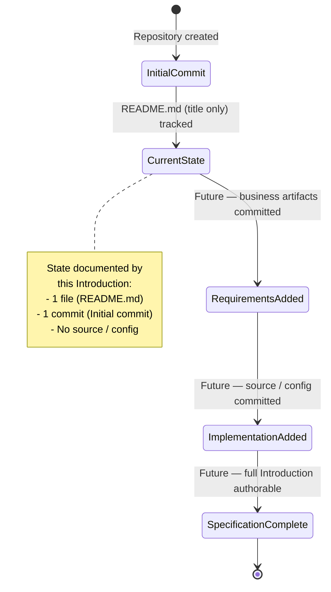

---

## 1.4 References

The following repository artifacts and metadata were examined in the authoring of this Introduction section. Each reference reflects content that was directly observed; no inferred or external sources were used.

### 1.4.1 Files Examined

- `README.md` — The sole tracked file in the repository. Verified to contain exactly one line consisting of the Markdown level-one heading `# Artifact12` (12 bytes total). Used as the authoritative source for the repository name and as evidence of the absence of descriptive content.

### 1.4.2 Folders Examined

- `/` (repository root) — Inventoried for top-level contents. Confirmed to contain only `README.md` and the `.git/` metadata directory. Used as the authoritative source for the assertion that no source directories, build manifests, configuration files, or supporting documentation are present.
- `.git/` — Standard Git version-control metadata directory; examined only for commit history and remote-origin attribution, not for application content.

### 1.4.3 Repository Metadata Examined

- **Git remote origin** — `https://github.com/shalini690/Artifact12.git`; used as evidence of the canonical repository identity and hosting location.
- **Git commit history** — Single commit titled `Initial commit` (hash `5a796d794af56bb8930b5554aea8a563c39931d9`), authored by `shalini690 <shalini@blitzy.io>` on June 1, 2026; used as evidence of the repository's initial / pre-implementation state.
- **Git branch metadata** — Default branch `main`; used as evidence of the active branch under specification.

### 1.4.4 Cross-Referenced Technical Specification Sections

No other sections of this Technical Specification were available for cross-reference at the time of authoring (the list of retrievable sections was empty). Subsequent revisions of this Introduction should be re-evaluated against any sections that are subsequently authored, particularly those covering technology stack, system architecture, functional requirements, and non-functional requirements.

# 2. Product Requirements

## 2.1 PREFACE AND METHODOLOGICAL BASIS

### 2.1.1 Section Authoring Constraint

This Product Requirements section is authored under the identical **evidence-only policy** declared in Section 1.3.3 of this Technical Specification. Every claim is grounded in directly observable repository content; every requirement element that cannot be so grounded is recorded as "none defined," "not present," "not documented," or "cannot be enumerated" rather than invented.

A Feature Catalog, Functional Requirements Table, Feature Relationships diagram, and Implementation Considerations matrix can only be authored against an evidentiary base of features, capabilities, or requirements artifacts committed to the repository. As demonstrated in the preceding sections of this Technical Specification, no such artifacts exist in the Artifact12 repository at the time of authoring. The structural skeleton of this section is therefore preserved in full — with every prompted subsection enumerated — while the content of each subsection records the verified absence of source material.

### 2.1.2 Repository State Snapshot Relevant to Product Requirements

The following snapshot consolidates the evidentiary findings from Sections 1.1 through 1.4 that bear directly on the authorship of product requirements. Each row below has been independently verified in the cited preceding section.

| Attribute Relevant to Requirements | Verified Value | Originating Section |
|-----------------------------------|----------------|---------------------|
| Tracked source artifacts | `README.md` (12 bytes) and `.git/` only | Section 1.2.2.2 |
| Implemented system capabilities | None | Section 1.2.2.1 |
| In-scope features | None defined | Section 1.3.1.1 |
| Committed technology stack | None (language, runtime, framework all undetermined) | Section 1.2.2.3 |
| Documented integration surface | None declared | Section 1.2.1.3 |

### 2.1.3 ID Allocation Policy

The prompt for this section requires consistent identifier formatting: features in the form `F-XXX` and functional requirements in the form `F-XXX-RQ-YYY`. Because zero features exist in the repository, **no identifiers in either format have been allocated** in this section. Allocating placeholder identifiers (e.g., `F-001` for an unspecified feature) would constitute fabrication and is therefore explicitly avoided. The first identifier in each scheme will be assigned when the first feature is committed to the repository in a future revision.

---

## 2.2 FEATURE CATALOG

### 2.2.1 Feature Catalog Status

The Feature Catalog is **empty by direct evidence**. The repository inventory in Section 1.2.2.2 confirms that no executable artifact, module, package, library, or service exists beyond the `README.md` placeholder and the Git metadata directory. The in-scope feature enumeration in Section 1.3.1.1 explicitly records "None defined" across Must-Have Capabilities, Primary User Workflows, Essential Integrations, and Key Technical Requirements. Consequently, the Feature Catalog contains zero entries.

### 2.2.2 Feature Metadata

No feature metadata exists to be cataloged. The placeholder table below preserves the prompted metadata schema and records the absence of populating data.

| Metadata Field | Items Currently Defined |
|----------------|-------------------------|
| Unique ID (`F-XXX`) | None allocated |
| Feature Name | None defined |
| Feature Category | None defined |
| Priority Level (Critical / High / Medium / Low) | None assigned |

The Status dimension (Proposed / Approved / In Development / Completed) is also unpopulated. With no features defined, no lifecycle state can be ascribed.

| Lifecycle Status | Feature Count |
|------------------|---------------|
| Proposed | 0 |
| Approved | 0 |
| In Development | 0 |
| Completed | 0 |

### 2.2.3 Feature Descriptions

The descriptive dimensions required by the prompt — Overview, Business Value, User Benefits, and Technical Context — cannot be authored in the absence of features. Each dimension is recorded as not present below, with the originating evidentiary section.

| Description Dimension | Documentation Status | Evidentiary Basis |
|-----------------------|----------------------|-------------------|
| Overview | Not present | Section 1.1.2 (no problem statement) |
| Business Value | Not present | Section 1.1.4 (no value proposition) |
| User Benefits | Not present | Section 1.1.3 (no user personas) |
| Technical Context | Not present | Section 1.2.2.3 (no technical approach) |

### 2.2.4 Feature Dependencies

Feature dependencies presuppose at least two features between which a dependency relation can be established. With zero features in the catalog, no dependency tuples can be authored.

| Dependency Category | Documentation Status |
|---------------------|----------------------|
| Prerequisite Features | Cannot be enumerated |
| System Dependencies | Cannot be enumerated |
| External Dependencies | Cannot be enumerated |
| Integration Requirements | Cannot be enumerated |

---

## 2.3 FUNCTIONAL REQUIREMENTS TABLE

### 2.3.1 Functional Requirements Status

A Functional Requirements Table maps each feature `F-XXX` to its constituent requirements `F-XXX-RQ-YYY`. Because the Feature Catalog (Section 2.2) is empty, the domain of the mapping is empty, and consequently the Functional Requirements Table is empty. No requirement identifiers in the `F-XXX-RQ-YYY` format have been allocated.

### 2.3.2 Requirement Details

The four requirement-detail dimensions prescribed by the prompt are preserved schematically below and recorded as unpopulated.

| Requirement Detail | Documentation Status |
|--------------------|----------------------|
| Requirement ID (`F-XXX-RQ-YYY`) | None allocated |
| Description | Not authored |
| Acceptance Criteria | Not authored |
| Priority (Must-Have / Should-Have / Could-Have) | Not assigned |

Complexity classification (High / Medium / Low) is similarly unpopulated, as complexity assessment requires a defined requirement against which technical scope can be evaluated.

| Complexity Tier | Requirement Count |
|-----------------|-------------------|
| High | 0 |
| Medium | 0 |
| Low | 0 |

### 2.3.3 Technical Specifications

The Technical Specifications dimensions (Input Parameters, Output/Response, Performance Criteria, Data Requirements) require a defined functional boundary to populate. Per Section 1.2.2.2, no API contracts, schemas, or interface definitions exist in the repository.

| Technical Specification Field | Documentation Status | Evidentiary Basis |
|-------------------------------|----------------------|-------------------|
| Input Parameters | None defined | Section 1.2.1.3 (no inbound API definitions) |
| Output / Response | None defined | Section 1.2.1.3 (no outbound clients) |
| Performance Criteria | None defined | Section 1.2.3.3 (no KPIs) |
| Data Requirements | None defined | Section 1.3.1.2 (no data domains) |

### 2.3.4 Validation Rules

Validation rules (Business Rules, Data Validation, Security Requirements, Compliance Requirements) are similarly unpopulated. The repository contains no `LICENSE` file, no security policy, no regulatory designation, and no business-rule documentation (Section 1.2.2.2).

| Validation Rule Category | Documentation Status |
|--------------------------|----------------------|
| Business Rules | Not present |
| Data Validation | Not present |
| Security Requirements | Not present |
| Compliance Requirements | Not present |

---

## 2.4 FEATURE RELATIONSHIPS

### 2.4.1 Feature Dependencies Map

The prompt instructs: "Only document feature relationships that are clearly evident in the requirements or source code. Don't imagine any feature relationships of your own." With zero features in the Feature Catalog (Section 2.2.1), the dependency map is the empty graph: no nodes, no edges. No directed or undirected dependency relations are authored in this section.

### 2.4.2 Integration Points

Per Section 1.2.1.3, the repository declares no integration surface with any external system, internal platform, or third-party service. The integration-category table in Section 1.2.1.3 records "No" across Inbound API Definitions, Outbound Service Clients, Event/Messaging Schemas, Identity/Authentication Providers, and Data Source/Sink Connectors. Consequently, no integration points between features can be documented because (a) no features exist, and (b) no integration boundaries exist independently.

### 2.4.3 Shared Components and Common Services

Per Section 1.2.2.2, the repository contains no application components beyond Git metadata and the placeholder `README.md`. No shared libraries, common runtime services, infrastructure modules, or platform components are present. The notion of "sharing" presupposes at least two consumers; with zero features, the consumer set is empty.

### 2.4.4 Consolidated Relationship Status

| Relationship Dimension | Status | Evidentiary Basis |
|------------------------|--------|-------------------|
| Feature Dependencies Map | Empty graph | Section 2.2.1 |
| Integration Points | None | Section 1.2.1.3 |
| Shared Components | None | Section 1.2.2.2 |
| Common Services | None | Section 1.2.2.3 |

### 2.4.5 Visual Representation of the Empty Feature Space

The diagram below visualizes the current absence of features and the conditions under which feature relationships could be authored in future revisions of this Technical Specification.

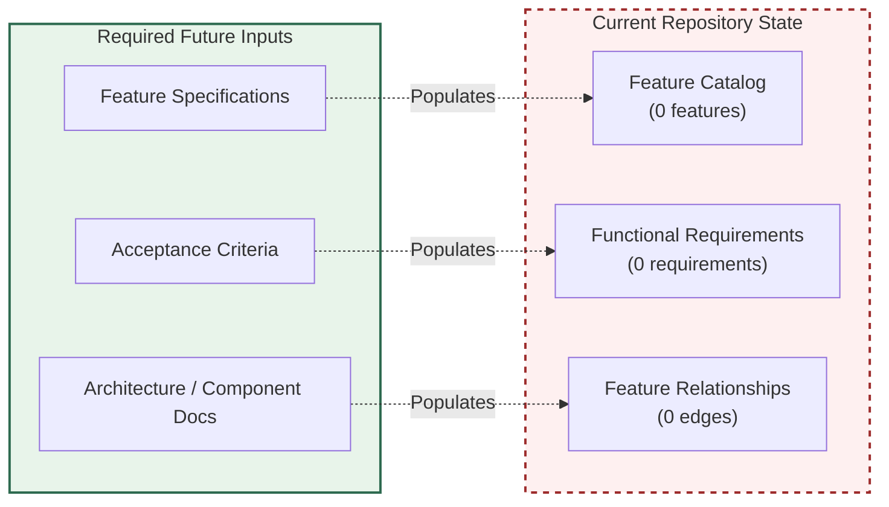

---

## 2.5 IMPLEMENTATION CONSIDERATIONS

### 2.5.1 Technical Constraints

Per Section 1.2.2.3, programming language, runtime environment, framework selection, persistence strategy, deployment topology, and architectural style are all undetermined in the repository. No constraint can be evidenced from artifacts that do not exist. Technical constraints for the (non-existent) feature set are therefore recorded as not derivable.

### 2.5.2 Performance Requirements

Per Section 1.2.3.3, the KPI placeholder table records "No" across Product/Adoption Metrics, Reliability/Availability Targets, Performance/Latency Targets, and Business/Financial Outcomes. No throughput, latency, concurrency, or capacity targets are defined. The performance requirement set is empty.

### 2.5.3 Scalability Considerations

Scalability considerations require a defined deployment topology (vertical vs. horizontal scaling axes, stateless vs. stateful service partitioning, data-sharding strategy, caching tiers). Section 1.2.2.3 confirms that deployment topology is undetermined. Consequently, scalability considerations cannot be derived from the current repository state.

### 2.5.4 Security Implications

The repository contains no authentication or authorization scheme, no identity-provider configuration (Section 1.2.1.3), no secrets-management policy, no security-control documentation, and no threat model. No `SECURITY.md` file or equivalent is present in the inventory recorded by Section 1.2.2.2. Security implications for individual features cannot be assessed because no features exist; security implications for the system as a whole cannot be assessed because no system implementation exists.

### 2.5.5 Maintenance Requirements

Per Section 1.1.3, no `CODEOWNERS`, `MAINTAINERS`, or runbook files exist in the repository. No operational owners are documented. Per Section 1.2.2.2, no test suites, CI/CD pipelines, or observability configuration exist. Maintenance requirements — including update cadence, patching policy, support tier, and backward-compatibility commitments — are therefore not documented.

### 2.5.6 Consolidated Implementation Considerations Matrix

| Consideration | Documentation Status | Evidentiary Cross-Reference |
|---------------|----------------------|------------------------------|
| Technical Constraints | Not derivable | Section 1.2.2.3 |
| Performance Requirements | None defined | Section 1.2.3.3 |
| Scalability Considerations | Not derivable | Section 1.2.2.3 |
| Security Implications | Not assessable | Section 1.2.1.3 |
| Maintenance Requirements | Not documented | Sections 1.1.3, 1.2.2.2 |

---

## 2.6 TRACEABILITY MATRIX

### 2.6.1 Traceability Matrix Status

A traceability matrix correlates business objectives, features, functional requirements, design elements, source modules, and verification artifacts (test cases). Each correlation axis requires populated artifacts on both ends of the mapping. As consolidated in Sections 1.1, 1.2, 1.3, and 2.2–2.5, **every axis of a potential traceability matrix is empty**. No traceability links can be authored.

### 2.6.2 Placeholder Axis Inventory

| Traceability Axis | Source Axis Populated? | Target Axis Populated? |
|-------------------|------------------------|------------------------|
| Business Objective → Feature | No (Section 1.1.4) | No (Section 2.2.1) |
| Feature → Functional Requirement | No (Section 2.2.1) | No (Section 2.3.1) |
| Requirement → Design Element | No (Section 2.3.1) | No (Section 1.2.2.3) |
| Requirement → Test Case | No (Section 2.3.1) | No (Section 1.2.2.2) |

### 2.6.3 Section-to-Evidence Traceability

While requirement-to-implementation traceability cannot be authored, the table below establishes traceability between the subsections of this Section 2 and the evidentiary sections of the existing Technical Specification on which their "absent" determinations are grounded. This satisfies the prompt's traceability-matrix requirement to the extent permitted by the evidence-only constraint.

| Section 2 Subsection | Evidentiary Anchor | Determination |
|----------------------|--------------------|-------------|
| 2.2 Feature Catalog | Section 1.3.1.1 | Empty by evidence |
| 2.3 Functional Requirements | Section 1.2.2.1 | Empty by evidence |
| 2.4 Feature Relationships | Section 1.2.1.3 | Empty by evidence |
| 2.5 Implementation Considerations | Section 1.2.2.3 | Not derivable |

---

## 2.7 ASSUMPTIONS AND CONSTRAINTS

### 2.7.1 Documented Assumptions

The repository in its current state encodes no explicit assumptions. The single tracked file (`README.md`, 12 bytes) contains no narrative content beyond the project title. Consequently, no business, technical, regulatory, or operational assumptions can be enumerated from observable artifacts.

| Assumption Category | Documented? |
|---------------------|-------------|
| Business Assumptions | No |
| Technical Assumptions | No |
| Operational Assumptions | No |
| Regulatory Assumptions | No |

### 2.7.2 Documented Constraints

| Constraint Category | Documented? | Evidentiary Basis |
|---------------------|-------------|-------------------|
| Schedule Constraints | No | No roadmap, milestones, or release plan |
| Budgetary Constraints | No | No financial documentation |
| Resource Constraints | No | No staffing or team documentation |
| Regulatory Constraints | No | No compliance designation present |

### 2.7.3 Methodological Constraint Applicable to This Section

The single explicit constraint governing this section is **methodological** rather than substantive: namely, the evidence-only authoring policy declared in Section 1.3.3 and reaffirmed in Section 2.1.1. Under this constraint, no feature, requirement, relationship, or implementation consideration may be authored without a corresponding artifact committed to the repository.

---

## 2.8 REQUIREMENT VERSIONING

### 2.8.1 Version Baseline

This is the **initial issuance** of Section 2 of the Technical Specification. The corresponding Git commit baseline is the single commit `5a796d794af56bb8930b5554aea8a563c39931d9` ("Initial commit") authored on June 1, 2026 (as established in Section 1.4.3).

| Version Attribute | Value |
|-------------------|-------|
| Section Version | 1.0 (initial issuance) |
| Repository Commit Baseline | `5a796d794af56bb8930b5554aea8a563c39931d9` |
| Commit Date Baseline | June 1, 2026 |
| Requirement Records Versioned | 0 |

### 2.8.2 Version-Tracking Schema for Future Requirements

When functional requirements are authored against committed features, each requirement entry will be associated with its introducing commit and version increment. The schema below is reserved for that future use; no rows are populated at this time.

| Requirement ID | Introduced in Commit | Section Version |
|----------------|----------------------|-----------------|
| (none allocated) | — | — |

---

## 2.9 DOCUMENTATION MAINTENANCE POSTURE

### 2.9.1 Triggers for Section Population

This section will transition from its current placeholder state to an authored state when specific artifact classes are committed to the repository. The table below maps each subsection to the artifact class whose introduction unblocks its authorship.

| Subsection | Unblocking Artifact Class |
|------------|---------------------------|
| 2.2 Feature Catalog | Product brief, feature specification, PRD |
| 2.3 Functional Requirements | User stories with acceptance criteria |
| 2.4 Feature Relationships | Component or dependency diagrams |
| 2.5 Implementation Considerations | ADRs, NFR documents, technology selections |

### 2.9.2 Population Lifecycle

The diagram below mirrors the Section 1.3.3 lifecycle to position Section 2 within the broader specification-maturation flow.

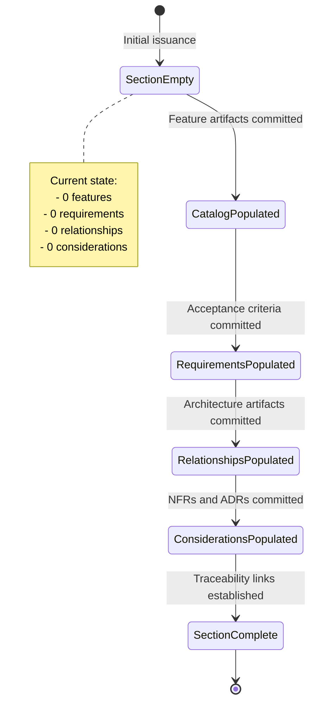

### 2.9.3 Consistency with Section 1 Posture

This section maintains the documentation posture declared in Section 1.3.3: every absent element is recorded explicitly rather than omitted, every cross-reference is anchored to a verified evidentiary section, and no element is fabricated to fill a prescribed schema. Subsequent revisions of this Section 2 should preserve the same posture until features and requirements are committed.

---

## 2.10 REFERENCES

### 2.10.1 Files Examined

- `README.md` — The sole tracked content file in the repository. Re-verified for this section to contain exactly one line consisting of the level-one Markdown heading `# Artifact12` (12 bytes total). Used as the authoritative source for the determination that no feature, requirement, or business narrative is encoded in any tracked file.

### 2.10.2 Folders Examined

- `/` (repository root) — Re-inventoried for this section to confirm that no `requirements/`, `docs/`, `specs/`, `features/`, `stories/`, or equivalent directories exist. The repository root contains only `README.md` and the `.git/` metadata directory, consistent with the inventory recorded in Section 1.2.2.2 and Section 1.4.2.
- `.git/` — Examined only for commit identity and authoring metadata; not used as a source of application content.

### 2.10.3 Cross-Referenced Technical Specification Sections

The following preceding sections of this Technical Specification were retrieved and consulted as evidentiary anchors for the absent-state determinations recorded in Section 2:

- **Section 1.1 — Executive Summary** — Source for the determinations recorded in Sections 2.1.2, 2.2.3, and 2.7.1, including the verified initial / pre-implementation repository state, the absence of any documented problem statement or value proposition, and the absence of stakeholder and persona documentation.
- **Section 1.2 — System Overview** — Source for the determinations recorded in Sections 2.3.3, 2.4.2, 2.4.3, 2.5.1, 2.5.3, and 2.5.4, including the explicit "no system capabilities implemented or specified" statement, the complete repository inventory (only `README.md` and `.git/`), the empty integration-category table, and the undetermined technical-approach finding.
- **Section 1.3 — Scope** — Source for the determinations recorded in Sections 2.2.1, 2.6.1, and 2.9.3, including the explicit "in-scope feature set is currently empty" statement and the documentation-maintenance posture inherited by this section.
- **Section 1.4 — References** — Source for the repository-metadata attributes (origin URL, default branch, initial commit hash, authoring identity, commit date) reused in Sections 2.1.2 and 2.8.1 of this section.

### 2.10.4 Repository Metadata Re-Confirmed for This Section

| Metadata Attribute | Value | Originating Section |
|--------------------|-------|---------------------|
| Repository Name | Artifact12 | Section 1.1.1 |
| Default Branch | `main` | Section 1.4.3 |
| Commit Count | 1 (Initial commit) | Section 1.4.3 |
| Commit Baseline | `5a796d794af56bb8930b5554aea8a563c39931d9` | Section 1.4.3 |

# 3. Technology Stack

## 3.1 AUTHORING CONSTRAINT AND TECHNOLOGY-STACK SNAPSHOT

### 3.1.1 Methodological Basis

This Technology Stack section is authored under the identical **evidence-only policy** declared in Section 1.3.3 and reaffirmed in Sections 2.1.1 and 2.7.3 of this Technical Specification. Every technology selection recorded below is grounded in directly observable repository content. Every prompted technology category that cannot be so grounded is recorded as "none committed," "not present," "not determined," or "cannot be enumerated" rather than invented.

A Technology Stack section can only enumerate concrete language, framework, library, dependency, service, storage, and tooling selections when one or more of the following artifact classes are committed to the repository:

1. **Source files** of one or more programming languages (e.g., `.py`, `.js`, `.ts`, `.java`, `.go`, `.rs`, `.kt`, `.swift`, `.m`, `.cs`).
2. **Dependency manifests** declaring third-party packages, registries, and pinned versions (e.g., `package.json`, `requirements.txt`, `pyproject.toml`, `Pipfile`, `pom.xml`, `build.gradle`, `go.mod`, `Cargo.toml`, `Gemfile`, `composer.json`, `*.csproj`, `Podfile`).
3. **Service integration descriptors** declaring external APIs, identity providers, observability backends, or cloud services (e.g., OpenAPI documents, SDK client configurations, IAM role definitions, `.env` templates).
4. **Storage configuration artifacts** declaring database engines, schemas, migrations, or persistence layers (e.g., `*.sql`, ORM model files, `migrations/`, `schemas/`, NoSQL collection definitions).
5. **Development and deployment descriptors** declaring build systems, containerization, infrastructure-as-code, or CI/CD pipelines (e.g., `Makefile`, `Dockerfile`, `docker-compose.yml`, `*.tf`, Kubernetes manifests, `.github/workflows/`, `.gitlab-ci.yml`, `Jenkinsfile`).

As verified in Section 1.2.2.2 and Section 2.10.2, **none** of these artifact classes exist in the Artifact12 repository at the time of authoring. The structural skeleton of this section is therefore preserved in full — with every prompted dimension enumerated — while the content of each subsection records the verified absence of source material.

### 3.1.2 Repository State Snapshot Relevant to Technology Selection

The following snapshot consolidates the evidentiary findings from Sections 1 and 2 that bear directly on the authorship of technology-stack determinations. Each row below has been independently verified in the cited preceding section and is recorded here for the convenience of readers consulting Section 3 in isolation.

| Attribute Relevant to Technology Stack | Verified Value | Originating Section |
|----------------------------------------|----------------|---------------------|
| Tracked source artifacts | `README.md` (12 bytes) and `.git/` only | Section 1.2.2.2 |
| Source files of any programming language | None present | Section 1.2.2.2 |
| Dependency manifest files | None present | Section 1.2.2.2 |
| Configuration files (`.env`, `*.yaml`, `*.toml`, `*.ini`) | None present | Section 1.2.2.2 |
| Container / orchestration descriptors | None present | Section 1.2.2.2 |
| CI/CD pipeline definitions | None present | Section 1.2.2.2 |
| Infrastructure-as-code artifacts | None present | Section 1.2.2.2 |
| Database schemas, ORM models, migrations | None present | Section 1.2.2.2 |
| Integration surface (inbound APIs, outbound clients, events, identity, data connectors) | None declared | Section 1.2.1.3 |
| Committed technology decisions (language, runtime, framework, persistence, topology, style) | All undetermined | Section 1.2.2.3 |
| Authentication / authorization scheme | None present | Section 2.5.4 |
| Identity-provider configuration | None present | Section 2.5.4 |
| Secrets-management policy | None present | Section 2.5.4 |

### 3.1.3 Non-Application of Default Technology Stack

The authoring prompt for this section provides a Default Technology Stack as a fallback (AWS, Docker, Terraform, GitHub Actions, Python/Flask, Auth0, MongoDB, Langchain, React with TypeScript, TailwindCSS, React-Native, Swift, Kotlin, Objective-C, ElectronJS). The same prompt also instructs the author to "only include sections and items that are actually relevant to this system, based on your analysis of its requirements" and to "not add any items that aren't clearly applicable."

These two directives are reconciled by the evidence-only constraint declared in Sections 1.3.3, 2.1.1, and 2.7.3: imposing the default stack onto a repository that contains zero corroborating artifacts would constitute fabrication and would directly violate the methodological constraint binding every preceding section of this Technical Specification. Accordingly, **no element of the Default Technology Stack is asserted as a selection of this system** within Section 3. The default stack is recorded here only as the catalogue against which the empty-state determination is made; each component below is marked "not committed" with reference to the evidentiary anchor that establishes its absence.

---

## 3.2 PROGRAMMING LANGUAGES

### 3.2.1 Evidentiary Status

The repository commits no programming-language indicators. Per Section 1.2.2.3, programming language is explicitly recorded as **undetermined** because no source or configuration files exist to evidence it. The inventory recorded in Section 1.2.2.2 — limited to `README.md` (12 bytes) and the `.git/` metadata directory — contains no file with any source-code extension. No language can therefore be enumerated for any platform or component.

### 3.2.2 Per-Platform Determination

The following table records, for each platform tier referenced in the prompt's Default Technology Stack, the verified absence of language commitment in the repository. The "Evidentiary Anchor" column points to the preceding Tech Spec section that establishes the absence.

| Platform / Component | Language Selection | Evidentiary Anchor |
|----------------------|---------------------|---------------------|
| Backend services | Not determined; no `.py`, `.js`, `.ts`, `.java`, `.go`, `.rs`, `.rb`, `.cs`, `.cpp` files committed | Section 1.2.2.2, Section 1.2.2.3 |
| Web frontend | Not determined; no `.html`, `.css`, `.js`, `.ts`, `.jsx`, `.tsx` files committed | Section 1.2.2.2, Section 1.2.2.3 |
| Mobile / cross-platform | Not determined; no React-Native, Flutter, or hybrid-runtime sources committed | Section 1.2.2.2, Section 1.2.2.3 |
| Native iOS | Not determined; no `.swift`, `.m`, `.mm` files or Xcode project committed | Section 1.2.2.2, Section 1.2.2.3 |
| Native Android | Not determined; no `.kt`, `.java` files or Gradle project committed | Section 1.2.2.2, Section 1.2.2.3 |
| Native macOS | Not determined; no `.m`, `.mm`, `.swift` files or Xcode project committed | Section 1.2.2.2, Section 1.2.2.3 |
| Desktop (Electron / native) | Not determined; no Electron `package.json` or native desktop sources committed | Section 1.2.2.2, Section 1.2.2.3 |
| Infrastructure scripting | Not determined; no `*.tf`, `*.sh`, `*.ps1`, `*.py` infrastructure scripts committed | Section 1.2.2.2 |

### 3.2.3 Selection Criteria, Constraints, and Dependencies

No selection criteria have been authored into any tracked file, and no constraints on language choice are recorded. Per Section 2.5.1, "no constraint can be evidenced from artifacts that do not exist," and per Section 2.7.3, the only constraint governing this section is the methodological evidence-only policy itself. Language-level dependencies (runtime versions, polyglot interop requirements, FFI boundaries) cannot be derived because no language has been chosen.

---

## 3.3 FRAMEWORKS AND LIBRARIES

### 3.3.1 Core Frameworks

The repository commits no application frameworks. Per Section 1.2.2.3, framework selection is explicitly undetermined. The inventory in Section 1.2.2.2 records no framework-bearing files of any kind — no `Flask` blueprints, no `Django` settings modules, no `Express` server files, no `Spring` annotations, no `FastAPI` routers, no React/Vue/Angular component trees, no Next.js / Nuxt / SvelteKit conventions, no iOS `AppDelegate` / Android `Application` entry points. The following table records the verified absence across the framework dimensions implied by the prompt's Default Technology Stack.

| Framework Dimension | Selection | Version | Evidentiary Anchor |
|---------------------|-----------|---------|---------------------|
| Backend web framework | None committed | — | Section 1.2.2.3 |
| AI / LLM framework | None committed | — | Section 1.2.2.3 |
| Web frontend framework | None committed | — | Section 1.2.2.3 |
| CSS framework | None committed | — | Section 1.2.2.3 |
| Mobile / cross-platform framework | None committed | — | Section 1.2.2.3 |
| Native iOS framework (UIKit / SwiftUI) | None committed | — | Section 1.2.2.3 |
| Native Android framework (Jetpack / Compose) | None committed | — | Section 1.2.2.3 |
| Desktop application framework | None committed | — | Section 1.2.2.3 |
| Testing framework | None committed | — | Section 1.2.2.2 |

### 3.3.2 Supporting Libraries

Supporting libraries (HTTP clients, serialization libraries, validation libraries, logging frameworks, ORM/ODM toolkits, dependency-injection containers, etc.) cannot be enumerated because no dependency manifest is committed to the repository. Per Section 1.2.2.2, the explicit list of absent manifest classes includes `package.json`, `requirements.txt`, `pom.xml`, `go.mod`, `Cargo.toml`, and `Gemfile`. The supporting-library set is therefore **empty**, with no version pins, no transitive dependency graph, and no advisory or compatibility metadata associated with this Technical Specification.

### 3.3.3 Compatibility Requirements

Compatibility requirements between frameworks and supporting libraries (e.g., minimum runtime versions, peer-dependency ranges, ABI compatibility windows, browser-target matrices) cannot be derived because no frameworks or libraries have been selected. Per Section 2.5.1, technical constraints for the (non-existent) feature set are recorded as not derivable; the same determination applies to compatibility requirements within this section.

---

## 3.4 OPEN SOURCE DEPENDENCIES

### 3.4.1 Dependency Manifest Inventory

No open-source third-party libraries are declared by the repository. The verified absence of every standard dependency-manifest file class — enumerated explicitly in Section 1.2.2.2 — precludes the enumeration of any package, version, or registry coordinate. The table below records the absence across the manifest classes that would otherwise enumerate open-source dependencies.

| Ecosystem | Expected Manifest File(s) | Present in Repository? | Evidentiary Anchor |
|-----------|---------------------------|------------------------|---------------------|
| Node.js / JavaScript / TypeScript | `package.json`, `package-lock.json`, `yarn.lock`, `pnpm-lock.yaml` | No | Section 1.2.2.2 |
| Python | `requirements.txt`, `setup.py`, `pyproject.toml`, `Pipfile`, `Pipfile.lock`, `poetry.lock` | No | Section 1.2.2.2 |
| JVM (Java / Kotlin / Scala) | `pom.xml`, `build.gradle`, `build.gradle.kts`, `settings.gradle` | No | Section 1.2.2.2 |
| Go | `go.mod`, `go.sum` | No | Section 1.2.2.2 |
| Rust | `Cargo.toml`, `Cargo.lock` | No | Section 1.2.2.2 |
| Ruby | `Gemfile`, `Gemfile.lock` | No | Section 1.2.2.2 |
| PHP | `composer.json`, `composer.lock` | No | Section 1.2.2.2 |
| .NET / C# | `*.csproj`, `*.sln`, `packages.config` | No | Section 1.2.2.2 |
| iOS / Swift | `Podfile`, `Package.swift`, `*.xcodeproj` | No | Section 1.2.2.2 |
| Android | `build.gradle`, `gradle.properties` | No | Section 1.2.2.2 |

### 3.4.2 Package Registries

No package registry references (e.g., npm, PyPI, Maven Central, Go module proxy, crates.io, RubyGems, Packagist, NuGet, CocoaPods, Swift Package Index) are configured in the repository. Registry resolution, mirror configuration, scoped-registry authentication, and private-feed credentials are therefore all undefined. The set of effective package registries for this system is **empty**.

### 3.4.3 Version Pinning

Version pinning, lockfile generation, and reproducible-build guarantees cannot be characterized in the absence of any manifest or lockfile. No semantic-version ranges, no exact pins, no Git-SHA references, and no vendored sources are present in the repository. This determination is fully consistent with Section 2.5.5, which records the absence of any maintenance posture (update cadence, patching policy) in the repository.

---

## 3.5 THIRD-PARTY SERVICES

### 3.5.1 External APIs and Integrations

Per Section 1.2.1.3, the repository **declares no integration surface** with any external system, internal platform, or third-party service. The integration-category table in Section 1.2.1.3 records "No" across all five integration categories: Inbound API Definitions, Outbound Service Clients, Event / Messaging Schemas, Identity / Authentication Providers, and Data Source / Sink Connectors. No external API client is configured, no SDK is imported, and no service contract (OpenAPI, GraphQL schema, gRPC `.proto`, AsyncAPI) is committed.

### 3.5.2 Authentication Services

Per Section 2.5.4, the repository "contains no authentication or authorization scheme, no identity-provider configuration, no secrets-management policy, no security-control documentation, and no threat model." No identity-provider integration (e.g., Auth0, Okta, AWS Cognito, Azure AD, Google Identity Platform, Firebase Authentication, Keycloak) is configured. No OAuth 2.0 / OIDC client registration, no SAML federation, and no API-key issuance scheme is present. Authentication-service selection is therefore **not determined**.

### 3.5.3 Monitoring and Observability Tools

No monitoring, logging, metrics, tracing, or alerting integration is committed. The inventory in Section 1.2.2.2 records no observability configuration of any kind — no OpenTelemetry collectors, no Prometheus scrape definitions, no Grafana dashboards, no Datadog / New Relic / Sentry / Honeycomb / Splunk client configurations, no `logging.yaml` or equivalent. Per Section 2.5.5, the maintenance and operations posture is undocumented, and observability-tool selection is consistent with that determination: **none**.

### 3.5.4 Cloud Services

No cloud-service configuration is present. The inventory recorded in Section 1.2.2.2 confirms the absence of cloud-vendor-specific artifacts (e.g., AWS CloudFormation templates, CDK projects, S3/SQS/SNS/DynamoDB/Lambda configurations; Azure ARM/Bicep templates, App Service / Functions configurations; GCP Deployment Manager / Cloud Build / Cloud Run configurations) as well as vendor-neutral infrastructure-as-code (e.g., Terraform `*.tf`, Pulumi `Pulumi.yaml`, Crossplane manifests). The system is therefore **not bound to any cloud provider** in its present state.

| Third-Party Service Category | Selection | Evidentiary Anchor |
|------------------------------|-----------|---------------------|
| External APIs / SDKs | None integrated | Section 1.2.1.3 |
| Identity / Authentication | None integrated | Section 2.5.4 |
| Secrets Management | None configured | Section 2.5.4 |
| Observability (logs, metrics, traces) | None configured | Section 1.2.2.2 |
| Error Tracking | None configured | Section 1.2.2.2 |
| Cloud Platform | None bound | Section 1.2.2.2 |
| Messaging / Event Bus | None configured | Section 1.2.1.3 |
| Email / Notification Services | None configured | Section 1.2.1.3 |

---

## 3.6 DATABASES AND STORAGE

### 3.6.1 Primary and Secondary Databases

No database engine is selected. Per Section 1.2.2.3, persistence strategy is explicitly recorded as **undetermined**. The inventory in Section 1.2.2.2 records the absence of any schema artifact: no `*.sql` DDL files, no ORM model files, no migration directories (`migrations/`, `db/migrate/`, `alembic/`, `prisma/`), no NoSQL collection or index definitions, and no client-driver configuration. Neither a primary database (relational or document-oriented) nor any secondary/replica database is committed.

| Database Tier | Engine Selection | Version | Evidentiary Anchor |
|---------------|------------------|---------|---------------------|
| Primary OLTP database | None committed | — | Section 1.2.2.3 |
| Secondary / read-replica database | None committed | — | Section 1.2.2.3 |
| Analytical / OLAP store | None committed | — | Section 1.2.2.3 |
| Search index | None committed | — | Section 1.2.2.3 |
| Time-series store | None committed | — | Section 1.2.2.3 |
| Graph database | None committed | — | Section 1.2.2.3 |

### 3.6.2 Data Persistence Strategies

Data persistence strategies (write-ahead logging, replication topology, backup-and-restore policy, retention windows, soft-delete vs. hard-delete semantics, partitioning and sharding) cannot be characterized because no database is selected. Per Section 1.3.1.2, no data domains are defined in the repository, and per Section 2.5.3, deployment topology and stateful-partitioning strategy are undetermined. Persistence strategy is therefore **not derivable**.

### 3.6.3 Caching Solutions

No caching layer is configured. No Redis, Memcached, in-memory, CDN-edge, or application-level cache is referenced in any tracked file. The inventory in Section 1.2.2.2 confirms the absence of any cache-related configuration. Caching strategy is **not determined**, consistent with Section 2.5.3's finding that caching tiers cannot be derived without a defined deployment topology.

### 3.6.4 Storage Services

No object storage (e.g., AWS S3, Azure Blob, GCS), block storage, file-system service, or external content-delivery configuration is committed. Storage-service binding is **not determined**, consistent with the cloud-services determination in Section 3.5.4 and the integration-surface determination in Section 1.2.1.3.

---

## 3.7 DEVELOPMENT AND DEPLOYMENT

### 3.7.1 Development Tools

No development-tooling configuration is committed. The inventory in Section 1.2.2.2 records the absence of editor configurations (`.editorconfig`, `.vscode/`, `.idea/`), linter configurations (`.eslintrc`, `pyproject.toml [tool.ruff]`, `golangci-lint.yml`, `rustfmt.toml`), formatter configurations (`.prettierrc`, `black.toml`), pre-commit hook definitions (`.pre-commit-config.yaml`, `.husky/`), and type-checker configurations (`tsconfig.json`, `mypy.ini`). Developer-experience tooling is therefore **not determined**.

### 3.7.2 Build System

No build system is configured. None of the build-manifest classes enumerated in Section 1.2.2.2 is present, and no build orchestrator (`Makefile`, `Justfile`, `Taskfile.yml`, `BUILD.bazel`, `BUCK`, `nx.json`, `turbo.json`, `lerna.json`) is committed. Build-time artifact generation, output-directory conventions, source-map generation, and bundling strategy are all undefined. The build-system dimension is therefore **empty**.

### 3.7.3 Containerization

No containerization is configured. Section 1.2.2.2 explicitly lists `Dockerfile`, `docker-compose.yml`, and Kubernetes manifests among the artifact classes absent from the repository. No `.dockerignore`, no multi-stage build definition, no Helm chart, no Kustomize overlay, and no container-registry reference exists. Containerization is therefore **not committed**.

### 3.7.4 CI/CD Requirements

No CI/CD pipeline is defined. The repository contains no `.github/workflows/` directory (explicitly noted in Section 1.2.2.2 as absent), no `.gitlab-ci.yml`, no `Jenkinsfile`, no `.circleci/config.yml`, no `azure-pipelines.yml`, no `.travis.yml`, no `.buildkite/`, and no `bitbucket-pipelines.yml`. Build automation, test automation, security scanning, artifact publishing, and deployment promotion are all undefined.

| Development & Deployment Dimension | Configuration Status | Evidentiary Anchor |
|------------------------------------|----------------------|---------------------|
| Editor / formatter / linter configuration | None committed | Section 1.2.2.2 |
| Type-checker configuration | None committed | Section 1.2.2.2 |
| Pre-commit hooks | None committed | Section 1.2.2.2 |
| Build orchestrator (`Makefile`, Bazel, Nx, Turbo) | None committed | Section 1.2.2.2 |
| Dependency manifest (build inputs) | None committed | Section 1.2.2.2, Section 3.4.1 |
| Containerization (`Dockerfile`, Compose) | None committed | Section 1.2.2.2 |
| Orchestration (Kubernetes, Helm, Kustomize) | None committed | Section 1.2.2.2 |
| Infrastructure as Code (Terraform, CDK, Pulumi) | None committed | Section 1.2.2.2 |
| CI/CD pipeline definitions | None committed | Section 1.2.2.2 |
| Release / deployment automation | None committed | Section 1.2.2.2 |

---

## 3.8 CONSOLIDATED TECHNOLOGY STACK MATRIX

### 3.8.1 Stack Dimension Status Matrix

The following matrix consolidates the per-subsection findings of Sections 3.2 through 3.7 against the dimensions implied by the prompt and the Default Technology Stack provided as fallback. Every "Status" entry is anchored to the evidentiary section that establishes the absence.

| Stack Dimension | Subsection | Status | Evidentiary Anchor |
|-----------------|------------|--------|---------------------|
| Backend language | 3.2 | Not determined | Section 1.2.2.3 |
| Frontend (web) language | 3.2 | Not determined | Section 1.2.2.3 |
| Mobile / cross-platform language | 3.2 | Not determined | Section 1.2.2.3 |
| Native iOS / Android / macOS / Desktop languages | 3.2 | Not determined | Section 1.2.2.3 |
| Backend framework | 3.3 | None committed | Section 1.2.2.3 |
| AI / LLM framework | 3.3 | None committed | Section 1.2.2.3 |
| Web frontend framework | 3.3 | None committed | Section 1.2.2.3 |
| CSS / styling framework | 3.3 | None committed | Section 1.2.2.3 |
| Mobile framework | 3.3 | None committed | Section 1.2.2.3 |
| Open-source dependencies (any ecosystem) | 3.4 | None declared | Section 1.2.2.2 |
| Package registries | 3.4 | None referenced | Section 1.2.2.2 |
| External APIs / SDKs | 3.5 | None integrated | Section 1.2.1.3 |
| Identity / Authentication services | 3.5 | None integrated | Section 2.5.4 |
| Monitoring / Observability tools | 3.5 | None configured | Section 1.2.2.2 |
| Cloud platform | 3.5 | None bound | Section 1.2.2.2 |
| Primary database engine | 3.6 | None committed | Section 1.2.2.3 |
| Secondary / replica databases | 3.6 | None committed | Section 1.2.2.3 |
| Caching solutions | 3.6 | None configured | Section 2.5.3 |
| Storage services | 3.6 | None bound | Section 1.2.1.3 |
| Development tooling | 3.7 | None committed | Section 1.2.2.2 |
| Build system | 3.7 | None committed | Section 1.2.2.2 |
| Containerization | 3.7 | None committed | Section 1.2.2.2 |
| Infrastructure as Code | 3.7 | None committed | Section 1.2.2.2 |
| CI/CD pipelines | 3.7 | None committed | Section 1.2.2.2 |

### 3.8.2 Empty-State Component Diagram

The diagram below mirrors the visualization pattern established in Section 1.2.2.3 to depict the present, evidenced state of the technology stack against the categories awaiting commit. The "Currently Evidenced" subgraph contains only the placeholder `README.md` (no technology-bearing artifact), while the "Awaiting Commits" subgraph enumerates the prompted stack dimensions whose authorship is unblocked by the future introduction of corresponding artifacts.

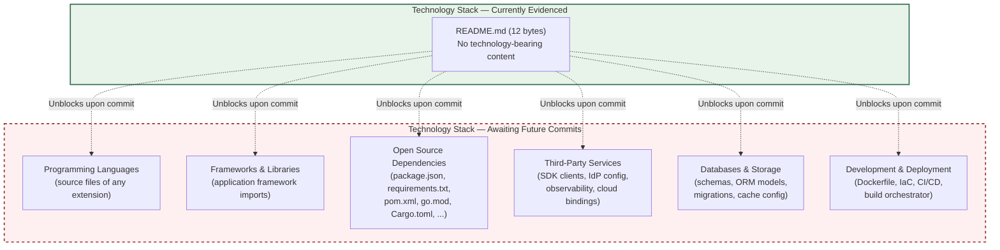

---

## 3.9 POPULATION LIFECYCLE AND TRIGGERS

### 3.9.1 Triggers for Subsection Population

Each subsection of Section 3 will transition from its current placeholder state to an authored state when the corresponding artifact class is committed to the repository. The table below maps each Section 3 subsection to the unblocking artifact class, consistent with the trigger-table pattern established in Section 2.9.1.

| Subsection | Unblocking Artifact Class |
|------------|---------------------------|
| 3.2 Programming Languages | Source files of one or more programming languages |
| 3.3 Frameworks and Libraries | Framework imports / configurations referenced from committed source |
| 3.4 Open Source Dependencies | Dependency manifest (`package.json`, `requirements.txt`, `pom.xml`, `go.mod`, `Cargo.toml`, `Gemfile`, etc.) with lockfile |
| 3.5 Third-Party Services | SDK client code, IdP configuration, observability configuration, cloud service descriptors |
| 3.6 Databases and Storage | Schema files, ORM models, migration directories, cache configuration |
| 3.7 Development and Deployment | `Dockerfile`, IaC sources (`*.tf`, CDK, Pulumi), CI/CD workflow files, build orchestrator manifests |

### 3.9.2 Lifecycle Diagram

The diagram below positions Section 3 within the broader specification-maturation flow established by Section 1.3.3 and mirrored by Section 2.9.2. The current state — `StackEmpty` — corresponds to the initial-issuance baseline at commit `5a796d794af56bb8930b5554aea8a563c39931d9`.

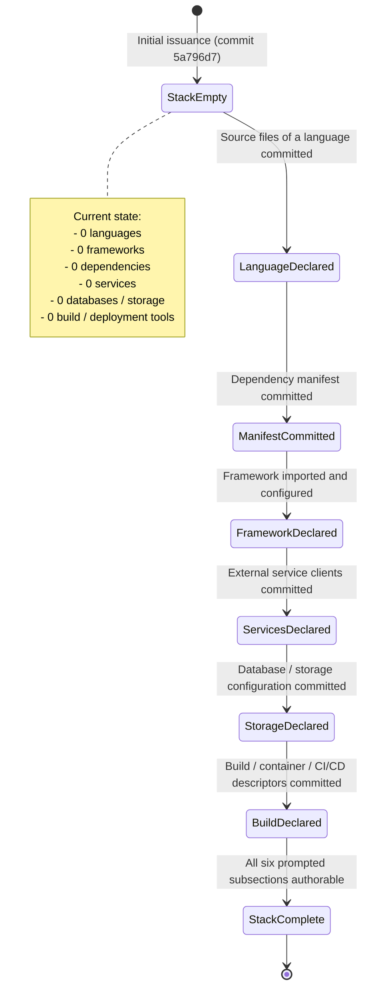

---

## 3.10 VERSION BASELINE

### 3.10.1 Section Version

This is the **initial issuance** of Section 3 of the Technical Specification. The section is published in version 1.0 and records zero technology selections, consistent with the verified empty state of the repository.

### 3.10.2 Repository Commit Baseline

Per Section 2.8.1, the version baseline for this Technical Specification is the single Git commit `5a796d794af56bb8930b5554aea8a563c39931d9` ("Initial commit") authored on June 1, 2026. Section 3 inherits this baseline directly and re-asserts it for the technology-stack determinations recorded above.

| Version Attribute | Value |
|-------------------|-------|
| Section Version | 1.0 (initial issuance) |
| Repository Commit Baseline | `5a796d794af56bb8930b5554aea8a563c39931d9` |
| Commit Date Baseline | June 1, 2026 |
| Technology Selections Recorded | 0 |
| Open-Source Dependencies Versioned | 0 |
| Third-Party Service Integrations | 0 |

### 3.10.3 Consistency with Section 1 and Section 2 Posture

This section maintains the documentation posture declared in Section 1.3.3 and reaffirmed in Sections 2.1.1, 2.7.3, and 2.9.3: every absent element is recorded explicitly rather than omitted, every cross-reference is anchored to a verified evidentiary section, and no element is fabricated to fill a prescribed schema. The Default Technology Stack supplied by the authoring prompt has been explicitly **not** imposed on this section (see Section 3.1.3). Subsequent revisions of Section 3 should preserve the same posture until the unblocking artifact classes enumerated in Section 3.9.1 are committed to the repository.

---

## 3.11 REFERENCES

### 3.11.1 Files Examined

- `README.md` — The sole tracked content file in the repository. Re-verified for this section to contain exactly one line consisting of the level-one Markdown heading `# Artifact12` (12 bytes total). Examined for any embedded technology references, badges, dependency links, or service URLs; none are present. Used as the authoritative source for the determination that no technology-stack indicator is encoded in any tracked file.

### 3.11.2 Folders Examined

- `/` (repository root) — Re-inventoried for this section to confirm the absence of source directories (`src/`, `lib/`, `app/`, `pkg/`, `cmd/`, `internal/`), build directories (`build/`, `dist/`, `out/`, `target/`), configuration directories (`config/`, `conf/`, `etc/`), test directories (`test/`, `tests/`, `__tests__/`, `spec/`), schema directories (`migrations/`, `schemas/`, `db/`), CI/CD directories (`.github/workflows/`, `.circleci/`, `.gitlab/`), and infrastructure directories (`infra/`, `terraform/`, `cloudformation/`, `k8s/`). The repository root contains only `README.md` and the `.git/` metadata directory.
- `.git/` — Examined only for the commit identity, branch information, and authoring metadata referenced in Section 3.10.2; not used as a source of application or technology-stack content.

### 3.11.3 Cross-Referenced Technical Specification Sections

The following preceding sections of this Technical Specification were retrieved and consulted as evidentiary anchors for the determinations recorded in Section 3:

- **Section 1.2 — System Overview** — Primary anchor for the entirety of Section 3. Section 1.2.2.3 establishes that programming language, runtime environment, framework selection, persistence strategy, deployment topology, and architectural style are all undetermined. Section 1.2.2.2 enumerates the absent artifact categories (build manifests, container descriptors, CI definitions, configuration files) whose presence would unblock Section 3 authorship. Section 1.2.1.3 establishes the empty integration surface.
- **Section 1.3 — Scope** — Source for the evidence-only authoring policy declared in Section 1.3.3, which governs the present section and prevents application of the Default Technology Stack.
- **Section 2.1 — Preface and Methodological Basis** — Reaffirms the evidence-only policy in Section 2.1.1 and provides the structural precedent for recording verified absence rather than fabricating selections.
- **Section 2.5 — Implementation Considerations** — Section 2.5.1 anchors the "no constraint derivable" determination in Section 3.2.3, Section 2.5.3 anchors the caching and topology determinations in Section 3.6, and Section 2.5.4 anchors the authentication-services and secrets-management determinations in Section 3.5.2.
- **Section 2.7 — Assumptions and Constraints** — Section 2.7.3 confirms that the only constraint governing this section is the methodological evidence-only policy itself.
- **Section 2.8 — Requirement Versioning** — Source for the commit baseline `5a796d794af56bb8930b5554aea8a563c39931d9` and the June 1, 2026 date reused in Section 3.10.
- **Section 2.9 — Documentation Maintenance Posture** — Provides the lifecycle-diagram and trigger-table patterns mirrored by Sections 3.9.1 and 3.9.2.
- **Section 2.10 — References** — Provides the references-section template mirrored by Section 3.11.

### 3.11.4 Repository Metadata Re-Confirmed for This Section

| Metadata Attribute | Value | Originating Section |
|--------------------|-------|---------------------|
| Repository Name | Artifact12 | Section 1.1.1 |
| Default Branch | `main` | Section 1.4.3 |
| Commit Count | 1 (Initial commit) | Section 1.4.3 |
| Commit Baseline | `5a796d794af56bb8930b5554aea8a563c39931d9` | Section 1.4.3 |
| Commit Date | June 1, 2026 | Section 1.4.3 |
| Tracked Files Containing Technology Indicators | 0 | Section 1.2.2.2 |

# 4. Process Flowchart

## 4.1 Authoring Constraint and Process-Flow Snapshot

### 4.1.1 Methodological Basis

This Process Flowchart section is authored under the identical **evidence-only policy** declared in Section 1.3.3, reaffirmed in Sections 2.1.1, 2.7.3, and 3.1.1, and applied without exception in every preceding subsection of this Technical Specification. Every process step, decision diamond, swim lane, state transition, error path, and integration sequence recorded below is grounded in directly observable repository content. Every prompted process-flow dimension that cannot be so grounded is recorded as "none defined," "not derivable," "not present," or "cannot be authored from evidence" rather than invented.

A Process Flowchart section can only enumerate concrete workflows, decision points, integration sequences, state transitions, error-recovery procedures, and SLA-bounded timings when one or more of the following artifact classes are committed to the repository:

1. **Business-process artifacts** declaring user journeys, use cases, or BPMN diagrams (e.g., `*.bpmn`, user-story files, journey maps, sequence specifications).
2. **API and integration contracts** declaring inbound or outbound interactions (e.g., OpenAPI documents, GraphQL schemas, gRPC `.proto` files, AsyncAPI / event-schema descriptors, message-broker configurations).
3. **Application source code** containing executable workflow logic, control flow, decision branches, retry constructs, and try/catch handlers.
4. **State machine specifications** declaring discrete states, transition predicates, and event handlers (e.g., XState configuration, Akka FSM definitions, workflow-engine DSLs).
5. **Persistence-layer descriptors** declaring transaction boundaries, ORM models, schema migrations, or saga choreography (e.g., `*.sql`, ORM model files, migration directories).
6. **Validation and authorization policy artifacts** declaring business rules, schema validators, RBAC/ABAC policies, or regulatory-compliance controls (e.g., JSON Schema files, OPA Rego policies, validator configurations).
7. **Observability and reliability descriptors** declaring SLA targets, latency budgets, retry policies, circuit-breaker configurations, or alerting rules (e.g., SLO YAML files, Hystrix / Resilience4j configurations, runbooks).

As verified in Section 1.2.2.2 and consolidated in Section 3.1.2, **none** of these artifact classes exist in the Artifact12 repository at the time of authoring. The structural skeleton of this section is therefore preserved in full — with every prompted process-flow dimension enumerated — while the content of each subsection records the verified absence of source material.

### 4.1.2 Repository State Snapshot Relevant to Process-Flow Authorship

The following snapshot consolidates the evidentiary findings from Sections 1, 2, and 3 that bear directly on the authorship of process-flow determinations. Each row below has been independently verified in the cited preceding section and is recorded here for the convenience of readers consulting Section 4 in isolation.

| Attribute Relevant to Process Flowcharts | Verified Value | Originating Section |
|------------------------------------------|----------------|---------------------|
| Tracked content artifacts | `README.md` (12 bytes, title only) and `.git/` only | Section 1.2.2.2 |
| Source files containing executable workflow logic | None present | Section 1.2.2.2 |
| Business-process / user-journey documentation | None present | Section 1.3.1.1 |
| Feature catalog entries | Zero features | Section 2.2 (via Section 2.4.1) |
| Functional requirements (`F-XXX-RQ-YYY`) | None allocated | Section 2.3.1 |
| Business rules | Not present | Section 2.3.4 |
| Data-validation rules | Not present | Section 2.3.4 |
| Security requirements | Not present | Section 2.3.4 |
| Compliance requirements | Not present | Section 2.3.4 |
| Inbound API definitions | None | Section 1.2.1.3 |
| Outbound service clients | None | Section 1.2.1.3 |
| Event / messaging schemas | None | Section 1.2.1.3 |
| Identity / authentication providers | None | Section 1.2.1.3, 2.5.4, 3.5.2 |
| Data source / sink connectors | None | Section 1.2.1.3 |
| Authentication / authorization scheme | None present | Section 2.5.4 |
| Database engines / persistence strategy | None committed; strategy undetermined | Section 3.6.1, 3.6.2 |
| Caching solutions | None configured | Section 3.6.3, 2.5.3 |
| Storage services | None bound | Section 3.6.4 |
| Monitoring, logging, tracing, alerting | None configured | Section 3.5.3 |
| Error tracking services | None configured | Section 3.5 |
| Performance / latency / throughput targets | None defined | Section 1.2.3.3, 2.5.2 |
| Reliability / availability targets | None defined | Section 1.2.3.3 |
| Operational owners, runbooks, on-call rosters | None present | Section 2.5.5 |
| Committed architectural style and topology | All undetermined | Section 1.2.2.3 |

### 4.1.3 Non-Application of Prompted Workflow Templates

The authoring prompt for this section enumerates concrete process-flow templates the section "should" contain: end-to-end user journeys, system interactions, decision points, error-handling paths, data flow between systems, API interactions, event processing flows, batch processing sequences, start/end points, process steps, decision diamonds, system boundaries, user touchpoints, error states and recovery paths, timing and SLA considerations, business rules at each step, data-validation requirements, authorization checkpoints, regulatory compliance checks, state transitions, data persistence points, caching requirements, transaction boundaries, retry mechanisms, fallback processes, error notification flows, and recovery procedures.

The same prompt instructs the author to use proper Mermaid.js flowchart syntax, include clear labels and descriptions, add swim lanes for different actors/systems, document all decision points, and include timing constraints where applicable.

These directives are reconciled with the evidence-only constraint declared in Sections 1.3.3, 2.1.1, 2.7.3, 3.1.1, and 3.1.3 in the same manner as Section 3.1.3 reconciled the prompted Default Technology Stack: **no concrete process flow, decision diamond, swim-lane actor, state transition, retry mechanism, fallback process, or SLA threshold is asserted within Section 4** because every such assertion would constitute fabrication relative to the verified repository state. The prompted templates are recorded here only as the catalogue against which each empty-state determination is anchored; each prompted dimension below is marked with reference to the evidentiary anchor that establishes its absence.

The Mermaid diagrams produced in this section are accordingly **meta-level visualizations of the empty process-flow surface and its population lifecycle**, mirroring the visualization pattern established in Sections 1.2.2.3, 1.3.3, 2.4.5, 2.9.2, 3.8.2, and 3.9.2, rather than concrete workflow diagrams which would require artifacts that the repository does not contain.

---

## 4.2 System Workflows

### 4.2.1 Core Business Processes

#### 4.2.1.1 End-to-End User Journeys

No user journeys are documented in the repository. Per Section 1.3.1.1, the "Primary User Workflows" cell of the In-Scope Elements table records "None defined." Per Section 2.4.1, the feature dependency map is the empty graph with zero nodes and zero edges, and per Section 2.3.1, the Functional Requirements Table is empty because the Feature Catalog (Section 2.2) is empty. With zero features, zero requirements, and zero workflow documents, the journey-graph domain is empty and no end-to-end traversal can be authored.

| Journey Dimension | Documentation Status | Evidentiary Anchor |
|-------------------|----------------------|---------------------|
| User personas / actor catalog | None defined | Section 1.3.1.2 (no user groups documented) |
| Entry points / triggering events | None defined | Section 1.2.1.3 (no inbound API definitions) |
| Sequential process steps | None defined | Section 2.2 (zero features) |
| Exit conditions / success criteria | None defined | Section 1.2.3.1 (no measurable objectives) |
| Alternative / unhappy paths | None defined | Section 2.3.4 (no business rules) |

#### 4.2.1.2 System Interactions

No system interactions are derivable from the repository. Per Section 1.2.2.1, "No system capabilities are implemented or specified," and per Section 1.2.2.2, the repository contains no application components, modules, packages, libraries, or services beyond Git's internal metadata and the placeholder README. Inter-component interaction sequences require at least two components; the component count is zero.

| Interaction Dimension | Documentation Status | Evidentiary Anchor |
|------------------------|----------------------|---------------------|
| Internal component-to-component calls | None defined | Section 1.2.2.2 (no components present) |
| Synchronous request / response patterns | None defined | Section 1.2.1.3 (no API definitions) |
| Asynchronous message / event exchanges | None defined | Section 1.2.1.3 (no event schemas) |
| Shared-state / database-mediated coordination | None defined | Section 3.6.1 (no database selected) |

#### 4.2.1.3 Decision Points

No decision points are derivable. Decision diamonds in a process flow encode branching logic predicated on business rules, validation outcomes, or authorization checks. Per Section 2.3.4, the Validation Rules table records "Not present" across Business Rules, Data Validation, Security Requirements, and Compliance Requirements. With no encoded predicates, no decision diamond can be authored from evidence.

#### 4.2.1.4 Error Handling Paths

No error handling paths are derivable. Per Section 1.2.2.2, the repository contains no source files, no try/catch constructs, no error-type hierarchy, no exception handlers, and no fallback implementations. Per Section 3.5.3, no error tracking, monitoring, or alerting service is configured. The set of authored error-handling branches is empty.

### 4.2.2 Integration Workflows

#### 4.2.2.1 Data Flow Between Systems

No inter-system data flow is derivable. Per Section 1.2.1.3, the integration-category table records "No" across all five integration categories (Inbound API Definitions, Outbound Service Clients, Event / Messaging Schemas, Identity / Authentication Providers, Data Source / Sink Connectors). Per Section 2.4.2, "the repository declares no integration surface with any external system, internal platform, or third-party service." A data-flow diagram presupposes at least one source and one sink; the system declares neither.

#### 4.2.2.2 API Interactions

No API interactions are derivable. Per Section 1.2.1.3, no inbound API definitions (OpenAPI, GraphQL, gRPC/Protocol Buffers) and no outbound service clients are present. Per Section 3.5.1, "no external API client is configured, no SDK is imported, and no service contract (OpenAPI, GraphQL schema, gRPC `.proto`, AsyncAPI) is committed." Request/response sequence diagrams cannot be authored in the absence of contracts and clients.

#### 4.2.2.3 Event Processing Flows

No event processing flows are derivable. Per Section 1.2.1.3, no event/messaging schemas are declared, and per Section 3.5 (Consolidated Third-Party Services table), no messaging / event bus is configured. Event producers, consumers, topics, partitions, ordering guarantees, and dead-letter strategies cannot be enumerated because no event infrastructure is committed.

#### 4.2.2.4 Batch Processing Sequences

No batch processing sequences are derivable. Per Section 1.2.2.2, no executable code, no scheduled-job descriptors (e.g., cron expressions, Airflow DAGs, Argo Workflows manifests), and no batch-orchestration configuration exist in the repository. Batch step graphs, checkpointing strategies, and idempotency controls cannot be authored from evidence.

### 4.2.3 Consolidated System Workflow Status

| Workflow Dimension | Documentation Status | Evidentiary Anchor |
|---------------------|----------------------|---------------------|
| End-to-end user journeys | None defined | Sections 1.3.1.1, 2.4.1 |
| System interactions | None defined | Sections 1.2.2.1, 1.2.2.2 |
| Decision points | None defined | Section 2.3.4 |
| Error handling paths | None defined | Sections 1.2.2.2, 3.5.3 |
| Data flow between systems | None defined | Sections 1.2.1.3, 2.4.2 |
| API interactions | None defined | Sections 1.2.1.3, 3.5.1 |
| Event processing flows | None defined | Sections 1.2.1.3, 3.5 |
| Batch processing sequences | None defined | Section 1.2.2.2 |

---

## 4.3 Flowchart Requirements and Validation Rules

### 4.3.1 Process Step and Decision Diamond Inventory

The flowchart-requirement dimensions prescribed by the prompt are preserved schematically below and recorded as unpopulated. Each dimension's authorship is gated by the same evidentiary anchors that govern Section 4.2.

| Flowchart Component | Documentation Status | Evidentiary Anchor |
|---------------------|----------------------|---------------------|
| Start points (workflow triggers) | None defined | Section 1.2.1.3 (no inbound triggers / API endpoints) |
| End points (terminal states) | None defined | Section 1.2.2.3 (no state model defined) |
| Process steps (work units) | None defined | Section 2.2 (zero features) |
| Decision diamonds (branching predicates) | None defined | Section 2.3.4 (no business rules) |
| System boundaries (service / component lines) | None defined | Section 1.3.1.2 (no system/service boundary in repository) |
| User touchpoints (UI interactions, notifications) | None defined | Section 1.2.2.1 (no user-facing surfaces) |
| Error states (failure modes) | None defined | Section 1.2.2.2 (no source code) |
| Recovery paths (compensation / rollback flows) | None defined | Section 2.5.5 (no operational documentation) |

### 4.3.2 Validation Rules at Each Step

Validation rules at each step of a process flow require both (a) a defined process step and (b) a defined rule predicate. Per Section 4.3.1 above, no process steps are defined. Per Section 2.3.4 (cited verbatim): "Business Rules — Not present; Data Validation — Not present; Security Requirements — Not present; Compliance Requirements — Not present." The cross-product of zero steps and zero rules is the empty set.

| Validation Rule Category | Documentation Status | Originating Section |
|---------------------------|----------------------|---------------------|
| Business rules at each step | Not present | Section 2.3.4 |
| Data validation requirements | Not present | Section 2.3.4 |
| Schema-level input/output validation | Not present | Section 2.3.3 (no input parameters or output/response defined) |
| Cross-field invariants | Not present | Section 2.3.4 |
| Referential-integrity assertions | Not present | Section 3.6.1 (no database / schema committed) |

### 4.3.3 Authorization Checkpoints and Compliance Checks

Authorization checkpoints presuppose an authentication and authorization scheme. Per Section 2.5.4, the repository "contains no authentication or authorization scheme, no identity-provider configuration, no secrets-management policy, no security-control documentation, and no threat model." Per Section 3.5.2, "Authentication-service selection is therefore not determined." Per the Section 3.5 Consolidated Third-Party Services table, "Identity / Authentication: None integrated" and "Secrets Management: None configured."

Compliance checks presuppose a regulatory designation. Per Section 2.3.4, "Compliance Requirements — Not present." No regulatory framework (e.g., GDPR, HIPAA, PCI-DSS, SOC 2, ISO 27001) is declared in any tracked file, and no `LICENSE` or security-policy file is present in the repository inventory (Section 1.2.2.2).

| Checkpoint / Check Category | Documentation Status | Evidentiary Anchor |
|------------------------------|----------------------|---------------------|
| Authentication checkpoints (identity verification) | None defined | Sections 2.5.4, 3.5.2 |
| Authorization checkpoints (permission evaluation) | None defined | Section 2.5.4 |
| Secrets-management checkpoints | None defined | Section 2.5.4 |
| Regulatory compliance checks | None defined | Section 2.3.4 |
| Audit-log emission points | None defined | Section 3.5.3 (no observability configured) |

### 4.3.4 Timing and SLA Considerations

The prompt requires timing constraints and SLA considerations at relevant process-flow steps. Per Section 1.2.3.3, the KPI placeholder table records "No" across Product/Adoption Metrics, Reliability/Availability Targets, Performance/Latency Targets, and Business/Financial Outcomes. Per Section 2.5.2, "No throughput, latency, concurrency, or capacity targets are defined. The performance requirement set is empty." Per Section 2.5.5, no operational support tier or update cadence is documented.

| Timing / SLA Dimension | Documentation Status | Evidentiary Anchor |
|--------------------------|----------------------|---------------------|
| Per-step latency budgets (p50 / p95 / p99) | None defined | Section 2.5.2 |
| End-to-end response-time targets | None defined | Section 1.2.3.3 |
| Throughput / requests-per-second targets | None defined | Section 2.5.2 |
| Availability / uptime objectives | None defined | Section 1.2.3.3 |
| Recovery-Time Objective (RTO) | None defined | Section 2.5.5 |
| Recovery-Point Objective (RPO) | None defined | Section 2.5.5 |
| Batch-window timing constraints | None defined | Section 1.2.2.2 (no batch artifacts) |

---

## 4.4 Technical Implementation

### 4.4.1 State Management

#### 4.4.1.1 State Transitions

No state transitions are derivable. State-transition modelling requires a defined set of discrete states, a set of transition events, and a set of transition predicates. Per Section 1.2.2.1, no system capabilities are implemented, and per Section 1.2.2.3, "programming language, runtime environment, framework selection, persistence strategy, deployment topology, and architectural style are all undetermined." With no source code, no state machine specification, and no domain model, the state-transition graph is empty.

#### 4.4.1.2 Data Persistence Points

No data persistence points are derivable. Per Section 3.6.1, "No database engine is selected … Neither a primary database (relational or document-oriented) nor any secondary/replica database is committed." Per Section 3.6.2, "Data persistence strategies (write-ahead logging, replication topology, backup-and-restore policy, retention windows, soft-delete vs. hard-delete semantics, partitioning and sharding) cannot be characterized because no database is selected … Persistence strategy is therefore not derivable." Per Section 3.6.4, "Storage-service binding is not determined."

#### 4.4.1.3 Caching Requirements

No caching requirements are derivable. Per Section 3.6.3, "No caching layer is configured. No Redis, Memcached, in-memory, CDN-edge, or application-level cache is referenced in any tracked file … Caching strategy is not determined." Per Section 2.5.3, "scalability considerations cannot be derived from the current repository state," which includes caching-tier determinations.

#### 4.4.1.4 Transaction Boundaries

No transaction boundaries are derivable. Transaction-boundary modelling (ACID local transactions, distributed Two-Phase Commit, saga choreography, eventual-consistency compensations) presupposes at least one persistence engine and one transactional workflow. Per Section 3.6.1, no database engine is committed, and per Section 3.6.2, persistence strategy is not derivable. Per Section 4.2.1, no workflow is defined. The transaction-boundary set is empty.

| State Management Dimension | Documentation Status | Evidentiary Anchor |
|-----------------------------|----------------------|---------------------|
| State transitions | None defined | Sections 1.2.2.1, 1.2.2.3 |
| Data persistence points | None defined | Sections 3.6.1, 3.6.2 |
| Caching requirements | None defined | Sections 3.6.3, 2.5.3 |
| Transaction boundaries | None defined | Sections 3.6.1, 3.6.2 |

### 4.4.2 Error Handling

#### 4.4.2.1 Retry Mechanisms

No retry mechanisms are derivable. Retry strategies (immediate retry, exponential backoff with jitter, bounded retry budgets, idempotency-key correlation) require committed source code or framework configuration. Per Section 1.2.2.2, no source files of any programming language exist in the repository, and per Section 3.3 (cross-referenced from Section 3.8.1: "Backend framework — None committed"), no framework imports are present. The retry-policy set is empty.

#### 4.4.2.2 Fallback Processes

No fallback processes are derivable. Fallback patterns (circuit breakers, bulkheads, default-value substitution, graceful degradation, read-only mode) require both an executable primary path (which is absent per Section 1.2.2.2) and an executable fallback path (also absent). The fallback-process set is empty.

#### 4.4.2.3 Error Notification Flows

No error notification flows are derivable. Per Section 3.5.3, "No monitoring, logging, metrics, tracing, or alerting integration is committed … no Datadog / New Relic / Sentry / Honeycomb / Splunk client configurations, no `logging.yaml` or equivalent" are present. Per the Section 3.5 Consolidated Third-Party Services table, "Email / Notification Services — None configured." The notification-channel set is empty.

#### 4.4.2.4 Recovery Procedures

No recovery procedures are derivable. Per Section 2.5.5, "no `CODEOWNERS`, `MAINTAINERS`, or runbook files exist in the repository. No operational owners are documented … no test suites, CI/CD pipelines, or observability configuration exist." Recovery procedures depend on documented operational ownership, runbooks, and observable failure signals — none of which are present.

| Error Handling Dimension | Documentation Status | Evidentiary Anchor |
|---------------------------|----------------------|---------------------|
| Retry mechanisms | None defined | Sections 1.2.2.2, 3.3 |
| Fallback processes | None defined | Section 1.2.2.2 |
| Error notification flows | None defined | Section 3.5.3 |
| Recovery procedures | None defined | Section 2.5.5 |

---

## 4.5 Required Diagrams — Per-Diagram Empty-State Determination

The prompt requires five concrete Mermaid.js diagrams: a high-level system workflow, detailed process flows for each core feature, error handling flowcharts, integration sequence diagrams, and state transition diagrams. Each is evaluated below against the evidentiary base. Following the per-diagram determinations, Section 4.5.6 provides the meta-level Mermaid visualizations that the evidence-only policy permits.

### 4.5.1 High-Level System Workflow

A high-level system workflow requires a defined system with at least one capability. Per Section 1.2.2.1, "No system capabilities are implemented or specified," and per Section 1.2.2.3, all technical-approach dimensions are undetermined. **Determination: cannot be authored from evidence.**

### 4.5.2 Detailed Process Flows for Each Core Feature

Per-feature process flows require a non-empty feature set. Per Section 2.4.1, the feature catalog contains zero features, and per Section 2.3.1, no functional requirements have been allocated. The set of "core features" over which to iterate is empty. **Determination: cannot be authored from evidence.**

### 4.5.3 Error Handling Flowcharts

Error-handling flowcharts require committed source code with documented failure modes, an exception hierarchy, and recovery branches. Per Section 1.2.2.2, no source code is present. Per Section 4.4.2 above, retry, fallback, notification, and recovery dimensions are all empty. **Determination: cannot be authored from evidence.**

### 4.5.4 Integration Sequence Diagrams

Integration sequence diagrams require at least two communicating actors with defined message exchanges. Per Section 1.2.1.3, the integration-category table records "No" across all five categories, and per Section 3.5.1, no SDK is imported and no service contract is committed. The actor count for inter-system sequences is zero. **Determination: cannot be authored from evidence.**

### 4.5.5 State Transition Diagrams

State transition diagrams require a defined finite-state model with discrete states and transition events. Per Section 4.4.1.1, the state-transition graph is empty. **Determination: cannot be authored from evidence.**

### 4.5.6 Meta-Level Visualization of the Empty Process-Flow Surface

Consistent with the meta-level visualization pattern established in Sections 1.2.2.3, 2.4.5, and 3.8.2, the diagram below visualizes the present, evidenced state of process-flow artifacts against the categories awaiting commit. The "Currently Evidenced" subgraph contains only the placeholder `README.md` (which contains no workflow-bearing content), while the "Awaiting Commits" subgraph enumerates the prompted process-flow dimensions whose authorship is unblocked by the future introduction of corresponding artifacts.

```mermaid
flowchart TB
    subgraph Evidenced["Process Flowchart — Currently Evidenced"]
        Placeholder["README.md (12 bytes)<br/>No workflow-bearing content"]
    end

    subgraph Awaiting["Process Flowchart — Awaiting Future Commits"]
        Journeys["End-to-End User Journeys<br/>(personas, triggers,<br/>sequential steps, exit conditions)"]
        Interactions["System Interactions<br/>(component-to-component calls,<br/>sync / async exchanges)"]
        Decisions["Decision Points<br/>(branching predicates,<br/>business-rule diamonds)"]
        Errors["Error Handling Paths<br/>(exception hierarchy,<br/>retry, fallback, recovery)"]
        DataFlow["Inter-System Data Flow<br/>(producers, sinks,<br/>transformation stages)"]
        APIs["API Interactions<br/>(inbound / outbound contracts,<br/>request/response sequences)"]
        Events["Event Processing Flows<br/>(producers, topics, consumers,<br/>ordering, dead-lettering)"]
        Batch["Batch Processing Sequences<br/>(schedules, DAG steps,<br/>checkpointing, idempotency)"]
        Validation["Validation &amp; Authorization<br/>(business rules, schema checks,<br/>authn / authz, compliance)"]
        StateMgmt["State Management<br/>(transitions, persistence,<br/>caching, transactions)"]
        SLAs["Timing &amp; SLA Constraints<br/>(latency budgets, throughput,<br/>availability, RTO / RPO)"]
    end

    Placeholder -.->|"Unblocks upon commit"| Journeys
    Placeholder -.->|"Unblocks upon commit"| Interactions
    Placeholder -.->|"Unblocks upon commit"| Decisions
    Placeholder -.->|"Unblocks upon commit"| Errors
    Placeholder -.->|"Unblocks upon commit"| DataFlow
    Placeholder -.->|"Unblocks upon commit"| APIs
    Placeholder -.->|"Unblocks upon commit"| Events
    Placeholder -.->|"Unblocks upon commit"| Batch
    Placeholder -.->|"Unblocks upon commit"| Validation
    Placeholder -.->|"Unblocks upon commit"| StateMgmt
    Placeholder -.->|"Unblocks upon commit"| SLAs

    style Evidenced fill:#e8f4ea,stroke:#2d6a4f,stroke-width:2px
    style Awaiting fill:#fef0f0,stroke:#9d2c2c,stroke-width:2px,stroke-dasharray: 5 5
```

The diagram below additionally visualizes the **swim-lane** dimension requested by the prompt, recording each prompted actor lane as empty and explicitly noting the absence of any committed actor catalogue.

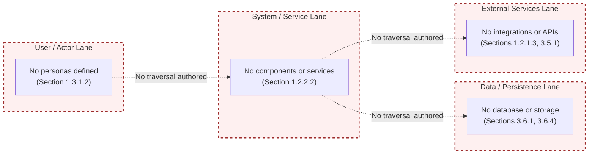

---

## 4.6 Consolidated Process-Flow Status Matrix

The following matrix consolidates the per-subsection findings of Sections 4.2 through 4.5 against every dimension implied by the prompt. Every "Status" entry is anchored to the evidentiary section that establishes the absence, mirroring the consolidation pattern of Section 3.8.1.

| Process-Flow Dimension | Subsection | Status | Evidentiary Anchor |
|------------------------|------------|--------|---------------------|
| End-to-end user journeys | 4.2.1.1 | None defined | Sections 1.3.1.1, 2.4.1 |
| System interactions | 4.2.1.2 | None defined | Sections 1.2.2.1, 1.2.2.2 |
| Decision points | 4.2.1.3 | None defined | Section 2.3.4 |
| Error handling paths | 4.2.1.4 | None defined | Sections 1.2.2.2, 3.5.3 |
| Data flow between systems | 4.2.2.1 | None defined | Sections 1.2.1.3, 2.4.2 |
| API interactions | 4.2.2.2 | None defined | Sections 1.2.1.3, 3.5.1 |
| Event processing flows | 4.2.2.3 | None defined | Sections 1.2.1.3, 3.5 |
| Batch processing sequences | 4.2.2.4 | None defined | Section 1.2.2.2 |
| Start / end points | 4.3.1 | None defined | Sections 1.2.1.3, 1.2.2.3 |
| Process steps | 4.3.1 | None defined | Section 2.2 |
| Decision diamonds | 4.3.1 | None defined | Section 2.3.4 |
| System boundaries | 4.3.1 | None defined | Section 1.3.1.2 |
| User touchpoints | 4.3.1 | None defined | Section 1.2.2.1 |
| Error states / recovery paths | 4.3.1 | None defined | Sections 1.2.2.2, 2.5.5 |
| Business rules at each step | 4.3.2 | Not present | Section 2.3.4 |
| Data validation requirements | 4.3.2 | Not present | Section 2.3.4 |
| Authorization checkpoints | 4.3.3 | None defined | Sections 2.5.4, 3.5.2 |
| Regulatory compliance checks | 4.3.3 | None defined | Section 2.3.4 |
| Per-step latency budgets | 4.3.4 | None defined | Section 2.5.2 |
| Availability / SLA objectives | 4.3.4 | None defined | Section 1.2.3.3 |
| RTO / RPO targets | 4.3.4 | None defined | Section 2.5.5 |
| State transitions | 4.4.1.1 | None defined | Sections 1.2.2.1, 1.2.2.3 |
| Data persistence points | 4.4.1.2 | None defined | Sections 3.6.1, 3.6.2 |
| Caching requirements | 4.4.1.3 | None defined | Sections 3.6.3, 2.5.3 |
| Transaction boundaries | 4.4.1.4 | None defined | Sections 3.6.1, 3.6.2 |
| Retry mechanisms | 4.4.2.1 | None defined | Sections 1.2.2.2, 3.3 |
| Fallback processes | 4.4.2.2 | None defined | Section 1.2.2.2 |
| Error notification flows | 4.4.2.3 | None defined | Section 3.5.3 |
| Recovery procedures | 4.4.2.4 | None defined | Section 2.5.5 |
| High-level system workflow diagram | 4.5.1 | Cannot be authored | Section 1.2.2.1 |
| Per-feature process-flow diagrams | 4.5.2 | Cannot be authored | Section 2.4.1 |
| Error-handling flowcharts | 4.5.3 | Cannot be authored | Section 1.2.2.2 |
| Integration sequence diagrams | 4.5.4 | Cannot be authored | Section 1.2.1.3 |
| State transition diagrams | 4.5.5 | Cannot be authored | Section 4.4.1.1 |

---

## 4.7 Population Lifecycle and Triggers

### 4.7.1 Triggers for Subsection Population

Each subsection of Section 4 will transition from its current placeholder state to an authored state when the corresponding artifact class is committed to the repository. The table below maps each Section 4 subsection to the unblocking artifact class, consistent with the trigger-table pattern established in Sections 2.9.1 and 3.9.1.

| Section 4 Subsection | Unblocking Artifact Class |
|----------------------|---------------------------|
| 4.2.1 Core Business Processes | Product brief, user-story files with workflow descriptions, journey maps, BPMN diagrams, or sequence specifications |
| 4.2.2 Integration Workflows | API definitions (OpenAPI / GraphQL / gRPC), event schemas (AsyncAPI), message-broker configurations, ETL / batch-orchestration descriptors |
| 4.3.1 Process Steps and Decision Points | Source code with control-flow logic, workflow-engine DSLs, or BPMN process definitions |
| 4.3.2 Validation Rules | JSON Schema files, validator configurations, business-rule documents, or framework-level validation annotations |
| 4.3.3 Authorization Checkpoints and Compliance Checks | Identity-provider configuration, RBAC / ABAC policy files, OPA Rego policies, compliance-control documents |
| 4.3.4 Timing and SLA Considerations | SLO / SLA documents, latency-budget specifications, capacity-planning artifacts |
| 4.4.1 State Management | State-machine specifications, ORM models, migration files, transaction-coordinator configurations |
| 4.4.2 Error Handling | Source code with try/catch constructs, retry-library configurations, circuit-breaker descriptors, runbooks |
| 4.5 Required Diagrams | Architecture documents, feature specifications, and source code from which workflows can be extracted |

### 4.7.2 Lifecycle Diagram

The diagram below positions Section 4 within the broader specification-maturation flow established by Section 1.3.3 and mirrored by Sections 2.9.2 and 3.9.2. The current state — `ProcessFlowsEmpty` — corresponds to the initial-issuance baseline at commit `5a796d794af56bb8930b5554aea8a563c39931d9`.

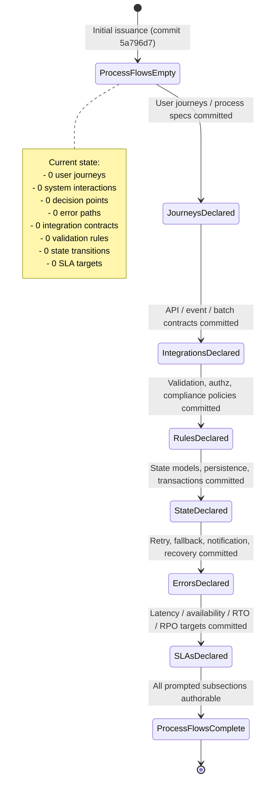

### 4.7.3 Consistency with Preceding Sections' Posture

This section maintains the documentation posture declared in Section 1.3.3 and reaffirmed in Sections 2.1.1, 2.7.3, 2.9.3, 3.1.1, and 3.1.3: every absent element is recorded explicitly rather than omitted, every cross-reference is anchored to a verified evidentiary section, no Mermaid diagram visualizes a fabricated workflow, and no element of the prompted process-flow catalogue is asserted as present without artifact-level evidence. Subsequent revisions of Section 4 should preserve the same posture until the artifact classes enumerated in Section 4.7.1 are committed.

---

## 4.8 Version Baseline

The determinations recorded in this Section 4 are bound to the repository state at the following commit, identical to the baseline reaffirmed in Sections 1.4, 2.8, and 3.10:

| Metadata Attribute | Value | Originating Section |
|--------------------|-------|---------------------|
| Repository Name | Artifact12 | Section 1.1.1 |
| Origin URL | `https://github.com/shalini690/Artifact12.git` | Section 1.4 |
| Default Branch | `main` | Section 1.4.3 |
| Commit Count | 1 (Initial commit) | Section 1.4.3 |
| Commit Baseline | `5a796d794af56bb8930b5554aea8a563c39931d9` | Section 1.4.3 |
| Commit Date | June 1, 2026 | Section 1.4.3 |
| Tracked Files Containing Process-Flow Indicators | 0 | Section 1.2.2.2 |

Any process flow, decision diamond, state transition, retry policy, fallback, notification channel, recovery procedure, or SLA threshold introduced by future commits will require revision of this Section 4 to reflect the resulting authorability of the corresponding subsections, with each new claim anchored to a specific committed artifact.

---

## 4.9 References

### 4.9.1 Files Examined

- `README.md` — The sole tracked content file in the repository. Re-verified for this section to contain exactly one line consisting of the level-one Markdown heading `# Artifact12` (12 bytes total). Examined for any embedded workflow descriptions, sequence narratives, decision-rule text, integration references, SLA statements, error-handling text, or process-flow content; none are present. Used as the authoritative source for the determination that no process-flow indicator is encoded in any tracked file.

### 4.9.2 Folders Examined

- `/` (repository root) — Re-inventoried for this section to confirm the absence of process-flow-relevant directories, including but not limited to: workflow-definition directories (`workflows/`, `bpmn/`, `processes/`, `flows/`), state-machine directories (`statecharts/`, `fsm/`), API-contract directories (`api/`, `openapi/`, `proto/`, `graphql/`, `schemas/`), event-schema directories (`events/`, `asyncapi/`), validation-policy directories (`policies/`, `rules/`, `validators/`), runbook directories (`runbooks/`, `operations/`, `oncall/`), and batch / scheduling directories (`jobs/`, `cron/`, `dags/`, `airflow/`). The repository root contains only `README.md` and the `.git/` metadata directory, consistent with the inventory recorded in Section 1.2.2.2.
- `.git/` — Examined only for the commit identity, branch information, and authoring metadata referenced in Section 4.8; not used as a source of application or process-flow content.

### 4.9.3 Cross-Referenced Technical Specification Sections

The following preceding sections of this Technical Specification were retrieved and consulted as evidentiary anchors for the determinations recorded in Section 4:

- **Section 1.2 — System Overview** — Primary anchor for the entirety of Section 4. Section 1.2.1.3 establishes the empty integration surface (anchor for Sections 4.2.2.1 through 4.2.2.3 and 4.5.4). Section 1.2.2.1 establishes that no system capabilities are implemented or specified (anchor for Sections 4.2.1.2 and 4.5.1). Section 1.2.2.2 enumerates the absent artifact categories (anchor for Sections 4.2.1.4, 4.2.2.4, 4.4.2.1, 4.4.2.2, and 4.5.3). Section 1.2.2.3 establishes that all technical-approach dimensions are undetermined (anchor for Sections 4.4.1.1 and 4.5.5). Section 1.2.3.3 records the empty KPI set (anchor for Section 4.3.4).
- **Section 1.3 — Scope** — Section 1.3.1.1 records no primary user workflows (anchor for Section 4.2.1.1). Section 1.3.1.2 records no system / service boundary (anchor for Sections 4.3.1 and 4.5.6). Section 1.3.3 provides the evidence-only policy that governs the present section.
- **Section 1.4 — References** — Source for the commit baseline `5a796d794af56bb8930b5554aea8a563c39931d9`, the default branch `main`, the commit date June 1, 2026, and the origin URL re-affirmed in Section 4.8.
- **Section 2.1 — Preface and Methodological Basis** — Reaffirms the evidence-only policy in Section 2.1.1.
- **Section 2.2 — Feature Catalog** — Establishes the zero-feature baseline anchoring Sections 4.3.1 (process steps) and 4.5.2 (per-feature process flows).
- **Section 2.3 — Functional Requirements Table** — Section 2.3.1 records no allocated requirement identifiers (anchor for the absence of process steps tied to `F-XXX-RQ-YYY` IDs). Section 2.3.3 records no input parameters or output/response definitions (anchor for absent API interactions). Section 2.3.4 records "Not present" across Business Rules, Data Validation, Security Requirements, and Compliance Requirements (anchor for Sections 4.2.1.3, 4.3.2, and 4.3.3).
- **Section 2.4 — Feature Relationships** — Section 2.4.1 confirms the empty feature dependency graph (anchor for Section 4.5.2). Section 2.4.2 confirms the empty integration-points set (anchor for Section 4.2.2).
- **Section 2.5 — Implementation Considerations** — Section 2.5.2 records no performance targets (anchor for Section 4.3.4). Section 2.5.3 records that scalability and caching considerations cannot be derived (anchor for Sections 4.4.1.3 and 4.4.1.4). Section 2.5.4 records the absence of authentication, authorization, identity-provider, and secrets-management posture (anchor for Section 4.3.3). Section 2.5.5 records the absence of operational ownership, runbooks, and maintenance posture (anchor for Section 4.4.2.4).
- **Section 2.7 — Assumptions and Constraints** — Section 2.7.3 confirms that the only governing constraint is the methodological evidence-only policy itself.
- **Section 2.8 — Requirement Versioning** — Source for the commit-baseline pattern reused in Section 4.8.
- **Section 2.9 — Documentation Maintenance Posture** — Provides the lifecycle-diagram and trigger-table patterns mirrored by Sections 4.7.1 and 4.7.2.
- **Section 2.10 — References** — Provides the references-section template mirrored by Section 4.9.
- **Section 3.1 — Authoring Constraint and Technology-Stack Snapshot** — Section 3.1.1 reaffirms the evidence-only policy. Section 3.1.3 establishes the precedent for explicit non-application of prompted templates (default stacks in 3.1.3; default workflow templates in 4.1.3).
- **Section 3.3 — Frameworks and Libraries** — Establishes that no framework imports are committed (anchor for Section 4.4.2.1, retry mechanisms).
- **Section 3.5 — Third-Party Services** — Section 3.5.1 confirms no external API clients or SDKs (anchor for Section 4.2.2.2). Section 3.5.2 confirms no identity-provider integration (anchor for Section 4.3.3). Section 3.5.3 confirms no monitoring / observability / alerting (anchor for Sections 4.2.1.4 and 4.4.2.3). The Section 3.5 Consolidated Third-Party Services table confirms no messaging / event bus and no email / notification services (anchor for Sections 4.2.2.3 and 4.4.2.3).
- **Section 3.6 — Databases and Storage** — Section 3.6.1 confirms no database engine is selected (anchor for Sections 4.4.1.2 and 4.4.1.4). Section 3.6.2 confirms persistence strategy is not derivable. Section 3.6.3 confirms no caching layer (anchor for Section 4.4.1.3). Section 3.6.4 confirms no storage-service binding.
- **Section 3.8 — Consolidated Technology Stack Matrix** — Provides the matrix-consolidation pattern mirrored by Section 4.6.
- **Section 3.9 — Population Lifecycle and Triggers** — Provides the trigger-table and state-diagram patterns mirrored by Section 4.7.
- **Section 3.10 — Version Baseline** — Reaffirms the commit baseline reused in Section 4.8.
- **Section 3.11 — References** — Provides the references-section template mirrored by Section 4.9.

### 4.9.4 Repository Metadata Re-Confirmed for This Section

| Metadata Attribute | Value | Originating Section |
|--------------------|-------|---------------------|
| Repository Name | Artifact12 | Section 1.1.1 |
| Default Branch | `main` | Section 1.4.3 |
| Commit Count | 1 (Initial commit) | Section 1.4.3 |
| Commit Baseline | `5a796d794af56bb8930b5554aea8a563c39931d9` | Section 1.4.3 |
| Commit Date | June 1, 2026 | Section 1.4.3 |
| Tracked Files Containing Process-Flow Indicators | 0 | Section 1.2.2.2 |
| Process Flows Authored from Direct Evidence | 0 | This section (4.6) |
| Decision Diamonds Authored from Direct Evidence | 0 | This section (4.6) |
| State Transitions Authored from Direct Evidence | 0 | This section (4.6) |
| SLA Targets Authored from Direct Evidence | 0 | This section (4.6) |

# 5. System Architecture

## 5.1 AUTHORING CONSTRAINT AND ARCHITECTURE SNAPSHOT

### 5.1.1 Methodological Basis

This System Architecture section is authored under the identical **evidence-only policy** declared in Section 1.3.3 and reaffirmed in Sections 2.1.1, 2.7.3, 3.1.1, and 4.1.1 of this Technical Specification. Every architectural element recorded below — including architectural style, component inventory, interaction topology, data flow, integration surface, technical decisions, and cross-cutting concerns — is grounded in directly observable repository content. Every prompted architectural dimension that cannot be so grounded is recorded as "none defined," "not derivable," "none committed," or "cannot be authored from evidence" rather than invented.

A System Architecture section can only enumerate concrete components, interaction patterns, integration points, technical decisions, and operational concerns when one or more of the following artifact classes are committed to the repository:

1. **Application source code** organized into modules, packages, services, or layers that materialize the component graph (e.g., `src/`, `lib/`, `app/`, `services/`, `cmd/` directories with executable files).
2. **Architectural-decision documents** declaring style choices, tradeoff analyses, and rejected alternatives (e.g., `docs/adr/`, `docs/architecture/`, `ARCHITECTURE.md`, C4 model artifacts).
3. **Interface and contract definitions** declaring inbound and outbound interaction surfaces (e.g., OpenAPI documents, GraphQL schemas, gRPC `.proto` files, AsyncAPI / event-schema descriptors, message-broker configurations).
4. **Component-deployment descriptors** declaring runtime topology and orchestration (e.g., `Dockerfile`, `docker-compose.yml`, Kubernetes manifests, Helm charts, service-mesh configuration).
5. **Persistence and state descriptors** declaring data stores, caches, and transaction boundaries (e.g., `*.sql` DDL, ORM model files, migration directories, cache-configuration files).
6. **Security-architecture artifacts** declaring authentication providers, authorization policies, secrets-management, and threat models (e.g., IdP configuration, RBAC/ABAC policy files, OPA Rego policies, `SECURITY.md`).
7. **Observability-architecture artifacts** declaring monitoring, logging, tracing, alerting, and SLO targets (e.g., OpenTelemetry collector configuration, Prometheus scrape definitions, SLO YAML files, runbooks).
8. **Resilience and disaster-recovery artifacts** declaring retry policies, circuit-breaker descriptors, backup-and-restore procedures, RTO/RPO targets, and failover plans.

As verified in Section 1.2.2.2 and consolidated in Sections 3.1.2 and 4.1.2, **none** of these artifact classes exist in the Artifact12 repository at the time of authoring. The structural skeleton of this section is therefore preserved in full — with every prompted architectural dimension enumerated — while the content of each subsection records the verified absence of source material.

### 5.1.2 Repository State Snapshot Relevant to Architecture Authorship

The following snapshot consolidates the evidentiary findings from Sections 1, 2, 3, and 4 that bear directly on the authorship of architectural determinations. Each row below has been independently verified in the cited preceding section and is recorded here for the convenience of readers consulting Section 5 in isolation.

| Attribute Relevant to System Architecture | Verified Value | Originating Section |
|-------------------------------------------|----------------|---------------------|
| Tracked content artifacts | `README.md` (12 bytes, title only) and `.git/` only | Section 1.2.2.2 |
| Application components, modules, packages, services | None present | Section 1.2.2.2 |
| Architectural style (monolith, microservices, serverless, event-driven) | Undetermined | Section 1.2.2.3 |
| Programming language, runtime, framework | All undetermined | Section 1.2.2.3 |
| System capabilities | None implemented or specified | Section 1.2.2.1 |
| System / service boundaries | Not defined | Section 1.3.1.2 |
| Inbound API definitions | None | Section 1.2.1.3 |
| Outbound service clients | None | Section 1.2.1.3 |
| Event / messaging schemas | None | Section 1.2.1.3 |
| Identity / authentication providers | None | Sections 1.2.1.3, 2.5.4, 3.5.2 |
| Data source / sink connectors | None | Section 1.2.1.3 |
| Database engines, schemas, ORM models, migrations | None committed | Sections 3.6.1, 3.6.2 |
| Caching layer configuration | None configured | Section 3.6.3 |
| Storage-service binding | Not determined | Section 3.6.4 |
| Authentication / authorization scheme | None present | Section 2.5.4 |
| Secrets-management policy | None present | Section 2.5.4 |
| Threat model | None present | Section 2.5.4 |
| Monitoring, logging, tracing, alerting integration | None configured | Section 3.5.3 |
| Error tracking services | None configured | Section 3.5 |
| Cloud-platform binding | None bound | Section 3.5.4 |
| Containerization / orchestration descriptors | None present | Section 1.2.2.2 |
| Infrastructure-as-code artifacts | None present | Section 1.2.2.2 |
| CI/CD pipeline definitions | None present | Section 1.2.2.2 |
| Performance / latency / throughput targets | None defined | Sections 1.2.3.3, 2.5.2 |
| Availability / reliability / SLA targets | None defined | Sections 1.2.3.3, 2.5.5 |
| RTO / RPO / disaster-recovery targets | None defined | Section 2.5.5 |
| Operational owners (CODEOWNERS / MAINTAINERS) | None present | Sections 1.1.3, 2.5.5 |
| Runbooks / on-call procedures | None present | Section 2.5.5 |
| Architecture Decision Records (ADRs) | None present | Section 2.5.1 |
| State-machine specifications | None present | Section 4.4.1.1 |
| Retry / circuit-breaker / fallback configurations | None present | Sections 4.4.2.1, 4.4.2.2 |

### 5.1.3 Non-Application of Prompted Architecture Templates

The authoring prompt for this section enumerates concrete architectural templates the section "should" contain: an overall architecture style with rationale, key architectural principles and patterns, system boundaries and major interfaces, a core components table with primary responsibility / key dependencies / integration points / critical considerations columns, primary data flows between components, integration patterns and protocols, data transformation points, key data stores and caches, an external integration points table with integration type / data exchange pattern / protocol-format / SLA requirements columns, per-component purpose and responsibilities, technologies and frameworks used, key interfaces and APIs, data persistence requirements, scaling considerations, architecture style decisions and tradeoffs, communication pattern choices, data storage solution rationale, caching strategy justification, security mechanism selection, monitoring and observability approach, logging and tracing strategy, error handling patterns, authentication and authorization framework, performance requirements and SLAs, and disaster recovery procedures.

The same prompt instructs the author to produce detailed component interaction diagrams, state transition diagrams, sequence diagrams for key flows, decision tree diagrams, Architecture Decision Record diagrams, and error handling flow diagrams.

These directives are reconciled with the evidence-only constraint declared in Sections 1.3.3, 2.1.1, 2.7.3, 3.1.1, 3.1.3, and 4.1.3 in the same manner as Section 3.1.3 reconciled the prompted Default Technology Stack and Section 4.1.3 reconciled the prompted process-flow templates: **no concrete component, interaction edge, integration endpoint, architectural decision, communication pattern, storage rationale, caching policy, security mechanism, observability tool, error-handling pattern, or SLA threshold is asserted within Section 5** because every such assertion would constitute fabrication relative to the verified repository state. The prompted templates are recorded here only as the catalogue against which each empty-state determination is anchored; each prompted dimension below is marked with reference to the evidentiary anchor that establishes its absence.

The Mermaid diagrams produced in this section are accordingly **meta-level visualizations of the empty architecture surface and its population lifecycle**, mirroring the visualization pattern established in Sections 1.2.2.3, 1.3.3, 2.4.5, 2.9.2, 3.8.2, 3.9.2, 4.5.6, and 4.7.2, rather than concrete architectural diagrams which would require artifacts that the repository does not contain.

---

## 5.2 HIGH-LEVEL ARCHITECTURE

### 5.2.1 System Overview

#### 5.2.1.1 Overall Architecture Style and Rationale

The Artifact12 repository commits no architectural-style decision. Per Section 1.2.2.3, "programming language, runtime environment, framework selection, persistence strategy, deployment topology, and architectural style (monolith, microservices, serverless, event-driven, etc.) are all undetermined because no source or configuration files exist to evidence them." No `ARCHITECTURE.md`, no C4 model documents, no `docs/architecture/` directory, and no Architecture Decision Records exist in the repository. The architecture-style decision and its rationale are therefore **not derivable from the current repository state**.

#### 5.2.1.2 Key Architectural Principles and Patterns

No architectural principles (e.g., separation of concerns, single responsibility, hexagonal/ports-and-adapters, CQRS, event sourcing, domain-driven design tactical patterns) and no architectural patterns (e.g., layered, microkernel, pipes-and-filters, service-oriented, mesh-based) are documented in any tracked file. Per Section 1.2.2.2, the only tracked artifacts are `README.md` (12 bytes, title-only) and `.git/`. The architectural-principles and patterns inventory is **empty**.

#### 5.2.1.3 System Boundaries and Major Interfaces

System boundaries presuppose a defined system. Per Section 1.3.1.2, "implementation boundaries presuppose an implementation. Because no implementation exists, boundaries cannot be drawn from artifacts present in the repository." Per Section 1.2.1.3, the integration-category table records "No" across all five integration categories (Inbound API Definitions, Outbound Service Clients, Event / Messaging Schemas, Identity / Authentication Providers, Data Source / Sink Connectors). The major-interfaces inventory is therefore **empty**, and no boundary can be drawn between in-system components (none exist) and out-of-system actors (none declared).

| High-Level Architecture Dimension | Documentation Status | Evidentiary Anchor |
|-----------------------------------|----------------------|---------------------|
| Overall architecture style | Undetermined | Section 1.2.2.3 |
| Style rationale | Not derivable | Section 1.2.2.3 |
| Architectural principles | None documented | Section 1.2.2.2 |
| Architectural patterns | None documented | Section 1.2.2.2 |
| System / service boundary | Not defined | Section 1.3.1.2 |
| Major interfaces | None declared | Section 1.2.1.3 |

### 5.2.2 Core Components Table

The prompted Core Components Table requires Component Name, Primary Responsibility, Key Dependencies, Integration Points, and Critical Considerations columns. Per Section 1.2.2.2, the component count of the repository is **zero**: no application components, modules, packages, libraries, or services exist beyond Git's internal metadata and the placeholder README. The Core Components Table is therefore recorded below as empty, with each prompted column noting the absence-anchor for the corresponding evidentiary section. The four-column constraint defined in the section formatting requirements is respected by splitting the prompted attribute set into two complementary tables.

**Table 5.2.2-A — Component Identity and Responsibility**

| Component Name | Primary Responsibility | Status | Evidentiary Anchor |
|----------------|------------------------|--------|---------------------|
| _(none committed)_ | _(none committed)_ | None defined | Section 1.2.2.2 |

**Table 5.2.2-B — Component Dependencies and Integration**

| Component Name | Key Dependencies | Integration Points | Critical Considerations |
|----------------|------------------|--------------------|--------------------------|
| _(none committed)_ | _(none committed)_ | _(none declared)_ | _(not derivable)_ |

The empty rows reflect the verified zero-component repository state per Section 1.2.2.2 and the zero-integration-surface determination per Section 1.2.1.3. Any non-empty row would constitute fabrication relative to the evidentiary base.

### 5.2.3 Data Flow Description

#### 5.2.3.1 Primary Data Flows Between Components

No primary data flow is derivable. Per Section 4.2.2.1, "no inter-system data flow is derivable" because the integration-category table records "No" across all five categories. Per Section 1.2.2.2, the component count is zero. A data-flow graph requires at least one producer and one consumer; the repository declares neither. The primary-data-flow set is **empty**.

#### 5.2.3.2 Integration Patterns and Protocols

No integration pattern (e.g., request/response, publish/subscribe, broker-mediated messaging, choreographed events, orchestrated workflows, point-to-point synchronous, ETL/ELT batch, change-data-capture) and no protocol (e.g., HTTP/REST, gRPC, GraphQL, AMQP, MQTT, Kafka wire protocol, JDBC, ODBC) is declared in any tracked file. Per Section 3.5.1, "no external API client is configured, no SDK is imported, and no service contract (OpenAPI, GraphQL schema, gRPC `.proto`, AsyncAPI) is committed." The integration-pattern and protocol inventory is **empty**.

#### 5.2.3.3 Data Transformation Points

No data transformation points are derivable. Transformation points (e.g., schema mappers, anti-corruption layers, data-validation adapters, format converters, enrichment pipelines) presuppose at least one inbound data shape and one outbound data shape. Per Section 4.2.2.1, no inter-system data flow exists. Per Section 1.3.1.2, no data domains are defined. The data-transformation-point set is **empty**.

#### 5.2.3.4 Key Data Stores and Caches

No data stores or caches are committed. Per Section 3.6.1, "no database engine is selected … Neither a primary database (relational or document-oriented) nor any secondary/replica database is committed." Per Section 3.6.3, "no caching layer is configured. No Redis, Memcached, in-memory, CDN-edge, or application-level cache is referenced in any tracked file." Per Section 3.6.4, "storage-service binding is not determined." The data-store and cache inventory is therefore **empty**.

| Data Flow Dimension | Documentation Status | Evidentiary Anchor |
|---------------------|----------------------|---------------------|
| Primary data flows between components | None defined | Sections 1.2.2.2, 4.2.2.1 |
| Integration patterns | None defined | Section 1.2.1.3 |
| Protocols | None defined | Sections 1.2.1.3, 3.5.1 |
| Data transformation points | None defined | Section 4.2.2.1 |
| Primary database | None committed | Section 3.6.1 |
| Caching solutions | None configured | Section 3.6.3 |
| Storage services | Not determined | Section 3.6.4 |

### 5.2.4 External Integration Points

The prompted External Integration Points table requires System Name, Integration Type, Data Exchange Pattern, Protocol/Format, and SLA Requirements columns. Per Section 1.2.1.3, the integration-category table records "No" across all five categories (Inbound API Definitions, Outbound Service Clients, Event / Messaging Schemas, Identity / Authentication Providers, Data Source / Sink Connectors). Per the Section 3.5 Consolidated Third-Party Services table, every third-party service category is recorded as "None integrated," "None configured," or "None bound." The External Integration Points table is therefore empty. To respect the four-column constraint, the prompted attribute set is presented across two complementary tables.

**Table 5.2.4-A — External System Identity and Integration Type**

| System Name | Integration Type | Status | Evidentiary Anchor |
|-------------|------------------|--------|---------------------|
| _(none declared)_ | _(none declared)_ | None | Section 1.2.1.3 |

**Table 5.2.4-B — Exchange Pattern, Protocol, and SLA**

| System Name | Data Exchange Pattern | Protocol / Format | SLA Requirements |
|-------------|------------------------|-------------------|------------------|
| _(none declared)_ | _(none declared)_ | _(none declared)_ | _(none defined)_ |

The empty rows reflect the verified zero-integration-surface determination of Section 1.2.1.3 and the zero-SLA determination of Section 2.5.2 ("the performance requirement set is empty").

---

## 5.3 COMPONENT DETAILS

### 5.3.1 Component Inventory

Per Section 1.2.2.2, the component count of the Artifact12 repository is **zero**. The full repository inventory is reproduced below for traceability:

| Path | Type | Architectural Role | Size |
|------|------|--------------------|------|
| `README.md` | File | Placeholder (no architectural role) | 12 bytes |
| `.git/` | Directory | Version-control metadata (not part of the deployed system) | (system-managed) |

Because the set of "major components" over which the prompted per-component dimensions iterate is empty, the per-component subsections below record the absence of source material for each dimension uniformly. The iteration loop is non-executing.

### 5.3.2 Per-Component Dimensional Determinations

#### 5.3.2.1 Purpose and Responsibilities

Per Section 1.2.2.1, "no system capabilities are implemented or specified. The repository contains no executable code, no domain logic, no user-facing surfaces, and no service endpoints." With zero components in the inventory (Section 5.3.1) and zero capabilities documented, the per-component purpose-and-responsibility enumeration is **empty**.

#### 5.3.2.2 Technologies and Frameworks Used

Per the Section 3.8.1 Consolidated Stack Dimension Status Matrix, every framework dimension (Backend, AI / LLM, Web frontend, CSS / styling, Mobile) is recorded as "None committed." Every programming-language dimension (Backend, Frontend, Mobile / cross-platform, Native iOS / Android / macOS / Desktop) is recorded as "Not determined." Open-source dependencies are recorded as "None declared." Because no component exists and no technology is committed, the per-component technology-and-framework enumeration is **empty**.

#### 5.3.2.3 Key Interfaces and APIs

Per Section 1.2.1.3, the integration-category table records "No" across Inbound API Definitions and Outbound Service Clients. Per Section 3.5.1, "no external API client is configured, no SDK is imported, and no service contract (OpenAPI, GraphQL schema, gRPC `.proto`, AsyncAPI) is committed." Component-level public interfaces (exposed APIs) and consumed interfaces (client dependencies) are therefore **none defined**.

#### 5.3.2.4 Data Persistence Requirements

Per Section 3.6.1, "no database engine is selected." Per Section 3.6.2, "data persistence strategies (write-ahead logging, replication topology, backup-and-restore policy, retention windows, soft-delete vs. hard-delete semantics, partitioning and sharding) cannot be characterized because no database is selected … Persistence strategy is therefore not derivable." Per Section 4.4.1.2, "no data persistence points are derivable." Per-component data-persistence requirements are therefore **none defined**.

#### 5.3.2.5 Scaling Considerations

Per Section 2.5.3, "scalability considerations require a defined deployment topology (vertical vs. horizontal scaling axes, stateless vs. stateful service partitioning, data-sharding strategy, caching tiers). Section 1.2.2.3 confirms that deployment topology is undetermined. Consequently, scalability considerations cannot be derived from the current repository state." Per-component scaling considerations are therefore **not derivable**.

### 5.3.3 Consolidated Component Dimension Status

| Per-Component Dimension | Documentation Status | Evidentiary Anchor |
|-------------------------|----------------------|---------------------|
| Purpose and responsibilities | None defined | Sections 1.2.2.1, 1.2.2.2 |
| Technologies and frameworks | None committed | Section 3.8.1 |
| Key interfaces and APIs | None defined | Sections 1.2.1.3, 3.5.1 |
| Data persistence requirements | None defined | Sections 3.6.1, 3.6.2, 4.4.1.2 |
| Scaling considerations | Not derivable | Sections 1.2.2.3, 2.5.3 |

---

## 5.4 TECHNICAL DECISIONS

### 5.4.1 Architecture Style Decisions and Tradeoffs

Per Section 1.2.2.3, "architectural style (monolith, microservices, serverless, event-driven, etc.) are all undetermined." Per Section 2.5.1, "technical constraints for the (non-existent) feature set are therefore recorded as not derivable." No Architecture Decision Record (ADR) directory, no `docs/decisions/` folder, and no tradeoff-analysis document is present in the repository inventory recorded by Section 1.2.2.2. The architecture-style decision and the tradeoffs that would have justified it are therefore **none documented**.

The catalogue of style alternatives below is recorded only to make explicit the dimensions awaiting a future architectural decision; no row is asserted as a selection of this system.

| Style Alternative | Selection Status | Evidentiary Anchor |
|-------------------|------------------|---------------------|
| Monolithic | Not selected; not rejected | Section 1.2.2.3 |
| Layered / N-tier | Not selected; not rejected | Section 1.2.2.3 |
| Microservices | Not selected; not rejected | Section 1.2.2.3 |
| Serverless / Function-as-a-Service | Not selected; not rejected | Section 1.2.2.3 |
| Event-driven | Not selected; not rejected | Section 1.2.2.3 |
| Service-oriented (SOA) | Not selected; not rejected | Section 1.2.2.3 |
| Hexagonal / Ports-and-Adapters | Not selected; not rejected | Section 1.2.2.3 |
| CQRS / Event Sourcing | Not selected; not rejected | Section 1.2.2.3 |

### 5.4.2 Communication Pattern Choices

Per Section 1.2.1.3, no inbound API definitions, outbound service clients, or event/messaging schemas are committed. Per Section 3.5.1, "no SDK is imported and no service contract (OpenAPI, GraphQL schema, gRPC `.proto`, AsyncAPI) is committed." Per the Section 3.5 Consolidated Third-Party Services table, "Messaging / Event Bus — None configured." Communication-pattern choices — synchronous request/response, asynchronous messaging, publish/subscribe, broker-mediated event streaming, polling, long-polling, server-sent events, WebSocket bidirectional, gRPC streaming — are therefore **none defined**.

| Communication Pattern | Selection Status | Evidentiary Anchor |
|----------------------|------------------|---------------------|
| Synchronous request/response (HTTP/REST) | Not selected | Section 1.2.1.3 |
| Synchronous remote procedure call (gRPC) | Not selected | Section 1.2.1.3 |
| GraphQL query / mutation | Not selected | Section 1.2.1.3 |
| Asynchronous messaging (AMQP / SQS / SNS) | Not selected | Section 3.5 |
| Publish/subscribe (Kafka / Pulsar / NATS) | Not selected | Section 3.5 |
| WebSocket bidirectional | Not selected | Section 1.2.1.3 |
| Server-sent events | Not selected | Section 1.2.1.3 |
| Batch / ETL pipelines | Not selected | Section 4.2.2.4 |

### 5.4.3 Data Storage Solution Rationale

Per Section 3.6.1, "neither a primary database (relational or document-oriented) nor any secondary/replica database is committed." Per Section 3.6.2, "persistence strategy is therefore not derivable." No data-storage solution rationale (e.g., ACID-vs-BASE tradeoff, OLTP-vs-OLAP separation, normalized-vs-denormalized modelling, polyglot persistence) is documented because no storage solution is selected. The data-storage rationale is **none documented**.

| Storage Solution Category | Selection Status | Evidentiary Anchor |
|---------------------------|------------------|---------------------|
| Relational OLTP database | None committed | Section 3.6.1 |
| Document database | None committed | Section 3.6.1 |
| Key-value store | None committed | Section 3.6.1 |
| Wide-column store | None committed | Section 3.6.1 |
| Graph database | None committed | Section 3.6.1 |
| Time-series database | None committed | Section 3.6.1 |
| Search index | None committed | Section 3.6.1 |
| Object / blob storage | None bound | Section 3.6.4 |

### 5.4.4 Caching Strategy Justification

Per Section 3.6.3, "no caching layer is configured. No Redis, Memcached, in-memory, CDN-edge, or application-level cache is referenced in any tracked file. The inventory in Section 1.2.2.2 confirms the absence of any cache-related configuration." Per Section 4.4.1.3, "no caching requirements are derivable." The caching strategy and its justification — including cache-aside vs. write-through vs. write-behind selection, eviction policy, TTL configuration, cache-coherency model, and multi-tier cache architecture — are therefore **none configured**.

### 5.4.5 Security Mechanism Selection

Per Section 2.5.4, "the repository contains no authentication or authorization scheme, no identity-provider configuration, no secrets-management policy, no security-control documentation, and no threat model. No `SECURITY.md` file or equivalent is present in the inventory recorded by Section 1.2.2.2." Per Section 3.5.2, "no identity-provider integration (e.g., Auth0, Okta, AWS Cognito, Azure AD, Google Identity Platform, Firebase Authentication, Keycloak) is configured. No OAuth 2.0 / OIDC client registration, no SAML federation, and no API-key issuance scheme is present." The security-mechanism selection is therefore **none present**.

| Security Mechanism Category | Selection Status | Evidentiary Anchor |
|-----------------------------|------------------|---------------------|
| Authentication scheme | None present | Section 2.5.4 |
| Authorization model (RBAC / ABAC / ReBAC) | None present | Section 2.5.4 |
| Identity provider | None integrated | Section 3.5.2 |
| Secrets management | None configured | Section 2.5.4 |
| Transport encryption (TLS) | Not configured | Section 1.2.2.2 |
| At-rest encryption | Not configured | Section 3.6 |
| Threat model | None present | Section 2.5.4 |
| `SECURITY.md` / vulnerability-disclosure policy | None present | Section 2.5.4 |

### 5.4.6 Architecture Decision Records (ADRs)

Per Section 2.5.1, technical constraints are recorded as "not derivable" because no source artifacts exist. The repository inventory recorded by Section 1.2.2.2 contains no `docs/adr/`, no `docs/decisions/`, no `ARCHITECTURE.md`, and no ADR templates (e.g., MADR, Nygard-format ADRs). The Architecture Decision Record catalogue is **empty**.

| ADR Attribute | Status | Evidentiary Anchor |
|---------------|--------|---------------------|
| ADR directory present | No | Section 1.2.2.2 |
| ADR templates committed | No | Section 1.2.2.2 |
| Decision records authored | Zero | Section 2.5.1 |
| Status (proposed / accepted / superseded) tracked | Not applicable | Section 2.5.1 |

---

## 5.5 CROSS-CUTTING CONCERNS

### 5.5.1 Monitoring and Observability Approach

Per Section 3.5.3, "no monitoring, logging, metrics, tracing, or alerting integration is committed. The inventory in Section 1.2.2.2 records no observability configuration of any kind — no OpenTelemetry collectors, no Prometheus scrape definitions, no Grafana dashboards, no Datadog / New Relic / Sentry / Honeycomb / Splunk client configurations, no `logging.yaml` or equivalent." The monitoring and observability approach is therefore **none configured**.

### 5.5.2 Logging and Tracing Strategy

Per the same Section 3.5.3 finding, no logging framework configuration, no structured-log schema, no log-shipper configuration (e.g., Fluentd, Fluent Bit, Logstash, Vector), no distributed-tracing instrumentation (e.g., OpenTelemetry, Jaeger, Zipkin clients), no trace-context propagation library, and no correlation-ID convention is present in any tracked file. The logging and tracing strategy is **none configured**.

| Observability Dimension | Configuration Status | Evidentiary Anchor |
|-------------------------|----------------------|---------------------|
| Log emission framework | None configured | Section 3.5.3 |
| Log aggregation / shipping | None configured | Section 3.5.3 |
| Metrics collection | None configured | Section 3.5.3 |
| Distributed tracing | None configured | Section 3.5.3 |
| Alerting rules | None configured | Section 3.5.3 |
| Dashboarding | None configured | Section 3.5.3 |
| Error tracking | None configured | Section 3.5 |
| Synthetic / real-user monitoring | None configured | Section 3.5.3 |

### 5.5.3 Error Handling Patterns

Per Section 4.4.2, every error-handling dimension is recorded as "none defined": retry mechanisms (Section 4.4.2.1), fallback processes (Section 4.4.2.2), error notification flows (Section 4.4.2.3), and recovery procedures (Section 4.4.2.4). Per Section 1.2.2.2, the repository contains no source files, no try/catch constructs, no error-type hierarchy, no exception handlers, and no fallback implementations. The error-handling pattern catalogue is therefore **none defined**.

| Error Handling Dimension | Documentation Status | Evidentiary Anchor |
|---------------------------|----------------------|---------------------|
| Exception hierarchy | None defined | Section 1.2.2.2 |
| Retry policies (immediate, exponential backoff, jitter) | None defined | Section 4.4.2.1 |
| Circuit breaker / bulkhead patterns | None defined | Section 4.4.2.2 |
| Fallback / graceful degradation | None defined | Section 4.4.2.2 |
| Dead-letter queues / poison-message handling | None defined | Section 1.2.1.3 |
| Error notification / alerting flows | None defined | Section 4.4.2.3 |
| Recovery procedures | None defined | Section 4.4.2.4 |

### 5.5.4 Authentication and Authorization Framework

Per Section 2.5.4, "security implications for individual features cannot be assessed because no features exist; security implications for the system as a whole cannot be assessed because no system implementation exists." Per Section 3.5.2, "authentication-service selection is therefore not determined." Per Section 4.3.3 (referenced from Section 4.6 Consolidated Process-Flow Status Matrix), authorization checkpoints are recorded as "none defined" with evidentiary anchors at Sections 2.5.4 and 3.5.2. The authentication and authorization framework is therefore **none integrated**.

| AuthN / AuthZ Dimension | Status | Evidentiary Anchor |
|--------------------------|--------|---------------------|
| Authentication protocol (OAuth 2.0, OIDC, SAML, mTLS) | None configured | Section 3.5.2 |
| Identity provider | None integrated | Section 3.5.2 |
| Token format (JWT, opaque, PASETO) | Not selected | Section 2.5.4 |
| Session management | Not defined | Section 2.5.4 |
| Authorization model (RBAC, ABAC, ReBAC, PBAC) | None present | Section 2.5.4 |
| Policy enforcement point | Not defined | Section 2.5.4 |
| Policy decision point (e.g., OPA, Cedar) | Not configured | Section 2.5.4 |
| API key / service-account issuance | Not configured | Section 3.5.2 |

### 5.5.5 Performance Requirements and SLAs

Per Section 2.5.2, "no throughput, latency, concurrency, or capacity targets are defined. The performance requirement set is empty." Per Section 1.2.3.3, the KPI placeholder table records "No" across Product/Adoption Metrics, Reliability/Availability Targets, Performance/Latency Targets, and Business/Financial Outcomes. Per the Section 4.6 Consolidated Process-Flow Status Matrix, per-step latency budgets, availability/SLA objectives, and RTO/RPO targets are all recorded as "none defined." Performance requirements and SLA targets are therefore **none defined**.

| Performance / SLA Dimension | Target | Evidentiary Anchor |
|------------------------------|--------|---------------------|
| Request latency (p50 / p95 / p99) | None defined | Section 2.5.2 |
| Throughput (RPS / QPS / TPS) | None defined | Section 2.5.2 |
| Concurrency ceiling | None defined | Section 2.5.2 |
| Availability (uptime %) | None defined | Section 1.2.3.3 |
| Error budget | None defined | Section 1.2.3.3 |
| Capacity ceiling | None defined | Section 2.5.3 |
| RTO (Recovery Time Objective) | None defined | Section 2.5.5 |
| RPO (Recovery Point Objective) | None defined | Section 2.5.5 |

### 5.5.6 Disaster Recovery Procedures

Per Section 2.5.5, "no `CODEOWNERS`, `MAINTAINERS`, or runbook files exist in the repository. No operational owners are documented … no test suites, CI/CD pipelines, or observability configuration exist. Maintenance requirements — including update cadence, patching policy, support tier, and backward-compatibility commitments — are therefore not documented." Per Section 4.4.2.4, "recovery procedures depend on documented operational ownership, runbooks, and observable failure signals — none of which are present." Disaster recovery procedures are therefore **not documented**.

| Disaster Recovery Dimension | Documentation Status | Evidentiary Anchor |
|------------------------------|----------------------|---------------------|
| Backup-and-restore policy | None documented | Section 3.6.2 |
| Replication / failover topology | None documented | Section 3.6.2 |
| Multi-region active-active / active-passive strategy | None documented | Section 3.5.4 |
| Runbooks and on-call procedures | None present | Section 2.5.5 |
| Incident-response process | None documented | Section 2.5.5 |
| Disaster-recovery drill cadence | None documented | Section 2.5.5 |
| RTO / RPO targets | None defined | Section 2.5.5 |
| Backup retention windows | None defined | Section 3.6.2 |

---

## 5.6 REQUIRED DIAGRAMS — PER-DIAGRAM EMPTY-STATE DETERMINATION

The prompt requires six categories of Mermaid.js diagrams: detailed component interaction diagrams, state transition diagrams, sequence diagrams for key flows, decision tree diagrams, Architecture Decision Record diagrams, and error handling flow diagrams. Each is evaluated below against the evidentiary base, mirroring the per-diagram determination pattern established in Section 4.5. Following the per-diagram determinations, Section 5.6.7 provides the meta-level Mermaid visualizations that the evidence-only policy permits.

### 5.6.1 Component Interaction Diagrams

Detailed component interaction diagrams require a non-empty component graph with at least two nodes and one edge. Per Section 1.2.2.2, the component count is zero, and per Section 1.2.2.1, no system capabilities are implemented. **Determination: cannot be authored from evidence.**

### 5.6.2 State Transition Diagrams

State transition diagrams require a defined finite-state model with discrete states and transition events. Per Section 4.4.1.1, "the state-transition graph is empty." **Determination: cannot be authored from evidence.**

### 5.6.3 Sequence Diagrams for Key Flows

Sequence diagrams require at least two communicating actors and a defined message exchange. Per Section 1.2.1.3, the integration-category table records "No" across all five categories, and per Section 4.2.1.2, no internal component-to-component calls are defined. The actor count for sequence diagrams is zero. **Determination: cannot be authored from evidence.**

### 5.6.4 Decision Tree Diagrams

Decision-tree diagrams require enumerated decision predicates with branching outcomes. Per Section 4.2.1.3, "no decision points are derivable" because Section 2.3.4 records "Not present" across Business Rules, Data Validation, Security Requirements, and Compliance Requirements. The decision-predicate set is empty. **Determination: cannot be authored from evidence.**

### 5.6.5 Architecture Decision Record (ADR) Diagrams

ADR diagrams require a non-empty Architecture Decision Record catalogue. Per Section 5.4.6 above, the ADR catalogue is empty (zero records authored, no ADR directory present, no templates committed). **Determination: cannot be authored from evidence.**

### 5.6.6 Error Handling Flow Diagrams

Error-handling flow diagrams require committed source code with documented failure modes, an exception hierarchy, and recovery branches. Per Section 4.5.3, "no source code is present. Per Section 4.4.2 above, retry, fallback, notification, and recovery dimensions are all empty." **Determination: cannot be authored from evidence.**

### 5.6.7 Meta-Level Visualization of the Empty Architecture Surface

Consistent with the meta-level visualization pattern established in Sections 1.2.2.3, 2.4.5, 3.8.2, and 4.5.6, the diagram below visualizes the present, evidenced state of architectural artifacts against the categories awaiting commit. The "Currently Evidenced" subgraph contains only the placeholder `README.md` (which contains no architecture-bearing content), while the "Awaiting Commits" subgraph enumerates the prompted architecture dimensions whose authorship is unblocked by the future introduction of corresponding artifacts.

```mermaid
flowchart TB
    subgraph Evidenced["System Architecture — Currently Evidenced"]
        Placeholder["README.md (12 bytes)<br/>No architecture-bearing content"]
    end

    subgraph Awaiting["System Architecture — Awaiting Future Commits"]
        Style["Architecture Style<br/>(monolith / microservices /<br/>serverless / event-driven)"]
        Components["Core Components<br/>(modules, services, packages<br/>with responsibilities)"]
        Interfaces["Major Interfaces<br/>(inbound / outbound APIs,<br/>events, contracts)"]
        DataFlows["Data Flows<br/>(producers, sinks,<br/>transformation stages)"]
        Storage["Data Stores &amp; Caches<br/>(databases, caches,<br/>persistence strategy)"]
        Comms["Communication Patterns<br/>(sync / async, pub-sub,<br/>request-response, streaming)"]
        Security["Security Architecture<br/>(authN / authZ, IdP,<br/>secrets, threat model)"]
        Observ["Observability<br/>(monitoring, logging,<br/>tracing, alerting)"]
        Errors["Error Handling<br/>(retry, circuit breaker,<br/>fallback, recovery)"]
        SLAs["Performance &amp; SLAs<br/>(latency, throughput,<br/>availability, RTO / RPO)"]
        DR["Disaster Recovery<br/>(backup, failover,<br/>runbooks, on-call)"]
        ADRs["Architecture Decision<br/>Records (ADRs)<br/>(decisions, tradeoffs)"]
    end

    Placeholder -.->|"Unblocks upon commit"| Style
    Placeholder -.->|"Unblocks upon commit"| Components
    Placeholder -.->|"Unblocks upon commit"| Interfaces
    Placeholder -.->|"Unblocks upon commit"| DataFlows
    Placeholder -.->|"Unblocks upon commit"| Storage
    Placeholder -.->|"Unblocks upon commit"| Comms
    Placeholder -.->|"Unblocks upon commit"| Security
    Placeholder -.->|"Unblocks upon commit"| Observ
    Placeholder -.->|"Unblocks upon commit"| Errors
    Placeholder -.->|"Unblocks upon commit"| SLAs
    Placeholder -.->|"Unblocks upon commit"| DR
    Placeholder -.->|"Unblocks upon commit"| ADRs

    style Evidenced fill:#e8f4ea,stroke:#2d6a4f,stroke-width:2px
    style Awaiting fill:#fef0f0,stroke:#9d2c2c,stroke-width:2px,stroke-dasharray: 5 5
```

The diagram below additionally visualizes the **swim-lane component-interaction surface** requested by the prompt, recording each prompted architectural lane as empty and explicitly noting the absence of any committed component, integration, or persistence target. This mirrors the swim-lane pattern of Section 4.5.6.

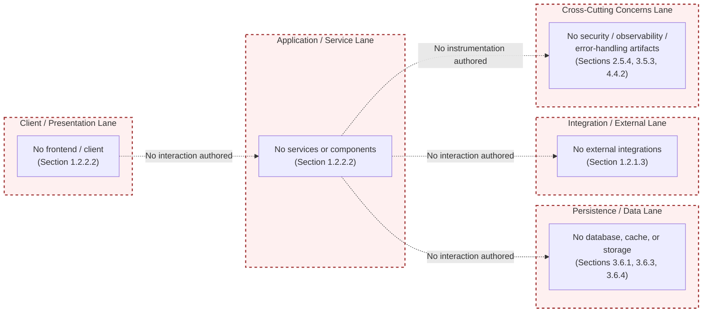

---

## 5.7 CONSOLIDATED ARCHITECTURE STATUS MATRIX

The following matrix consolidates the per-subsection findings of Sections 5.2 through 5.6 against every dimension implied by the prompt. Every "Status" entry is anchored to the evidentiary section that establishes the absence, mirroring the consolidation pattern of Sections 3.8.1 and 4.6.

| Architecture Dimension | Subsection | Status | Evidentiary Anchor |
|------------------------|------------|--------|---------------------|
| Overall architecture style | 5.2.1.1 | Undetermined | Section 1.2.2.3 |
| Architectural principles | 5.2.1.2 | None documented | Section 1.2.2.2 |
| Architectural patterns | 5.2.1.2 | None documented | Section 1.2.2.2 |
| System / service boundaries | 5.2.1.3 | Not defined | Section 1.3.1.2 |
| Major interfaces | 5.2.1.3 | None declared | Section 1.2.1.3 |
| Core components inventory | 5.2.2 | Zero components | Section 1.2.2.2 |
| Component responsibilities | 5.2.2 | None defined | Section 1.2.2.1 |
| Component dependencies | 5.2.2 | None declared | Section 1.2.2.2 |
| Primary data flows | 5.2.3.1 | None defined | Section 4.2.2.1 |
| Integration patterns | 5.2.3.2 | None defined | Section 1.2.1.3 |
| Protocols | 5.2.3.2 | None defined | Sections 1.2.1.3, 3.5.1 |
| Data transformation points | 5.2.3.3 | None defined | Section 4.2.2.1 |
| Data stores | 5.2.3.4 | None committed | Section 3.6.1 |
| Caches | 5.2.3.4 | None configured | Section 3.6.3 |
| External integration points | 5.2.4 | None declared | Section 1.2.1.3 |
| External SLA requirements | 5.2.4 | None defined | Section 2.5.2 |
| Per-component purpose | 5.3.2.1 | None defined | Section 1.2.2.1 |
| Per-component technologies | 5.3.2.2 | None committed | Section 3.8.1 |
| Per-component APIs | 5.3.2.3 | None defined | Section 1.2.1.3 |
| Per-component persistence | 5.3.2.4 | None defined | Sections 3.6.1, 3.6.2 |
| Per-component scaling | 5.3.2.5 | Not derivable | Section 2.5.3 |
| Architecture style decisions | 5.4.1 | None documented | Section 1.2.2.3 |
| Communication pattern choices | 5.4.2 | None defined | Section 1.2.1.3 |
| Data storage rationale | 5.4.3 | None documented | Section 3.6.1 |
| Caching strategy | 5.4.4 | None configured | Section 3.6.3 |
| Security mechanism selection | 5.4.5 | None present | Section 2.5.4 |
| Architecture Decision Records | 5.4.6 | Zero records | Section 2.5.1 |
| Monitoring / observability | 5.5.1 | None configured | Section 3.5.3 |
| Logging and tracing strategy | 5.5.2 | None configured | Section 3.5.3 |
| Error handling patterns | 5.5.3 | None defined | Section 4.4.2 |
| Authentication framework | 5.5.4 | None integrated | Section 3.5.2 |
| Authorization framework | 5.5.4 | None present | Section 2.5.4 |
| Performance / SLA targets | 5.5.5 | None defined | Section 2.5.2 |
| Disaster recovery procedures | 5.5.6 | Not documented | Section 2.5.5 |
| Component interaction diagrams | 5.6.1 | Cannot be authored | Section 1.2.2.2 |
| State transition diagrams | 5.6.2 | Cannot be authored | Section 4.4.1.1 |
| Sequence diagrams | 5.6.3 | Cannot be authored | Section 1.2.1.3 |
| Decision tree diagrams | 5.6.4 | Cannot be authored | Section 4.2.1.3 |
| ADR diagrams | 5.6.5 | Cannot be authored | Section 5.4.6 |
| Error handling flow diagrams | 5.6.6 | Cannot be authored | Section 4.4.2 |

---

## 5.8 POPULATION LIFECYCLE AND TRIGGERS

### 5.8.1 Triggers for Subsection Population

Each subsection of Section 5 will transition from its current placeholder state to an authored state when the corresponding artifact class is committed to the repository. The table below maps each Section 5 subsection to the unblocking artifact class, consistent with the trigger-table pattern established in Sections 2.9.1, 3.9.1, and 4.7.1.

| Section 5 Subsection | Unblocking Artifact Class |
|----------------------|---------------------------|
| 5.2.1 System Overview | `ARCHITECTURE.md`, C4 model artifacts, `docs/architecture/` documents declaring style and principles |
| 5.2.2 Core Components | Source directories (`src/`, `lib/`, `app/`, `services/`, `cmd/`) with executable modules and module-level documentation |
| 5.2.3 Data Flow | Sequence diagrams, dataflow specifications, ETL/ELT descriptors, source code containing inter-component calls |
| 5.2.4 External Integration Points | API contracts (OpenAPI / GraphQL / gRPC), event schemas (AsyncAPI), SDK client configurations, identity-provider bindings |
| 5.3 Component Details | Per-module README files, code-level documentation, framework-import declarations, ORM model files |
| 5.4.1 Architecture Style Decisions | `docs/adr/`, `docs/decisions/`, MADR / Nygard-format ADRs |
| 5.4.2 Communication Pattern Choices | Source code with HTTP / gRPC / messaging client invocations, broker configuration, IPC descriptors |
| 5.4.3 Data Storage Rationale | Schema artifacts (`*.sql`), ORM models, migration directories, database-selection ADRs |
| 5.4.4 Caching Strategy | Cache-client configuration (Redis / Memcached), CDN configuration, cache-aside / write-through annotations |
| 5.4.5 Security Mechanism Selection | IdP configuration, OAuth / OIDC client registration, RBAC / ABAC policy files, `SECURITY.md`, threat-model documents |
| 5.5.1 Monitoring and Observability | OpenTelemetry collector configuration, Prometheus scrape definitions, dashboard JSON, alerting rule files |
| 5.5.2 Logging and Tracing | Logging framework configuration, structured-log schema, trace-instrumentation libraries, correlation-ID conventions |
| 5.5.3 Error Handling | Source code with try/catch constructs, retry-library configurations, circuit-breaker descriptors |
| 5.5.4 Authentication and Authorization | IdP configuration, OAuth / OIDC client registration, RBAC / ABAC policy files, OPA Rego policies |
| 5.5.5 Performance Requirements and SLAs | SLO YAML files, latency-budget specifications, capacity-planning artifacts |
| 5.5.6 Disaster Recovery | Backup-and-restore policies, runbooks, on-call rosters, RTO / RPO documents, failover descriptors |
| 5.6 Required Diagrams | Architecture documents, source code, contract definitions, and ADRs from which diagrams can be extracted |

### 5.8.2 Lifecycle Diagram

The diagram below positions Section 5 within the broader specification-maturation flow established by Section 1.3.3 and mirrored by Sections 2.9.2, 3.9.2, and 4.7.2. The current state — `ArchitectureEmpty` — corresponds to the initial-issuance baseline at commit `5a796d794af56bb8930b5554aea8a563c39931d9`.

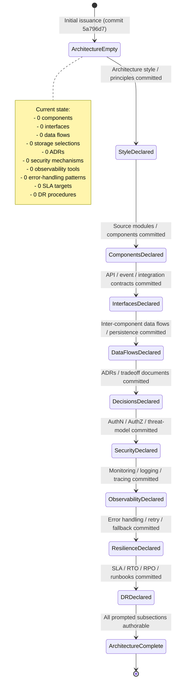

### 5.8.3 Consistency with Preceding Sections' Posture

This section maintains the documentation posture declared in Section 1.3.3 and reaffirmed in Sections 2.1.1, 2.7.3, 2.9.3, 3.1.1, 3.1.3, 3.10.3, 4.1.1, and 4.7.3: every absent element is recorded explicitly rather than omitted, every cross-reference is anchored to a verified evidentiary section, no Mermaid diagram visualizes a fabricated architecture, and no element of the prompted architectural catalogue is asserted as present without artifact-level evidence. Subsequent revisions of Section 5 should preserve the same posture until the artifact classes enumerated in Section 5.8.1 are committed.

---

## 5.9 VERSION BASELINE

### 5.9.1 Section Version

This is the **initial issuance** of Section 5 of the Technical Specification. The section is published in version 1.0 and records zero architectural selections, consistent with the verified empty state of the repository.

### 5.9.2 Repository Commit Baseline

Per Section 2.8.1, the version baseline for this Technical Specification is the single Git commit `5a796d794af56bb8930b5554aea8a563c39931d9` ("Initial commit") authored on June 1, 2026. Section 5 inherits this baseline directly and re-asserts it for the architectural determinations recorded above.

| Version Attribute | Value |
|-------------------|-------|
| Section Version | 1.0 (initial issuance) |
| Repository Commit Baseline | `5a796d794af56bb8930b5554aea8a563c39931d9` |
| Commit Date Baseline | June 1, 2026 |
| Architectural Components Recorded | 0 |
| External Integration Points Recorded | 0 |
| Architecture Decision Records Recorded | 0 |
| Communication Patterns Selected | 0 |
| Storage Solutions Selected | 0 |
| Security Mechanisms Selected | 0 |
| Observability Tools Configured | 0 |
| Performance / SLA Targets Defined | 0 |
| Disaster Recovery Procedures Documented | 0 |

### 5.9.3 Consistency with Sections 1 Through 4 Posture

This section maintains the documentation posture declared in Section 1.3.3 and reaffirmed in every preceding Section-level closure (Sections 2.9.3, 3.10.3, 4.7.3, and 4.8): every absent element is recorded explicitly rather than omitted, every cross-reference is anchored to a verified evidentiary section, and no element is fabricated to fill a prescribed schema. The prompted Required Diagrams catalogue (component interaction, state transition, sequence, decision tree, ADR, error handling) has been explicitly **not** populated with concrete architectural diagrams (see Section 5.6); the meta-level visualizations recorded in Section 5.6.7 conform to the visualization pattern of Sections 1.2.2.3, 3.8.2, and 4.5.6. Subsequent revisions of Section 5 should preserve the same posture until the unblocking artifact classes enumerated in Section 5.8.1 are committed to the repository.

---

## 5.10 REFERENCES

### 5.10.1 Files and Folders Examined

- `README.md` — Verified to contain 12 bytes total: the H1 heading `# Artifact12` with no body content. Established the verified absence of any descriptive narrative, architecture diagrams, technology declarations, integration contracts, security policies, or observability descriptors that would unblock architectural authorship.
- `` (repository root, depth 1) — Confirmed to contain only `README.md` as a top-level non-Git file. Established the verified absence of `src/`, `lib/`, `app/`, `services/`, `cmd/` source directories; `docs/`, `docs/adr/`, `docs/architecture/`, `ARCHITECTURE.md`, `SECURITY.md` documentation artifacts; `Dockerfile`, `docker-compose.yml`, Kubernetes manifests; `*.tf`, CDK, Pulumi infrastructure-as-code; `.github/workflows/`, `.gitlab-ci.yml`, `Jenkinsfile` CI/CD pipelines; `package.json`, `requirements.txt`, `pom.xml`, `go.mod`, `Cargo.toml`, `Gemfile` dependency manifests; `*.sql`, ORM models, `migrations/`, `prisma/` persistence descriptors; `logging.yaml`, OpenTelemetry / Prometheus / Grafana observability descriptors; `CODEOWNERS`, `MAINTAINERS`, runbook files.
- `.git/` — Acknowledged as version-control metadata; not part of the deployed system architecture and not used as a source of architectural evidence beyond commit-baseline identification.

### 5.10.2 Technical Specification Sections Referenced

- **Section 1.1 EXECUTIVE SUMMARY** — Repository identity (Artifact12), origin URL (`https://github.com/shalini690/Artifact12.git`), default branch (`main`), initial commit (`5a796d794af56bb8930b5554aea8a563c39931d9`) authored on June 1, 2026 by `shalini690`, and the absence of stakeholder/operations ownership documentation.
- **Section 1.2 SYSTEM OVERVIEW** — Empty integration-category table (1.2.1.3), zero system capabilities (1.2.2.1), repository inventory of `README.md` and `.git/` only (1.2.2.2), all technical-approach dimensions undetermined (1.2.2.3), and KPI placeholder table recording "No" across all categories (1.2.3.3).
- **Section 1.3 SCOPE** — Empty in-scope feature set (1.3.1.1), undefined implementation boundaries (1.3.1.2), provisional production-readiness exclusion (1.3.2.1), and evidence-only documentation posture (1.3.3).
- **Section 2.1 PREFACE AND METHODOLOGICAL BASIS** — Reaffirmation of evidence-only authoring policy applied throughout Section 5.
- **Section 2.3 FUNCTIONAL REQUIREMENTS TABLE** — Empty business rules, data validation, security requirements, and compliance requirements catalogues (2.3.4).
- **Section 2.4 FEATURE RELATIONSHIPS** — Empty feature dependency graph (2.4.1) and absent integration surface (2.4.2).
- **Section 2.5 IMPLEMENTATION CONSIDERATIONS** — Technical constraints not derivable (2.5.1), performance requirements empty (2.5.2), scalability not derivable (2.5.3), security not assessable (2.5.4), maintenance not documented (2.5.5).
- **Section 2.7 ASSUMPTIONS AND CONSTRAINTS** — Methodological-constraint reaffirmation (2.7.3).
- **Section 2.8 REQUIREMENT VERSIONING** — Commit baseline `5a796d7` (2.8.1).
- **Section 2.9 DOCUMENTATION MAINTENANCE POSTURE** — Trigger-table and lifecycle-diagram patterns mirrored in Section 5.8.
- **Section 3.1 AUTHORING CONSTRAINT AND TECHNOLOGY-STACK SNAPSHOT** — Section-level methodological preamble pattern mirrored in Section 5.1, and non-application of prompted templates (3.1.3) mirrored in Section 5.1.3.
- **Section 3.5 THIRD-PARTY SERVICES** — Empty external APIs (3.5.1), absent authentication services (3.5.2), absent monitoring/observability (3.5.3), absent cloud-platform binding (3.5.4).
- **Section 3.6 DATABASES AND STORAGE** — No primary or secondary databases (3.6.1), persistence strategy not derivable (3.6.2), no caching configured (3.6.3), no storage services bound (3.6.4).
- **Section 3.7 DEVELOPMENT AND DEPLOYMENT** — Absent build, containerization, IaC, and CI/CD artifacts referenced from the Section 3.8.1 consolidated matrix.
- **Section 3.8 CONSOLIDATED TECHNOLOGY STACK MATRIX** — Consolidated-status-matrix pattern mirrored in Section 5.7, and empty-state component-diagram pattern mirrored in Section 5.6.7.
- **Section 3.9 POPULATION LIFECYCLE AND TRIGGERS** — Trigger-table (3.9.1) and lifecycle state-diagram (3.9.2) patterns mirrored in Section 5.8.
- **Section 3.10 VERSION BASELINE** — Version-baseline pattern mirrored in Section 5.9.
- **Section 4.1 Authoring Constraint and Process-Flow Snapshot** — Meta-level-visualization rationale (4.1.3) mirrored in Section 5.1.3 and 5.6.7.
- **Section 4.2 System Workflows** — Empty inter-system data flow (4.2.2.1), empty API interactions (4.2.2.2), empty event processing flows (4.2.2.3), empty batch sequences (4.2.2.4), and empty decision points (4.2.1.3).
- **Section 4.4 Technical Implementation** — Empty state-transition graph (4.4.1.1), empty data-persistence points (4.4.1.2), empty caching requirements (4.4.1.3), empty transaction boundaries (4.4.1.4), empty retry mechanisms (4.4.2.1), empty fallback processes (4.4.2.2), empty error notification flows (4.4.2.3), empty recovery procedures (4.4.2.4).
- **Section 4.5 Required Diagrams — Per-Diagram Empty-State Determination** — Per-diagram "Cannot be authored from evidence" determination pattern mirrored in Sections 5.6.1 through 5.6.6, and the swim-lane meta-visualization pattern (4.5.6) mirrored in Section 5.6.7.
- **Section 4.6 Consolidated Process-Flow Status Matrix** — Consolidated-status-matrix template mirrored in Section 5.7.
- **Section 4.7 Population Lifecycle and Triggers** — Trigger-table (4.7.1) and lifecycle-diagram (4.7.2) patterns mirrored in Section 5.8.

# 6. SYSTEM COMPONENTS DESIGN

## 6.1 Core Services Architecture

# 6. SYSTEM COMPONENTS DESIGN

## 6.1 CORE SERVICES ARCHITECTURE

### 6.1.1 Applicability Determination

**Core Services Architecture is not applicable for this system in its current repository state.**

This determination is grounded exclusively in the verifiable repository evidence consolidated by Sections 1.2.2.2, 1.2.2.3, 5.2, 5.3, 5.4, and 5.5 of this Technical Specification, and is not a statement about the long-term architectural intent of the Artifact12 project. Specifically:

1. **No services exist.** Per Section 1.2.2.2, the complete tracked content of the Artifact12 repository consists solely of `README.md` (12 bytes, containing only the H1 heading `# Artifact12`) and the `.git/` version-control metadata directory. Per Section 5.3.1, "the component count of the Artifact12 repository is **zero**." There are no service modules, no executables, no daemons, no APIs, and no workers from which service boundaries could be drawn.

2. **No architectural style is selected.** Per Section 1.2.2.3, "programming language, runtime environment, framework selection, persistence strategy, deployment topology, and architectural style (monolith, microservices, serverless, event-driven, etc.) are all undetermined because no source or configuration files exist to evidence them." The very precondition for evaluating whether the system requires a microservices, distributed, or service-component decomposition — namely the existence of a system — is unsatisfied.

3. **No integration surface is declared.** Per Section 1.2.1.3, the integration-category table records "No" across all five categories (Inbound API Definitions, Outbound Service Clients, Event / Messaging Schemas, Identity / Authentication Providers, Data Source / Sink Connectors). There are no inter-service boundaries to coordinate.

4. **No deployment topology is committed.** Per Section 1.2.2.2, the repository contains no containerization or orchestration descriptors (no `Dockerfile`, `docker-compose.yml`, Kubernetes manifests, or service-mesh configuration), no infrastructure-as-code artifacts, and no CI/CD pipeline definitions. There is no runtime topology against which scaling, load-balancing, or service-discovery decisions can be expressed.

5. **No operational, resilience, or recovery artifacts exist.** Per Section 5.5.6, every disaster-recovery dimension (backup-and-restore policy, replication/failover topology, multi-region strategy, runbooks, incident-response, drill cadence, RTO/RPO targets, retention windows) is recorded as "none documented" or "none defined." Per Section 4.4.2, every error-handling dimension (retry, fallback, notification, recovery) is recorded as "none defined."

This section therefore enumerates every dimension prompted by the Core Services Architecture template — service components, scalability design, and resilience patterns — and records, for each, the verified absence of source material, anchored to the preceding evidentiary section that establishes the absence. This mirrors the empty-state authoring pattern established in Sections 3.1.3, 4.1.3, 5.1.3, 5.6, 5.7, and 5.8, and preserves the **evidence-only policy** declared in Section 1.3.3 and reaffirmed in Sections 2.1.1, 2.7.3, 3.1.1, 4.1.1, and 5.1.1.

#### 6.1.1.1 Scope of This Section

Section 6.1 enumerates each dimension implied by the Core Services Architecture template against three categories:

| Category | Dimensions Enumerated | Subsection |
|----------|------------------------|------------|
| Service Components | Boundaries, communication, discovery, load balancing, circuit breakers, retry/fallback | 6.1.3 |
| Scalability Design | Horizontal/vertical scaling, auto-scaling, resource allocation, performance optimization, capacity planning | 6.1.4 |
| Resilience Patterns | Fault tolerance, disaster recovery, data redundancy, failover, service degradation | 6.1.5 |

Each dimension is recorded with its prompted intent, its current documentation status, and the evidentiary anchor in a preceding section that establishes the empty state.

#### 6.1.1.2 Reconciliation with the Section Prompt

The section prompt instructs the author: *"If the system does not require microservices, distributed architecture, or distinct service components, clearly state 'Core Services Architecture is not applicable for this system' and explain why."* The reconciliation is direct: the system does not require — and cannot yet require — service-oriented decomposition because the system itself does not exist in any committed form. The remainder of this section preserves the prompted structural skeleton (service components, scalability, resilience, required diagrams) so that future revisions of the specification can populate each dimension in place as the corresponding artifacts described in Section 6.1.7 are committed.

---

### 6.1.2 Evidentiary Basis for Non-Applicability

The following snapshot consolidates the verifiable findings from Sections 1, 2, 3, 4, and 5 that bear directly on the inapplicability of Core Services Architecture authorship. Each row has been independently established in the cited preceding section.

#### 6.1.2.1 Repository State Snapshot Relevant to Core Services Architecture

| Attribute Bearing on Service Architecture | Verified Value | Originating Section |
|-------------------------------------------|----------------|---------------------|
| Tracked artifacts | `README.md` (12 bytes) and `.git/` only | Section 1.2.2.2 |
| Service / component count | Zero | Sections 1.2.2.2, 5.3.1 |
| Architectural style | Undetermined | Sections 1.2.2.3, 5.4.1 |
| Inbound API definitions | None | Section 1.2.1.3 |
| Outbound service clients | None | Section 1.2.1.3 |
| Event / messaging schemas | None | Section 1.2.1.3 |
| Communication-pattern choices | None defined | Section 5.4.2 |
| Containerization / orchestration descriptors | None present | Section 1.2.2.2 |
| Cloud-platform binding | None bound | Section 3.5.4 |
| Database / cache / storage selection | None committed / None configured / Not determined | Sections 3.6.1, 3.6.3, 3.6.4 |
| Retry / circuit-breaker / fallback configurations | None present | Sections 4.4.2.1, 4.4.2.2 |
| Recovery procedures | None defined | Section 4.4.2.4 |
| Disaster-recovery procedures | Not documented | Section 5.5.6 |
| Performance / latency / throughput targets | None defined | Sections 1.2.3.3, 2.5.2 |
| Availability / SLA / RTO / RPO targets | None defined | Sections 2.5.5, 5.5.5 |
| Scalability considerations | Not derivable | Sections 2.5.3, 5.3.2.5 |
| Operational owners (CODEOWNERS / runbooks) | None present | Sections 1.1.3, 2.5.5 |

#### 6.1.2.2 Architectural-Style Prerequisite for Service Authorship

A Core Services Architecture section presupposes that the system has — at minimum — adopted an architectural style that admits the concept of "services" (i.e., microservices, service-oriented, event-driven, or any distributed decomposition). Per Section 5.4.1, the architecture-style decision is recorded as "none documented" with every alternative (Monolithic, Layered/N-tier, Microservices, Serverless/FaaS, Event-driven, SOA, Hexagonal, CQRS/Event Sourcing) marked "Not selected; not rejected" against the evidentiary anchor at Section 1.2.2.3. Because the style itself is unselected, the question of whether the system decomposes into "core services" is not yet answerable from the repository.

---

### 6.1.3 Service Components — Empty-State Determinations

The section prompt enumerates six dimensions under the SERVICE COMPONENTS heading. Each is evaluated below against the evidentiary base.

#### 6.1.3.1 Service Boundaries and Responsibilities

Service boundaries require a non-empty component graph with assigned responsibility statements and at least one defined boundary between in-system components and out-of-system actors. Per Section 5.2.1.3, "system boundaries presuppose a defined system … the major-interfaces inventory is therefore **empty**, and no boundary can be drawn between in-system components (none exist) and out-of-system actors (none declared)." Per Section 5.3.2.1, the per-component purpose-and-responsibility enumeration is empty because zero components are committed. **Service boundaries and responsibilities are none defined.**

#### 6.1.3.2 Inter-Service Communication Patterns

Inter-service communication requires at least two communicating services and a chosen interaction protocol. Per Section 5.4.2, every communication-pattern alternative — synchronous request/response over HTTP/REST, synchronous remote procedure call (gRPC), GraphQL, asynchronous messaging (AMQP / SQS / SNS), publish/subscribe (Kafka / Pulsar / NATS), WebSocket bidirectional, server-sent events, and batch/ETL pipelines — is recorded as "Not selected" against the evidentiary anchors at Sections 1.2.1.3, 3.5, and 4.2.2.4. Per Section 5.6.3, "the actor count for sequence diagrams is zero." **Inter-service communication patterns are none defined.**

#### 6.1.3.3 Service Discovery Mechanisms

Service discovery (DNS-based, registry-based via Consul/etcd, Kubernetes-Service-based, service-mesh-based via Istio/Linkerd, client-side via Eureka/Ribbon) requires both a deployment topology and a network substrate against which discovery is performed. Per Section 1.2.2.2, no Kubernetes manifests, Helm charts, service-mesh configuration, or service-registry descriptors are present. Per Section 3.5.4, no cloud-platform binding exists from which a managed service-discovery facility (e.g., AWS Cloud Map, GCP Service Directory, Azure Service Fabric) could be inherited. **Service discovery mechanisms are none defined.**

#### 6.1.3.4 Load Balancing Strategy

A load-balancing strategy (L4/L7, round-robin / least-connections / consistent-hashing / weighted, sticky-session / stateless, ingress-controller-based / cloud-LB-based / sidecar-based) requires both a multi-replica deployment topology and a network entry point. Per Section 3.5.4, no cloud-platform binding exists, so cloud-managed load balancers (ALB, NLB, GCP HTTP(S) LB, Azure Application Gateway) are not available targets. Per Section 1.2.2.2, no ingress-controller manifests, no NGINX/HAProxy configuration, and no service-mesh sidecar configuration are present. Per Section 3.7.3 (consolidated in Section 3.8.1), no containerization is committed, so container-level load-balancing primitives have no host. **The load-balancing strategy is none defined.**

#### 6.1.3.5 Circuit Breaker Patterns

Circuit-breaker patterns (closed / open / half-open state machines, failure-rate thresholds, recovery-probe intervals) require committed source code with a circuit-breaker library binding (e.g., Resilience4j, Hystrix, Polly, gobreaker, Sentinel, Failsafe). Per Section 4.4.2.2, "fallback patterns (circuit breakers, bulkheads, default-value substitution, graceful degradation, read-only mode) require both an executable primary path (which is absent per Section 1.2.2.2) and an executable fallback path (also absent). The fallback-process set is empty." Per Section 5.5.3, the error-handling pattern catalogue records circuit-breaker / bulkhead patterns as "None defined." **Circuit breaker patterns are none defined.**

#### 6.1.3.6 Retry and Fallback Mechanisms

Retry mechanisms (immediate retry, exponential backoff, jitter, bounded retry budgets, idempotency-key correlation) and fallback mechanisms (default-value substitution, cached-response fallback, degraded mode) require committed source code or framework configuration. Per Section 4.4.2.1, "no retry mechanisms are derivable … the retry-policy set is empty." Per Section 4.4.2.2, "the fallback-process set is empty." Per Section 5.5.3, retry policies (immediate, exponential backoff, jitter) and fallback / graceful degradation are recorded as "None defined." **Retry and fallback mechanisms are none defined.**

#### 6.1.3.7 Service Components Status Matrix

| Service Components Dimension | Status | Evidentiary Anchor |
|------------------------------|--------|---------------------|
| Service boundaries and responsibilities | None defined | Sections 5.2.1.3, 5.3.2.1 |
| Inter-service communication patterns | None defined | Section 5.4.2 |
| Service discovery mechanisms | None defined | Sections 1.2.2.2, 3.5.4 |
| Load balancing strategy | None defined | Sections 3.5.4, 3.7.3 |
| Circuit breaker patterns | None defined | Sections 4.4.2.2, 5.5.3 |
| Retry and fallback mechanisms | None defined | Sections 4.4.2.1, 4.4.2.2 |

---

### 6.1.4 Scalability Design — Empty-State Determinations

The section prompt enumerates five dimensions under the SCALABILITY DESIGN heading. Each is evaluated below.

#### 6.1.4.1 Horizontal and Vertical Scaling Approach

A horizontal-versus-vertical scaling approach requires a defined deployment topology (replica count, statelessness assumptions, partition keys) and a stateful-versus-stateless service classification. Per Section 2.5.3, "scalability considerations require a defined deployment topology (vertical vs. horizontal scaling axes, stateless vs. stateful service partitioning, data-sharding strategy, caching tiers). Section 1.2.2.3 confirms that deployment topology is undetermined. Consequently, scalability considerations cannot be derived from the current repository state." Per Section 5.3.2.5, "per-component scaling considerations are therefore **not derivable**." **The horizontal / vertical scaling approach is not derivable.**

#### 6.1.4.2 Auto-Scaling Triggers and Rules

Auto-scaling triggers (CPU utilization, memory utilization, request rate, queue depth, custom Prometheus metrics) and rules (HorizontalPodAutoscaler manifests, KEDA scaler definitions, AWS Auto Scaling policies, GCP autoscaler configurations, Azure VMSS rules) require both a runtime platform that supports autoscaling primitives and observable telemetry to drive trigger evaluation. Per Section 3.5.4, no cloud-platform binding exists. Per Section 1.2.2.2, no Kubernetes manifests are present from which HPA / VPA / KEDA definitions could be extracted. Per Section 5.5.1, monitoring and observability are recorded as "none configured," so no metric source exists to drive scaling decisions. **Auto-scaling triggers and rules are none defined.**

#### 6.1.4.3 Resource Allocation Strategy

A resource-allocation strategy (CPU/memory requests and limits, GPU allocation, ephemeral-storage budgets, network-bandwidth reservations, QoS classes, priority classes) presupposes a containerized or virtualized runtime. Per Section 1.2.2.2, no `Dockerfile`, `docker-compose.yml`, Kubernetes resource manifests, or VM templates are present. Per Section 3.7.3 (cross-referenced from Section 3.8.1), containerization is recorded as "None committed." **Resource allocation strategy is none defined.**

#### 6.1.4.4 Performance Optimization Techniques

Performance optimization techniques (caching tiers, CDN binding, database read-replica routing, connection pooling, lazy loading, query optimization, async I/O, batching, compression, partitioning) presuppose at least one workload to optimize and one performance target to measure against. Per Section 2.5.2, "no throughput, latency, concurrency, or capacity targets are defined. The performance requirement set is empty." Per Section 3.6.3, no caching layer is configured. Per Section 5.5.5, every performance / SLA dimension (request latency p50/p95/p99, throughput, concurrency ceiling, availability, error budget, capacity ceiling, RTO, RPO) is recorded as "None defined." **Performance optimization techniques are none defined.**

#### 6.1.4.5 Capacity Planning Guidelines

Capacity-planning guidelines (peak / sustained / burst capacity envelopes, load-test results, growth projections, headroom percentages, scale-out trigger thresholds, SLO error budgets) require defined performance targets, defined workload profiles, and a defined deployment topology. Per Section 1.2.3.3, the KPI placeholder table records "No" across all four KPI categories. Per Section 2.5.2, the performance requirement set is empty. Per Section 2.5.3, scalability considerations are not derivable. Per Section 5.5.5, RTO / RPO and availability targets are recorded as "None defined." **Capacity planning guidelines are none defined.**

#### 6.1.4.6 Scalability Design Status Matrix

| Scalability Design Dimension | Status | Evidentiary Anchor |
|------------------------------|--------|---------------------|
| Horizontal / vertical scaling approach | Not derivable | Sections 2.5.3, 5.3.2.5 |
| Auto-scaling triggers and rules | None defined | Sections 3.5.4, 5.5.1 |
| Resource allocation strategy | None defined | Sections 1.2.2.2, 3.7.3 |
| Performance optimization techniques | None defined | Sections 2.5.2, 3.6.3, 5.5.5 |
| Capacity planning guidelines | None defined | Sections 1.2.3.3, 2.5.2, 2.5.3 |

---

### 6.1.5 Resilience Patterns — Empty-State Determinations

The section prompt enumerates five dimensions under the RESILIENCE PATTERNS heading. Each is evaluated below.

#### 6.1.5.1 Fault Tolerance Mechanisms

Fault-tolerance mechanisms (timeouts, retries with backoff, circuit breakers, bulkheads, idempotent operations, message acknowledgements, dead-letter queues, transactional outbox patterns) require committed source code with explicit fault-handling constructs. Per Section 4.4.2, every error-handling dimension (retry mechanisms, fallback processes, error notification flows, recovery procedures) is recorded as "none defined." Per Section 5.5.3, "the error-handling pattern catalogue is therefore **none defined**," with exception hierarchy, retry policies, circuit breaker / bulkhead patterns, fallback / graceful degradation, dead-letter queues / poison-message handling, error notification / alerting flows, and recovery procedures all marked "None defined." **Fault tolerance mechanisms are none defined.**

#### 6.1.5.2 Disaster Recovery Procedures

Disaster-recovery procedures (backup-and-restore policies, replication topology, multi-region failover, runbooks, incident-response playbooks, DR drill cadence, RTO/RPO targets) require operational ownership, documented procedures, and observable failure signals. Per Section 2.5.5, "no `CODEOWNERS`, `MAINTAINERS`, or runbook files exist in the repository … no test suites, CI/CD pipelines, or observability configuration exist." Per Section 4.4.2.4, "recovery procedures depend on documented operational ownership, runbooks, and observable failure signals — none of which are present." Per Section 5.5.6, every disaster-recovery dimension is recorded as "None documented" or "None defined." **Disaster recovery procedures are not documented.**

#### 6.1.5.3 Data Redundancy Approach

A data-redundancy approach (synchronous / asynchronous replication, multi-AZ / multi-region replication, write-quorum / read-quorum configuration, erasure coding, snapshot cadence, point-in-time recovery) requires at least one persistence engine and a declared replication topology. Per Section 3.6.1, "no database engine is selected … Neither a primary database (relational or document-oriented) nor any secondary/replica database is committed." Per Section 3.6.2, "data persistence strategies (write-ahead logging, replication topology, backup-and-restore policy, retention windows, soft-delete vs. hard-delete semantics, partitioning and sharding) cannot be characterized because no database is selected." Per Section 5.5.6, replication / failover topology is recorded as "None documented" with evidentiary anchor at Section 3.6.2. **The data redundancy approach is none documented.**

#### 6.1.5.4 Failover Configurations

Failover configurations (active-active multi-region, active-passive standby, leader-election protocols, virtual-IP failover, DNS-based failover with health checks, database promotion procedures) require a declared multi-instance topology and a health-checking mechanism. Per Section 3.6.2, persistence-strategy replication topology is recorded as "not derivable." Per Section 3.5.4, no cloud-platform binding exists from which managed failover primitives could be inherited. Per Section 5.5.6, replication / failover topology and "multi-region active-active / active-passive strategy" are both recorded as "None documented." **Failover configurations are none documented.**

#### 6.1.5.5 Service Degradation Policies

Service-degradation policies (read-only mode, feature-flag-driven traffic shedding, prioritized request classes, graceful-degradation defaults, cached-response fallback, partial-response acceptance) require committed source code with explicit degradation branches and a feature-flag platform or equivalent runtime switch. Per Section 4.4.2.2, "fallback patterns (circuit breakers, bulkheads, default-value substitution, graceful degradation, read-only mode) require both an executable primary path (which is absent per Section 1.2.2.2) and an executable fallback path (also absent). The fallback-process set is empty." Per Section 5.5.3, fallback / graceful degradation is recorded as "None defined." **Service degradation policies are none defined.**

#### 6.1.5.6 Resilience Patterns Status Matrix

| Resilience Patterns Dimension | Status | Evidentiary Anchor |
|-------------------------------|--------|---------------------|
| Fault tolerance mechanisms | None defined | Sections 4.4.2, 5.5.3 |
| Disaster recovery procedures | Not documented | Sections 2.5.5, 5.5.6 |
| Data redundancy approach | None documented | Sections 3.6.1, 3.6.2, 5.5.6 |
| Failover configurations | None documented | Sections 3.5.4, 3.6.2, 5.5.6 |
| Service degradation policies | None defined | Sections 4.4.2.2, 5.5.3 |

---

### 6.1.6 Required Diagrams — Per-Diagram Empty-State Determination

The section prompt requires three Mermaid.js diagrams: service interaction diagrams, scalability architecture diagrams, and resilience pattern implementation diagrams. Each is evaluated below against the evidentiary base, mirroring the per-diagram determination pattern of Sections 4.5 and 5.6. Following the per-diagram determinations, Section 6.1.6.4 supplies the meta-level visualizations that the evidence-only policy permits.

#### 6.1.6.1 Service Interaction Diagram

A service interaction diagram requires a non-empty service graph with at least two service nodes and one directed interaction edge (request, event, or stream). Per Section 5.3.1, the component count is zero. Per Section 5.6.1, the equivalent component-interaction diagram was determined "cannot be authored from evidence" because "the component count is zero, and per Section 1.2.2.1, no system capabilities are implemented." Per Section 5.6.3, the actor count for sequence diagrams is zero. **Determination: cannot be authored from evidence.**

#### 6.1.6.2 Scalability Architecture Diagram

A scalability architecture diagram requires a defined deployment topology with scaling axes (replica fan-out, partition keys, scaling boundaries) and at least one elasticity primitive (HPA, ASG, KEDA scaler). Per Section 2.5.3, "scalability considerations cannot be derived from the current repository state." Per Section 5.3.2.5, per-component scaling considerations are recorded as "not derivable." Per Section 1.2.2.2, no Kubernetes manifests, autoscaling-policy descriptors, or cloud-load-balancer bindings exist. **Determination: cannot be authored from evidence.**

#### 6.1.6.3 Resilience Pattern Implementation Diagram

A resilience pattern implementation diagram requires committed source code with documented failure modes, exception hierarchies, retry / circuit-breaker / fallback branches, and recovery flows. Per Section 4.4.2, all error-handling dimensions are recorded as "none defined." Per Section 5.6.6, the equivalent error-handling flow diagram was determined "cannot be authored from evidence" because "no source code is present" and "retry, fallback, notification, and recovery dimensions are all empty." **Determination: cannot be authored from evidence.**

#### 6.1.6.4 Meta-Level Visualizations of the Empty Core Services Surface

Consistent with the meta-level visualization pattern established in Sections 1.2.2.3, 2.9.2, 3.8.2, 3.9.2, 4.5.6, 4.7.2, 5.6.7, and 5.8.2, three meta-level Mermaid diagrams below visualize the present, evidenced state of the Core Services Architecture surface against the dimensions awaiting commit.

#### Diagram 6.1.6.4-A — Service Components: Currently Evidenced vs. Awaiting Commits

The diagram below visualizes the Service Components surface (Section 6.1.3). The "Currently Evidenced" subgraph contains only the placeholder `README.md`; the "Awaiting Future Commits" subgraph enumerates the six prompted service-components dimensions whose authorship is unblocked by future commitment of the artifact classes enumerated in Section 6.1.7.

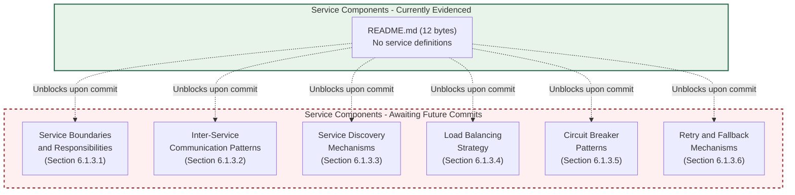

#### Diagram 6.1.6.4-B — Scalability Design: Currently Evidenced vs. Awaiting Commits

The diagram below visualizes the Scalability Design surface (Section 6.1.4) using the same meta-level pattern.

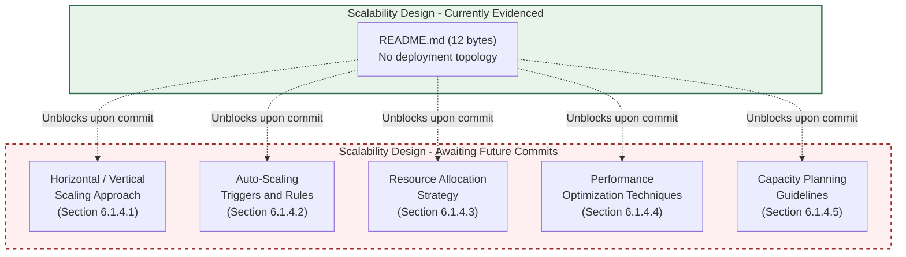

#### Diagram 6.1.6.4-C — Resilience Patterns: Currently Evidenced vs. Awaiting Commits

The diagram below visualizes the Resilience Patterns surface (Section 6.1.5) using the same meta-level pattern.

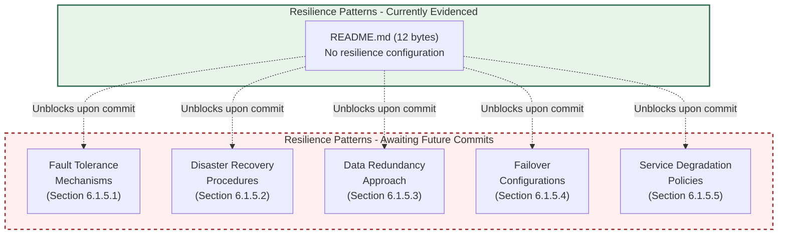

#### Diagram 6.1.6.4-D — Swim-Lane Visualization of the Empty Service Interaction Surface

Mirroring the swim-lane pattern of Sections 4.5.6 and 5.6.7, the diagram below records each prompted service-architecture lane as empty and explicitly notes the absence of any committed service, scalability primitive, or resilience artifact.

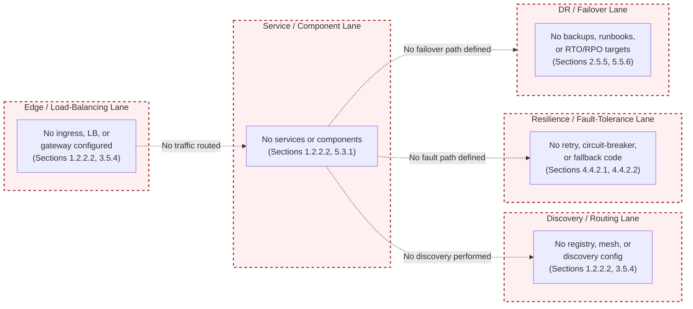

---

### 6.1.7 Population Lifecycle and Triggers

Each subsection of Section 6.1 will transition from its current placeholder state to an authored state when the corresponding artifact class is committed to the repository. The trigger tables below mirror the population-lifecycle pattern established in Sections 2.9.1, 3.9.1, 4.7.1, and 5.8.1.

#### 6.1.7.1 Unblocking Artifacts — Service Components (Section 6.1.3)

| Service Components Subsection | Unblocking Artifact Class |
|-------------------------------|---------------------------|
| 6.1.3.1 Service Boundaries | Source directories (`src/`, `services/`, `cmd/`), per-service READMEs, bounded-context maps |
| 6.1.3.2 Inter-Service Communication | API contracts (OpenAPI / gRPC `.proto` / AsyncAPI), broker configuration, RPC client code |
| 6.1.3.3 Service Discovery | Kubernetes `Service` manifests, Consul / etcd configs, service-mesh manifests (Istio, Linkerd) |
| 6.1.3.4 Load Balancing | Ingress controllers, NGINX / HAProxy / Envoy configs, cloud LB descriptors (ALB, NLB) |
| 6.1.3.5 Circuit Breakers | Resilience library configs (Resilience4j, Hystrix, Polly, Sentinel, gobreaker) |
| 6.1.3.6 Retry and Fallback | Retry-library configs, idempotency-key middleware, fallback handler code |

#### 6.1.7.2 Unblocking Artifacts — Scalability Design (Section 6.1.4)

| Scalability Design Subsection | Unblocking Artifact Class |
|-------------------------------|---------------------------|
| 6.1.4.1 Horizontal / Vertical Scaling | Deployment topology (Kubernetes Deployments, ASG configs, replica specs) |
| 6.1.4.2 Auto-Scaling Triggers | HPA / VPA manifests, KEDA scalers, CloudWatch alarms, Prometheus alerting rules |
| 6.1.4.3 Resource Allocation | Kubernetes resource requests / limits, `Dockerfile` resource hints, `docker-compose` configs |
| 6.1.4.4 Performance Optimization | Caching configs, CDN bindings, connection-pool configs, query-plan annotations |
| 6.1.4.5 Capacity Planning | SLO YAML files, load-test scripts, capacity-planning documents, headroom budgets |

#### 6.1.7.3 Unblocking Artifacts — Resilience Patterns (Section 6.1.5)

| Resilience Patterns Subsection | Unblocking Artifact Class |
|--------------------------------|---------------------------|
| 6.1.5.1 Fault Tolerance | Timeout configs, retry / bulkhead configs, graceful-shutdown handlers, idempotency code |
| 6.1.5.2 Disaster Recovery | Runbooks, RTO / RPO documents, multi-region failover playbooks, on-call rosters |
| 6.1.5.3 Data Redundancy | Database replication configs, backup-and-restore policies, snapshot-cadence definitions |
| 6.1.5.4 Failover | Active-passive / active-active topology descriptors, health-check / leader-election configs |
| 6.1.5.5 Service Degradation | Feature-flag configs (LaunchDarkly, Unleash, ConfigCat), graceful-degradation handlers |

#### 6.1.7.4 Lifecycle Diagram for Section 6.1 Maturation

The diagram below positions Section 6.1 within the broader specification-maturation flow established by Section 1.3.3 and mirrored by Sections 2.9.2, 3.9.2, 4.7.2, and 5.8.2. The current state — `CoreServicesEmpty` — corresponds to the initial-issuance baseline at commit `5a796d794af56bb8930b5554aea8a563c39931d9` per Section 1.1.1.

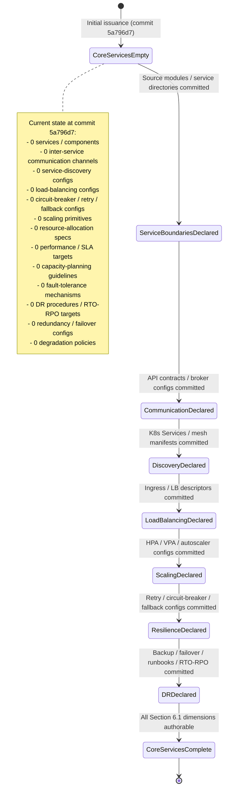

---

### 6.1.8 Consistency with Preceding Sections' Documentation Posture

This section maintains the **evidence-only documentation posture** declared in Section 1.3.3 and reaffirmed in Sections 2.1.1, 2.7.3, 2.9.3, 3.1.1, 3.1.3, 3.10.3, 4.1.1, 4.7.3, 5.1.1, and 5.8.3. Specifically:

1. Every absent element of the prompted Core Services Architecture catalogue is recorded explicitly — as "none defined," "not derivable," "none documented," or "cannot be authored from evidence" — rather than omitted or fabricated.
2. Every cross-reference is anchored to a verified evidentiary section in this Technical Specification (Sections 1.1, 1.2, 1.3, 2.5, 3.5, 3.6, 3.7, 4.2, 4.4, 5.1, 5.2, 5.3, 5.4, 5.5, 5.6, 5.7, 5.8).
3. No Mermaid diagram in this section visualizes a fabricated service topology; the three required diagrams (service interaction, scalability architecture, resilience patterns) are each recorded as "cannot be authored from evidence," and the meta-level visualizations supplied in Section 6.1.6.4 depict only the verified empty surface and its population lifecycle.
4. No element of the prompted Core Services Architecture catalogue is asserted as present without artifact-level evidence in the repository.

Subsequent revisions of Section 6.1 should preserve the same posture until the artifact classes enumerated in Sections 6.1.7.1, 6.1.7.2, and 6.1.7.3 are committed. The applicability determination in Section 6.1.1 — "Core Services Architecture is not applicable for this system" — should be re-evaluated whenever any artifact in Section 5.1.1's enumeration of unblocking artifact classes (application source code, architectural-decision documents, interface and contract definitions, component-deployment descriptors, persistence and state descriptors, security-architecture artifacts, observability-architecture artifacts, resilience and disaster-recovery artifacts) is introduced to the repository.

---

### 6.1.9 Consolidated Section 6.1 Status Matrix

The following matrix consolidates the per-dimension findings of Sections 6.1.3, 6.1.4, and 6.1.5 against every dimension implied by the section prompt. Every "Status" entry is anchored to the evidentiary section that establishes the absence, mirroring the consolidation pattern of Sections 3.8.1, 4.6, and 5.7. The matrix is partitioned into two complementary tables to respect the four-column formatting constraint.

#### 6.1.9.1 Service Components and Scalability Status

| Section 6.1 Dimension | Subsection | Status | Evidentiary Anchor |
|------------------------|------------|--------|---------------------|
| Service boundaries and responsibilities | 6.1.3.1 | None defined | Sections 5.2.1.3, 5.3.2.1 |
| Inter-service communication patterns | 6.1.3.2 | None defined | Section 5.4.2 |
| Service discovery mechanisms | 6.1.3.3 | None defined | Sections 1.2.2.2, 3.5.4 |
| Load balancing strategy | 6.1.3.4 | None defined | Sections 3.5.4, 3.7.3 |
| Circuit breaker patterns | 6.1.3.5 | None defined | Sections 4.4.2.2, 5.5.3 |
| Retry and fallback mechanisms | 6.1.3.6 | None defined | Sections 4.4.2.1, 4.4.2.2 |
| Horizontal / vertical scaling | 6.1.4.1 | Not derivable | Sections 2.5.3, 5.3.2.5 |
| Auto-scaling triggers and rules | 6.1.4.2 | None defined | Sections 3.5.4, 5.5.1 |
| Resource allocation strategy | 6.1.4.3 | None defined | Sections 1.2.2.2, 3.7.3 |
| Performance optimization techniques | 6.1.4.4 | None defined | Sections 2.5.2, 5.5.5 |
| Capacity planning guidelines | 6.1.4.5 | None defined | Sections 1.2.3.3, 2.5.3 |

#### 6.1.9.2 Resilience Patterns and Required Diagrams Status

| Section 6.1 Dimension | Subsection | Status | Evidentiary Anchor |
|------------------------|------------|--------|---------------------|
| Fault tolerance mechanisms | 6.1.5.1 | None defined | Sections 4.4.2, 5.5.3 |
| Disaster recovery procedures | 6.1.5.2 | Not documented | Sections 2.5.5, 5.5.6 |
| Data redundancy approach | 6.1.5.3 | None documented | Sections 3.6.1, 3.6.2 |
| Failover configurations | 6.1.5.4 | None documented | Sections 3.5.4, 5.5.6 |
| Service degradation policies | 6.1.5.5 | None defined | Sections 4.4.2.2, 5.5.3 |
| Service interaction diagram | 6.1.6.1 | Cannot be authored | Sections 5.3.1, 5.6.1 |
| Scalability architecture diagram | 6.1.6.2 | Cannot be authored | Sections 2.5.3, 5.3.2.5 |
| Resilience pattern diagram | 6.1.6.3 | Cannot be authored | Sections 4.4.2, 5.6.6 |

---

#### References

#### Files Examined

- `README.md` — Verified to contain only 12 bytes (the H1 heading `# Artifact12`); contains no service definitions, no architecture-bearing content, and no integration contracts. Establishes the zero-component, zero-service evidentiary baseline.

#### Folders Explored

- `/` (repository root, depth 1) — Verified to contain only `README.md` as the sole tracked non-Git file. Confirmed the absence of source directories (`src/`, `services/`, `cmd/`, `app/`, `lib/`), containerization descriptors (`Dockerfile`, `docker-compose.yml`), orchestration manifests (Kubernetes, Helm), service-mesh configuration (Istio, Linkerd), CI/CD pipeline definitions (`.github/workflows/`), infrastructure-as-code artifacts (Terraform, CDK, Pulumi), resilience-library configurations, and operational ownership files (`CODEOWNERS`, `MAINTAINERS`, runbooks).

#### Technical Specification Sections Cross-Referenced

- **Section 1.1 EXECUTIVE SUMMARY** — Repository identity, initial pre-implementation state, commit baseline `5a796d794af56bb8930b5554aea8a563c39931d9`, absence of operational owners.
- **Section 1.2 SYSTEM OVERVIEW** — Integration-category table (all "No"), zero-component inventory, undetermined architectural style and deployment topology.
- **Section 1.3 SCOPE** — Undefined implementation boundaries, evidence-only documentation posture.
- **Section 2.5 IMPLEMENTATION CONSIDERATIONS** — Empty performance-requirement set, non-derivable scalability considerations, undocumented maintenance and DR requirements.
- **Section 3.5 THIRD-PARTY SERVICES** — Zero-binding cloud platform, zero observability integration, zero identity-provider integration, zero messaging/event-bus configuration.
- **Section 3.6 DATABASES AND STORAGE** — No database engine selected, no caching layer configured, no storage-service bound, non-derivable persistence strategy.
- **Section 3.7 DEVELOPMENT AND DEPLOYMENT** — No containerization committed (referenced via Section 3.8.1).
- **Section 3.8 CONSOLIDATED TECHNOLOGY STACK MATRIX** — All stack dimensions "None committed" or "Not determined."
- **Section 4.2 System Workflows** — No internal component-to-component calls, no decision points, no inter-system data flow.
- **Section 4.4 Technical Implementation** — Empty state-transition graph, empty retry-policy set, empty fallback-process set, empty error-notification channel set, undefined recovery procedures.
- **Section 4.5 Required Diagrams — Per-Diagram Empty-State Determination** — Source pattern for per-diagram empty-state determinations and swim-lane meta-level visualizations.
- **Section 4.6 Consolidated Process-Flow Status Matrix** — Consolidation pattern for empty-state status matrices.
- **Section 4.7 Population Lifecycle and Triggers** — Trigger-table pattern for unblocking artifacts.
- **Section 5.1 AUTHORING CONSTRAINT AND ARCHITECTURE SNAPSHOT** — Evidence-only methodological basis and unblocking artifact-class enumeration.
- **Section 5.2 HIGH-LEVEL ARCHITECTURE** — Undetermined architectural style, empty major-interfaces inventory, zero-row Core Components Table, empty data-flow inventory.
- **Section 5.3 COMPONENT DETAILS** — Zero-component repository inventory, empty per-component dimensional determinations, non-derivable per-component scaling considerations.
- **Section 5.4 TECHNICAL DECISIONS** — Architecture-style decision "none documented," all communication-pattern alternatives "Not selected," empty ADR catalogue.
- **Section 5.5 CROSS-CUTTING CONCERNS** — No monitoring/logging/tracing configured, error-handling pattern catalogue "none defined," undocumented disaster-recovery procedures, no performance/SLA targets.
- **Section 5.6 REQUIRED DIAGRAMS — PER-DIAGRAM EMPTY-STATE DETERMINATION** — Source pattern for per-diagram "cannot be authored from evidence" determinations and meta-level visualizations.
- **Section 5.7 CONSOLIDATED ARCHITECTURE STATUS MATRIX** — Consolidation pattern for architecture-dimension status matrices.
- **Section 5.8 POPULATION LIFECYCLE AND TRIGGERS** — Trigger-table pattern and lifecycle-diagram pattern for Section 5 maturation.

## 6.2 Database Design

### 6.2.1 Applicability Determination

**Database Design is not applicable for this system in its current repository state.**

This determination is grounded exclusively in the verifiable repository evidence consolidated by Sections 1.2.2.2, 1.2.2.3, 3.6, 4.4.1, 5.3.2.4, 5.4.3, 5.4.4, 5.5.4, 5.5.5, 5.5.6, and 5.7 of this Technical Specification, and is not a statement about the long-term data-architecture intent of the Artifact12 project. Specifically:

1. **No database engine is committed.** Per Section 3.6.1, "No database engine is selected … The inventory in Section 1.2.2.2 records the absence of any schema artifact: no `*.sql` DDL files, no ORM model files, no migration directories (`migrations/`, `db/migrate/`, `alembic/`, `prisma/`), no NoSQL collection or index definitions, and no client-driver configuration. Neither a primary database (relational or document-oriented) nor any secondary/replica database is committed." Every database-tier row in the Section 3.6.1 selection table — Primary OLTP, secondary/read-replica, analytical/OLAP, search index, time-series, and graph — is recorded as "None committed."

2. **No persistence strategy is derivable.** Per Section 3.6.2, "data persistence strategies (write-ahead logging, replication topology, backup-and-restore policy, retention windows, soft-delete vs. hard-delete semantics, partitioning and sharding) cannot be characterized because no database is selected … Persistence strategy is therefore not derivable." Per Section 4.4.1.2, "no data persistence points are derivable."

3. **No caching layer is configured.** Per Section 3.6.3, "No caching layer is configured. No Redis, Memcached, in-memory, CDN-edge, or application-level cache is referenced in any tracked file." Per Section 5.4.4, the caching strategy and its justification are recorded as "none configured."

4. **No storage service is bound.** Per Section 3.6.4, "No object storage (e.g., AWS S3, Azure Blob, GCS), block storage, file-system service, or external content-delivery configuration is committed. Storage-service binding is not determined."

5. **No data-storage rationale is documented.** Per Section 5.4.3, "no data-storage solution rationale (e.g., ACID-vs-BASE tradeoff, OLTP-vs-OLAP separation, normalized-vs-denormalized modelling, polyglot persistence) is documented because no storage solution is selected. The data-storage rationale is none documented." Every storage-solution row in the Section 5.4.3 table — relational OLTP, document, key-value, wide-column, graph, time-series, search index, and object/blob — is recorded as "None committed" or "None bound."

6. **No per-component persistence requirement is defined.** Per Section 5.3.2.4, "per-component data-persistence requirements are therefore none defined." Per Section 5.3.1, the component count of the Artifact12 repository is zero, so no component-level persistence boundary can be drawn.

7. **No disaster-recovery, backup, retention, or replication policy exists.** Per Section 5.5.6, every disaster-recovery dimension — backup-and-restore policy, replication / failover topology, multi-region active-active / active-passive strategy, runbooks and on-call procedures, incident-response process, DR drill cadence, RTO / RPO targets, and backup retention windows — is recorded as "None documented" or "None defined."

8. **No access-control or audit mechanism is present.** Per Section 5.5.4, every authentication / authorization dimension is recorded as "None configured," "None integrated," "None present," "Not selected," or "Not defined." Per Section 2.5.4, "the repository contains no authentication or authorization scheme, no identity-provider configuration, no secrets-management policy, no security-control documentation, and no threat model."

This section therefore enumerates every dimension prompted by the Database Design template — schema design, data management, compliance considerations, and performance optimization — and records, for each, the verified absence of source material, anchored to the preceding evidentiary section that establishes the absence. This mirrors the empty-state authoring pattern established in Sections 3.1.3, 4.1.3, 4.5, 4.6, 5.1.3, 5.6, 5.7, 5.8, and 6.1, and preserves the **evidence-only policy** declared in Section 1.3.3 and reaffirmed in Sections 2.1.1, 2.7.3, 3.1.1, 4.1.1, 5.1.1, and 6.1.1.

#### 6.2.1.1 Scope of This Section

Section 6.2 enumerates each dimension implied by the Database Design template against four categories:

| Category | Dimensions Enumerated | Subsection |
|----------|------------------------|------------|
| Schema Design | Entity relationships, data models, indexing, partitioning, replication, backup architecture | 6.2.3 |
| Data Management | Migrations, versioning, archival, storage/retrieval, caching policies | 6.2.4 |
| Compliance Considerations | Retention, backup/fault-tolerance, privacy, audit, access controls | 6.2.5 |
| Performance Optimization | Query optimization, caching strategy, connection pooling, read/write splitting, batch processing | 6.2.6 |

Each dimension is recorded with its prompted intent, its current documentation status, and the evidentiary anchor in a preceding section that establishes the empty state.

#### 6.2.1.2 Reconciliation with the Section Prompt

The section prompt instructs the author: *"If the system does not require or direct database or persistent storage interactions are not clearly evident, clearly state 'Database Design is not applicable to this system' and explain why."* The reconciliation is direct: no database engine, no schema artifact, no persistence configuration, no caching layer, and no storage-service binding is committed to the repository, and per Section 1.2.2.3, persistence strategy is explicitly recorded as **undetermined**. The system therefore neither requires nor evidences direct database or persistent-storage interactions in its current state. The remainder of this section preserves the prompted structural skeleton (schema design, data management, compliance considerations, performance optimization, and required diagrams) so that future revisions of the specification can populate each dimension in place as the corresponding artifacts described in Section 6.2.8 are committed.

---

### 6.2.2 Evidentiary Basis for Non-Applicability

The following snapshot consolidates the verifiable findings from Sections 1, 2, 3, 4, and 5 that bear directly on the inapplicability of Database Design authorship. Each row has been independently established in the cited preceding section.

#### 6.2.2.1 Repository State Snapshot Relevant to Database Design

| Attribute Bearing on Database Design | Verified Value | Originating Section |
|--------------------------------------|----------------|---------------------|
| Tracked artifacts | `README.md` (12 bytes) and `.git/` only | Section 1.2.2.2 |
| Database engine (primary OLTP) | None committed | Section 3.6.1 |
| Secondary / read-replica database | None committed | Section 3.6.1 |
| Analytical / OLAP store | None committed | Section 3.6.1 |
| Search index | None committed | Section 3.6.1 |
| Time-series store | None committed | Section 3.6.1 |
| Graph database | None committed | Section 3.6.1 |
| Persistence strategy | Not derivable | Section 3.6.2 |
| Caching layer (Redis / Memcached / in-memory / CDN) | None configured | Section 3.6.3 |
| Object / blob storage | None bound | Section 3.6.4 |
| Schema artifacts (`*.sql`, ORM models, migration dirs) | None present | Section 3.6.1 |
| Data-storage rationale | None documented | Section 5.4.3 |
| Caching strategy / eviction / TTL / coherency | None configured | Section 5.4.4 |
| Per-component persistence requirements | None defined | Section 5.3.2.4 |
| Data persistence points | None defined | Section 4.4.1.2 |
| Caching requirements | None defined | Section 4.4.1.3 |
| Transaction boundaries (ACID / 2PC / saga) | None defined | Section 4.4.1.4 |
| Backup-and-restore policy | None documented | Section 5.5.6 |
| Replication / failover topology | None documented | Section 5.5.6 |
| RTO / RPO targets | None defined | Section 5.5.6 |
| Backup retention windows | None defined | Section 5.5.6 |
| Authentication / authorization framework | None integrated | Section 5.5.4 |
| Identity-provider integration | None integrated | Section 5.5.4 |
| Audit-logging / change-data-capture configuration | None configured | Section 5.5.1 |
| Cloud-platform binding (managed DB services) | None bound | Section 3.5.4 |
| Containerization / orchestration descriptors | None present | Section 1.2.2.2 |

#### 6.2.2.2 Persistence-Engine Prerequisite for Database Design Authorship

A Database Design section presupposes that the system has — at minimum — selected at least one persistence engine (relational, document-oriented, key-value, wide-column, graph, time-series, search index, or object storage) and committed at least one schema artifact (DDL file, ORM model, NoSQL index/collection definition, or equivalent) against which entity relationships, indexing, partitioning, replication, and backup design can be expressed. Per Section 5.4.3, every storage-solution alternative is recorded as "None committed" or "None bound" with evidentiary anchors at Sections 3.6.1 and 3.6.4. Because no persistence engine is selected and no schema artifact is committed, the question of how the system models, indexes, partitions, replicates, or backs up its data is not yet answerable from the repository.

---

### 6.2.3 Schema Design — Empty-State Determinations

The section prompt enumerates six dimensions under the SCHEMA DESIGN heading. Each is evaluated below against the evidentiary base.

#### 6.2.3.1 Entity Relationships

Entity-relationship modelling requires a non-empty domain entity set, defined cardinality between entities (one-to-one, one-to-many, many-to-many), and explicit foreign-key or reference constraints. Per Section 3.6.1, no ORM model files, no `*.sql` DDL files containing `CREATE TABLE` or `REFERENCES` clauses, and no NoSQL collection definitions are present. Per Section 1.3.1.2, "no schemas, models, or data-dictionary files [are] present" under the "Data Domains Included" boundary dimension. Per Section 5.3.2.4, "per-component data-persistence requirements are therefore none defined." **Entity relationships are none defined.**

#### 6.2.3.2 Data Models and Structures

A data model (logical or physical) requires committed schema artifacts that define table or document structures, attribute types, constraints, and integrity rules. Per Section 3.6.1, the schema-artifact inventory enumerates the absence of `*.sql` DDL files, ORM model files, migration directories (`migrations/`, `db/migrate/`, `alembic/`, `prisma/`), NoSQL collection/index definitions, and client-driver configuration. Per Section 5.4.3, all storage-solution categories — relational OLTP, document, key-value, wide-column, graph, time-series, search index, and object/blob — are recorded as "None committed" or "None bound." **Data models and structures are none defined.**

#### 6.2.3.3 Indexing Strategy

An indexing strategy (B-tree primary indexes, secondary / composite / covering indexes, hash / GIN / GiST / BRIN indexes, full-text indexes, unique-constraint indexes, expression / functional indexes, partial / filtered indexes) requires committed DDL `CREATE INDEX` statements, ORM index annotations, or NoSQL index definitions. Per Section 3.6.1, no such artifacts exist. Per Section 5.5.5, no throughput, latency, or query-performance target exists against which an indexing strategy could be optimized. **The indexing strategy is none defined.**

#### 6.2.3.4 Partitioning Approach

A partitioning approach (range / hash / list / composite partitioning, declarative partitioning, partition pruning, sharding by key, consistent hashing) requires both a selected database engine and committed partition or shard definitions. Per Section 3.6.2, "data persistence strategies (write-ahead logging, replication topology, backup-and-restore policy, retention windows, soft-delete vs. hard-delete semantics, partitioning and sharding) cannot be characterized because no database is selected." Per Section 2.5.3, "data-sharding strategy" is among the dimensions that cannot be derived because deployment topology is undetermined. **The partitioning approach is not derivable.**

#### 6.2.3.5 Replication Configuration

A replication configuration (synchronous / asynchronous replication, single-leader / multi-leader / leaderless topology, streaming replication, logical replication, write-quorum / read-quorum tuning, cross-region replication) requires committed replication-topology descriptors (e.g., `postgresql.conf` standby parameters, MongoDB replica-set initialization documents, Cassandra `cassandra.yaml` snitch / replication-factor configuration). Per Section 3.6.2, no such descriptors are present and replication topology is recorded among the persistence-strategy dimensions that "cannot be characterized." Per Section 5.5.6, "Replication / failover topology — None documented." **Replication configuration is none documented.**

#### 6.2.3.6 Backup Architecture

A backup architecture (full / incremental / differential backup cadence, point-in-time recovery via WAL/redo-log shipping, snapshot-based backups, cross-region backup replication, immutable / append-only backup vaults, restore-validation procedures) requires committed backup policy documents, scheduled-backup scripts (e.g., `pg_dump`, `mysqldump`, MongoDB `mongodump`), snapshot-cadence configurations, and restore-verification runbooks. Per Section 5.5.6, "Backup-and-restore policy — None documented" and "Backup retention windows — None defined." Per Section 3.6.2, backup-and-restore policy is recorded among the dimensions that "cannot be characterized because no database is selected." **Backup architecture is none documented.**

#### 6.2.3.7 Schema Design Status Matrix

| Schema Design Dimension | Status | Evidentiary Anchor |
|--------------------------|--------|---------------------|
| Entity relationships | None defined | Sections 3.6.1, 5.3.2.4 |
| Data models and structures | None defined | Sections 3.6.1, 5.4.3 |
| Indexing strategy | None defined | Sections 3.6.1, 5.5.5 |
| Partitioning approach | Not derivable | Sections 2.5.3, 3.6.2 |
| Replication configuration | None documented | Sections 3.6.2, 5.5.6 |
| Backup architecture | None documented | Sections 3.6.2, 5.5.6 |

---

### 6.2.4 Data Management — Empty-State Determinations

The section prompt enumerates five dimensions under the DATA MANAGEMENT heading. Each is evaluated below.

#### 6.2.4.1 Migration Procedures

Database migration procedures (forward / reverse / idempotent migrations, baseline schemas, migration runners) require committed migration directories such as `migrations/`, `db/migrate/`, `alembic/versions/`, `prisma/migrations/`, Flyway `db/migration/V__*.sql` versioned files, or Liquibase `changelog.xml`. Per Section 3.6.1, the schema-artifact inventory explicitly enumerates the absence of "migration directories (`migrations/`, `db/migrate/`, `alembic/`, `prisma/`)." Per Section 1.2.2.2, no source directories of any kind exist in the repository. **Migration procedures are none defined.**

#### 6.2.4.2 Versioning Strategy

A schema-versioning strategy (sequentially numbered migrations, timestamp-based versions, semantic versioning of DDL contracts, expand-contract / parallel-change patterns, blue-green schema rollouts, backward-compatibility windows) requires committed migration version metadata and a documented compatibility window. Per Section 3.6.1, no migration directories exist, so no migration version metadata can be recorded. Per Section 2.8 (Requirement Versioning, established as pattern in Sections 2.9.1, 3.9.1, 4.7.1, 5.8.1) and Section 2.5.5, no backward-compatibility commitments are documented. **The versioning strategy is none defined.**

#### 6.2.4.3 Archival Policies

Archival policies (cold-storage tiering, time-based archival jobs, partition rotation into archival schemas, immutable archive vaults, archival-to-object-storage flows) require committed archival job definitions, retention-policy configurations, and at minimum one persistence engine plus one object-storage binding. Per Section 3.6.1, no database engine is committed. Per Section 3.6.4, no object storage is bound. Per Section 5.5.6, "Backup retention windows — None defined." **Archival policies are none defined.**

#### 6.2.4.4 Data Storage and Retrieval Mechanisms

Data storage and retrieval mechanisms (DAO / Repository patterns, ORM session management, raw SQL execution, prepared statements, query builders, NoSQL client APIs, object-store SDKs, full-text-search query DSLs) require committed application source code with persistence-client invocations. Per Section 1.2.2.2, no source files of any programming language exist in the repository. Per Section 3.6.1, no database client-driver configuration is committed. Per Section 3.6.4, no storage-service binding (e.g., AWS S3, Azure Blob, GCS) is committed. Per Section 5.3.2.3, component-level public and consumed interfaces are "none defined." **Data storage and retrieval mechanisms are none defined.**

#### 6.2.4.5 Caching Policies

Caching policies (cache-aside vs. write-through vs. write-behind vs. refresh-ahead selection, TTL configuration, eviction policy — LRU / LFU / FIFO / TTL-based, cache key design, multi-tier cache architecture — L1 in-process / L2 distributed / L3 CDN, cache-coherency / invalidation protocols) require committed cache-client configuration, cache-aside annotations, or middleware-level cache configuration. Per Section 3.6.3, "No caching layer is configured. No Redis, Memcached, in-memory, CDN-edge, or application-level cache is referenced in any tracked file. The inventory in Section 1.2.2.2 confirms the absence of any cache-related configuration." Per Section 5.4.4, "The caching strategy and its justification — including cache-aside vs. write-through vs. write-behind selection, eviction policy, TTL configuration, cache-coherency model, and multi-tier cache architecture — are therefore none configured." Per Section 4.4.1.3, "no caching requirements are derivable." **Caching policies are none configured.**

#### 6.2.4.6 Data Management Status Matrix

| Data Management Dimension | Status | Evidentiary Anchor |
|---------------------------|--------|---------------------|
| Migration procedures | None defined | Sections 1.2.2.2, 3.6.1 |
| Versioning strategy | None defined | Sections 2.5.5, 3.6.1 |
| Archival policies | None defined | Sections 3.6.1, 3.6.4, 5.5.6 |
| Data storage and retrieval mechanisms | None defined | Sections 1.2.2.2, 3.6.1, 3.6.4 |
| Caching policies | None configured | Sections 3.6.3, 4.4.1.3, 5.4.4 |

---

### 6.2.5 Compliance Considerations — Empty-State Determinations

The section prompt enumerates five dimensions under the COMPLIANCE CONSIDERATIONS heading. Each is evaluated below.

#### 6.2.5.1 Data Retention Rules

Data retention rules (per-data-class retention windows, hard-delete vs. soft-delete vs. tombstone semantics, GDPR right-to-erasure procedures, HIPAA retention obligations, jurisdictional retention requirements, retention-policy enforcement schedulers) require committed retention-policy configurations and at minimum one persistence engine to which the rules apply. Per Section 3.6.2, "soft-delete vs. hard-delete semantics … retention windows … cannot be characterized because no database is selected." Per Section 5.5.6, "Backup retention windows — None defined." Per Section 1.3.1.2, no data domains are defined in the repository against which classification-driven retention rules could be specified. **Data retention rules are none defined.**

#### 6.2.5.2 Backup and Fault Tolerance Policies

Backup and fault-tolerance policies for the data tier (backup-and-restore procedures, replication-driven fault tolerance, multi-AZ / multi-region durability, write-ahead logging policy, point-in-time recovery windows, disaster-recovery drill cadence, RTO / RPO contracts) require committed policy documents, scheduled-backup runners, and replication topology descriptors. Per Section 5.5.6, every disaster-recovery dimension — backup-and-restore policy, replication / failover topology, multi-region strategy, runbooks and on-call procedures, incident-response process, DR drill cadence, RTO / RPO targets, and backup retention windows — is recorded as "None documented" or "None defined." Per Section 3.6.2, backup-and-restore policy is recorded among the dimensions that "cannot be characterized because no database is selected." **Backup and fault tolerance policies are none documented.**

#### 6.2.5.3 Privacy Controls

Privacy controls (PII inventory and classification, field-level encryption, tokenization / pseudonymization, anonymization for analytics extracts, consent-management metadata, data-residency enforcement, key management for at-rest encryption) require committed PII inventories, encryption-at-rest configuration, anonymization scripts, and a security-control documentation baseline. Per Section 2.5.4, "the repository contains no authentication or authorization scheme, no identity-provider configuration, no secrets-management policy, no security-control documentation, and no threat model. No `SECURITY.md` file or equivalent is present in the inventory recorded by Section 1.2.2.2." Per Section 5.4.5, "At-rest encryption — Not configured" with evidentiary anchor at Section 3.6. **Privacy controls are none present.**

#### 6.2.5.4 Audit Mechanisms

Audit mechanisms (audit-log tables, change-data-capture streams, immutable append-only audit ledgers, before-image / after-image trigger-based auditing, database-native audit features such as PostgreSQL `pgaudit` / MySQL audit plugin / SQL Server Audit, schema-change history) require committed audit-table DDL, change-data-capture pipeline configuration, or database-native audit configuration. Per Section 3.6.1, no DDL files of any kind are present. Per Section 5.5.1, monitoring and observability are recorded as "None configured," and per Section 5.5.2, the logging and tracing strategy is "None configured," removing the substrate against which an audit-log shipping pipeline could be defined. **Audit mechanisms are none configured.**

#### 6.2.5.5 Access Controls

Access controls (database-user definitions, role-based grant scripts, row-level / column-level security policies, attribute-based access policies, schema-scoped grants, secrets-managed connection-string distribution, IAM-bound managed-database access) require committed role definitions, `GRANT` / `REVOKE` DDL, and a chosen authentication/authorization model. Per Section 5.5.4, every authentication / authorization dimension is recorded as "None configured," "None integrated," "None present," "Not selected," or "Not defined," with evidentiary anchors at Sections 2.5.4 and 3.5.2. Per Section 5.4.5, "Authorization model (RBAC / ABAC / ReBAC) — None present." **Access controls are none present.**

#### 6.2.5.6 Compliance Considerations Status Matrix

| Compliance Considerations Dimension | Status | Evidentiary Anchor |
|--------------------------------------|--------|---------------------|
| Data retention rules | None defined | Sections 1.3.1.2, 3.6.2, 5.5.6 |
| Backup and fault tolerance policies | None documented | Sections 3.6.2, 5.5.6 |
| Privacy controls | None present | Sections 2.5.4, 5.4.5 |
| Audit mechanisms | None configured | Sections 3.6.1, 5.5.1, 5.5.2 |
| Access controls | None present | Sections 5.4.5, 5.5.4 |

---

### 6.2.6 Performance Optimization — Empty-State Determinations

The section prompt enumerates five dimensions under the PERFORMANCE OPTIMIZATION heading. Each is evaluated below.

#### 6.2.6.1 Query Optimization Patterns

Query optimization patterns (EXPLAIN-plan-driven index tuning, query hints, materialized views, denormalization, query rewriting, prepared-statement caching, plan baselines, statistics-driven optimization, slow-query log analysis) require committed queries against a selected database engine and a defined performance baseline. Per Section 3.6.1, no database engine is committed and no schema artifact exists from which queries could be authored. Per Section 5.5.5, every performance / SLA dimension — request latency (p50 / p95 / p99), throughput (RPS / QPS / TPS), concurrency ceiling, availability, error budget, capacity ceiling, RTO, and RPO — is recorded as "None defined." Per Section 2.5.2, "the performance requirement set is empty." **Query optimization patterns are none defined.**

#### 6.2.6.2 Caching Strategy

A caching strategy at the data tier (read-through cache for query result sets, write-back cache for high-volume writes, materialized-view caching, query-result memoization, second-level ORM cache, distributed cache for shared session state) requires committed cache-client configuration. Per Section 3.6.3, "Caching strategy is not determined." Per Section 5.4.4, the caching strategy and its justification are "none configured." Per Section 4.4.1.3, "no caching requirements are derivable." **The caching strategy is none configured.**

#### 6.2.6.3 Connection Pooling

Connection pooling (driver-side pooling such as HikariCP / c3p0 / DBCP / Tomcat JDBC Pool, application-side pool sizing, pool-warming, server-side pooling via pgBouncer / PgPool / ProxySQL, max-connections tuning, idle-timeout configuration) requires both a selected database driver and a committed pool configuration. Per Section 3.6.1, no client-driver configuration is committed. Per Section 3.3 (cross-referenced from Section 3.8.1: "Backend framework — None committed"), no framework imports are present from which a pool binding could be inherited. Per Section 5.3.2.2, "the per-component technology-and-framework enumeration is empty." **Connection pooling is none configured.**

#### 6.2.6.4 Read/Write Splitting

Read/write splitting (primary-writer / replica-reader routing, consistency-level-aware routing, replica-lag-aware routing, application-side splitting via JDBC routing data sources, proxy-side splitting via ProxySQL / MaxScale / PgPool / RDS Proxy, read-only connection-string distribution) requires both a committed replica topology and an application or proxy capable of routing. Per Section 3.6.1, "Neither a primary database (relational or document-oriented) nor any secondary/replica database is committed." Per Section 5.5.6, "Replication / failover topology — None documented." Per Section 1.2.2.2, no proxy or routing-middleware configuration is present. **Read/write splitting is none configured.**

#### 6.2.6.5 Batch Processing Approach

A batch processing approach for the data tier (bulk insert / `COPY` / `INSERT … ON CONFLICT` upserts, batch-size tuning, multi-row INSERT batching, JDBC `addBatch` / `executeBatch`, ETL / ELT pipelines, Airflow / Dagster / Prefect DAGs, scheduled cron-driven batch jobs, Spark / Beam / Flink batch jobs) requires committed batch-job definitions and a target persistence engine. Per Section 3.6.1, no database engine is committed. Per Section 4.2.2.4 (referenced from Section 5.4.2), "Batch / ETL pipelines — Not selected" as a communication pattern. Per Section 1.2.2.2, no scheduler, workflow-orchestrator, or batch-runtime configuration is present. **The batch processing approach is none defined.**

#### 6.2.6.6 Performance Optimization Status Matrix

| Performance Optimization Dimension | Status | Evidentiary Anchor |
|-------------------------------------|--------|---------------------|
| Query optimization patterns | None defined | Sections 2.5.2, 3.6.1, 5.5.5 |
| Caching strategy | None configured | Sections 3.6.3, 4.4.1.3, 5.4.4 |
| Connection pooling | None configured | Sections 3.6.1, 5.3.2.2 |
| Read/write splitting | None configured | Sections 3.6.1, 5.5.6 |
| Batch processing approach | None defined | Sections 1.2.2.2, 3.6.1, 5.4.2 |

---

### 6.2.7 Required Diagrams — Per-Diagram Empty-State Determination

The section prompt requires three categories of Mermaid.js diagrams: database schema (ERD) diagrams, data flow diagrams, and replication architecture diagrams. Each is evaluated below against the evidentiary base, mirroring the per-diagram determination pattern of Sections 4.5, 5.6, and 6.1.6. Following the per-diagram determinations, Section 6.2.7.4 supplies the meta-level visualizations that the evidence-only policy permits.

#### 6.2.7.1 Database Schema (ERD) Diagrams

A database schema diagram (entity-relationship diagram, logical / physical data model) requires a non-empty entity set with at least one defined entity, attribute set, and inter-entity relationship. Per Section 3.6.1, no schema artifacts (`*.sql` DDL files, ORM model files, NoSQL collection or index definitions) are committed. Per Section 6.2.3.1 above, entity relationships are recorded as "none defined." Per Section 6.2.3.2 above, data models and structures are recorded as "none defined." **Determination: cannot be authored from evidence.**

#### 6.2.7.2 Data Flow Diagrams

A data flow diagram (DFD level-0 / level-1, source-to-sink data movement, transformation stages between producers and consumers) requires at minimum one identified data producer, one identified data sink, and one defined transformation or transport stage. Per Section 4.2.2.1 (referenced from Section 5.2.3.1 in the Section 5.7 Status Matrix), "Primary data flows — None defined." Per Section 5.6.7, the persistence/data swim-lane in the empty-architecture visualization is recorded as "No database, cache, or storage (Sections 3.6.1, 3.6.3, 3.6.4)." Per Section 4.4.1.2, "no data persistence points are derivable." **Determination: cannot be authored from evidence.**

#### 6.2.7.3 Replication Architecture Diagrams

A replication architecture diagram (single-leader / multi-leader / leaderless topology, primary/standby pair, multi-AZ replica set, cross-region replication, write-quorum / read-quorum diagram) requires a committed replication topology descriptor and a chosen replication mode. Per Section 3.6.2, "data persistence strategies (write-ahead logging, replication topology, backup-and-restore policy, retention windows, soft-delete vs. hard-delete semantics, partitioning and sharding) cannot be characterized because no database is selected." Per Section 5.5.6, "Replication / failover topology — None documented." Per Section 6.2.3.5 above, replication configuration is recorded as "none documented." **Determination: cannot be authored from evidence.**

#### 6.2.7.4 Meta-Level Visualizations of the Empty Database Design Surface

Consistent with the meta-level visualization pattern established in Sections 1.2.2.3, 2.9.2, 3.8.2, 3.9.2, 4.5.6, 4.7.2, 5.6.7, 5.8.2, and 6.1.6.4, four meta-level Mermaid diagrams below visualize the present, evidenced state of the Database Design surface against the dimensions awaiting commit. No diagram below depicts a fabricated database schema, replica topology, or data flow; each diagram visualizes only the empty surface and its population lifecycle.

#### Diagram 6.2.7.4-A — Schema Design: Currently Evidenced vs. Awaiting Commits

The diagram below visualizes the Schema Design surface (Section 6.2.3). The "Currently Evidenced" subgraph contains only the placeholder `README.md`; the "Awaiting Future Commits" subgraph enumerates the six prompted schema-design dimensions whose authorship is unblocked by future commitment of the artifact classes enumerated in Section 6.2.8.

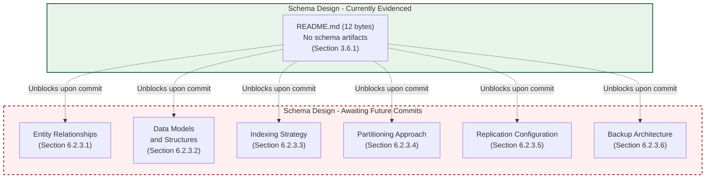

#### Diagram 6.2.7.4-B — Data Management: Currently Evidenced vs. Awaiting Commits

The diagram below visualizes the Data Management surface (Section 6.2.4) using the same meta-level pattern.

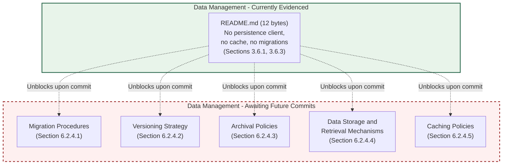

#### Diagram 6.2.7.4-C — Compliance and Performance: Currently Evidenced vs. Awaiting Commits

The diagram below visualizes the Compliance Considerations (Section 6.2.5) and Performance Optimization (Section 6.2.6) surfaces using the same meta-level pattern.

```mermaid
flowchart TB
    subgraph EvidencedCP["Compliance and Performance - Currently Evidenced"]
        PlaceholderCP["README.md (12 bytes)<br/>No retention, audit, access<br/>controls, or perf targets<br/>(Sections 2.5.4, 5.5.4, 5.5.5)"]
    end

    subgraph AwaitingCompliance["Compliance Considerations - Awaiting Future Commits"]
        Retention["Data Retention Rules<br/>(Section 6.2.5.1)"]
        BackupFT["Backup and Fault<br/>Tolerance Policies<br/>(Section 6.2.5.2)"]
        Privacy["Privacy Controls<br/>(Section 6.2.5.3)"]
        Audit["Audit Mechanisms<br/>(Section 6.2.5.4)"]
        Access["Access Controls<br/>(Section 6.2.5.5)"]
    end

    subgraph AwaitingPerf["Performance Optimization - Awaiting Future Commits"]
        QueryOpt["Query Optimization<br/>Patterns<br/>(Section 6.2.6.1)"]
        CacheStrat["Caching Strategy<br/>(Section 6.2.6.2)"]
        Pooling["Connection Pooling<br/>(Section 6.2.6.3)"]
        RWSplit["Read/Write Splitting<br/>(Section 6.2.6.4)"]
        Batch["Batch Processing<br/>Approach<br/>(Section 6.2.6.5)"]
    end

    PlaceholderCP -.->|"Unblocks upon commit"| Retention
    PlaceholderCP -.->|"Unblocks upon commit"| BackupFT
    PlaceholderCP -.->|"Unblocks upon commit"| Privacy
    PlaceholderCP -.->|"Unblocks upon commit"| Audit
    PlaceholderCP -.->|"Unblocks upon commit"| Access
    PlaceholderCP -.->|"Unblocks upon commit"| QueryOpt
    PlaceholderCP -.->|"Unblocks upon commit"| CacheStrat
    PlaceholderCP -.->|"Unblocks upon commit"| Pooling
    PlaceholderCP -.->|"Unblocks upon commit"| RWSplit
    PlaceholderCP -.->|"Unblocks upon commit"| Batch

    style EvidencedCP fill:#e8f4ea,stroke:#2d6a4f,stroke-width:2px
    style AwaitingCompliance fill:#fef0f0,stroke:#9d2c2c,stroke-width:2px,stroke-dasharray: 5 5
    style AwaitingPerf fill:#fef0f0,stroke:#9d2c2c,stroke-width:2px,stroke-dasharray: 5 5
```

#### Diagram 6.2.7.4-D — Swim-Lane Visualization of the Empty Persistence Surface

Mirroring the swim-lane pattern of Sections 4.5.6, 5.6.7, and 6.1.6.4, the diagram below records each prompted database-design lane as empty and explicitly notes the absence of any committed engine, schema, replica, cache, retention policy, or access-control artifact. No data flow, ERD, or replica topology is depicted.

```mermaid
flowchart LR
    subgraph EngineLane["Database Engine Lane"]
        EngineEmpty["No OLTP / OLAP / NoSQL /<br/>search / graph / TS engine<br/>(Section 3.6.1)"]
    end

    subgraph SchemaLane["Schema and Modelling Lane"]
        SchemaEmpty["No DDL, ORM models,<br/>or migration directories<br/>(Section 3.6.1)"]
    end

    subgraph ReplicaLane["Replication and Backup Lane"]
        ReplicaEmpty["No replica topology,<br/>backup policy, or RTO/RPO<br/>(Sections 3.6.2, 5.5.6)"]
    end

    subgraph CacheLane["Caching Lane"]
        CacheEmpty["No Redis / Memcached /<br/>CDN / in-process cache<br/>(Sections 3.6.3, 5.4.4)"]
    end

    subgraph ComplianceLane["Compliance and Access Lane"]
        ComplianceEmpty["No retention, privacy,<br/>audit, or access controls<br/>(Sections 2.5.4, 5.5.4)"]
    end

    EngineEmpty -.->|"No schema authored"| SchemaEmpty
    SchemaEmpty -.->|"No replica or backup defined"| ReplicaEmpty
    SchemaEmpty -.->|"No cache configured"| CacheEmpty
    SchemaEmpty -.->|"No compliance policy defined"| ComplianceEmpty

    style EngineLane fill:#fef0f0,stroke:#9d2c2c,stroke-width:2px,stroke-dasharray: 5 5
    style SchemaLane fill:#fef0f0,stroke:#9d2c2c,stroke-width:2px,stroke-dasharray: 5 5
    style ReplicaLane fill:#fef0f0,stroke:#9d2c2c,stroke-width:2px,stroke-dasharray: 5 5
    style CacheLane fill:#fef0f0,stroke:#9d2c2c,stroke-width:2px,stroke-dasharray: 5 5
    style ComplianceLane fill:#fef0f0,stroke:#9d2c2c,stroke-width:2px,stroke-dasharray: 5 5
```

---

### 6.2.8 Population Lifecycle and Triggers

Each subsection of Section 6.2 will transition from its current placeholder state to an authored state when the corresponding artifact class is committed to the repository. The trigger tables below mirror the population-lifecycle pattern established in Sections 2.9.1, 3.9.1, 4.7.1, 5.8.1, and 6.1.7.

#### 6.2.8.1 Unblocking Artifacts — Schema Design (Section 6.2.3)

| Schema Design Subsection | Unblocking Artifact Class |
|---------------------------|---------------------------|
| 6.2.3.1 Entity Relationships | ORM model files, ERD source documents, `*.sql` DDL files with `CREATE TABLE` / `REFERENCES` |
| 6.2.3.2 Data Models and Structures | DDL files, ORM model classes, NoSQL collection / document-schema definitions |
| 6.2.3.3 Indexing Strategy | DDL `CREATE INDEX` statements, ORM index annotations, NoSQL index definitions |
| 6.2.3.4 Partitioning Approach | DDL partition definitions, sharding configuration, NoSQL shard-key declarations |
| 6.2.3.5 Replication Configuration | Replication-topology descriptors (`postgresql.conf`, MongoDB replica-set config, Cassandra `cassandra.yaml`) |
| 6.2.3.6 Backup Architecture | Backup policy documents, `pg_dump` / `mysqldump` / `mongodump` scripts, snapshot-cadence configurations |

#### 6.2.8.2 Unblocking Artifacts — Data Management (Section 6.2.4)

| Data Management Subsection | Unblocking Artifact Class |
|----------------------------|---------------------------|
| 6.2.4.1 Migration Procedures | Migration directories (`migrations/`, `alembic/`, `prisma/migrations/`, Flyway, Liquibase) |
| 6.2.4.2 Versioning Strategy | Schema version metadata, migration version files, compatibility-window documents |
| 6.2.4.3 Archival Policies | Archival-job definitions, retention-policy configurations, cold-storage tier descriptors |
| 6.2.4.4 Data Storage and Retrieval | DAO / Repository code, ORM session configuration, persistence-client invocations |
| 6.2.4.5 Caching Policies | Redis / Memcached client configurations, cache-aside annotations, CDN bindings |

#### 6.2.8.3 Unblocking Artifacts — Compliance Considerations (Section 6.2.5)

| Compliance Considerations Subsection | Unblocking Artifact Class |
|---------------------------------------|---------------------------|
| 6.2.5.1 Data Retention Rules | Retention-policy YAML / JSON, GDPR / HIPAA compliance documents, soft-delete / tombstone schema columns |
| 6.2.5.2 Backup and Fault Tolerance Policies | Backup runbooks, replication-driven durability descriptors, RTO / RPO specifications |
| 6.2.5.3 Privacy Controls | PII inventory documents, encryption-at-rest configuration, tokenization / anonymization scripts |
| 6.2.5.4 Audit Mechanisms | Audit-log table DDL, change-data-capture pipeline configuration, database-native audit plugin configs |
| 6.2.5.5 Access Controls | RBAC role definitions, database `GRANT` / `REVOKE` scripts, row-level security policies, IAM bindings |

#### 6.2.8.4 Unblocking Artifacts — Performance Optimization (Section 6.2.6)

| Performance Optimization Subsection | Unblocking Artifact Class |
|--------------------------------------|---------------------------|
| 6.2.6.1 Query Optimization Patterns | EXPLAIN plan annotations, query hints, materialized view DDL, slow-query log analyses |
| 6.2.6.2 Caching Strategy | Cache-aside / write-through / write-behind code, TTL configuration, eviction-policy declarations |
| 6.2.6.3 Connection Pooling | Pool configurations (HikariCP, c3p0, pgBouncer, PgPool, ProxySQL, RDS Proxy) |
| 6.2.6.4 Read/Write Splitting | Replica routing configuration, read-replica connection strings, proxy-level routing rules |
| 6.2.6.5 Batch Processing Approach | Bulk-insert / upsert code, ETL pipelines (Airflow / Dagster / Prefect DAGs), batch-job schedulers |

#### 6.2.8.5 Lifecycle Diagram for Section 6.2 Maturation

The diagram below positions Section 6.2 within the broader specification-maturation flow established by Section 1.3.3 and mirrored by Sections 2.9.2, 3.9.2, 4.7.2, 5.8.2, and 6.1.7.4. The current state — `DatabaseDesignEmpty` — corresponds to the initial-issuance baseline at commit `5a796d794af56bb8930b5554aea8a563c39931d9` per Section 1.1.1.

```mermaid
stateDiagram-v2
    [*] --> DatabaseDesignEmpty: Initial issuance (commit 5a796d7)
    DatabaseDesignEmpty --> EngineSelected: Database engine selected and client driver committed
    EngineSelected --> SchemaAuthored: DDL / ORM models / NoSQL collections committed
    SchemaAuthored --> IndexingAuthored: CREATE INDEX statements / ORM annotations committed
    IndexingAuthored --> MigrationsAuthored: Migration directories and version metadata committed
    MigrationsAuthored --> PartitioningAuthored: Partition / shard definitions committed
    PartitioningAuthored --> ReplicationAuthored: Replication topology and failover configs committed
    ReplicationAuthored --> BackupAuthored: Backup policy, retention windows, RTO/RPO targets committed
    BackupAuthored --> ComplianceAuthored: Retention, privacy, audit, access-control artifacts committed
    ComplianceAuthored --> PerfAuthored: Pooling, read/write splitting, query optimization, caching committed
    PerfAuthored --> DatabaseDesignComplete: All Section 6.2 dimensions authorable
    DatabaseDesignComplete --> [*]

    note right of DatabaseDesignEmpty
        Current state at commit 5a796d7:
        - 0 database engines
        - 0 schema artifacts (DDL / ORM / NoSQL)
        - 0 indexing strategies
        - 0 migration directories
        - 0 partition / shard definitions
        - 0 replication topologies
        - 0 backup policies / RTO-RPO targets
        - 0 caching layers
        - 0 retention / privacy / audit policies
        - 0 access controls
        - 0 connection pools
        - 0 read/write splitting configs
        - 0 batch processing pipelines
    end note
```

---

### 6.2.9 Consistency with Preceding Sections' Documentation Posture

This section maintains the **evidence-only documentation posture** declared in Section 1.3.3 and reaffirmed in Sections 2.1.1, 2.7.3, 2.9.3, 3.1.1, 3.1.3, 3.10.3, 4.1.1, 4.7.3, 5.1.1, 5.8.3, and 6.1.8. Specifically:

1. Every absent element of the prompted Database Design catalogue is recorded explicitly — as "none defined," "none configured," "none documented," "none present," "not derivable," or "cannot be authored from evidence" — rather than omitted or fabricated.
2. Every cross-reference is anchored to a verified evidentiary section in this Technical Specification (Sections 1.1, 1.2, 1.3, 2.5, 3.5, 3.6, 4.2, 4.4, 5.1, 5.2, 5.3, 5.4, 5.5, 5.6, 5.7, 5.8, 6.1).
3. No Mermaid diagram in this section visualizes a fabricated entity-relationship model, replication topology, or data flow. The three required diagrams (database schema / ERD, data flow, replication architecture) are each recorded as "cannot be authored from evidence," and the meta-level visualizations supplied in Section 6.2.7.4 depict only the verified empty surface and its population lifecycle.
4. No default database engine (PostgreSQL, MySQL, MongoDB, etc.), default caching layer (Redis, Memcached, etc.), default retention rule, default RTO / RPO target, or default access-control model is asserted. No illustrative or "for-example" schema is rendered.
5. No element of the prompted Database Design catalogue is asserted as present without artifact-level evidence in the repository.

Subsequent revisions of Section 6.2 should preserve the same posture until the artifact classes enumerated in Sections 6.2.8.1, 6.2.8.2, 6.2.8.3, and 6.2.8.4 are committed. The applicability determination in Section 6.2.1 — *"Database Design is not applicable for this system in its current repository state"* — should be re-evaluated whenever any artifact in Section 5.1.1's enumeration of unblocking artifact classes (specifically the "persistence and state descriptors" class: schema files, migration directories, ORM models, NoSQL collection definitions, replication topology descriptors, backup policies, retention configurations, cache-client configurations) is introduced to the repository.

---

### 6.2.10 Consolidated Section 6.2 Status Matrix

The following matrix consolidates the per-dimension findings of Sections 6.2.3, 6.2.4, 6.2.5, 6.2.6, and 6.2.7 against every dimension implied by the section prompt. Every "Status" entry is anchored to the evidentiary section that establishes the absence, mirroring the consolidation pattern of Sections 3.8.1, 4.6, 5.7, and 6.1.9. The matrix is partitioned into three complementary tables to respect the four-column formatting constraint.

#### 6.2.10.1 Schema Design and Data Management Status

| Section 6.2 Dimension | Subsection | Status | Evidentiary Anchor |
|------------------------|------------|--------|---------------------|
| Entity relationships | 6.2.3.1 | None defined | Sections 3.6.1, 5.3.2.4 |
| Data models and structures | 6.2.3.2 | None defined | Sections 3.6.1, 5.4.3 |
| Indexing strategy | 6.2.3.3 | None defined | Sections 3.6.1, 5.5.5 |
| Partitioning approach | 6.2.3.4 | Not derivable | Sections 2.5.3, 3.6.2 |
| Replication configuration | 6.2.3.5 | None documented | Sections 3.6.2, 5.5.6 |
| Backup architecture | 6.2.3.6 | None documented | Sections 3.6.2, 5.5.6 |
| Migration procedures | 6.2.4.1 | None defined | Sections 1.2.2.2, 3.6.1 |
| Versioning strategy | 6.2.4.2 | None defined | Sections 2.5.5, 3.6.1 |
| Archival policies | 6.2.4.3 | None defined | Sections 3.6.1, 5.5.6 |
| Data storage and retrieval mechanisms | 6.2.4.4 | None defined | Sections 1.2.2.2, 3.6.4 |
| Caching policies | 6.2.4.5 | None configured | Sections 3.6.3, 5.4.4 |

#### 6.2.10.2 Compliance Considerations and Performance Optimization Status

| Section 6.2 Dimension | Subsection | Status | Evidentiary Anchor |
|------------------------|------------|--------|---------------------|
| Data retention rules | 6.2.5.1 | None defined | Sections 3.6.2, 5.5.6 |
| Backup and fault tolerance policies | 6.2.5.2 | None documented | Sections 3.6.2, 5.5.6 |
| Privacy controls | 6.2.5.3 | None present | Sections 2.5.4, 5.4.5 |
| Audit mechanisms | 6.2.5.4 | None configured | Sections 5.5.1, 5.5.2 |
| Access controls | 6.2.5.5 | None present | Sections 5.4.5, 5.5.4 |
| Query optimization patterns | 6.2.6.1 | None defined | Sections 3.6.1, 5.5.5 |
| Caching strategy | 6.2.6.2 | None configured | Sections 3.6.3, 5.4.4 |
| Connection pooling | 6.2.6.3 | None configured | Sections 3.6.1, 5.3.2.2 |
| Read/write splitting | 6.2.6.4 | None configured | Sections 3.6.1, 5.5.6 |
| Batch processing approach | 6.2.6.5 | None defined | Sections 3.6.1, 5.4.2 |

#### 6.2.10.3 Required Diagrams Status

| Section 6.2 Diagram | Subsection | Status | Evidentiary Anchor |
|----------------------|------------|--------|---------------------|
| Database schema (ERD) diagram | 6.2.7.1 | Cannot be authored | Sections 3.6.1, 6.2.3.1 |
| Data flow diagram | 6.2.7.2 | Cannot be authored | Sections 4.2.2.1, 4.4.1.2 |
| Replication architecture diagram | 6.2.7.3 | Cannot be authored | Sections 3.6.2, 5.5.6 |

---

#### References

#### Files Examined

- `README.md` — Verified to contain only 12 bytes (the H1 heading `# Artifact12`); contains no schema artifacts, no DDL, no ORM models, no NoSQL definitions, no cache configuration, no storage-service binding, and no compliance-policy text. Establishes the zero-persistence, zero-cache, zero-storage evidentiary baseline.

#### Folders Explored

- `/` (repository root, depth 1) — Verified to contain only `README.md` as the sole tracked non-Git file. Confirmed the absence of database-design-relevant directories and files: schema directories (`db/`, `database/`, `schemas/`, `models/`), DDL files (`*.sql`), ORM model files (SQLAlchemy, Hibernate, Django Models, Prisma, TypeORM, Sequelize, etc.), migration directories (`migrations/`, `db/migrate/`, `alembic/`, `prisma/migrations/`, Flyway, Liquibase), NoSQL collection / index definitions, client-driver configuration files, cache-related configuration (Redis, Memcached client configs), object-storage configuration (S3, Azure Blob, GCS), backup / restore scripts, replication-topology descriptors (`postgresql.conf`, MongoDB replica-set config, Cassandra `cassandra.yaml`), connection-pool configurations (HikariCP, pgBouncer, PgPool, ProxySQL), retention-policy YAML / JSON files, PII inventories, encryption-at-rest configuration, audit-log DDL, RBAC role definitions, `SECURITY.md`, threat-model documents, infrastructure-as-code artifacts (Terraform, CDK, Pulumi), Kubernetes manifests (`Dockerfile`, `docker-compose.yml`), and CI/CD pipeline definitions (`.github/workflows/`).

#### Technical Specification Sections Cross-Referenced

- **Section 1.1 EXECUTIVE SUMMARY** — Repository identity, initial pre-implementation state, commit baseline `5a796d794af56bb8930b5554aea8a563c39931d9`, absence of operational owners.
- **Section 1.2 SYSTEM OVERVIEW** — Integration-category table (all "No"), zero-component inventory, undetermined persistence strategy.
- **Section 1.3 SCOPE** — Undefined implementation boundaries (specifically "Data Domains Included — No"), evidence-only documentation posture.
- **Section 2.5 IMPLEMENTATION CONSIDERATIONS** — Empty performance-requirement set, non-derivable scalability considerations (including data-sharding strategy and caching tiers), absent security implications, undocumented maintenance requirements.
- **Section 3.5 THIRD-PARTY SERVICES** — Zero cloud-platform binding (no managed-database services inheritable), zero observability integration (no audit-log shipping substrate), zero identity-provider integration.
- **Section 3.6 DATABASES AND STORAGE** — *PRIMARY ANCHOR* — No database engine selected, non-derivable persistence strategy, no caching layer configured, no storage-service bound.
- **Section 3.8 CONSOLIDATED TECHNOLOGY STACK MATRIX** — All stack dimensions "None committed" or "Not determined," including backend framework and language.
- **Section 4.2 System Workflows** — No primary data flows, no inter-system data flow.
- **Section 4.4 Technical Implementation** — Empty state-transition graph, no data persistence points, no caching requirements, no transaction boundaries.
- **Section 4.5 Required Diagrams — Per-Diagram Empty-State Determination** — Source pattern for per-diagram empty-state determinations.
- **Section 5.3 COMPONENT DETAILS** — Zero-component inventory, per-component data-persistence requirements "none defined," per-component scaling "not derivable."
- **Section 5.4 TECHNICAL DECISIONS** — Data-storage rationale "none documented," caching strategy "none configured," security mechanism selection "none present" (including at-rest encryption "Not configured"), zero Architecture Decision Records.
- **Section 5.5 CROSS-CUTTING CONCERNS** — Monitoring/logging/tracing "none configured" (removing audit-pipeline substrate), error-handling pattern catalogue "none defined," authentication and authorization framework "none integrated," performance / SLA targets "none defined" (including RTO and RPO), disaster recovery procedures "not documented" (including backup-and-restore policy, replication / failover topology, and backup retention windows).
- **Section 5.6 REQUIRED DIAGRAMS — PER-DIAGRAM EMPTY-STATE DETERMINATION** — Source pattern for per-diagram "cannot be authored from evidence" determinations and meta-level / swim-lane visualizations.
- **Section 5.7 CONSOLIDATED ARCHITECTURE STATUS MATRIX** — Consolidation pattern for status matrices (including per-component persistence, data stores, caches, data storage rationale, caching strategy, and disaster-recovery rows).
- **Section 5.8 POPULATION LIFECYCLE AND TRIGGERS** — Trigger-table pattern for unblocking-artifact mapping and lifecycle-diagram pattern for section maturation.
- **Section 6.1 CORE SERVICES ARCHITECTURE** — *PRIMARY PATTERN REFERENCE* — Empty-state applicability-determination, evidentiary-basis snapshot, per-dimension status matrix, meta-level visualizations, population-lifecycle table, lifecycle state diagram, consistency-maintenance, and consolidated status-matrix templates mirrored throughout Section 6.2.

## 6.3 Integration Architecture

### 6.3.1 Applicability Determination

**Integration Architecture is not applicable for this system in its current repository state.**

This determination is grounded exclusively in the verifiable repository evidence consolidated by Sections 1.2.1.3, 1.2.2.2, 2.5.4, 3.5, 4.2.2, 5.2.3.2, 5.2.4, 5.4.2, 5.5.3, 5.5.4, and 5.5.5 of this Technical Specification, and is not a statement about the long-term integration intent of the Artifact12 project. Specifically:

1. **No integration surface is declared.** Per Section 1.2.1.3, the integration-category table records "No" across all five integration categories (Inbound API Definitions, Outbound Service Clients, Event / Messaging Schemas, Identity / Authentication Providers, Data Source / Sink Connectors), and "the repository, in its current state, **declares no integration surface** with any external system, internal platform, or third-party service."

2. **No service contract is committed.** Per Section 3.5.1, "no external API client is configured, no SDK is imported, and no service contract (OpenAPI, GraphQL schema, gRPC `.proto`, AsyncAPI) is committed." Per Section 5.2.3.2, "no integration pattern (e.g., request/response, publish/subscribe, broker-mediated messaging, choreographed events, orchestrated workflows, point-to-point synchronous, ETL/ELT batch, change-data-capture) and no protocol (e.g., HTTP/REST, gRPC, GraphQL, AMQP, MQTT, Kafka wire protocol, JDBC, ODBC) is declared in any tracked file."

3. **No communication-pattern selection has been made.** Per Section 5.4.2, every communication-pattern alternative — synchronous request/response (HTTP/REST), synchronous remote procedure call (gRPC), GraphQL query/mutation, asynchronous messaging (AMQP / SQS / SNS), publish/subscribe (Kafka / Pulsar / NATS), WebSocket bidirectional, server-sent events, and batch / ETL pipelines — is recorded as "Not selected" against the evidentiary anchors at Sections 1.2.1.3, 3.5, and 4.2.2.4.

4. **No authentication or authorization framework is configured.** Per Section 5.5.4, every authentication / authorization dimension is recorded as "None configured," "None integrated," "Not selected," "None present," or "Not defined." Per Section 3.5.2, "no identity-provider integration (e.g., Auth0, Okta, AWS Cognito, Azure AD, Google Identity Platform, Firebase Authentication, Keycloak) is configured. No OAuth 2.0 / OIDC client registration, no SAML federation, and no API-key issuance scheme is present. Authentication-service selection is therefore not determined."

5. **No messaging or event-bus binding exists.** Per the Section 3.5 Consolidated Third-Party Services table, "Messaging / Event Bus — None configured" and "Email / Notification Services — None configured." Per Section 4.2.2.3, "no event processing flows are derivable" because "no event/messaging schemas are declared, and ... no messaging / event bus is configured."

6. **No API gateway, ingress, or edge configuration is committed.** Per Section 1.2.2.2, the repository contains no Kubernetes manifests, no ingress-controller configuration, no NGINX/Envoy/HAProxy configuration files, and no cloud API-gateway descriptors. Per Section 3.5.4, no cloud-platform binding exists from which a managed API-gateway service (AWS API Gateway, Azure API Management, GCP API Gateway, Apigee) could be inherited.

7. **No performance, SLA, or rate-limit target exists.** Per Section 5.5.5, every performance / SLA dimension — request latency (p50 / p95 / p99), throughput (RPS / QPS / TPS), concurrency ceiling, availability, error budget, capacity ceiling, RTO, and RPO — is recorded as "None defined." Per Section 2.5.2, "the performance requirement set is empty." No rate-limit configuration, throttling policy, or quota descriptor is present.

8. **No error-handling pattern exists for asynchronous flows.** Per Section 5.5.3, every error-handling dimension — exception hierarchy, retry policies (immediate, exponential backoff, jitter), circuit breaker / bulkhead patterns, fallback / graceful degradation, dead-letter queues / poison-message handling, error notification / alerting flows, and recovery procedures — is recorded as "None defined." Per Section 4.4.2, the retry-policy set, fallback-process set, notification-channel set, and recovery-procedure set are all empty.

9. **No integration workflows are derivable.** Per Section 4.2.2, in aggregate: "No inter-system data flow is derivable," "No API interactions are derivable," "No event processing flows are derivable," and "No batch processing sequences are derivable." The integration-workflow inventory is empty across all four prompted dimensions.

This section therefore enumerates every dimension prompted by the Integration Architecture template — API design, message processing, and external systems — and records, for each, the verified absence of source material, anchored to the preceding evidentiary section that establishes the absence. This mirrors the empty-state authoring pattern established in Sections 3.1.3, 4.1.3, 4.5, 4.6, 5.1.3, 5.6, 5.7, 5.8, 6.1, and 6.2, and preserves the **evidence-only policy** declared in Section 1.3.3 and reaffirmed in Sections 2.1.1, 2.7.3, 3.1.1, 4.1.1, 5.1.1, 6.1.1, and 6.2.1.

#### 6.3.1.1 Scope of This Section

Section 6.3 enumerates each dimension implied by the Integration Architecture template against three categories:

| Category | Dimensions Enumerated | Subsection |
|----------|------------------------|------------|
| API Design | Protocol specifications, authentication, authorization, rate limiting, versioning, documentation | 6.3.3 |
| Message Processing | Event patterns, queue architecture, stream processing, batch flows, error handling | 6.3.4 |
| External Systems | Third-party integration, legacy interfaces, API gateway, service contracts | 6.3.5 |

Each dimension is recorded with its prompted intent, its current documentation status, and the evidentiary anchor in a preceding section that establishes the empty state.

#### 6.3.1.2 Reconciliation with the Section Prompt

The section prompt instructs the author: *"If the system does not require integration with external systems or services, clearly state 'Integration Architecture is not applicable for this system' and explain why."* The reconciliation is direct: no inbound API contract, no outbound service client, no event or messaging schema, no identity-provider integration, no data source/sink connector, no message broker, no API gateway, and no SLA or rate-limit target is committed to the repository. Per Section 1.2.1.3, the system "declares no integration surface" with any external system, internal platform, or third-party service. The system therefore neither requires nor evidences any integration with external systems or services in its current state. The remainder of this section preserves the prompted structural skeleton (API design, message processing, external systems, and required diagrams) so that future revisions of the specification can populate each dimension in place as the corresponding artifacts described in Section 6.3.7 are committed.

---

### 6.3.2 Evidentiary Basis for Non-Applicability

The following snapshot consolidates the verifiable findings from Sections 1, 2, 3, 4, and 5 that bear directly on the inapplicability of Integration Architecture authorship. Each row has been independently established in the cited preceding section.

#### 6.3.2.1 Repository State Snapshot Relevant to Integration Architecture

| Attribute Bearing on Integration Architecture | Verified Value | Originating Section |
|-----------------------------------------------|----------------|---------------------|
| Tracked artifacts | `README.md` (12 bytes) and `.git/` only | Section 1.2.2.2 |
| Inbound API definitions | None | Section 1.2.1.3 |
| Outbound service clients | None | Section 1.2.1.3 |
| Event / messaging schemas | None | Section 1.2.1.3 |
| Identity / authentication providers | None | Section 1.2.1.3 |
| Data source / sink connectors | None | Section 1.2.1.3 |
| Service contracts (OpenAPI / GraphQL / gRPC / AsyncAPI) | None committed | Section 3.5.1 |
| External API client / SDK imports | None | Section 3.5.1 |
| Authentication-protocol selection (OAuth 2.0 / OIDC / SAML / mTLS) | None configured | Section 3.5.2 |
| Identity-provider integration (Auth0, Okta, Cognito, Azure AD, Keycloak) | None integrated | Section 3.5.2 |
| Authorization model (RBAC / ABAC / ReBAC / PBAC) | None present | Section 5.5.4 |
| Token format (JWT / opaque / PASETO) | Not selected | Section 5.5.4 |
| Session management | Not defined | Section 5.5.4 |
| Communication-pattern choices (sync, async, pub/sub, streaming) | None defined | Section 5.4.2 |
| Integration pattern and protocol declarations | None | Section 5.2.3.2 |
| External integration points (System × Pattern × Protocol × SLA) | None declared | Section 5.2.4 |
| Cloud-platform binding (managed integration services) | None bound | Section 3.5.4 |
| Messaging / event-bus binding | None configured | Section 3.5 |
| Email / notification service binding | None configured | Section 3.5 |
| Observability / error-tracking integration | None configured | Sections 3.5.3, 5.5.1, 5.5.2 |
| Inter-system data flow | Not derivable | Section 4.2.2.1 |
| API interactions | Not derivable | Section 4.2.2.2 |
| Event processing flows | Not derivable | Section 4.2.2.3 |
| Batch processing sequences | Not derivable | Section 4.2.2.4 |
| Error-handling patterns (retry / fallback / DLQ / notification / recovery) | None defined | Sections 4.4.2, 5.5.3 |
| Performance / SLA / rate-limit targets | None defined | Sections 2.5.2, 5.5.5 |
| Backward-compatibility / API versioning commitments | Not documented | Section 2.5.5 |
| Containerization / ingress / gateway descriptors | None present | Section 1.2.2.2 |

#### 6.3.2.2 Integration-Surface Prerequisite for Integration Architecture Authorship

An Integration Architecture section presupposes that the system has — at minimum — declared at least one integration surface (an inbound API definition, an outbound service client, an event/messaging schema, an identity-provider binding, or a data source/sink connector) and committed at least one transport-protocol or contract artifact (an OpenAPI document, a GraphQL schema, a gRPC `.proto` file, an AsyncAPI descriptor, an SDK client configuration, or a message-broker connection descriptor) against which protocols, authentication methods, rate limits, versioning, messaging topologies, and gateway configurations can be expressed. Per Section 5.2.4, the External Integration Points table is empty across both Table 5.2.4-A (System Name × Integration Type) and Table 5.2.4-B (Data Exchange Pattern × Protocol/Format × SLA Requirements), each row recorded as "_(none declared)_" with the evidentiary anchor at Section 1.2.1.3. Because no integration surface is declared and no contract artifact is committed, the question of how the system communicates with any external participant is not yet answerable from the repository.

---

### 6.3.3 API Design — Empty-State Determinations

The section prompt enumerates six dimensions under the API DESIGN heading. Each is evaluated below against the evidentiary base.

#### 6.3.3.1 Protocol Specifications

A protocol specification (HTTP/REST with JSON or HAL, HTTP/2-based gRPC with Protocol Buffers, GraphQL over HTTP, WebSocket bidirectional, server-sent events, AMQP / MQTT messaging protocols, raw TCP/UDP) requires a committed wire-format declaration — an OpenAPI document, a `.proto` file, a GraphQL schema, an AsyncAPI descriptor, or equivalent — and a runtime client or server binding. Per Section 1.2.1.3, no inbound API definitions and no outbound service clients are present. Per Section 3.5.1, "no external API client is configured, no SDK is imported, and no service contract (OpenAPI, GraphQL schema, gRPC `.proto`, AsyncAPI) is committed." Per Section 5.4.2, every communication-pattern alternative is recorded as "Not selected." Per Section 5.2.3.2, "no integration pattern ... and no protocol (e.g., HTTP/REST, gRPC, GraphQL, AMQP, MQTT, Kafka wire protocol, JDBC, ODBC) is declared in any tracked file." **Protocol specifications are none defined.**

#### 6.3.3.2 Authentication Methods

Authentication methods (OAuth 2.0 client credentials / authorization code / device code / PKCE, OpenID Connect federated authentication, SAML 2.0 federation, mutual TLS, API-key issuance, HMAC-signed request authentication, JWT bearer, PASETO bearer) require both a chosen authentication protocol and an integrated identity provider or credential-management facility. Per Section 3.5.2, "no identity-provider integration (e.g., Auth0, Okta, AWS Cognito, Azure AD, Google Identity Platform, Firebase Authentication, Keycloak) is configured. No OAuth 2.0 / OIDC client registration, no SAML federation, and no API-key issuance scheme is present. Authentication-service selection is therefore not determined." Per Section 5.5.4, "Authentication protocol (OAuth 2.0, OIDC, SAML, mTLS) — None configured," "Identity provider — None integrated," "Token format (JWT, opaque, PASETO) — Not selected," and "API key / service-account issuance — Not configured." Per Section 2.5.4, "the repository contains no authentication or authorization scheme, no identity-provider configuration, no secrets-management policy, no security-control documentation, and no threat model." **Authentication methods are none configured.**

#### 6.3.3.3 Authorization Framework

An authorization framework (Role-Based Access Control via per-route role assertions, Attribute-Based Access Control via attribute-evaluation policies, Relationship-Based Access Control via Zanzibar / SpiceDB tuples, Policy-Based Access Control with externalized policy engines such as OPA / Cedar / Casbin, scope-based authorization via OAuth 2.0 scopes, claims-based authorization via JWT claims, fine-grained permission catalogues) requires a chosen authorization model, committed policy artifacts, a defined policy enforcement point, and a defined policy decision point. Per Section 5.5.4, "Authorization model (RBAC, ABAC, ReBAC, PBAC) — None present," "Policy enforcement point — Not defined," and "Policy decision point (e.g., OPA, Cedar) — Not configured." Per Section 5.4.5, "Authorization model (RBAC / ABAC / ReBAC) — None present" with evidentiary anchor at Section 2.5.4. Per Section 2.5.4, "security implications for individual features cannot be assessed because no features exist; security implications for the system as a whole cannot be assessed because no system implementation exists." **The authorization framework is none present.**

#### 6.3.3.4 Rate Limiting Strategy

A rate-limiting strategy (token-bucket / leaky-bucket / fixed-window / sliding-window / sliding-log algorithms, per-client-key quotas, per-route quotas, per-tenant quotas, distributed-counter implementations via Redis / DynamoDB / Memcached, gateway-enforced limits via NGINX `limit_req` / Envoy rate-limit filter / AWS API Gateway usage plans / Azure APIM policies / Kong rate-limiting plugin, retry-after semantics, burst-capacity provisioning) requires a committed rate-limit configuration, a chosen enforcement substrate, and a defined throughput baseline against which limits are calibrated. Per Section 5.5.5, "Throughput (RPS / QPS / TPS) — None defined," "Concurrency ceiling — None defined," "Capacity ceiling — None defined," and "Error budget — None defined." Per Section 2.5.2, "the performance requirement set is empty." Per Section 1.2.2.2, no gateway, proxy, or middleware configuration is present from which a rate-limit policy could be derived. Per Section 3.5.4, no cloud-platform binding exists from which a managed rate-limit primitive could be inherited. **The rate-limiting strategy is none defined.**

#### 6.3.3.5 Versioning Approach

An API versioning approach (URL-path versioning such as `/v1/`, `/v2/`; media-type / `Accept`-header versioning such as `application/vnd.example.v1+json`; query-parameter versioning such as `?api-version=2024-01-01`; subdomain versioning such as `v1.api.example.com`; schema-evolution conventions including additive-only fields, deprecation cycles, sunset headers; semantic versioning of contracts) requires committed contract artifacts that carry version metadata and a documented backward-compatibility window. Per Section 1.2.1.3, no API contracts are present, so no contract version metadata can be authored. Per Section 2.5.5, maintenance requirements — "including update cadence, patching policy, support tier, and backward-compatibility commitments — are ... not documented." Per Section 5.4.6, the Architecture Decision Records catalogue is empty (no `docs/adr/`, no `docs/decisions/`, no `ARCHITECTURE.md`), so no decision document records a versioning convention. **The versioning approach is none defined.**

#### 6.3.3.6 Documentation Standards

API documentation standards (OpenAPI 3.x specifications served through Swagger UI / ReDoc / RapiDoc, GraphQL schema introspection rendered through GraphiQL / GraphQL Playground / Apollo Sandbox, gRPC reflection through `grpcurl` / Postman / Bloom RPC, AsyncAPI descriptors rendered through AsyncAPI Studio, JSON Schema published catalogues, machine-readable contract registries) require committed contract artifacts and a documentation-rendering or registry-publishing pipeline. Per Section 1.2.1.3, "no integration documentation, API definitions (OpenAPI, GraphQL, gRPC/Protocol Buffers), event-schema descriptors, message-broker configurations, identity-provider settings, or enterprise-service-bus declarations exist in the repository." Per Section 1.2.2.2, no documentation site, no `docs/` directory, and no API-portal configuration is present beyond the 12-byte `README.md`. **Documentation standards are none present.**

#### 6.3.3.7 API Design Status Matrix

| API Design Dimension | Status | Evidentiary Anchor |
|-----------------------|--------|---------------------|
| Protocol specifications | None defined | Sections 1.2.1.3, 3.5.1, 5.4.2 |
| Authentication methods | None configured | Sections 2.5.4, 3.5.2, 5.5.4 |
| Authorization framework | None present | Sections 2.5.4, 5.4.5, 5.5.4 |
| Rate limiting strategy | None defined | Sections 2.5.2, 5.5.5 |
| Versioning approach | None defined | Sections 1.2.1.3, 2.5.5 |
| Documentation standards | None present | Sections 1.2.1.3, 1.2.2.2 |

---

### 6.3.4 Message Processing — Empty-State Determinations

The section prompt enumerates five dimensions under the MESSAGE PROCESSING heading. Each is evaluated below against the evidentiary base.

#### 6.3.4.1 Event Processing Patterns

Event processing patterns (event-carried state transfer, event notification, event sourcing with append-only event logs, Command-Query Responsibility Segregation (CQRS) with separate command and query handlers, choreographed sagas via published events, orchestrated sagas via workflow engines such as Temporal / Camunda / Step Functions, event streaming with topic partitions and consumer groups, exactly-once / at-least-once / at-most-once delivery semantics) require committed event handlers, event schemas, and a message-transport binding. Per Section 4.2.2.3, "no event processing flows are derivable. Per Section 1.2.1.3, no event/messaging schemas are declared, and per Section 3.5 (Consolidated Third-Party Services table), no messaging / event bus is configured. Event producers, consumers, topics, partitions, ordering guarantees, and dead-letter strategies cannot be enumerated because no event infrastructure is committed." Per Section 5.4.2, "Asynchronous messaging (AMQP / SQS / SNS) — Not selected" and "Publish/subscribe (Kafka / Pulsar / NATS) — Not selected." **Event processing patterns are none defined.**

#### 6.3.4.2 Message Queue Architecture

A message queue architecture (work queues with competing consumers, priority queues, delay / scheduled queues, fanout exchanges, topic exchanges, header exchanges, FIFO ordering, deduplication windows, visibility-timeout semantics, message-acknowledgement protocols) requires committed broker configuration — RabbitMQ vhost/exchange/queue declarations, AWS SQS/SNS topic and queue definitions, Azure Service Bus namespace bindings, Google Pub/Sub topic and subscription declarations, NATS subject hierarchies, or equivalent. Per Section 3.5 Consolidated Third-Party Services table, "Messaging / Event Bus — None configured" with evidentiary anchor at Section 1.2.1.3. Per Section 1.2.2.2, no broker configuration, no client-driver dependency manifest, and no connection-string descriptor exists in any tracked file. **Message queue architecture is none configured.**

#### 6.3.4.3 Stream Processing Design

A stream-processing design (Kafka Streams topologies, Apache Flink job graphs, Apache Beam pipelines, Apache Pulsar Functions, AWS Kinesis Data Streams consumers, GCP Dataflow pipelines, Azure Stream Analytics queries, windowing strategies — tumbling / hopping / sliding / session windows, watermarking and late-arrival handling, stateful operators with RocksDB-backed state stores, checkpoint and savepoint cadence, exactly-once stream semantics) requires a committed stream-processing runtime binding and topology source code. Per Section 5.4.2, "Publish/subscribe (Kafka / Pulsar / NATS) — Not selected" with evidentiary anchor at Section 3.5. Per Section 3.5 Consolidated Third-Party Services table, no messaging / event bus is configured. Per Section 1.2.2.2, no source files, no stream-job definitions, and no broker configuration exist. **Stream processing design is none defined.**

#### 6.3.4.4 Batch Processing Flows

Batch processing flows (Airflow / Dagster / Prefect / Luigi DAGs, AWS Step Functions / Azure Logic Apps / GCP Workflows orchestrations, cron-scheduled batch jobs, Kubernetes `CronJob` manifests, Apache Spark batch jobs, Apache Hadoop MapReduce jobs, ETL pipelines with extract / transform / load stages, ELT pipelines with in-warehouse transformation, change-data-capture flows via Debezium / Maxwell / AWS DMS) require committed job definitions, a scheduler binding, and a target persistence engine or sink. Per Section 4.2.2.4, "no batch processing sequences are derivable. Per Section 1.2.2.2, no executable code, no scheduled-job descriptors (e.g., cron expressions, Airflow DAGs, Argo Workflows manifests), and no batch-orchestration configuration exist in the repository. Batch step graphs, checkpointing strategies, and idempotency controls cannot be authored from evidence." Per Section 5.4.2, "Batch / ETL pipelines — Not selected" with evidentiary anchor at Section 4.2.2.4. **Batch processing flows are none defined.**

#### 6.3.4.5 Error Handling Strategy

An error-handling strategy for messaging flows (dead-letter queues with redrive policies, poison-message detection and quarantine, retry with exponential backoff and jitter, idempotency-key correlation for deduplication, message-acknowledgement semantics — automatic vs. manual, negative-acknowledgement handling, parking-lot queues for manual intervention, retry-budget enforcement, circuit-breaker integration on broker connections, outbox / inbox patterns for transactional messaging) requires committed broker configuration, retry-library bindings, and a defined recovery procedure. Per Section 5.5.3, "Dead-letter queues / poison-message handling — None defined," "Retry policies (immediate, exponential backoff, jitter) — None defined," "Circuit breaker / bulkhead patterns — None defined," "Fallback / graceful degradation — None defined," "Error notification / alerting flows — None defined," and "Recovery procedures — None defined." Per Section 4.4.2, the retry-policy set, fallback-process set, notification-channel set, and recovery-procedure set are all empty. **The error handling strategy is none defined.**

#### 6.3.4.6 Message Processing Status Matrix

| Message Processing Dimension | Status | Evidentiary Anchor |
|------------------------------|--------|---------------------|
| Event processing patterns | None defined | Sections 1.2.1.3, 4.2.2.3, 5.4.2 |
| Message queue architecture | None configured | Sections 1.2.1.3, 3.5 |
| Stream processing design | None defined | Sections 3.5, 5.4.2 |
| Batch processing flows | None defined | Sections 4.2.2.4, 5.4.2 |
| Error handling strategy | None defined | Sections 4.4.2, 5.5.3 |

---

### 6.3.5 External Systems — Empty-State Determinations

The section prompt enumerates four dimensions under the EXTERNAL SYSTEMS heading. Each is evaluated below against the evidentiary base.

#### 6.3.5.1 Third-Party Integration Patterns

Third-party integration patterns (SDK-based client integrations such as Stripe / Twilio / SendGrid / PayPal / Slack / Salesforce SDKs, webhook receivers with HMAC signature verification, anti-corruption layer adapters that translate vendor schemas, polling integrations with delta-token cursors, OAuth 2.0 client-credentials flows for service-to-service authentication, vendor-native event-bridge connectors such as AWS EventBridge SaaS partners, file-drop integrations via SFTP / S3 / Azure Blob, push-vs-pull synchronization patterns) require committed SDK imports, webhook handler code, and vendor-API contract declarations. Per Section 3.5.1, "no external API client is configured, no SDK is imported, and no service contract (OpenAPI, GraphQL schema, gRPC `.proto`, AsyncAPI) is committed." Per Section 1.2.1.3, the integration-category table records "No" across all five integration categories. Per Section 5.2.4, Table 5.2.4-A (System Name × Integration Type) records "_(none declared)_" with evidentiary anchor at Section 1.2.1.3. **Third-party integration patterns are none defined.**

#### 6.3.5.2 Legacy System Interfaces

Legacy system interfaces (JDBC / ODBC connectors to legacy relational databases, SOAP / WSDL client stubs, EDI X12 / EDIFACT message translators, mainframe-protocol adapters such as IBM CICS / IMS bridges, fixed-width / COBOL copybook parsers, MQ Series / IBM MQ client bindings, file-based batch interchange protocols, ESB-mediated adapters such as MuleSoft / Apache Camel / Spring Integration routes) require both a documented legacy system and a committed adapter implementation. Per Section 1.2.1.2, the repository is a "**greenfield initialization** rather than a replacement or upgrade of an existing system. There is no migration plan, no documentation of legacy capabilities, and no reference to a predecessor platform. Limitations of a prior or external system cannot be enumerated because none are referenced in any tracked file." Per Section 1.2.1.3, no integration documentation or enterprise-service-bus declarations exist. Per Section 5.2.3.2, no integration pattern or protocol is declared. **Legacy system interfaces are none defined.**

#### 6.3.5.3 API Gateway Configuration

An API gateway configuration (AWS API Gateway REST / HTTP / WebSocket APIs with stage variables, Azure API Management products and policies, GCP API Gateway / Apigee proxies, Kong gateway routes and plugins, KrakenD endpoints, Tyk APIs, Envoy gateway routes, NGINX `server` / `location` blocks, HAProxy front-ends and back-ends, Traefik routers and middlewares, Istio / Linkerd service-mesh ingress gateways) requires a chosen gateway substrate, committed routing rules, and either a cloud-platform binding or a self-hosted runtime descriptor. Per Section 3.5.4, "no cloud-service configuration is present ... The system is therefore not bound to any cloud provider in its present state." Per Section 1.2.2.2, no Kubernetes manifests, no `Dockerfile`, no `docker-compose.yml`, no ingress-controller manifests, no service-mesh configuration, no NGINX / HAProxy / Envoy configuration files, and no cloud API-gateway descriptors are present. **API gateway configuration is none configured.**

#### 6.3.5.4 External Service Contracts

External service contracts (OpenAPI imports of third-party APIs, vendor-provided gRPC `.proto` registries, AsyncAPI event catalogues for vendor-published events, JSON Schema documents for vendor payloads, contractual SLA agreements, vendor-API rate-limit and quota declarations, vendor authentication-scheme declarations, OAuth scopes published by external identity providers) require committed contract artifacts and documented service-level agreements. Per Section 3.5.1, "no service contract (OpenAPI, GraphQL schema, gRPC `.proto`, AsyncAPI) is committed." Per Section 5.2.4, Table 5.2.4-B (Data Exchange Pattern × Protocol/Format × SLA Requirements) records "_(none declared)_" / "_(none declared)_" / "_(none defined)_" with the evidentiary anchor at Section 1.2.1.3 and the zero-SLA determination of Section 2.5.2. Per Section 2.5.5, no backward-compatibility commitments or maintenance contracts are documented. **External service contracts are none declared.**

#### 6.3.5.5 External Systems Status Matrix

| External Systems Dimension | Status | Evidentiary Anchor |
|-----------------------------|--------|---------------------|
| Third-party integration patterns | None defined | Sections 1.2.1.3, 3.5.1, 5.2.4 |
| Legacy system interfaces | None defined | Sections 1.2.1.2, 1.2.1.3 |
| API gateway configuration | None configured | Sections 1.2.2.2, 3.5.4 |
| External service contracts | None declared | Sections 3.5.1, 5.2.4 |

---

### 6.3.6 Required Diagrams — Per-Diagram Empty-State Determination

The section prompt requires three categories of Mermaid.js diagrams — integration flow diagrams, API architecture diagrams, and message flow diagrams — as well as sequence diagrams for key flows. Each is evaluated below against the evidentiary base, mirroring the per-diagram determination pattern of Sections 4.5, 5.6, 6.1.6, and 6.2.7. Following the per-diagram determinations, Section 6.3.6.5 supplies the meta-level visualizations that the evidence-only policy permits.

#### 6.3.6.1 Integration Flow Diagrams

An integration flow diagram (source-to-sink data movement across systems, transformation stages between producers and consumers, fan-out / fan-in topologies, choreographed event sequences across multiple services) requires at minimum one identified data producer, one identified data sink, and one defined transformation or transport stage. Per Section 4.2.2.1, "no inter-system data flow is derivable. Per Section 1.2.1.3, the integration-category table records 'No' across all five integration categories ... Per Section 2.4.2, 'the repository declares no integration surface with any external system, internal platform, or third-party service.' A data-flow diagram presupposes at least one source and one sink; the system declares neither." Per Section 5.2.3.1, "the primary-data-flow set is empty." **Determination: cannot be authored from evidence.**

#### 6.3.6.2 API Architecture Diagrams

An API architecture diagram (request/response routing across edge gateways, internal services, and persistence backends; layered API surfaces such as public REST / internal gRPC / partner GraphQL; ingress-to-service-to-data topologies; deployment-bound API entry points) requires committed API contracts, a defined service topology, and a defined edge / gateway substrate. Per Section 4.2.2.2, "no API interactions are derivable. Per Section 1.2.1.3, no inbound API definitions (OpenAPI, GraphQL, gRPC/Protocol Buffers) and no outbound service clients are present. Per Section 3.5.1, 'no external API client is configured, no SDK is imported, and no service contract (OpenAPI, GraphQL schema, gRPC `.proto`, AsyncAPI) is committed.' Request/response sequence diagrams cannot be authored in the absence of contracts and clients." **Determination: cannot be authored from evidence.**

#### 6.3.6.3 Message Flow Diagrams

A message flow diagram (event producer → topic/queue → consumer-group fan-out, dead-letter routing on negative acknowledgement, retry-loop topology with exponential backoff, saga-step choreography across multiple bounded contexts, change-data-capture stream from source to sink) requires a committed broker topology and at least one identified producer / consumer pair. Per Section 4.2.2.3, "no event processing flows are derivable ... no event/messaging schemas are declared, and ... no messaging / event bus is configured. Event producers, consumers, topics, partitions, ordering guarantees, and dead-letter strategies cannot be enumerated because no event infrastructure is committed." Per Section 5.5.3, dead-letter queues / poison-message handling and retry policies are recorded as "None defined." **Determination: cannot be authored from evidence.**

#### 6.3.6.4 Sequence Diagrams for Key Flows

Sequence diagrams for key integration flows (inbound API request lifecycles, outbound third-party call sequences, event-publication-and-consumption choreographies, OAuth 2.0 authorization-code exchanges, webhook-delivery-and-acknowledgement loops) require at least two communicating actors with defined message exchanges. Per Section 4.5.4, "integration sequence diagrams require at least two communicating actors with defined message exchanges. Per Section 1.2.1.3, the integration-category table records 'No' across all five categories, and per Section 3.5.1, no SDK is imported and no service contract is committed. The actor count for inter-system sequences is zero." Per Section 5.6.3 (referenced in Section 6.1.6.1), "the actor count for sequence diagrams is zero." **Determination: cannot be authored from evidence.**

#### 6.3.6.5 Meta-Level Visualizations of the Empty Integration Surface

Consistent with the meta-level visualization pattern established in Sections 1.2.2.3, 2.4.5, 2.9.2, 3.8.2, 3.9.2, 4.5.6, 4.7.2, 5.6.7, 5.8.2, 6.1.6.4, and 6.2.7.4, four meta-level Mermaid diagrams below visualize the present, evidenced state of the Integration Architecture surface against the dimensions awaiting commit. No diagram below depicts a fabricated API contract, broker topology, gateway configuration, or sequence interaction; each diagram visualizes only the empty surface and its population lifecycle.

#### Diagram 6.3.6.5-A — API Design: Currently Evidenced vs. Awaiting Commits

The diagram below visualizes the API Design surface (Section 6.3.3). The "Currently Evidenced" subgraph contains only the placeholder `README.md`; the "Awaiting Future Commits" subgraph enumerates the six prompted API-design dimensions whose authorship is unblocked by future commitment of the artifact classes enumerated in Section 6.3.7.1.

```mermaid
flowchart TB
    subgraph EvidencedAPI["API Design - Currently Evidenced"]
        PlaceholderAPI["README.md (12 bytes)<br/>No API contracts<br/>(Section 1.2.1.3)"]
    end

    subgraph AwaitingAPI["API Design - Awaiting Future Commits"]
        Protocol["Protocol Specifications<br/>(Section 6.3.3.1)"]
        AuthN["Authentication Methods<br/>(Section 6.3.3.2)"]
        AuthZ["Authorization Framework<br/>(Section 6.3.3.3)"]
        RateLimit["Rate Limiting Strategy<br/>(Section 6.3.3.4)"]
        Versioning["Versioning Approach<br/>(Section 6.3.3.5)"]
        DocStandards["Documentation Standards<br/>(Section 6.3.3.6)"]
    end

    PlaceholderAPI -.->|"Unblocks upon commit"| Protocol
    PlaceholderAPI -.->|"Unblocks upon commit"| AuthN
    PlaceholderAPI -.->|"Unblocks upon commit"| AuthZ
    PlaceholderAPI -.->|"Unblocks upon commit"| RateLimit
    PlaceholderAPI -.->|"Unblocks upon commit"| Versioning
    PlaceholderAPI -.->|"Unblocks upon commit"| DocStandards

    style EvidencedAPI fill:#e8f4ea,stroke:#2d6a4f,stroke-width:2px
    style AwaitingAPI fill:#fef0f0,stroke:#9d2c2c,stroke-width:2px,stroke-dasharray: 5 5
```

#### Diagram 6.3.6.5-B — Message Processing: Currently Evidenced vs. Awaiting Commits

The diagram below visualizes the Message Processing surface (Section 6.3.4) using the same meta-level pattern.

```mermaid
flowchart TB
    subgraph EvidencedMP["Message Processing - Currently Evidenced"]
        PlaceholderMP["README.md (12 bytes)<br/>No broker, no event schema,<br/>no batch orchestrator<br/>(Sections 1.2.1.3, 3.5)"]
    end

    subgraph AwaitingMP["Message Processing - Awaiting Future Commits"]
        EventPatterns["Event Processing Patterns<br/>(Section 6.3.4.1)"]
        QueueArch["Message Queue Architecture<br/>(Section 6.3.4.2)"]
        StreamDesign["Stream Processing Design<br/>(Section 6.3.4.3)"]
        BatchFlows["Batch Processing Flows<br/>(Section 6.3.4.4)"]
        ErrorStrat["Error Handling Strategy<br/>(Section 6.3.4.5)"]
    end

    PlaceholderMP -.->|"Unblocks upon commit"| EventPatterns
    PlaceholderMP -.->|"Unblocks upon commit"| QueueArch
    PlaceholderMP -.->|"Unblocks upon commit"| StreamDesign
    PlaceholderMP -.->|"Unblocks upon commit"| BatchFlows
    PlaceholderMP -.->|"Unblocks upon commit"| ErrorStrat

    style EvidencedMP fill:#e8f4ea,stroke:#2d6a4f,stroke-width:2px
    style AwaitingMP fill:#fef0f0,stroke:#9d2c2c,stroke-width:2px,stroke-dasharray: 5 5
```

#### Diagram 6.3.6.5-C — External Systems: Currently Evidenced vs. Awaiting Commits

The diagram below visualizes the External Systems surface (Section 6.3.5) using the same meta-level pattern.

```mermaid
flowchart TB
    subgraph EvidencedES["External Systems - Currently Evidenced"]
        PlaceholderES["README.md (12 bytes)<br/>No SDK, no legacy adapter,<br/>no gateway, no contract<br/>(Sections 1.2.1.3, 3.5.1, 3.5.4)"]
    end

    subgraph AwaitingES["External Systems - Awaiting Future Commits"]
        ThirdParty["Third-Party Integration Patterns<br/>(Section 6.3.5.1)"]
        Legacy["Legacy System Interfaces<br/>(Section 6.3.5.2)"]
        Gateway["API Gateway Configuration<br/>(Section 6.3.5.3)"]
        Contracts["External Service Contracts<br/>(Section 6.3.5.4)"]
    end

    PlaceholderES -.->|"Unblocks upon commit"| ThirdParty
    PlaceholderES -.->|"Unblocks upon commit"| Legacy
    PlaceholderES -.->|"Unblocks upon commit"| Gateway
    PlaceholderES -.->|"Unblocks upon commit"| Contracts

    style EvidencedES fill:#e8f4ea,stroke:#2d6a4f,stroke-width:2px
    style AwaitingES fill:#fef0f0,stroke:#9d2c2c,stroke-with:2px,stroke-dasharray: 5 5
    style AwaitingES fill:#fef0f0,stroke:#9d2c2c,stroke-width:2px,stroke-dasharray: 5 5
```

#### Diagram 6.3.6.5-D — Swim-Lane Visualization of the Empty Integration Surface

Mirroring the swim-lane pattern of Sections 4.5.6, 5.6.7, 6.1.6.4, and 6.2.7.4, the diagram below records each prompted integration lane as empty and explicitly notes the absence of any committed contract, broker, gateway, or external participant. No request/response, event, or batch flow is depicted.

```mermaid
flowchart LR
    subgraph ClientLane["External Client / Consumer Lane"]
        ClientEmpty["No external clients<br/>or partner consumers<br/>(Section 1.2.1.3)"]
    end

    subgraph GatewayLane["API Gateway / Edge Lane"]
        GatewayEmpty["No ingress, gateway,<br/>or rate-limit config<br/>(Sections 1.2.2.2, 3.5.4)"]
    end

    subgraph APILane["API / Service Contract Lane"]
        APIEmpty["No OpenAPI, GraphQL,<br/>gRPC, or AsyncAPI contract<br/>(Section 3.5.1)"]
    end

    subgraph BrokerLane["Message Broker / Event Bus Lane"]
        BrokerEmpty["No queue, topic,<br/>or stream binding<br/>(Section 3.5, 4.2.2.3)"]
    end

    subgraph IdPLane["Identity Provider Lane"]
        IdPEmpty["No OAuth/OIDC/SAML<br/>or API-key issuer<br/>(Sections 3.5.2, 5.5.4)"]
    end

    subgraph PartnerLane["Third-Party / Legacy System Lane"]
        PartnerEmpty["No SDK, webhook,<br/>or legacy adapter<br/>(Sections 1.2.1.2, 3.5.1)"]
    end

    ClientEmpty -.->|"No traffic accepted"| GatewayEmpty
    GatewayEmpty -.->|"No route defined"| APIEmpty
    APIEmpty -.->|"No event published"| BrokerEmpty
    APIEmpty -.->|"No identity asserted"| IdPEmpty
    APIEmpty -.->|"No partner call issued"| PartnerEmpty

    style ClientLane fill:#fef0f0,stroke:#9d2c2c,stroke-width:2px,stroke-dasharray: 5 5
    style GatewayLane fill:#fef0f0,stroke:#9d2c2c,stroke-width:2px,stroke-dasharray: 5 5
    style APILane fill:#fef0f0,stroke:#9d2c2c,stroke-width:2px,stroke-dasharray: 5 5
    style BrokerLane fill:#fef0f0,stroke:#9d2c2c,stroke-width:2px,stroke-dasharray: 5 5
    style IdPLane fill:#fef0f0,stroke:#9d2c2c,stroke-width:2px,stroke-dasharray: 5 5
    style PartnerLane fill:#fef0f0,stroke:#9d2c2c,stroke-width:2px,stroke-dasharray: 5 5
```

---

### 6.3.7 Population Lifecycle and Triggers

Each subsection of Section 6.3 will transition from its current placeholder state to an authored state when the corresponding artifact class is committed to the repository. The trigger tables below mirror the population-lifecycle pattern established in Sections 2.9.1, 3.9.1, 4.7.1, 5.8.1, 6.1.7, and 6.2.8.

#### 6.3.7.1 Unblocking Artifacts — API Design (Section 6.3.3)

| API Design Subsection | Unblocking Artifact Class |
|------------------------|---------------------------|
| 6.3.3.1 Protocol Specifications | OpenAPI 3.x documents, GraphQL schemas, gRPC `.proto` files, AsyncAPI descriptors, WebSocket / SSE handler bindings |
| 6.3.3.2 Authentication Methods | OAuth 2.0 / OIDC client configs, JWT validator middleware, IdP integrations (Auth0, Okta, Cognito, Azure AD, Keycloak), API-key issuance schemes, mTLS certificate configurations |
| 6.3.3.3 Authorization Framework | RBAC role definitions, ABAC attribute policies, OPA Rego policies, Cedar policies, scope/claim mappings, policy-enforcement middleware |
| 6.3.3.4 Rate Limiting Strategy | Gateway rate-limit configs (NGINX `limit_req`, Envoy rate-limit filter, AWS API Gateway usage plans, Kong plugins), token-bucket / sliding-window implementations |
| 6.3.3.5 Versioning Approach | URL-path version pinning (`/v1/`), media-type versioning (`Accept: application/vnd.x.v1+json`), schema-evolution annotations, deprecation / sunset header conventions |
| 6.3.3.6 Documentation Standards | Swagger UI / ReDoc / RapiDoc deployments, GraphiQL / Apollo Sandbox bindings, AsyncAPI Studio publications, contract-registry configurations |

#### 6.3.7.2 Unblocking Artifacts — Message Processing (Section 6.3.4)

| Message Processing Subsection | Unblocking Artifact Class |
|-------------------------------|---------------------------|
| 6.3.4.1 Event Processing Patterns | Event-handler source code, event-sourcing aggregates, CQRS command/event handlers, choreography descriptors, Temporal / Camunda / Step Functions workflows |
| 6.3.4.2 Message Queue Architecture | RabbitMQ / SQS / SNS / Azure Service Bus / GCP Pub/Sub configurations, queue and topic declarations, exchange / subscription bindings |
| 6.3.4.3 Stream Processing Design | Kafka / Pulsar / NATS broker configs, Kafka Streams / Flink / Beam / Kinesis topology source, windowing and watermarking definitions |
| 6.3.4.4 Batch Processing Flows | Airflow / Dagster / Prefect DAGs, Kubernetes `CronJob` manifests, Spark / Hadoop / Beam batch jobs, CDC pipeline configurations (Debezium, AWS DMS) |
| 6.3.4.5 Error Handling Strategy | Dead-letter queue configs with redrive policies, poison-message quarantines, retry-policy descriptors, idempotency-key middleware, outbox / inbox handler code |

#### 6.3.7.3 Unblocking Artifacts — External Systems (Section 6.3.5)

| External Systems Subsection | Unblocking Artifact Class |
|------------------------------|---------------------------|
| 6.3.5.1 Third-Party Integration Patterns | SDK client code (Stripe, Twilio, SendGrid, Salesforce, etc.), webhook handlers with HMAC verification, anti-corruption layer adapters, EventBridge SaaS connectors |
| 6.3.5.2 Legacy System Interfaces | JDBC / ODBC connectors, SOAP / WSDL client stubs, EDI translators, mainframe protocol adapters, MQ Series client bindings, MuleSoft / Camel / Spring Integration routes |
| 6.3.5.3 API Gateway Configuration | Kong / Envoy / NGINX / Traefik / HAProxy configs, AWS API Gateway / Azure APIM / GCP API Gateway / Apigee descriptors, service-mesh ingress gateway manifests |
| 6.3.5.4 External Service Contracts | OpenAPI imports of third-party APIs, vendor `.proto` registries, AsyncAPI vendor event catalogues, SLA documents, vendor-published rate-limit and quota declarations |

#### 6.3.7.4 Lifecycle Diagram for Section 6.3 Maturation

The diagram below positions Section 6.3 within the broader specification-maturation flow established by Section 1.3.3 and mirrored by Sections 2.9.2, 3.9.2, 4.7.2, 5.8.2, 6.1.7.4, and 6.2.8.5. The current state — `IntegrationEmpty` — corresponds to the initial-issuance baseline at commit `5a796d794af56bb8930b5554aea8a563c39931d9` per Section 1.1.1.

```mermaid
stateDiagram-v2
    [*] --> IntegrationEmpty: Initial issuance (commit 5a796d7)
    IntegrationEmpty --> ProtocolDeclared: API contracts (OpenAPI / GraphQL / gRPC / AsyncAPI) committed
    ProtocolDeclared --> AuthDeclared: AuthN / AuthZ configs and IdP bindings committed
    AuthDeclared --> RateLimitDeclared: Rate-limit configs and SLA targets committed
    RateLimitDeclared --> VersioningDeclared: Versioning conventions and deprecation policies committed
    VersioningDeclared --> APIDocsDeclared: Swagger UI / GraphiQL / AsyncAPI Studio bindings committed
    APIDocsDeclared --> MessagingDeclared: Broker configs and event schemas committed
    MessagingDeclared --> StreamBatchDeclared: Stream-processing topologies and batch DAGs committed
    StreamBatchDeclared --> MessagingErrorDeclared: DLQ / retry / idempotency configurations committed
    MessagingErrorDeclared --> GatewayDeclared: API gateway / ingress / edge configuration committed
    GatewayDeclared --> ThirdPartyDeclared: SDK imports and webhook handlers committed
    ThirdPartyDeclared --> ContractsDeclared: External service contracts and SLA documents committed
    ContractsDeclared --> IntegrationComplete: All Section 6.3 dimensions authorable
    IntegrationComplete --> [*]

    note right of IntegrationEmpty
        Current state at commit 5a796d7:
        - 0 API contracts (OpenAPI / GraphQL / gRPC / AsyncAPI)
        - 0 protocol bindings
        - 0 authentication providers
        - 0 authorization policies
        - 0 rate-limit configurations
        - 0 versioning conventions
        - 0 documentation portals
        - 0 message brokers / event buses
        - 0 stream-processing topologies
        - 0 batch DAGs / scheduled jobs
        - 0 DLQ / retry / idempotency configs
        - 0 API gateways / ingress configs
        - 0 third-party SDK imports
        - 0 webhook handlers
        - 0 legacy-system adapters
        - 0 external service contracts / SLAs
    end note
```

---

### 6.3.8 Consistency with Preceding Sections' Documentation Posture

This section maintains the **evidence-only documentation posture** declared in Section 1.3.3 and reaffirmed in Sections 2.1.1, 2.7.3, 2.9.3, 3.1.1, 3.1.3, 3.10.3, 4.1.1, 4.7.3, 5.1.1, 5.8.3, 6.1.8, and 6.2.9. Specifically:

1. Every absent element of the prompted Integration Architecture catalogue is recorded explicitly — as "none defined," "none configured," "none documented," "none present," "not derivable," "none declared," or "cannot be authored from evidence" — rather than omitted or fabricated.
2. Every cross-reference is anchored to a verified evidentiary section in this Technical Specification (Sections 1.1, 1.2, 1.3, 2.4, 2.5, 3.5, 4.2, 4.4, 4.5, 5.2, 5.4, 5.5, 5.6, 5.7, 5.8, 6.1, 6.2).
3. No Mermaid diagram in this section visualizes a fabricated API surface, broker topology, event flow, or external-system interaction. The four required diagrams (integration flow, API architecture, message flow, and sequence diagrams for key flows) are each recorded as "cannot be authored from evidence," and the meta-level visualizations supplied in Section 6.3.6.5 depict only the verified empty surface and its population lifecycle.
4. No default authentication protocol (OAuth 2.0, OIDC, SAML, JWT, mTLS), default authorization model (RBAC, ABAC, ReBAC, PBAC), default rate-limit algorithm (token bucket, leaky bucket, sliding window), default versioning convention (URL-path, media-type, header-based), default message broker (Kafka, RabbitMQ, SQS, Pub/Sub), default stream-processing engine (Kafka Streams, Flink, Beam), default batch orchestrator (Airflow, Dagster, Prefect), default API gateway (Kong, Envoy, AWS API Gateway), or default identity provider (Auth0, Okta, Cognito, Azure AD, Keycloak) is asserted. No illustrative or "for-example" integration topology is rendered.
5. No element of the prompted Integration Architecture catalogue is asserted as present without artifact-level evidence in the repository.

Subsequent revisions of Section 6.3 should preserve the same posture until the artifact classes enumerated in Sections 6.3.7.1, 6.3.7.2, and 6.3.7.3 are committed. The applicability determination in Section 6.3.1 — *"Integration Architecture is not applicable for this system in its current repository state"* — should be re-evaluated whenever any artifact in Section 5.1.1's enumeration of unblocking artifact classes (specifically the "interface and contract definitions" class — OpenAPI documents, GraphQL schemas, gRPC `.proto` files, AsyncAPI descriptors, SDK client configurations, webhook handler code, broker configurations, identity-provider bindings, gateway descriptors, and external service contracts) is introduced to the repository.

---

### 6.3.9 Consolidated Section 6.3 Status Matrix

The following matrix consolidates the per-dimension findings of Sections 6.3.3, 6.3.4, 6.3.5, and 6.3.6 against every dimension implied by the section prompt. Every "Status" entry is anchored to the evidentiary section that establishes the absence, mirroring the consolidation pattern of Sections 3.8.1, 4.6, 5.7, 6.1.9, and 6.2.10. The matrix is partitioned into three complementary tables to respect the four-column formatting constraint.

#### 6.3.9.1 API Design Status

| Section 6.3 Dimension | Subsection | Status | Evidentiary Anchor |
|------------------------|------------|--------|---------------------|
| Protocol specifications | 6.3.3.1 | None defined | Sections 1.2.1.3, 5.4.2 |
| Authentication methods | 6.3.3.2 | None configured | Sections 3.5.2, 5.5.4 |
| Authorization framework | 6.3.3.3 | None present | Sections 2.5.4, 5.5.4 |
| Rate limiting strategy | 6.3.3.4 | None defined | Sections 2.5.2, 5.5.5 |
| Versioning approach | 6.3.3.5 | None defined | Sections 1.2.1.3, 2.5.5 |
| Documentation standards | 6.3.3.6 | None present | Sections 1.2.1.3, 1.2.2.2 |

#### 6.3.9.2 Message Processing and External Systems Status

| Section 6.3 Dimension | Subsection | Status | Evidentiary Anchor |
|------------------------|------------|--------|---------------------|
| Event processing patterns | 6.3.4.1 | None defined | Sections 4.2.2.3, 5.4.2 |
| Message queue architecture | 6.3.4.2 | None configured | Sections 1.2.1.3, 3.5 |
| Stream processing design | 6.3.4.3 | None defined | Sections 3.5, 5.4.2 |
| Batch processing flows | 6.3.4.4 | None defined | Sections 4.2.2.4, 5.4.2 |
| Error handling strategy | 6.3.4.5 | None defined | Sections 4.4.2, 5.5.3 |
| Third-party integration patterns | 6.3.5.1 | None defined | Sections 3.5.1, 5.2.4 |
| Legacy system interfaces | 6.3.5.2 | None defined | Sections 1.2.1.2, 1.2.1.3 |
| API gateway configuration | 6.3.5.3 | None configured | Sections 1.2.2.2, 3.5.4 |
| External service contracts | 6.3.5.4 | None declared | Sections 3.5.1, 5.2.4 |

#### 6.3.9.3 Required Diagrams Status

| Section 6.3 Diagram | Subsection | Status | Evidentiary Anchor |
|----------------------|------------|--------|---------------------|
| Integration flow diagrams | 6.3.6.1 | Cannot be authored | Sections 4.2.2.1, 5.2.3.1 |
| API architecture diagrams | 6.3.6.2 | Cannot be authored | Sections 3.5.1, 4.2.2.2 |
| Message flow diagrams | 6.3.6.3 | Cannot be authored | Sections 3.5, 4.2.2.3 |
| Sequence diagrams for key flows | 6.3.6.4 | Cannot be authored | Sections 4.5.4, 5.6.3 |

---

#### References

#### Files Examined

- `README.md` — Verified to contain only 12 bytes (the H1 heading `# Artifact12`); contains no API contracts, no SDK imports, no webhook handler declarations, no broker configuration, no identity-provider settings, no gateway configuration, no rate-limit policy, no versioning convention, and no external service contract. Establishes the zero-integration-surface evidentiary baseline.

#### Folders Explored

- `/` (repository root, depth 1) — Verified to contain only `README.md` as the sole tracked non-Git file. Confirmed the absence of integration-architecture-relevant directories and files: API-contract directories (no `openapi/`, `graphql/`, `proto/`, `asyncapi/`, `api/`, `contracts/`, `schemas/`), SDK-client configurations (no Stripe / Twilio / SendGrid / Salesforce / Slack imports), webhook handler code, broker configurations (no RabbitMQ / SQS / SNS / Azure Service Bus / GCP Pub/Sub / NATS configuration), stream-processing topologies (no Kafka Streams / Flink / Beam / Kinesis source), batch orchestrator definitions (no Airflow DAGs / Dagster jobs / Prefect flows / Kubernetes `CronJob` manifests), API gateway descriptors (no Kong / Envoy / NGINX / HAProxy / Traefik / AWS API Gateway / Azure APIM / GCP API Gateway / Apigee configuration), identity-provider bindings (no Auth0 / Okta / Cognito / Azure AD / Keycloak / Firebase Auth configuration), legacy-system adapters (no JDBC / ODBC / SOAP / EDI / mainframe-protocol bindings), service-mesh configurations (no Istio / Linkerd manifests), containerization descriptors (no `Dockerfile`, `docker-compose.yml`, Kubernetes manifests), infrastructure-as-code artifacts (no `*.tf`, CDK, Pulumi, Crossplane), CI/CD pipeline definitions (no `.github/workflows/`, `.gitlab-ci.yml`, `Jenkinsfile`), observability and error-tracking configuration (no OpenTelemetry / Prometheus / Grafana / Datadog / New Relic / Sentry / Honeycomb / Splunk client configurations), `SECURITY.md`, threat-model documents, runbooks, `CODEOWNERS`, and `MAINTAINERS` files.

#### Technical Specification Sections Cross-Referenced

- **Section 1.1 EXECUTIVE SUMMARY** — Repository identity (`shalini690/Artifact12.git`, branch `main`), initial pre-implementation state, commit baseline `5a796d794af56bb8930b5554aea8a563c39931d9`, absence of operational owners, absence of stakeholder register.
- **Section 1.2 SYSTEM OVERVIEW** — *PRIMARY ANCHOR* — Greenfield initialization (1.2.1.2), zero-integration-surface determination across all five integration categories (1.2.1.3), zero-component inventory (1.2.2.2), undetermined architectural style and deployment topology (1.2.2.3), empty KPI placeholder table (1.2.3.3).
- **Section 1.3 SCOPE** — Evidence-only policy declaration (1.3.3), undefined implementation boundaries (1.3.1.2), no data domains documented.
- **Section 2.4 FEATURE RELATIONSHIPS** — Confirmed zero integration points between features and confirmation of the zero-integration-surface determination (2.4.2).
- **Section 2.5 IMPLEMENTATION CONSIDERATIONS** — Empty performance-requirement set (2.5.2), non-derivable scalability considerations (2.5.3), no authentication or authorization scheme, no IdP, no secrets-management, no security-control documentation, no threat model (2.5.4), undocumented backward-compatibility commitments and maintenance requirements (2.5.5).
- **Section 3.5 THIRD-PARTY SERVICES** — *PRIMARY ANCHOR* — Zero external API / SDK integration (3.5.1), zero identity-provider integration and zero authentication-service selection (3.5.2), zero monitoring / observability / error-tracking integration (3.5.3), zero cloud-platform binding (3.5.4), and consolidated table confirming "Messaging / Event Bus — None configured" and "Email / Notification Services — None configured."
- **Section 4.2 System Workflows** — *PRIMARY ANCHOR* — No inter-system data flow (4.2.2.1), no API interactions (4.2.2.2), no event processing flows (4.2.2.3), no batch processing sequences (4.2.2.4); consolidated workflow status confirming all eight workflow dimensions "None defined."
- **Section 4.4 Technical Implementation** — Empty state-transition graph (4.4.1.1), empty retry-policy set (4.4.2.1), empty fallback-process set (4.4.2.2), empty notification-channel set (4.4.2.3), no recovery procedures (4.4.2.4).
- **Section 4.5 Required Diagrams — Per-Diagram Empty-State Determination** — *PRIMARY PATTERN REFERENCE* — Source pattern for per-diagram empty-state determinations; specifically 4.5.4 establishes that "integration sequence diagrams ... cannot be authored from evidence" because "the actor count for inter-system sequences is zero."
- **Section 5.2 HIGH-LEVEL ARCHITECTURE** — *PRIMARY ANCHOR* — Empty major-interfaces inventory (5.2.1.3), empty primary-data-flow set (5.2.3.1), no integration patterns or protocols declared (5.2.3.2), empty External Integration Points table partitioned across Tables 5.2.4-A and 5.2.4-B (5.2.4).
- **Section 5.4 TECHNICAL DECISIONS** — *PRIMARY ANCHOR* — Architecture-style decision "none documented" (5.4.1), all eight communication-pattern alternatives "Not selected" (5.4.2), all eight security-mechanism categories "None present" / "Not configured" (5.4.5), empty Architecture Decision Records catalogue (5.4.6).
- **Section 5.5 CROSS-CUTTING CONCERNS** — *PRIMARY ANCHOR* — Monitoring / logging / tracing "None configured" (5.5.1, 5.5.2), error-handling pattern catalogue "None defined" including dead-letter queues / poison-message handling and retry policies (5.5.3), authentication and authorization framework "None integrated" across all eight AuthN/AuthZ dimensions (5.5.4), performance / SLA targets "None defined" across all eight dimensions (5.5.5), disaster-recovery procedures "Not documented" (5.5.6).
- **Section 5.6 REQUIRED DIAGRAMS — PER-DIAGRAM EMPTY-STATE DETERMINATION** — Source pattern for per-diagram "cannot be authored from evidence" determinations and meta-level / swim-lane visualizations; specifically 5.6.3 establishes "the actor count for sequence diagrams is zero."
- **Section 5.7 CONSOLIDATED ARCHITECTURE STATUS MATRIX** — Consolidation pattern for status matrices (including external integration points, authentication framework, and communication-pattern rows).
- **Section 5.8 POPULATION LIFECYCLE AND TRIGGERS** — Trigger-table pattern for unblocking-artifact mapping; specifically the "External Integration Points" trigger unblocked by "API contracts (OpenAPI / GraphQL / gRPC), event schemas (AsyncAPI), SDK client configurations, identity-provider bindings."
- **Section 6.1 CORE SERVICES ARCHITECTURE** — *PRIMARY PATTERN REFERENCE* — Empty-state applicability-determination, evidentiary-basis snapshot, per-dimension status matrix, meta-level visualizations, population-lifecycle table, lifecycle state diagram, consistency-maintenance, and consolidated status-matrix templates mirrored throughout Section 6.3.
- **Section 6.2 Database Design** — *PRIMARY PATTERN REFERENCE* — Second precedent for the non-applicability authoring pattern, including 4-column-constraint-respecting status-matrix partitioning across multiple tables and the swim-lane meta-level visualization of an empty domain surface.

## 6.4 Security Architecture

### 6.4.1 Applicability Determination

**Detailed Security Architecture is not applicable for this system in its current repository state.**

This determination is grounded exclusively in the verifiable repository evidence consolidated by Sections 1.2.1.3, 1.2.2.2, 2.3.4, 2.5.4, 3.5.2, 3.6, 5.4.5, 5.5.4, 6.2.5.3, 6.2.5.4, 6.2.5.5, 6.3.3.2, and 6.3.3.3 of this Technical Specification, and is not a statement about the long-term security posture of the Artifact12 project. Specifically:

1. **No authentication or authorization scheme is committed.** Per Section 2.5.4, "the repository contains no authentication or authorization scheme, no identity-provider configuration (Section 1.2.1.3), no secrets-management policy, no security-control documentation, and no threat model. No `SECURITY.md` file or equivalent is present in the inventory recorded by Section 1.2.2.2. Security implications for individual features cannot be assessed because no features exist; security implications for the system as a whole cannot be assessed because no system implementation exists."

2. **No identity-provider integration exists.** Per Section 3.5.2, "no identity-provider integration (e.g., Auth0, Okta, AWS Cognito, Azure AD, Google Identity Platform, Firebase Authentication, Keycloak) is configured. No OAuth 2.0 / OIDC client registration, no SAML federation, and no API-key issuance scheme is present. Authentication-service selection is therefore not determined."

3. **No security mechanism is selected.** Per Section 5.4.5, every security-mechanism category — authentication scheme, authorization model (RBAC / ABAC / ReBAC), identity provider, secrets management, transport encryption (TLS), at-rest encryption, threat model, and `SECURITY.md` / vulnerability-disclosure policy — is recorded as "None present," "None integrated," "None configured," or "Not configured" with evidentiary anchors at Sections 2.5.4, 3.5.2, 3.6, and 1.2.2.2.

4. **No authentication / authorization framework dimension is defined.** Per Section 5.5.4, every authentication / authorization dimension is recorded as "None configured," "None integrated," "Not selected," "None present," or "Not defined": authentication protocol (OAuth 2.0, OIDC, SAML, mTLS), identity provider, token format (JWT, opaque, PASETO), session management, authorization model (RBAC, ABAC, ReBAC, PBAC), policy enforcement point, policy decision point (e.g., OPA, Cedar), and API key / service-account issuance.

5. **No security or compliance requirement is documented.** Per Section 2.3.4, "Security Requirements" and "Compliance Requirements" are both recorded as "Not present" in the Functional Requirements Table. The validation-rule catalogue contains no rule of any kind.

6. **No secrets-management configuration is present.** Per Section 5.4.5, "Secrets management — None configured" with evidentiary anchor at Section 2.5.4. No HashiCorp Vault, AWS Secrets Manager, Azure Key Vault, GCP Secret Manager, SOPS, sealed-secrets, or environment-variable convention is committed in any tracked file.

7. **No encryption configuration exists at any tier.** Per Section 5.4.5, "Transport encryption (TLS) — Not configured" (anchor: Section 1.2.2.2) and "At-rest encryption — Not configured" (anchor: Section 3.6). No TLS certificate, no `*.pem` / `*.crt` / `*.key` file, no encryption-at-rest descriptor (e.g., AWS KMS key policy, Azure Storage Service Encryption configuration, transparent-data-encryption DDL), and no field-level encryption library binding exists.

8. **Database-tier and integration-tier security is independently confirmed absent.** Per Section 6.2.5.3, "Privacy controls are none present." Per Section 6.2.5.4, "Audit mechanisms are none configured." Per Section 6.2.5.5, "Access controls are none present." Per Section 6.3.3.2, "Authentication methods are none configured." Per Section 6.3.3.3, "The authorization framework is none present." Every preceding Section 6 subsection that touches a security dimension reaches the same empty-state determination.

The section prompt instructs the author: *"If the system does not require specific security considerations beyond standard practices, clearly state 'Detailed Security Architecture is not applicable for this system' and explain which standard security practices will be followed instead."* The first clause is satisfied directly by the evidence above. The second clause — enumerating "standard security practices that will be followed" — is not satisfied in this revision, because no security practice (default or otherwise) has been committed to the repository, and asserting any such practice as adopted would violate the **evidence-only policy** declared in Section 1.3.3 and reaffirmed in Sections 2.1.1, 2.7.3, 3.1.1, 4.1.1, 5.1.1, 6.1.8, 6.2.9, and 6.3.8. Subsequent revisions of this section will record adopted security practices as their corresponding artifacts (a `SECURITY.md` file, threat-model documents, identity-provider configuration, RBAC/ABAC policies, encryption descriptors, etc.) are committed.

This section therefore enumerates every dimension prompted by the Security Architecture template — authentication framework, authorization system, and data protection — and records, for each, the verified absence of source material, anchored to the preceding evidentiary section that establishes the absence. This mirrors the empty-state authoring pattern established in Sections 3.1.3, 4.1.3, 4.5, 4.6, 5.1.3, 5.6, 5.7, 5.8, 6.1, 6.2, and 6.3.

#### 6.4.1.1 Scope of This Section

Section 6.4 enumerates each dimension implied by the Security Architecture template against three categories:

| Category | Dimensions Enumerated | Subsection |
|----------|------------------------|------------|
| Authentication Framework | Identity management, multi-factor authentication, session management, token handling, password policies | 6.4.3 |
| Authorization System | RBAC, permission management, resource authorization, policy enforcement points, audit logging | 6.4.4 |
| Data Protection | Encryption standards, key management, data masking rules, secure communication, compliance controls | 6.4.5 |

Each dimension is recorded with its prompted intent, its current documentation status, and the evidentiary anchor in a preceding section that establishes the empty state.

#### 6.4.1.2 Reconciliation with the Section Prompt

The Security Architecture prompt asks the author to address authentication framework, authorization system, and data protection, and to produce authentication flow diagrams, authorization flow diagrams, and security zone diagrams. The reconciliation is direct: no authentication protocol, no identity provider, no token format, no session-management convention, no password policy, no authorization model, no permission catalogue, no policy enforcement point, no audit-logging substrate, no encryption configuration at any tier, no key-management binding, no data-masking rule, no transport-security configuration, and no compliance-control documentation is committed to the repository. The system therefore neither requires nor evidences any of the prompted security capabilities in its current state. The remainder of this section preserves the prompted structural skeleton (authentication framework, authorization system, data protection, and required diagrams) so that future revisions of the specification can populate each dimension in place as the corresponding artifacts described in Section 6.4.7 are committed.

---

### 6.4.2 Evidentiary Basis for Non-Applicability

The following snapshot consolidates the verifiable findings from Sections 1, 2, 3, 5, 6.2, and 6.3 that bear directly on the inapplicability of Security Architecture authorship. Each row has been independently established in the cited preceding section.

#### 6.4.2.1 Repository State Snapshot Relevant to Security Architecture

| Attribute Bearing on Security Architecture | Verified Value | Originating Section |
|--------------------------------------------|----------------|---------------------|
| Tracked artifacts | `README.md` (12 bytes) and `.git/` only | Section 1.2.2.2 |
| `SECURITY.md` / vulnerability-disclosure policy | None present | Section 5.4.5 |
| Threat-model documents | None present | Section 2.5.4 |
| Identity-provider integration | None integrated | Section 3.5.2 |
| Authentication protocol (OAuth 2.0 / OIDC / SAML / mTLS) | None configured | Section 5.5.4 |
| Token format (JWT / opaque / PASETO) | Not selected | Section 5.5.4 |
| Session management | Not defined | Section 5.5.4 |
| Multi-factor authentication | None configured | Section 2.5.4 |
| Password / credential policy | None defined | Section 2.5.4 |
| API key / service-account issuance | Not configured | Section 5.5.4 |
| Authorization model (RBAC / ABAC / ReBAC / PBAC) | None present | Section 5.5.4 |
| Policy enforcement point (PEP) | Not defined | Section 5.5.4 |
| Policy decision point (PDP) (OPA / Cedar) | Not configured | Section 5.5.4 |
| Permission / scope / claim catalogue | None defined | Section 5.5.4 |
| Audit-logging / change-data-capture pipeline | None configured | Sections 5.5.1, 5.5.2 |
| Transport encryption (TLS) | Not configured | Section 5.4.5 |
| At-rest encryption | Not configured | Section 5.4.5 |
| Key management (Vault / KMS / Key Vault) | None configured | Section 2.5.4 |
| Secrets management policy | None configured | Section 5.4.5 |
| Data masking / tokenization / anonymization | None defined | Section 6.2.5.3 |
| Privacy controls (PII inventory, classification) | None present | Section 6.2.5.3 |
| Database access controls (`GRANT` / `REVOKE` / row-level security) | None present | Section 6.2.5.5 |
| API-tier authentication methods | None configured | Section 6.3.3.2 |
| API-tier authorization framework | None present | Section 6.3.3.3 |
| Security requirements catalogue | Not present | Section 2.3.4 |
| Compliance requirements catalogue | Not present | Section 2.3.4 |
| Containerization / runtime-isolation descriptors | None present | Section 1.2.2.2 |
| Network-policy / security-group / firewall configuration | None present | Section 1.2.2.2 |
| CI/CD security-scan configuration (SAST / DAST / SCA) | None present | Section 1.2.2.2 |

#### 6.4.2.2 Security-Architecture Prerequisite for Authorship

A Security Architecture section presupposes that the system has — at minimum — committed at least one identity-bearing artifact (an authentication-protocol configuration, an identity-provider binding, a credential-issuance descriptor, or an API-key registry), at least one authorization-policy artifact (a role definition, an ABAC policy, a Rego/Cedar policy file, or scope/claim mappings), and at least one data-protection artifact (a TLS certificate, an encryption-at-rest descriptor, a key-management binding, or a secrets-store configuration) against which authentication flows, authorization decisions, key lifecycles, and compliance controls can be expressed. Per Section 5.4.5, every security-mechanism category is recorded as "None present," "None integrated," "None configured," or "Not configured." Per Section 5.5.4, every authentication / authorization dimension is recorded with the same status. Because no identity, no policy, and no protection artifact is committed, the questions of how the system authenticates principals, authorizes access, protects data at rest, protects data in transit, manages keys, and demonstrates compliance are not yet answerable from the repository.

---

### 6.4.3 Authentication Framework — Empty-State Determinations

The section prompt enumerates five dimensions under the AUTHENTICATION FRAMEWORK heading. Each is evaluated below against the evidentiary base.

#### 6.4.3.1 Identity Management

Identity management (user-account directories, principal taxonomies — human users vs. service accounts vs. machine identities, identity-lifecycle provisioning and de-provisioning, federated identity through SAML 2.0 / OIDC / WS-Federation, just-in-time user provisioning via SCIM, social-login federation, identity-broker patterns) requires a committed identity-provider binding and an identity-store schema. Per Section 3.5.2, "no identity-provider integration (e.g., Auth0, Okta, AWS Cognito, Azure AD, Google Identity Platform, Firebase Authentication, Keycloak) is configured." Per Section 5.5.4, "Identity provider — None integrated" with evidentiary anchor at Section 3.5.2. Per Section 2.5.4, "the repository contains no authentication or authorization scheme, no identity-provider configuration." **Identity management is none integrated.**

#### 6.4.3.2 Multi-Factor Authentication

Multi-factor authentication (TOTP through RFC 6238 authenticator apps, WebAuthn / FIDO2 passkey assertions, SMS or voice OTP, push-notification challenges through providers such as Duo / Authy / Microsoft Authenticator, hardware-token authentication via YubiKey / Titan / SoloKey, biometric step-up authentication, risk-based adaptive authentication, recovery-code provisioning) requires both a configured authentication primary factor and a committed second-factor binding to an MFA provider. Per Section 2.5.4, the repository "contains no authentication or authorization scheme, no identity-provider configuration." Per Section 3.5.2, no OAuth 2.0 / OIDC client registration is present. Per Section 5.5.4, "Authentication protocol (OAuth 2.0, OIDC, SAML, mTLS) — None configured." Because no primary authentication factor is configured, no multi-factor enrollment, challenge, or verification can be authored. **Multi-factor authentication is none configured.**

#### 6.4.3.3 Session Management

Session management (server-side session stores via Redis / Memcached / database, signed-cookie sessions, sliding vs. absolute session timeouts, idle-timeout enforcement, session-fixation protection, session-revocation lists, refresh-token rotation, single-sign-on session propagation, distributed session coordination, anti-CSRF token strategies bound to sessions) requires a chosen session model, a committed session-store binding, and defined session lifecycle parameters. Per Section 5.5.4, "Session management — Not defined" with evidentiary anchor at Section 2.5.4. Per Section 3.6.3, no caching layer (Redis, Memcached, in-memory) is configured against which a session store could be bound. Per Section 1.2.2.2, no source files, no middleware configuration, and no framework binding from which session-handling defaults could be inherited exist in the repository. **Session management is not defined.**

#### 6.4.3.4 Token Handling

Token handling (JSON Web Token (JWT) signing with RS256 / ES256 / EdDSA / HS256 algorithms, opaque-token introspection through RFC 7662 endpoints, PASETO v2 / v3 / v4 signed and encrypted tokens, OAuth 2.0 access-token / refresh-token issuance flows, ID-token validation per OpenID Connect Core 1.0, token-binding via DPoP or mTLS, JWK Set rotation and `kid`-based key selection, token-revocation lists, audience and issuer claim validation, token lifetime and expiration policies) requires a chosen token format, a configured signing-key infrastructure, and a committed validator middleware. Per Section 5.5.4, "Token format (JWT, opaque, PASETO) — Not selected" with evidentiary anchor at Section 2.5.4. Per Section 5.5.4, "API key / service-account issuance — Not configured" with evidentiary anchor at Section 3.5.2. Per Section 1.2.2.2, no JWT validator library, no JWK source, no signing-key material, and no token-validation middleware is present in any tracked file. **Token handling is not selected.**

#### 6.4.3.5 Password Policies

Password policies (minimum length and complexity requirements, password-history retention, rotation cadence and forced-change schedules, password-hashing algorithm selection — Argon2id / bcrypt / scrypt / PBKDF2 with documented work factors, breached-password detection via Have-I-Been-Pwned k-anonymity API, account-lockout thresholds and timeout windows, password-reset workflows with single-use tokens, credential-stuffing detection, NIST SP 800-63B alignment, passwordless / WebAuthn alternatives) require a committed credential store and a defined credential-management module. Per Section 2.5.4, "no authentication or authorization scheme" exists in the repository. Per Section 3.5.2, no identity provider is integrated from which a managed password policy could be inherited. Per Section 1.2.2.2, no password-hashing library, no credential-store schema, no account-lockout middleware, and no password-reset workflow code is present. **Password policies are none defined.**

#### 6.4.3.6 Authentication Framework Status Matrix

| Authentication Framework Dimension | Status | Evidentiary Anchor |
|-------------------------------------|--------|---------------------|
| Identity management | None integrated | Sections 3.5.2, 5.5.4 |
| Multi-factor authentication | None configured | Sections 2.5.4, 5.5.4 |
| Session management | Not defined | Sections 2.5.4, 5.5.4 |
| Token handling | Not selected | Sections 2.5.4, 5.5.4 |
| Password policies | None defined | Sections 2.5.4, 3.5.2 |

---

### 6.4.4 Authorization System — Empty-State Determinations

The section prompt enumerates five dimensions under the AUTHORIZATION SYSTEM heading. Each is evaluated below against the evidentiary base.

#### 6.4.4.1 Role-Based Access Control

Role-Based Access Control (role taxonomies with inheritance hierarchies, role-to-permission mappings, separation-of-duty constraints, role-activation sessions per RBAC0 / RBAC1 / RBAC2 / RBAC3 levels, dynamic role assignment, role-binding scopes — global vs. tenant vs. project vs. resource, role membership audit) requires committed role definitions, a chosen authorization framework, and a defined permission catalogue. Per Section 5.5.4, "Authorization model (RBAC, ABAC, ReBAC, PBAC) — None present" with evidentiary anchor at Section 2.5.4. Per Section 5.4.5, "Authorization model (RBAC / ABAC / ReBAC) — None present" with evidentiary anchor at Section 2.5.4. Per Section 6.3.3.3, "The authorization framework is none present." Per Section 6.2.5.5, "Access controls are none present." **Role-based access control is none present.**

#### 6.4.4.2 Permission Management

Permission management (fine-grained permission catalogues, permission-grant lifecycles — grant / revoke / expire, permission-inheritance from roles or groups, attribute-derived permissions via ABAC policies, relationship-derived permissions via ReBAC / Zanzibar / SpiceDB tuples, scope catalogues for OAuth 2.0 access tokens, claim-based permission mappings, externalized authorization through OPA / Cedar / Casbin / OpenFGA, permission-cache invalidation strategies) requires committed permission definitions and a chosen authorization-evaluation substrate. Per Section 5.5.4, "Policy decision point (e.g., OPA, Cedar) — Not configured" with evidentiary anchor at Section 2.5.4. Per Section 1.2.2.2, no policy files (Rego, Cedar, Casbin model files), no permission schemas, and no claim-mapping configuration exist in the repository. Per Section 2.5.4, "security implications for individual features cannot be assessed because no features exist." **Permission management is none defined.**

#### 6.4.4.3 Resource Authorization

Resource authorization (per-resource access checks at controllers, repositories, and data-access layers; resource-ownership models; tenant-isolation guarantees; row-level and column-level security at the persistence tier; object-storage IAM policies; field-level data-access masking; per-endpoint authorization annotations; resource-hierarchy traversal for inherited permissions) requires a non-empty resource catalogue, committed resource handlers, and a defined authorization-check pipeline. Per Section 5.3.1, the component count of the repository is zero. Per Section 5.2.1.3, "system boundaries presuppose a defined system … the major-interfaces inventory is therefore **empty**, and no boundary can be drawn between in-system components (none exist) and out-of-system actors (none declared)." Per Section 6.2.5.5, "Access controls are none present" at the database tier. Per Section 6.3.3.3, "The authorization framework is none present" at the API tier. Because no resource exists, no resource-level authorization rule can be authored. **Resource authorization is none defined.**

#### 6.4.4.4 Policy Enforcement Points

Policy enforcement points (in-process middleware that intercepts every request and consults a PDP; API-gateway-tier enforcement via Kong / Envoy / NGINX / AWS API Gateway authorizers; service-mesh-tier enforcement via Istio AuthorizationPolicy or Linkerd Authorization policies; sidecar-tier enforcement via OPA-as-sidecar; database-tier enforcement via row-level security policies; storage-tier enforcement via IAM-bound bucket policies; client-tier enforcement via signed-URL distribution) require a chosen authorization framework, a committed PEP runtime, and a defined enforcement boundary. Per Section 5.5.4, "Policy enforcement point — Not defined" with evidentiary anchor at Section 2.5.4. Per Section 6.3.5.3, "API gateway configuration is none configured" with evidentiary anchors at Sections 1.2.2.2 and 3.5.4. Per Section 1.2.2.2, no ingress, gateway, service-mesh, or middleware configuration is present. **Policy enforcement points are not defined.**

#### 6.4.4.5 Audit Logging

Audit logging (immutable append-only audit ledgers, security-event logs with `who / what / when / where / how / outcome` fields, authentication-event logs — login success / failure / lockout / MFA-challenge, authorization-decision logs with permitted/denied verdicts and policy traces, data-access logs at row and field granularity, administrative-action logs, log integrity via hash chains or signed log batches, log shipping to SIEM platforms such as Splunk / Elastic / Sumo Logic / Datadog Security, retention windows aligned to compliance requirements, tamper-evident storage in append-only buckets) requires a committed logging substrate, structured-log schema, and a defined ship-to / retention pipeline. Per Section 5.5.1, "The monitoring and observability approach is therefore **none configured**." Per Section 5.5.2, "The logging and tracing strategy is **none configured**." Per Section 6.2.5.4, "Audit mechanisms are none configured." Per Section 2.5.4, "no security-control documentation" is present. **Audit logging is none configured.**

#### 6.4.4.6 Authorization System Status Matrix

| Authorization System Dimension | Status | Evidentiary Anchor |
|--------------------------------|--------|---------------------|
| Role-based access control (RBAC) | None present | Sections 2.5.4, 5.4.5, 5.5.4 |
| Permission management | None defined | Sections 2.5.4, 5.5.4 |
| Resource authorization | None defined | Sections 5.3.1, 6.2.5.5, 6.3.3.3 |
| Policy enforcement points | Not defined | Sections 2.5.4, 5.5.4 |
| Audit logging | None configured | Sections 5.5.1, 5.5.2, 6.2.5.4 |

---

### 6.4.5 Data Protection — Empty-State Determinations

The section prompt enumerates five dimensions under the DATA PROTECTION heading. Each is evaluated below against the evidentiary base.

#### 6.4.5.1 Encryption Standards

Encryption standards (symmetric encryption — AES-128 / AES-256 in GCM / CBC / CTR modes, ChaCha20-Poly1305 for authenticated encryption; asymmetric encryption — RSA-2048 / RSA-3072 / RSA-4096, ECC P-256 / P-384 / P-521, Ed25519 / X25519, post-quantum candidates such as ML-KEM / ML-DSA; hashing — SHA-256 / SHA-384 / SHA-512, BLAKE2 / BLAKE3; password hashing — Argon2id / bcrypt / scrypt; FIPS 140-3 validated cryptographic modules; envelope encryption with data-encryption-keys (DEKs) and key-encryption-keys (KEKs)) require committed cryptographic-library bindings, defined cipher suites, and at minimum one persistence or transport substrate to which the encryption is applied. Per Section 5.4.5, "Transport encryption (TLS) — Not configured" with evidentiary anchor at Section 1.2.2.2, and "At-rest encryption — Not configured" with evidentiary anchor at Section 3.6. Per Section 6.2.5.3, "Privacy controls are none present" (including field-level encryption). Per Section 1.2.2.2, no cryptographic library, no `*.pem` / `*.crt` / `*.key` / `*.p12` material, and no cipher-suite configuration exists in any tracked file. **Encryption standards are not configured.**

#### 6.4.5.2 Key Management

Key management (key lifecycle — generation / activation / rotation / suspension / revocation / destruction, key-management services such as AWS KMS / Azure Key Vault / GCP Cloud KMS / HashiCorp Vault Transit / HSM-backed key stores such as AWS CloudHSM and Azure Dedicated HSM, key-rotation cadence and automation, key-versioning and grace windows, key-encryption-key vs. data-encryption-key hierarchies, customer-managed vs. provider-managed keys, key-access audit logs, key-policy bindings to IAM principals) requires a committed key-management binding and a defined key-lifecycle policy. Per Section 5.4.5, "Secrets management — None configured" with evidentiary anchor at Section 2.5.4. Per Section 2.5.4, "no secrets-management policy" is present. Per Section 3.5.4, no cloud-platform binding exists from which a managed key-management service could be inherited. Per Section 1.2.2.2, no Vault / KMS / Key Vault configuration, no `*.tf` resource declaration, and no key-policy document exists in the repository. **Key management is none configured.**

#### 6.4.5.3 Data Masking Rules

Data masking rules (static data masking for non-production environments, dynamic data masking via SQL Server / Oracle / Snowflake DDM features, format-preserving encryption per NIST SP 800-38G, tokenization via Vault Transform / Protegrity / Thales CipherTrust, redaction of sensitive fields in log streams, partial masking — e.g., last-four-digits-only displays, pseudonymization via deterministic or randomized mappings, anonymization for analytics extracts, irreversible hashing for join keys, k-anonymity / l-diversity / t-closeness guarantees for published data) require a committed PII inventory, defined data classifications, and a chosen masking substrate. Per Section 6.2.5.3, "Privacy controls (PII inventory and classification, field-level encryption, tokenization / pseudonymization, anonymization for analytics extracts, consent-management metadata, data-residency enforcement, key management for at-rest encryption) require committed PII inventories, encryption-at-rest configuration, anonymization scripts, and a security-control documentation baseline … Privacy controls are none present." Per Section 1.3.1.2, "no schemas, models, or data-dictionary files [are] present" under the "Data Domains Included" boundary dimension, so no data field exists against which a masking rule could be authored. **Data masking rules are none defined.**

#### 6.4.5.4 Secure Communication

Secure communication (TLS 1.2 / TLS 1.3 with approved cipher suites, mutual TLS (mTLS) with client certificate validation, certificate-pinning for high-trust clients, HSTS headers with `preload` directives, OCSP stapling for revocation checking, certificate lifecycle automation via cert-manager / Let's Encrypt / ACME / AWS Certificate Manager / Azure Key Vault Certificates, service-mesh-enforced mTLS via Istio / Linkerd / Consul Connect, SSH key management for administrative access, VPN / IPSec tunnels for legacy connectivity, secure WebSocket (`wss://`) bindings, gRPC over TLS) requires committed TLS material, a chosen certificate authority, and a defined endpoint substrate. Per Section 5.4.5, "Transport encryption (TLS) — Not configured" with evidentiary anchor at Section 1.2.2.2. Per Section 1.2.2.2, no ingress controller, no reverse-proxy configuration, no `*.crt` / `*.pem` certificate, and no cert-manager or ACME configuration is present. Per Section 6.3.5.3, "API gateway configuration is none configured," removing the substrate at which TLS termination could be defined. **Secure communication is not configured.**

#### 6.4.5.5 Compliance Controls

Compliance controls (GDPR data-subject-rights workflows — access, rectification, erasure, portability, restriction, objection; HIPAA technical, administrative, and physical safeguards; SOC 2 Type I / Type II Common Criteria controls; PCI DSS v4.0 cardholder-data-environment controls; ISO/IEC 27001 / 27017 / 27018 / 27701 controls; FedRAMP / DoD IL controls; CCPA / CPRA consumer-rights workflows; NIST CSF 2.0 / NIST SP 800-53 control implementations; HITRUST CSF; FIPS 140-3 cryptographic module validation; control-evidence collection automation; continuous-compliance scanning via Drata / Vanta / Secureframe / Tugboat Logic) require a documented applicable-framework inventory, a control-matrix mapping framework controls to implementations, and committed evidence-collection automation. Per Section 2.3.4, "Compliance Requirements — Not present" in the Functional Requirements Table. Per Section 2.5.4, "no security-control documentation … no threat model. No `SECURITY.md` file or equivalent is present." Per Section 1.3.1.2, no data domains are defined against which classification-driven compliance obligations could be derived. **Compliance controls are not present.**

#### 6.4.5.6 Data Protection Status Matrix

| Data Protection Dimension | Status | Evidentiary Anchor |
|---------------------------|--------|---------------------|
| Encryption standards | Not configured | Sections 5.4.5, 6.2.5.3 |
| Key management | None configured | Sections 2.5.4, 5.4.5 |
| Data masking rules | None defined | Sections 1.3.1.2, 6.2.5.3 |
| Secure communication (TLS) | Not configured | Sections 1.2.2.2, 5.4.5 |
| Compliance controls | Not present | Sections 2.3.4, 2.5.4 |

---

### 6.4.6 Required Diagrams — Per-Diagram Empty-State Determination

The section prompt requires three categories of Mermaid.js diagrams: authentication flow diagrams, authorization flow diagrams, and security zone diagrams. Each is evaluated below against the evidentiary base, mirroring the per-diagram determination pattern of Sections 4.5, 5.6, 6.1.6, 6.2.7, and 6.3.6. Following the per-diagram determinations, Section 6.4.6.4 supplies the meta-level visualizations that the evidence-only policy permits.

#### 6.4.6.1 Authentication Flow Diagrams

An authentication flow diagram (OAuth 2.0 authorization-code-with-PKCE sequence, OIDC implicit / hybrid / authorization-code flow with ID-token issuance, SAML 2.0 SP-initiated or IdP-initiated SSO sequence, mTLS handshake with client-certificate validation, JWT bearer assertion exchange per RFC 7523, API-key request signing, WebAuthn registration and assertion ceremonies, MFA enrollment and challenge sequences, password-grant exchange — deprecated, refresh-token rotation, single-sign-out propagation) requires at least two communicating actors (typically client, authorization server, identity provider, and resource server), a chosen authentication protocol, and defined message exchanges. Per Section 5.5.4, "Authentication protocol (OAuth 2.0, OIDC, SAML, mTLS) — None configured" and "Identity provider — None integrated." Per Section 3.5.2, "Authentication-service selection is therefore not determined." Per Section 6.3.3.2, "Authentication methods are none configured." Per Section 4.5.4 (referenced from Section 6.3.6.4), "the actor count for inter-system sequences is zero." **Determination: cannot be authored from evidence.**

#### 6.4.6.2 Authorization Flow Diagrams

An authorization flow diagram (RBAC role-resolution at the policy enforcement point with consultation of the user-role binding, ABAC attribute-evaluation against a Rego/Cedar policy at a policy decision point, ReBAC tuple-traversal against a Zanzibar-style relationship graph, scope-based authorization for OAuth 2.0 protected resources, claim-based authorization through JWT verification, policy-decision caching with TTL-based invalidation, deny-by-default vs. allow-by-default evaluation, hierarchical policy resolution across global / tenant / project / resource scopes, audit-event emission on every decision) requires a chosen authorization model, a defined policy enforcement point, and a defined policy decision point. Per Section 5.5.4, "Authorization model (RBAC, ABAC, ReBAC, PBAC) — None present," "Policy enforcement point — Not defined," and "Policy decision point (e.g., OPA, Cedar) — Not configured." Per Section 6.3.3.3, "The authorization framework is none present." Per Section 6.2.5.5, "Access controls are none present." **Determination: cannot be authored from evidence.**

#### 6.4.6.3 Security Zone Diagrams

A security zone diagram (public / DMZ / internal / restricted trust zones, network segmentation via VPC subnets / security groups / network ACLs, micro-segmentation via service-mesh policies and Kubernetes NetworkPolicy resources, ingress and egress controls at each zone boundary, jump-host and bastion-host placement, data-classification zoning with encryption boundaries, zero-trust microperimeters with workload-identity enforcement, identity-zone separation between human users and service accounts, sensitive-data-zone isolation per PCI / HIPAA / GDPR requirements) requires a defined deployment topology, committed network-policy descriptors, and a documented trust-zone taxonomy. Per Section 1.2.2.3, "deployment topology … [is] all undetermined because no source or configuration files exist to evidence [it]." Per Section 1.2.2.2, no Kubernetes manifests, no `NetworkPolicy` resources, no security-group definitions, no VPC / subnet / route-table descriptors, no service-mesh authorization policies, and no firewall rules exist in any tracked file. Per Section 3.5.4, no cloud-platform binding exists from which a managed-network-segmentation primitive could be inherited. Per Section 6.1.3.3 and 6.1.3.4 (referenced from Section 6.1.9.1), service discovery and load-balancing strategy are recorded as "None defined" — no network entry point exists against which trust-zone boundaries could be drawn. **Determination: cannot be authored from evidence.**

#### 6.4.6.4 Meta-Level Visualizations of the Empty Security Architecture Surface

Consistent with the meta-level visualization pattern established in Sections 1.2.2.3, 2.4.5, 2.9.2, 3.8.2, 3.9.2, 4.5.6, 4.7.2, 5.6.7, 5.8.2, 6.1.6.4, 6.2.7.4, and 6.3.6.5, four meta-level Mermaid diagrams below visualize the present, evidenced state of the Security Architecture surface against the dimensions awaiting commit. No diagram below depicts a fabricated authentication ceremony, authorization decision flow, trust-zone topology, or key-management lifecycle; each diagram visualizes only the empty surface and its population lifecycle.

#### Diagram 6.4.6.4-A — Authentication Framework: Currently Evidenced vs. Awaiting Commits

The diagram below visualizes the Authentication Framework surface (Section 6.4.3). The "Currently Evidenced" subgraph contains only the placeholder `README.md`; the "Awaiting Future Commits" subgraph enumerates the five prompted authentication-framework dimensions whose authorship is unblocked by future commitment of the artifact classes enumerated in Section 6.4.7.1.

```mermaid
flowchart TB
    subgraph EvidencedAuthN["Authentication Framework - Currently Evidenced"]
        PlaceholderAuthN["README.md (12 bytes)<br/>No identity provider,<br/>no authentication protocol<br/>(Sections 2.5.4, 3.5.2)"]
    end

    subgraph AwaitingAuthN["Authentication Framework - Awaiting Future Commits"]
        IdentityMgmt["Identity Management<br/>(Section 6.4.3.1)"]
        MFA["Multi-Factor Authentication<br/>(Section 6.4.3.2)"]
        Sessions["Session Management<br/>(Section 6.4.3.3)"]
        Tokens["Token Handling<br/>(Section 6.4.3.4)"]
        Passwords["Password Policies<br/>(Section 6.4.3.5)"]
    end

    PlaceholderAuthN -.->|"Unblocks upon commit"| IdentityMgmt
    PlaceholderAuthN -.->|"Unblocks upon commit"| MFA
    PlaceholderAuthN -.->|"Unblocks upon commit"| Sessions
    PlaceholderAuthN -.->|"Unblocks upon commit"| Tokens
    PlaceholderAuthN -.->|"Unblocks upon commit"| Passwords

    style EvidencedAuthN fill:#e8f4ea,stroke:#2d6a4f,stroke-width:2px
    style AwaitingAuthN fill:#fef0f0,stroke:#9d2c2c,stroke-width:2px,stroke-dasharray: 5 5
```

#### Diagram 6.4.6.4-B — Authorization System: Currently Evidenced vs. Awaiting Commits

The diagram below visualizes the Authorization System surface (Section 6.4.4) using the same meta-level pattern.

```mermaid
flowchart TB
    subgraph EvidencedAuthZ["Authorization System - Currently Evidenced"]
        PlaceholderAuthZ["README.md (12 bytes)<br/>No RBAC/ABAC, no PEP/PDP,<br/>no audit pipeline<br/>(Sections 2.5.4, 5.5.4)"]
    end

    subgraph AwaitingAuthZ["Authorization System - Awaiting Future Commits"]
        RBAC["Role-Based Access Control<br/>(Section 6.4.4.1)"]
        Permissions["Permission Management<br/>(Section 6.4.4.2)"]
        ResourceAuthZ["Resource Authorization<br/>(Section 6.4.4.3)"]
        PEP["Policy Enforcement Points<br/>(Section 6.4.4.4)"]
        Audit["Audit Logging<br/>(Section 6.4.4.5)"]
    end

    PlaceholderAuthZ -.->|"Unblocks upon commit"| RBAC
    PlaceholderAuthZ -.->|"Unblocks upon commit"| Permissions
    PlaceholderAuthZ -.->|"Unblocks upon commit"| ResourceAuthZ
    PlaceholderAuthZ -.->|"Unblocks upon commit"| PEP
    PlaceholderAuthZ -.->|"Unblocks upon commit"| Audit

    style EvidencedAuthZ fill:#e8f4ea,stroke:#2d6a4f,stroke-width:2px
    style AwaitingAuthZ fill:#fef0f0,stroke:#9d2c2c,stroke-width:2px,stroke-dasharray: 5 5
```

#### Diagram 6.4.6.4-C — Data Protection: Currently Evidenced vs. Awaiting Commits

The diagram below visualizes the Data Protection surface (Section 6.4.5) using the same meta-level pattern.

```mermaid
flowchart TB
    subgraph EvidencedDP["Data Protection - Currently Evidenced"]
        PlaceholderDP["README.md (12 bytes)<br/>No TLS, no at-rest encryption,<br/>no KMS, no compliance docs<br/>(Sections 5.4.5, 6.2.5.3)"]
    end

    subgraph AwaitingDP["Data Protection - Awaiting Future Commits"]
        Encryption["Encryption Standards<br/>(Section 6.4.5.1)"]
        KeyMgmt["Key Management<br/>(Section 6.4.5.2)"]
        Masking["Data Masking Rules<br/>(Section 6.4.5.3)"]
        SecureComm["Secure Communication<br/>(Section 6.4.5.4)"]
        Compliance["Compliance Controls<br/>(Section 6.4.5.5)"]
    end

    PlaceholderDP -.->|"Unblocks upon commit"| Encryption
    PlaceholderDP -.->|"Unblocks upon commit"| KeyMgmt
    PlaceholderDP -.->|"Unblocks upon commit"| Masking
    PlaceholderDP -.->|"Unblocks upon commit"| SecureComm
    PlaceholderDP -.->|"Unblocks upon commit"| Compliance

    style EvidencedDP fill:#e8f4ea,stroke:#2d6a4f,stroke-width:2px
    style AwaitingDP fill:#fef0f0,stroke:#9d2c2c,stroke-width:2px,stroke-dasharray: 5 5
```

#### Diagram 6.4.6.4-D — Swim-Lane Visualization of the Empty Security Surface

Mirroring the swim-lane pattern of Sections 4.5.6, 5.6.7, 6.1.6.4, 6.2.7.4, and 6.3.6.5, the diagram below records each prompted security lane as empty and explicitly notes the absence of any committed identity, policy, encryption, key, audit, or compliance artifact. No authentication ceremony, authorization decision, or trust-zone boundary is depicted.

```mermaid
flowchart LR
    subgraph IdentityLane["Identity / Authentication Lane"]
        IdentityEmpty["No IdP, no OAuth/OIDC/SAML,<br/>no MFA, no password policy<br/>(Sections 2.5.4, 3.5.2, 5.5.4)"]
    end

    subgraph SessionLane["Session / Token Lane"]
        SessionEmpty["No session store, no JWT,<br/>no PASETO, no API keys<br/>(Section 5.5.4)"]
    end

    subgraph AuthzLane["Authorization / Policy Lane"]
        AuthzEmpty["No RBAC/ABAC/ReBAC,<br/>no PEP, no PDP (OPA/Cedar)<br/>(Sections 2.5.4, 5.5.4)"]
    end

    subgraph CryptoLane["Encryption / Key-Management Lane"]
        CryptoEmpty["No TLS, no at-rest encryption,<br/>no Vault/KMS/Key Vault<br/>(Sections 1.2.2.2, 3.6, 5.4.5)"]
    end

    subgraph AuditLane["Audit / Observability Lane"]
        AuditEmpty["No audit-log pipeline,<br/>no SIEM, no security telemetry<br/>(Sections 5.5.1, 5.5.2, 6.2.5.4)"]
    end

    subgraph ComplianceLane["Compliance / Governance Lane"]
        ComplianceEmpty["No SECURITY.md, threat model,<br/>PII inventory, or GDPR/HIPAA docs<br/>(Sections 2.3.4, 2.5.4, 6.2.5.3)"]
    end

    IdentityEmpty -.->|"No principal authenticated"| SessionEmpty
    SessionEmpty -.->|"No identity asserted"| AuthzEmpty
    AuthzEmpty -.->|"No resource protected"| CryptoEmpty
    AuthzEmpty -.->|"No decision logged"| AuditEmpty
    AuditEmpty -.->|"No evidence collected"| ComplianceEmpty

    style IdentityLane fill:#fef0f0,stroke:#9d2c2c,stroke-width:2px,stroke-dasharray: 5 5
    style SessionLane fill:#fef0f0,stroke:#9d2c2c,stroke-width:2px,stroke-dasharray: 5 5
    style AuthzLane fill:#fef0f0,stroke:#9d2c2c,stroke-width:2px,stroke-dasharray: 5 5
    style CryptoLane fill:#fef0f0,stroke:#9d2c2c,stroke-width:2px,stroke-dasharray: 5 5
    style AuditLane fill:#fef0f0,stroke:#9d2c2c,stroke-width:2px,stroke-dasharray: 5 5
    style ComplianceLane fill:#fef0f0,stroke:#9d2c2c,stroke-width:2px,stroke-dasharray: 5 5
```

---

### 6.4.7 Population Lifecycle and Triggers

Each subsection of Section 6.4 will transition from its current placeholder state to an authored state when the corresponding artifact class is committed to the repository. The trigger tables below mirror the population-lifecycle pattern established in Sections 2.9.1, 3.9.1, 4.7.1, 5.8.1, 6.1.7, 6.2.8, and 6.3.7.

#### 6.4.7.1 Unblocking Artifacts — Authentication Framework (Section 6.4.3)

| Authentication Subsection | Unblocking Artifact Class |
|---------------------------|---------------------------|
| 6.4.3.1 Identity Management | Identity-provider integrations (Auth0, Okta, AWS Cognito, Azure AD, Google Identity Platform, Firebase Authentication, Keycloak), SCIM provisioning bindings, identity-broker configurations |
| 6.4.3.2 Multi-Factor Authentication | TOTP enrollment flows, WebAuthn / FIDO2 registration handlers, MFA-provider configs (Duo, Authy, Microsoft Authenticator), risk-based adaptive-authentication rules |
| 6.4.3.3 Session Management | Server-side session-store bindings (Redis / Memcached / database), signed-cookie configurations, sliding/absolute timeout policies, anti-CSRF token middleware |
| 6.4.3.4 Token Handling | JWT validator middleware (RS256/ES256/EdDSA), opaque-token introspection clients, PASETO bindings, JWK Set publication, token-revocation lists, DPoP / mTLS bound tokens |
| 6.4.3.5 Password Policies | Password-hashing library configs (Argon2id, bcrypt, scrypt), account-lockout middleware, password-reset workflow code, NIST SP 800-63B alignment documentation |

#### 6.4.7.2 Unblocking Artifacts — Authorization System (Section 6.4.4)

| Authorization Subsection | Unblocking Artifact Class |
|--------------------------|---------------------------|
| 6.4.4.1 Role-Based Access Control | RBAC role definitions, role-to-permission mapping files, separation-of-duty constraint declarations, role-binding scopes (global / tenant / project / resource) |
| 6.4.4.2 Permission Management | Permission catalogues, OAuth 2.0 scope definitions, JWT claim mappings, OPA Rego policies, Cedar policies, Casbin model files, OpenFGA / SpiceDB tuples |
| 6.4.4.3 Resource Authorization | Per-route / per-controller authorization annotations, resource-ownership models, row-level / column-level security DDL, object-storage IAM bucket policies |
| 6.4.4.4 Policy Enforcement Points | Middleware authorization filters, API-gateway authorizers (Kong / Envoy / NGINX / AWS API Gateway), service-mesh AuthorizationPolicy manifests, OPA sidecars |
| 6.4.4.5 Audit Logging | Structured security-event log schemas, SIEM shipping configurations (Splunk / Elastic / Sumo Logic / Datadog Security), hash-chained audit ledgers, retention policies |

#### 6.4.7.3 Unblocking Artifacts — Data Protection (Section 6.4.5)

| Data Protection Subsection | Unblocking Artifact Class |
|----------------------------|---------------------------|
| 6.4.5.1 Encryption Standards | Cryptographic-library bindings (AES-GCM, ChaCha20-Poly1305), cipher-suite configurations, FIPS 140-3 module declarations, envelope-encryption DEK/KEK hierarchies |
| 6.4.5.2 Key Management | KMS bindings (AWS KMS / Azure Key Vault / GCP Cloud KMS / HashiCorp Vault Transit), HSM configurations, key-rotation policies, customer-managed-key declarations |
| 6.4.5.3 Data Masking Rules | PII inventory documents, data-classification schemas, dynamic-data-masking DDL, tokenization configurations, anonymization scripts for analytics extracts |
| 6.4.5.4 Secure Communication | TLS 1.2 / 1.3 certificate material, mTLS configurations, cert-manager / ACME bindings, HSTS configurations, service-mesh mTLS policies (Istio / Linkerd / Consul Connect) |
| 6.4.5.5 Compliance Controls | `SECURITY.md`, threat-model documents, GDPR / HIPAA / SOC 2 / PCI DSS / ISO 27001 control matrices, evidence-collection automation (Drata / Vanta / Secureframe) |

#### 6.4.7.4 Lifecycle Diagram for Section 6.4 Maturation

The diagram below positions Section 6.4 within the broader specification-maturation flow established by Section 1.3.3 and mirrored by Sections 2.9.2, 3.9.2, 4.7.2, 5.8.2, 6.1.7.4, 6.2.8.5, and 6.3.7.4. The current state — `SecurityArchEmpty` — corresponds to the initial-issuance baseline at commit `5a796d794af56bb8930b5554aea8a563c39931d9` per Section 1.1.1.

```mermaid
stateDiagram-v2
    [*] --> SecurityArchEmpty: Initial issuance (commit 5a796d7)
    SecurityArchEmpty --> ThreatModelDeclared: SECURITY.md and threat-model documents committed
    ThreatModelDeclared --> IdentityDeclared: Identity-provider bindings and SCIM configs committed
    IdentityDeclared --> AuthNDeclared: OAuth 2.0 / OIDC / SAML / mTLS configurations committed
    AuthNDeclared --> MFADeclared: MFA enrollment and challenge handlers committed
    MFADeclared --> SessionTokenDeclared: Session store and JWT/PASETO validator middleware committed
    SessionTokenDeclared --> PasswordPolicyDeclared: Password-hashing library and lockout middleware committed
    PasswordPolicyDeclared --> AuthZModelDeclared: RBAC / ABAC / ReBAC / PBAC model committed
    AuthZModelDeclared --> PermissionsDeclared: Permission catalogue and OPA/Cedar policies committed
    PermissionsDeclared --> PEPPDPDeclared: Policy enforcement and decision points committed
    PEPPDPDeclared --> AuditDeclared: Structured audit-log pipeline and SIEM bindings committed
    AuditDeclared --> EncryptionDeclared: TLS certs and at-rest encryption configurations committed
    EncryptionDeclared --> KeyMgmtDeclared: Vault / KMS / Key Vault bindings and rotation policies committed
    KeyMgmtDeclared --> MaskingDeclared: PII inventory, masking, and tokenization configurations committed
    MaskingDeclared --> ComplianceDeclared: GDPR / HIPAA / SOC 2 / PCI control matrices committed
    ComplianceDeclared --> SecurityArchComplete: All Section 6.4 dimensions authorable
    SecurityArchComplete --> [*]

    note right of SecurityArchEmpty
        Current state at commit 5a796d7:
        - 0 SECURITY.md / threat-model docs
        - 0 identity providers integrated
        - 0 authentication protocols configured
        - 0 MFA configurations
        - 0 session stores / token formats
        - 0 password policies
        - 0 authorization models (RBAC/ABAC/ReBAC)
        - 0 permission catalogues / OPA-Cedar policies
        - 0 policy enforcement / decision points
        - 0 audit-log pipelines / SIEM bindings
        - 0 TLS certificates / cipher suites
        - 0 at-rest encryption descriptors
        - 0 key-management bindings (Vault/KMS)
        - 0 PII inventories / masking rules
        - 0 GDPR/HIPAA/SOC 2/PCI control matrices
    end note
```

---

### 6.4.8 Consistency with Preceding Sections' Documentation Posture

This section maintains the **evidence-only documentation posture** declared in Section 1.3.3 and reaffirmed in Sections 2.1.1, 2.7.3, 2.9.3, 3.1.1, 3.1.3, 3.10.3, 4.1.1, 4.7.3, 5.1.1, 5.8.3, 6.1.8, 6.2.9, and 6.3.8. Specifically:

1. Every absent element of the prompted Security Architecture catalogue is recorded explicitly — as "none defined," "none configured," "none documented," "none present," "none integrated," "not selected," "not defined," "not configured," "not present," or "cannot be authored from evidence" — rather than omitted or fabricated.

2. Every cross-reference is anchored to a verified evidentiary section in this Technical Specification (Sections 1.1, 1.2, 1.3, 2.3, 2.5, 3.5, 3.6, 5.1, 5.2, 5.3, 5.4, 5.5, 5.6, 5.7, 5.8, 6.1, 6.2, 6.3).

3. No Mermaid diagram in this section visualizes a fabricated authentication ceremony, authorization decision flow, trust-zone topology, key-management lifecycle, or compliance-control implementation. The three required diagrams (authentication flow, authorization flow, security zone) are each recorded as "cannot be authored from evidence," and the meta-level visualizations supplied in Section 6.4.6.4 depict only the verified empty surface and its population lifecycle.

4. No default authentication protocol (OAuth 2.0, OIDC, SAML, mTLS), default identity provider (Auth0, Okta, AWS Cognito, Azure AD, Google Identity Platform, Firebase Authentication, Keycloak), default token format (JWT, opaque, PASETO), default session model, default password-hashing algorithm (Argon2id, bcrypt, scrypt, PBKDF2), default authorization model (RBAC, ABAC, ReBAC, PBAC), default policy engine (OPA, Cedar, Casbin, OpenFGA, SpiceDB), default encryption standard (AES-128, AES-256, ChaCha20-Poly1305), default key-management service (AWS KMS, Azure Key Vault, GCP Cloud KMS, HashiCorp Vault), default TLS version (1.2, 1.3) or cipher suite, default compliance framework (GDPR, HIPAA, SOC 2, PCI DSS, ISO 27001, NIST CSF), or default audit-pipeline substrate (Splunk, Elastic, Sumo Logic, Datadog Security) is asserted. No illustrative or "for-example" security architecture is rendered.

5. No element of the prompted Security Architecture catalogue is asserted as present without artifact-level evidence in the repository. In particular, the prompt's invitation to enumerate "standard security practices that will be followed" in lieu of a detailed architecture is **not honored as a present-tense commitment** in this revision, because no such practice has been committed to the repository; enumerating defaults would constitute a fabricated assertion in violation of Section 1.3.3.

6. The cross-tier consistency of the empty-state determination is preserved: Section 6.2.5.3 (Privacy Controls), Section 6.2.5.4 (Audit Mechanisms), and Section 6.2.5.5 (Access Controls) at the data tier; Section 6.3.3.2 (Authentication Methods) and Section 6.3.3.3 (Authorization Framework) at the API tier; and Section 6.4 (Security Architecture) at the dedicated security tier each reach the same empty-state determination, anchored to the same primary evidentiary anchors at Sections 2.5.4, 3.5.2, 5.4.5, and 5.5.4.

Subsequent revisions of Section 6.4 should preserve the same posture until the artifact classes enumerated in Sections 6.4.7.1, 6.4.7.2, and 6.4.7.3 are committed. The applicability determination in Section 6.4.1 — *"Detailed Security Architecture is not applicable for this system in its current repository state"* — should be re-evaluated whenever any artifact in Section 5.1.1's enumeration of unblocking artifact classes (specifically the "security-architecture artifacts" class — `SECURITY.md` files, threat-model documents, identity-provider bindings, OAuth 2.0 / OIDC / SAML configurations, JWT/PASETO validator middleware, MFA configurations, RBAC/ABAC/ReBAC policy files, OPA Rego or Cedar policies, audit-log pipeline configurations, TLS certificates, at-rest encryption descriptors, key-management bindings, PII inventories, GDPR/HIPAA/SOC 2/PCI DSS compliance documents) is introduced to the repository.

---

### 6.4.9 Consolidated Section 6.4 Status Matrix

The following matrix consolidates the per-dimension findings of Sections 6.4.3, 6.4.4, 6.4.5, and 6.4.6 against every dimension implied by the section prompt. Every "Status" entry is anchored to the evidentiary section that establishes the absence, mirroring the consolidation pattern of Sections 3.8.1, 4.6, 5.7, 6.1.9, 6.2.10, and 6.3.9. The matrix is partitioned into four complementary tables to respect the four-column formatting constraint.

#### 6.4.9.1 Authentication Framework Status

| Section 6.4 Dimension | Subsection | Status | Evidentiary Anchor |
|------------------------|------------|--------|---------------------|
| Identity management | 6.4.3.1 | None integrated | Sections 3.5.2, 5.5.4 |
| Multi-factor authentication | 6.4.3.2 | None configured | Sections 2.5.4, 5.5.4 |
| Session management | 6.4.3.3 | Not defined | Sections 2.5.4, 5.5.4 |
| Token handling | 6.4.3.4 | Not selected | Sections 2.5.4, 5.5.4 |
| Password policies | 6.4.3.5 | None defined | Sections 2.5.4, 3.5.2 |

#### 6.4.9.2 Authorization System Status

| Section 6.4 Dimension | Subsection | Status | Evidentiary Anchor |
|------------------------|------------|--------|---------------------|
| Role-based access control | 6.4.4.1 | None present | Sections 2.5.4, 5.5.4 |
| Permission management | 6.4.4.2 | None defined | Sections 2.5.4, 5.5.4 |
| Resource authorization | 6.4.4.3 | None defined | Sections 6.2.5.5, 6.3.3.3 |
| Policy enforcement points | 6.4.4.4 | Not defined | Sections 2.5.4, 5.5.4 |
| Audit logging | 6.4.4.5 | None configured | Sections 5.5.1, 5.5.2 |

#### 6.4.9.3 Data Protection Status

| Section 6.4 Dimension | Subsection | Status | Evidentiary Anchor |
|------------------------|------------|--------|---------------------|
| Encryption standards | 6.4.5.1 | Not configured | Sections 5.4.5, 6.2.5.3 |
| Key management | 6.4.5.2 | None configured | Sections 2.5.4, 5.4.5 |
| Data masking rules | 6.4.5.3 | None defined | Sections 1.3.1.2, 6.2.5.3 |
| Secure communication (TLS) | 6.4.5.4 | Not configured | Sections 1.2.2.2, 5.4.5 |
| Compliance controls | 6.4.5.5 | Not present | Sections 2.3.4, 2.5.4 |

#### 6.4.9.4 Required Diagrams Status

| Section 6.4 Diagram | Subsection | Status | Evidentiary Anchor |
|----------------------|------------|--------|---------------------|
| Authentication flow diagrams | 6.4.6.1 | Cannot be authored | Sections 3.5.2, 5.5.4 |
| Authorization flow diagrams | 6.4.6.2 | Cannot be authored | Sections 5.5.4, 6.3.3.3 |
| Security zone diagrams | 6.4.6.3 | Cannot be authored | Sections 1.2.2.2, 1.2.2.3 |

---

#### References

#### Files Examined

- `README.md` — Verified to contain only 12 bytes (the H1 heading `# Artifact12`); contains no `SECURITY.md` content, no threat-model text, no identity-provider configuration, no authentication protocol declaration, no RBAC / ABAC / ReBAC policy, no encryption configuration, no key-management binding, no audit-logging policy, no PII inventory, and no compliance-framework reference. Establishes the zero-security-artifact evidentiary baseline.

#### Folders Explored

- `/` (repository root, depth 1) — Verified to contain only `README.md` and `.git/` as direct children. Confirmed the absence of security-architecture-relevant directories and files: `SECURITY.md` and equivalent vulnerability-disclosure policy files; threat-model directories (`docs/threat-model/`, `security/threat-models/`); identity-provider configuration directories (no Auth0 / Okta / AWS Cognito / Azure AD / Google Identity / Firebase Auth / Keycloak bindings); OAuth 2.0 / OIDC client registrations; SAML metadata files; JWT signing-key material (`*.pem`, `*.key`, `*.jwk`); JWK Set publication endpoints; MFA enrollment-handler code; session-store configuration; password-hashing library bindings (no Argon2id / bcrypt / scrypt / PBKDF2 imports); RBAC role-definition files; ABAC attribute policies; OPA Rego policy directories (`policies/`, `rego/`); Cedar policy files; Casbin model and policy files; OpenFGA / SpiceDB tuple definitions; policy-enforcement middleware code; audit-log pipeline configurations (no SIEM ingestion configurations for Splunk / Elastic / Sumo Logic / Datadog Security); structured-logging schemas with security-event fields; TLS certificate material (`*.crt`, `*.pem`, `*.p12`); cert-manager / ACME / Let's Encrypt configuration; service-mesh mTLS policies (Istio / Linkerd / Consul Connect); at-rest encryption descriptors (no AWS KMS / Azure Storage Service Encryption / TDE DDL); key-management bindings (no HashiCorp Vault / AWS KMS / Azure Key Vault / GCP Cloud KMS configuration); HSM bindings; secrets-management configurations (no SOPS / sealed-secrets / Vault Agent / External Secrets Operator); PII inventory documents; data-classification schemas; data-masking rule files (no dynamic-data-masking DDL, no tokenization configurations); anonymization scripts; consent-management metadata; GDPR / HIPAA / SOC 2 / PCI DSS / ISO 27001 / NIST CSF / HITRUST compliance documents; FIPS 140-3 module declarations; CI/CD security-scan configurations (no SAST / DAST / SCA / secret-scanning workflows); container image-signing configurations (no Cosign / Notary v2 / in-toto attestations); network-policy descriptors (no Kubernetes `NetworkPolicy`, no security groups, no VPC / subnet definitions); WAF rule configurations; CSP / HSTS / X-Frame-Options header definitions; and operational ownership files (`CODEOWNERS`, `MAINTAINERS`, `SECURITY-CONTACTS`).

#### Technical Specification Sections Cross-Referenced

- **Section 1.1 EXECUTIVE SUMMARY** — Repository identity (`shalini690/Artifact12.git`, branch `main`), initial pre-implementation state, commit baseline `5a796d794af56bb8930b5554aea8a563c39931d9`, absence of operational owners, evidence-only constraint declaration.
- **Section 1.2 SYSTEM OVERVIEW** — *PRIMARY ANCHOR* — Integration-category table (all "No" including Identity / Authentication Providers, 1.2.1.3), zero-component inventory (1.2.2.2), undetermined deployment topology and architectural style (1.2.2.3), empty KPI placeholder table including reliability/availability dimensions (1.2.3.3).
- **Section 1.3 SCOPE** — Evidence-only policy declaration (1.3.3), undefined implementation boundaries (1.3.1.2), no data domains documented.
- **Section 2.3 FUNCTIONAL REQUIREMENTS TABLE** — "Security Requirements" and "Compliance Requirements" both recorded as "Not present" (2.3.4).
- **Section 2.5 IMPLEMENTATION CONSIDERATIONS** — *PRIMARY ANCHOR* — Section 2.5.4 establishes no authentication or authorization scheme, no identity-provider configuration, no secrets-management policy, no security-control documentation, no threat model, and no `SECURITY.md` file.
- **Section 3.5 THIRD-PARTY SERVICES** — *PRIMARY ANCHOR* — Section 3.5.2 establishes no identity-provider integration, no OAuth 2.0 / OIDC client registration, no SAML federation, no API-key issuance scheme, and "authentication-service selection is therefore not determined."
- **Section 3.6 DATABASES AND STORAGE** — Establishes no at-rest encryption configuration is committed (referenced from Section 5.4.5).
- **Section 5.1 AUTHORING CONSTRAINT AND ARCHITECTURE SNAPSHOT** — Establishes "security-architecture artifacts" as one of the unblocking artifact classes; evidence-only constraint reaffirmation.
- **Section 5.2 HIGH-LEVEL ARCHITECTURE** — Empty major-interfaces inventory (5.2.1.3), zero-component count establishing the absence of any resource against which authorization could be enforced.
- **Section 5.3 COMPONENT DETAILS** — Zero-component inventory (5.3.1) establishing the absence of any subject or object of authorization.
- **Section 5.4 TECHNICAL DECISIONS** — *PRIMARY ANCHOR* — Section 5.4.5 establishes the complete security-mechanism selection table with all eight categories (authentication scheme, authorization model, identity provider, secrets management, transport encryption, at-rest encryption, threat model, `SECURITY.md`) recorded as "None present," "None integrated," "None configured," or "Not configured."
- **Section 5.5 CROSS-CUTTING CONCERNS** — *PRIMARY ANCHOR* — Section 5.5.1 and 5.5.2 establish monitoring/logging/tracing as "None configured" (removing the audit-pipeline substrate); Section 5.5.4 establishes the complete authentication and authorization framework table with all eight AuthN/AuthZ dimensions (authentication protocol, identity provider, token format, session management, authorization model, policy enforcement point, policy decision point, API key issuance) recorded as "None configured," "None integrated," "Not selected," "None present," or "Not defined."
- **Section 5.6 REQUIRED DIAGRAMS — PER-DIAGRAM EMPTY-STATE DETERMINATION** — Per-diagram "cannot be authored from evidence" determination pattern and meta-level visualization template; specifically 5.6.7 explicitly identifies "Security Architecture (authN / authZ, IdP, secrets, threat model)" as awaiting future commits.
- **Section 5.7 CONSOLIDATED ARCHITECTURE STATUS MATRIX** — Consolidates "Authentication framework — None integrated" and "Authorization framework — None present" as Section 5 consolidated rows.
- **Section 5.8 POPULATION LIFECYCLE AND TRIGGERS** — Trigger-table pattern for unblocking-artifact mapping and lifecycle-diagram pattern for section maturation; security-architecture triggers (IdP configs, OAuth/OIDC clients, RBAC/ABAC files, `SECURITY.md`, threat-model documents) enumerated.
- **Section 6.1 CORE SERVICES ARCHITECTURE** — *PRIMARY PATTERN REFERENCE* — First precedent for the non-applicability authoring pattern (applicability determination, evidentiary basis, per-dimension status, meta-level visualizations, population lifecycle, consistency check, consolidated matrix).
- **Section 6.2 Database Design** — *PRIMARY PATTERN REFERENCE* — Second precedent for the non-applicability authoring pattern; specifically Sections 6.2.5.3 (Privacy Controls — "none present"), 6.2.5.4 (Audit Mechanisms — "none configured"), and 6.2.5.5 (Access Controls — "none present") establish the data-tier security empty-state determinations cross-referenced throughout Section 6.4.
- **Section 6.3 Integration Architecture** — *PRIMARY PATTERN REFERENCE* — Third precedent for the non-applicability authoring pattern; specifically Sections 6.3.3.2 (Authentication Methods — "none configured") and 6.3.3.3 (Authorization Framework — "none present") establish the API-tier security empty-state determinations cross-referenced throughout Section 6.4.

## 6.5 Monitoring and Observability

### 6.5.1 Applicability Determination

**Detailed Monitoring Architecture is not applicable for this system in its current repository state.**

This determination is grounded exclusively in the verifiable repository evidence consolidated by Sections 1.2.2.2, 1.2.3.3, 2.5.2, 2.5.5, 3.5.3, 3.5.4, 4.4.2.3, 4.4.2.4, 5.5.1, 5.5.2, 5.5.5, and 5.5.6 of this Technical Specification, and is not a statement about the long-term operational posture of the Artifact12 project. Specifically:

1. **No monitoring, logging, metrics, tracing, or alerting integration is committed.** Per Section 3.5.3, "no monitoring, logging, metrics, tracing, or alerting integration is committed. The inventory in Section 1.2.2.2 records no observability configuration of any kind — no OpenTelemetry collectors, no Prometheus scrape definitions, no Grafana dashboards, no Datadog / New Relic / Sentry / Honeycomb / Splunk client configurations, no `logging.yaml` or equivalent. Per Section 2.5.5, the maintenance and operations posture is undocumented, and observability-tool selection is consistent with that determination: **none**."

2. **The monitoring and observability approach is none configured.** Per Section 5.5.1, "the monitoring and observability approach is therefore **none configured**." Every dimension that the Cross-Cutting Concerns section enumerates for monitoring is grounded in the Section 3.5.3 absence finding.

3. **The logging and tracing strategy is none configured.** Per Section 5.5.2, "no logging framework configuration, no structured-log schema, no log-shipper configuration (e.g., Fluentd, Fluent Bit, Logstash, Vector), no distributed-tracing instrumentation (e.g., OpenTelemetry, Jaeger, Zipkin clients), no trace-context propagation library, and no correlation-ID convention is present in any tracked file. The logging and tracing strategy is **none configured**." Every one of the eight observability dimensions enumerated in the Section 5.5.2 table — log emission framework, log aggregation / shipping, metrics collection, distributed tracing, alerting rules, dashboarding, error tracking, and synthetic / real-user monitoring — is recorded as "None configured" against the evidentiary anchor at Section 3.5.3.

4. **No error notification flow exists.** Per Section 4.4.2.3, "no error notification flows are derivable. Per Section 3.5.3, 'No monitoring, logging, metrics, tracing, or alerting integration is committed … no Datadog / New Relic / Sentry / Honeycomb / Splunk client configurations, no `logging.yaml` or equivalent' are present. Per the Section 3.5 Consolidated Third-Party Services table, 'Email / Notification Services — None configured.' The notification-channel set is empty."

5. **No recovery procedures, runbooks, or operational owners exist.** Per Section 4.4.2.4, "no recovery procedures are derivable. Per Section 2.5.5, 'no `CODEOWNERS`, `MAINTAINERS`, or runbook files exist in the repository. No operational owners are documented … no test suites, CI/CD pipelines, or observability configuration exist.' Recovery procedures depend on documented operational ownership, runbooks, and observable failure signals — none of which are present." Per Section 5.5.6, every disaster-recovery dimension — backup-and-restore policy, replication / failover topology, multi-region strategy, runbooks and on-call procedures, incident-response process, disaster-recovery drill cadence, RTO / RPO targets, and backup-retention windows — is recorded as "None documented" or "None defined."

6. **No performance, SLA, or capacity target exists.** Per Section 5.5.5, every performance / SLA dimension is recorded as "None defined": request latency (p50 / p95 / p99) (anchor: Section 2.5.2), throughput (RPS / QPS / TPS) (anchor: Section 2.5.2), concurrency ceiling (anchor: Section 2.5.2), availability uptime % (anchor: Section 1.2.3.3), error budget (anchor: Section 1.2.3.3), capacity ceiling (anchor: Section 2.5.3), RTO (anchor: Section 2.5.5), and RPO (anchor: Section 2.5.5). Per Section 2.5.2, "no throughput, latency, concurrency, or capacity targets are defined. The performance requirement set is empty."

7. **No reliability, availability, or business KPI is declared.** Per Section 1.2.3.3, the KPI placeholder table records "No" across all four categories — Product / Adoption Metrics, Reliability / Availability Targets, Performance / Latency Targets, and Business / Financial Outcomes. No measurable objective, no service-level objective, and no operational target is authored into any tracked file.

8. **No cloud-platform binding exists.** Per Section 3.5.4, "no cloud-service configuration is present … The system is therefore not bound to any cloud provider in its present state." No managed observability service (AWS CloudWatch / X-Ray, Azure Monitor / Application Insights, GCP Cloud Monitoring / Cloud Logging / Cloud Trace) is therefore inheritable by way of platform binding.

This section therefore enumerates every dimension prompted by the Monitoring and Observability template — monitoring infrastructure, observability patterns, and incident response — and records, for each, the verified absence of source material, anchored to the preceding evidentiary section that establishes the absence. This mirrors the empty-state authoring pattern established in Sections 3.1.3, 4.1.3, 4.5, 4.6, 5.1.3, 5.6, 5.7, 5.8, 6.1, 6.2, 6.3, and 6.4, and preserves the **evidence-only policy** declared in Section 1.3.3 and reaffirmed in Sections 2.1.1, 2.7.3, 3.1.1, 4.1.1, 5.1.1, 6.1.8, 6.2.9, 6.3.8, and 6.4.8.

#### 6.5.1.1 Scope of This Section

Section 6.5 enumerates each dimension implied by the Monitoring and Observability template against three categories:

| Category | Dimensions Enumerated | Subsection |
|----------|------------------------|------------|
| Monitoring Infrastructure | Metrics collection, log aggregation, distributed tracing, alert management, dashboard design | 6.5.3 |
| Observability Patterns | Health checks, performance metrics, business metrics, SLA monitoring, capacity tracking | 6.5.4 |
| Incident Response | Alert routing, escalation procedures, runbooks, post-mortem processes, improvement tracking | 6.5.5 |

Each dimension is recorded with its prompted intent, its current documentation status, and the evidentiary anchor in a preceding section that establishes the empty state.

#### 6.5.1.2 Reconciliation with the Section Prompt

The section prompt instructs the author: *"If the system does not require specific monitoring beyond basic health checks, clearly state 'Detailed Monitoring Architecture is not applicable for this system' and explain which basic monitoring practices will be followed instead."* The first clause is satisfied directly by the evidence above. The second clause — enumerating "basic monitoring practices that will be followed" — is **not satisfied as a present-tense commitment in this revision**, because no monitoring practice (basic, default, or otherwise) has been committed to the repository, and asserting any such practice as adopted would violate the **evidence-only policy** declared in Section 1.3.3 and reaffirmed in Sections 2.1.1, 2.7.3, 3.1.1, 4.1.1, 5.1.1, 6.1.8, 6.2.9, 6.3.8, and 6.4.8. This treatment exactly mirrors the explicit handling of the equivalent prompt clause in Section 6.4.1, which declined to enumerate "standard security practices" on the same evidentiary basis.

Subsequent revisions of this section will record adopted monitoring practices as their corresponding artifacts (OpenTelemetry collector configurations, Prometheus scrape definitions, dashboard JSON, alerting rule files, structured-log schemas, trace-instrumentation libraries, correlation-ID conventions, SLO YAML definitions, runbooks, and post-mortem templates) are committed. The remainder of this section preserves the prompted structural skeleton — monitoring infrastructure, observability patterns, incident response, and required diagrams — so that future revisions of the specification can populate each dimension in place as the corresponding artifacts described in Section 6.5.7 are committed.

---

### 6.5.2 Evidentiary Basis for Non-Applicability

The following snapshot consolidates the verifiable findings from Sections 1, 2, 3, 4, 5, and 6.1 that bear directly on the inapplicability of detailed Monitoring Architecture authorship. Each row has been independently established in the cited preceding section.

#### 6.5.2.1 Repository State Snapshot Relevant to Monitoring Architecture

| Attribute Bearing on Monitoring Architecture | Verified Value | Originating Section |
|----------------------------------------------|----------------|---------------------|
| Tracked artifacts | `README.md` (12 bytes) and `.git/` only | Section 1.2.2.2 |
| OpenTelemetry collector configuration | None present | Section 3.5.3 |
| Prometheus scrape definitions | None present | Section 3.5.3 |
| Grafana / equivalent dashboard JSON | None present | Section 3.5.3 |
| Vendor APM bindings (Datadog / New Relic / Honeycomb / Splunk) | None configured | Section 3.5.3 |
| Error-tracking integration (Sentry / Rollbar / Bugsnag) | None configured | Sections 3.5, 3.5.3 |
| Log emission framework configuration | None configured | Section 5.5.2 |
| Log-shipper / aggregator (Fluentd / Fluent Bit / Logstash / Vector) | None configured | Section 5.5.2 |
| Structured-log schema | None configured | Section 5.5.2 |
| Distributed-tracing SDK (OpenTelemetry / Jaeger / Zipkin clients) | None configured | Section 5.5.2 |
| Trace-context propagation library / correlation-ID convention | None configured | Section 5.5.2 |
| Alerting rule files | None configured | Sections 3.5.3, 5.5.2 |
| Dashboarding configurations | None configured | Sections 3.5.3, 5.5.2 |
| Synthetic / real-user monitoring | None configured | Section 5.5.2 |
| Error-notification flows | None defined | Section 4.4.2.3 |
| Email / notification service binding | None configured | Section 3.5 |
| Request latency targets (p50 / p95 / p99) | None defined | Sections 2.5.2, 5.5.5 |
| Throughput targets (RPS / QPS / TPS) | None defined | Sections 2.5.2, 5.5.5 |
| Concurrency / capacity ceiling | None defined | Sections 2.5.3, 5.5.5 |
| Availability / uptime target | None defined | Sections 1.2.3.3, 5.5.5 |
| Error-budget definition | None defined | Sections 1.2.3.3, 5.5.5 |
| RTO / RPO targets | None defined | Sections 2.5.5, 5.5.5 |
| Reliability / availability KPIs | None defined | Section 1.2.3.3 |
| Product / business KPIs | None defined | Section 1.2.3.3 |
| Runbooks and on-call rosters | None present | Sections 2.5.5, 5.5.6 |
| Incident-response process documentation | None documented | Sections 2.5.5, 5.5.6 |
| Disaster-recovery drill cadence | None documented | Section 5.5.6 |
| `CODEOWNERS` / `MAINTAINERS` / operational-owner files | None present | Sections 1.1.3, 2.5.5 |
| Cloud-platform binding (managed observability inheritance) | None bound | Section 3.5.4 |
| Source code (instrumentation substrate) | None present | Section 1.2.2.2 |
| CI/CD pipelines (deploy-time monitoring integration) | None present | Sections 1.2.2.2, 3.7 |
| Architecture Decision Records (observability decisions) | Zero records | Sections 2.5.1, 5.4.6 |

#### 6.5.2.2 Observability-Substrate Prerequisite for Monitoring Authorship

A Monitoring and Observability section presupposes that the system has — at minimum — committed at least one **telemetry-source substrate** (application source code that emits metrics, logs, or traces; framework actuators such as Spring Boot Actuator, Micrometer, or Express health endpoints; or a runtime that exposes platform metrics), at least one **collector or transport binding** (an OpenTelemetry Collector configuration, a Prometheus scrape target, a Fluent Bit / Vector pipeline, a vendor-agent installation, or a cloud-managed log-router), at least one **storage backend** (a time-series database such as Prometheus / Mimir / VictoriaMetrics / InfluxDB / TimescaleDB; a log-store such as Loki / Elasticsearch / OpenSearch / S3+Athena; or a trace-store such as Tempo / Jaeger / Zipkin), and at least one **query / visualization / alerting interface** (a Grafana / Kibana / Datadog / New Relic dashboard, an AlertManager / PagerDuty / Opsgenie routing tree, or a SIEM query catalogue) against which metrics, dashboards, alerts, SLOs, and incident-response procedures can be expressed.

Per Section 5.5.1, "the monitoring and observability approach is therefore **none configured**." Per Section 5.5.2, every one of the eight enumerated observability dimensions is recorded as "None configured." Per Section 3.5.3, no monitoring integration of any kind is committed. Because no telemetry source, no collector, no storage backend, and no query / visualization interface is committed, the questions of which metrics the system emits, where logs are aggregated, how traces are propagated, when alerts fire, who is notified, how incidents are routed, what runbooks govern response, and how post-mortems generate improvement actions are **not yet answerable from the repository**.

---

### 6.5.3 Monitoring Infrastructure — Empty-State Determinations

The section prompt enumerates five dimensions under the MONITORING INFRASTRUCTURE heading. Each is evaluated below against the evidentiary base.

#### 6.5.3.1 Metrics Collection

Metrics collection (counter / gauge / histogram / summary instrument families per the OpenMetrics specification; Prometheus client libraries for application instrumentation; StatsD / DogStatsD push pipelines; OpenTelemetry Metrics SDK exporters; CloudWatch / Stackdriver / Azure Monitor metric publication; eBPF-based auto-instrumentation via Pixie / Cilium Hubble; RED method instrumentation — Rate, Errors, Duration; USE method instrumentation — Utilization, Saturation, Errors; Four Golden Signals — latency, traffic, errors, saturation; cardinality budgets and label-set governance; metric-aggregation windows and downsampling cadence) requires a committed instrumentation substrate, a chosen client library, and a defined collector or scrape target.

Per Section 3.5.3, "no monitoring, logging, metrics, tracing, or alerting integration is committed … no OpenTelemetry collectors, no Prometheus scrape definitions, no Grafana dashboards." Per Section 5.5.2, the observability-dimension table records "Metrics collection — None configured" with evidentiary anchor at Section 3.5.3. Per Section 1.2.2.2, no source files, no framework-import declarations, no `prometheus.yml`, no `otel-collector-config.yaml`, and no StatsD client configuration is present in any tracked file. **Metrics collection is none configured.**

#### 6.5.3.2 Log Aggregation

Log aggregation (structured logging frameworks such as Pino / Winston / Bunyan / Logback / Log4j2 / `zap` / `zerolog` / `slog` / `structlog`; JSON-encoded log lines with timestamp / level / message / context-fields conventions; log-shipper agents such as Fluentd / Fluent Bit / Logstash / Vector / Filebeat / Promtail; log-storage backends such as Elasticsearch / OpenSearch / Loki / Splunk / Sumo Logic / Datadog Logs / Azure Log Analytics / GCP Cloud Logging; log-retention windows and tiering; sampling and rate-limiting at the agent tier; multi-line log handling; PII-redaction filters; log-correlation through trace-id propagation; index lifecycle management) requires a committed log-emission framework, a chosen transport, and a defined retention substrate.

Per Section 5.5.2, "no logging framework configuration, no structured-log schema, no log-shipper configuration (e.g., Fluentd, Fluent Bit, Logstash, Vector) … is present in any tracked file." Per the Section 5.5.2 observability-dimension table, "Log emission framework — None configured" and "Log aggregation / shipping — None configured" with evidentiary anchor at Section 3.5.3. Per Section 1.2.2.2, no `logging.yaml`, no `logback.xml`, no `log4j2.xml`, no Vector / Fluent Bit configuration, and no Elasticsearch index template is present. **Log aggregation is none configured.**

#### 6.5.3.3 Distributed Tracing

Distributed tracing (OpenTelemetry Tracing SDKs and auto-instrumentation libraries; trace-context propagation per W3C TraceContext (`traceparent` / `tracestate`) and B3 single / multi-header; baggage propagation; span exporters to Jaeger / Zipkin / Tempo / Honeycomb / Lightstep / Datadog APM / New Relic Distributed Tracing; sampling strategies — always-on, probabilistic, rate-limited, tail-based; trace-aggregation backends with index-by-service / index-by-operation; service-map generation; root-cause analysis through critical-path computation; OpenTelemetry Collector pipelines with processors and exporters) requires a committed tracing SDK, a chosen propagation format, and a defined backend.

Per Section 5.5.2, "no distributed-tracing instrumentation (e.g., OpenTelemetry, Jaeger, Zipkin clients), no trace-context propagation library, and no correlation-ID convention is present in any tracked file." Per the Section 5.5.2 observability-dimension table, "Distributed tracing — None configured" with evidentiary anchor at Section 3.5.3. Per Section 1.2.2.2, no OpenTelemetry SDK dependency, no Jaeger / Zipkin client, and no trace-propagation middleware is present. **Distributed tracing is none configured.**

#### 6.5.3.4 Alert Management

Alert management (Prometheus AlertManager configuration with routing trees, grouping, inhibition, and silencing; alert-rule YAML files with `for:` duration windows; multi-window multi-burn-rate SLO alerts per Google SRE Workbook; vendor alerting platforms — PagerDuty / Opsgenie / VictorOps / Splunk On-Call / Datadog Monitors / New Relic Alerts; severity-tier definitions — P1 / P2 / P3 / SEV1 / SEV2; alert-grouping and deduplication; alert-suppression during maintenance windows; alert-fatigue mitigation through actionable-alert governance; runbook URLs attached to alert payloads) requires committed alert-rule files, a chosen routing substrate, and a defined notification channel set.

Per Section 5.5.2 observability-dimension table, "Alerting rules — None configured" with evidentiary anchor at Section 3.5.3. Per Section 4.4.2.3, "no error notification flows are derivable … 'Email / Notification Services — None configured.' The notification-channel set is empty." Per Section 3.5.3, no Datadog / New Relic / Sentry / Honeycomb / Splunk client configuration is present, removing every alert-routing substrate from the inventory. **Alert management is none configured.**

#### 6.5.3.5 Dashboard Design

Dashboard design (Grafana dashboard JSON with panel definitions, variable substitution, and template propagation; Kibana / OpenSearch Dashboards; Datadog / New Relic / Honeycomb / Splunk dashboard exports; Cloud-native dashboards — CloudWatch Dashboards / Azure Monitor Workbooks / GCP Cloud Monitoring Dashboards; dashboard-as-code through Grafonnet / Grafana Terraform Provider / Datadog Terraform Provider; per-persona dashboard taxonomies — service-owner, on-call, executive-summary, customer-experience; drill-down navigation conventions; per-environment dashboard parameterization; dashboard refresh cadences) requires committed dashboard descriptors and at least one source-of-metrics binding.

Per Section 5.5.2 observability-dimension table, "Dashboarding — None configured" with evidentiary anchor at Section 3.5.3. Per Section 3.5.3, "no Grafana dashboards … no Datadog / New Relic / Sentry / Honeycomb / Splunk client configurations" exist in the repository. Per Section 1.2.2.2, no `dashboards/` directory, no `*.json` dashboard export, and no dashboard-as-code source is present in the tracked inventory. **Dashboard design is none configured.**

#### 6.5.3.6 Monitoring Infrastructure Status Matrix

| Monitoring Infrastructure Dimension | Status | Evidentiary Anchor |
|-------------------------------------|--------|---------------------|
| Metrics collection | None configured | Sections 3.5.3, 5.5.2 |
| Log aggregation | None configured | Sections 3.5.3, 5.5.2 |
| Distributed tracing | None configured | Sections 3.5.3, 5.5.2 |
| Alert management | None configured | Sections 3.5.3, 4.4.2.3 |
| Dashboard design | None configured | Sections 3.5.3, 5.5.2 |

---

### 6.5.4 Observability Patterns — Empty-State Determinations

The section prompt enumerates five dimensions under the OBSERVABILITY PATTERNS heading. Each is evaluated below against the evidentiary base.

#### 6.5.4.1 Health Checks

Health checks (Kubernetes `livenessProbe`, `readinessProbe`, and `startupProbe` configurations with HTTP / TCP / exec / gRPC probe types; framework actuators such as Spring Boot Actuator `/actuator/health`, Micronaut Management `/health`, Quarkus SmallRye Health, ASP.NET Core Health Checks, Go-Kit `health.NewHealthSet`; standardized `/health`, `/healthz`, `/ready`, `/livez`, and `/startz` endpoint conventions; dependency-health propagation — upstream service health, database connectivity, message-broker reachability, cache reachability; circuit-breaker-aware health computation; per-component health reporting; cloud-managed health checks such as AWS ELB Target Group health checks, GCP Backend Service health checks, Azure Load Balancer health probes) require a committed runtime substrate that exposes health signals and a chosen probe transport.

Per Section 1.2.2.2, the repository contains "no `Dockerfile`, `docker-compose.yml`, Kubernetes manifests, or service-mesh configuration" from which `livenessProbe` / `readinessProbe` / `startupProbe` specifications could be extracted. Per Section 5.3.1, "the component count of the Artifact12 repository is **zero**" — no runtime component exists to expose a health endpoint. Per Section 6.1.3.3, service discovery mechanisms are recorded as "None defined," and per Section 6.1.3.4, load balancing strategy is recorded as "None defined" — eliminating any consumer of health-check verdicts. **Health checks are none defined.**

#### 6.5.4.2 Performance Metrics

Performance metrics (RED-method instrumentation — request Rate, Error rate, request Duration as histograms; USE-method instrumentation — resource Utilization, Saturation, Errors; Four Golden Signals — latency, traffic, errors, saturation; latency percentile reporting — p50 / p75 / p90 / p95 / p99 / p99.9; histogram bucket-boundary tuning; throughput counters with per-endpoint and per-tenant cardinality; error-rate gauges with per-error-class taxonomy; queue-depth and consumer-lag metrics; cold-start latency for serverless; garbage-collection-pause histograms; thread-pool saturation metrics; database connection-pool metrics) require defined performance targets, committed instrumentation code, and a metrics-collection pipeline.

Per Section 2.5.2, "no throughput, latency, concurrency, or capacity targets are defined. The performance requirement set is empty." Per Section 5.5.5, every performance / SLA dimension is recorded as "None defined": request latency (p50 / p95 / p99), throughput (RPS / QPS / TPS), concurrency ceiling, availability uptime %, error budget, capacity ceiling, RTO, and RPO. Per Section 6.1.4.4, "Performance optimization techniques are none defined" with evidentiary anchors at Sections 2.5.2, 3.6.3, and 5.5.5. **Performance metrics are none defined.**

#### 6.5.4.3 Business Metrics

Business metrics (domain-event counters for activations, signups, conversions, purchases, churn events; product-analytics integrations such as Amplitude / Mixpanel / Heap / Segment / PostHog; revenue-impact dashboards; Daily Active Users (DAU) / Monthly Active Users (MAU) / Weekly Active Users (WAU) calculations; funnel-conversion rates; feature-adoption tracking; cohort-retention curves; A/B-test outcome metrics; customer-experience metrics — Net Promoter Score (NPS), Customer Satisfaction (CSAT), Customer Effort Score (CES); SLO-driven customer-impact scoring; service-tier mappings to revenue-bearing customers) require a defined domain model, committed event-emission code, and a chosen analytics substrate.

Per Section 1.2.2.1, "no system capabilities are implemented or specified. The repository contains no executable code, no domain logic, no user-facing surfaces, and no service endpoints. A capability enumeration is **not derivable** from the current repository state." Per Section 1.2.3.3, the KPI placeholder table records "No" across "Product / Adoption Metrics" and "Business / Financial Outcomes." Per Section 1.2.3.1, "no measurable objectives are recorded in the repository." **Business metrics are none defined.**

#### 6.5.4.4 SLA Monitoring

SLA monitoring (Service-Level Indicators (SLIs) such as availability ratio, error-rate ratio, latency-threshold-meeting ratio; Service-Level Objectives (SLOs) expressed in YAML through OpenSLO, Sloth, Pyrra, or vendor-native formats; multi-window multi-burn-rate alert rules per the Google SRE Workbook; error-budget computation and consumption tracking; Service-Level Agreement (SLA) contractual obligations with customers; uptime targets — 99%, 99.9%, 99.95%, 99.99%, 99.999%; latency-budget allocation across service hops; SLO-driven release-gating; SLO dashboards with budget-burn projections; SLA penalty / credit calculations) require defined availability targets, committed SLO definitions, and a metric-source pipeline against which SLI ratios are computed.

Per Section 5.5.5, every performance / SLA dimension is recorded as "None defined": "Availability (uptime %) — None defined" (anchor: Section 1.2.3.3), "Error budget — None defined" (anchor: Section 1.2.3.3), "RTO (Recovery Time Objective) — None defined" (anchor: Section 2.5.5), and "RPO (Recovery Point Objective) — None defined" (anchor: Section 2.5.5). Per Section 1.2.3.3, "Reliability / Availability Targets — No" and "Performance / Latency Targets — No." Per Section 5.2.4, "External SLA requirements — None defined" with evidentiary anchor at Section 2.5.2. **SLA monitoring is none defined.**

#### 6.5.4.5 Capacity Tracking

Capacity tracking (peak / sustained / burst capacity envelopes; CPU / memory / network / disk utilization tracking; saturation-headroom budgets — typically 30%–50% reserved headroom per the USE method; growth-projection dashboards with linear / exponential / seasonal models; scale-out trigger thresholds tied to autoscaler bindings; capacity-planning documents with quarterly / annual review cadences; cost-vs-capacity dashboards; multi-tenant capacity isolation; database connection-pool headroom; message-broker partition-and-consumer-lag tracking; Kubernetes `ResourceQuota` / `LimitRange` reporting) requires defined performance targets, committed deployment-topology descriptors, and an observability pipeline.

Per Section 5.5.5, "Capacity ceiling — None defined" with evidentiary anchor at Section 2.5.3. Per Section 2.5.3, "scalability considerations require a defined deployment topology … Section 1.2.2.3 confirms that deployment topology is undetermined. Consequently, scalability considerations cannot be derived from the current repository state." Per Section 6.1.4.5, "Capacity planning guidelines are none defined" with evidentiary anchors at Sections 1.2.3.3, 2.5.2, and 2.5.3. **Capacity tracking is none defined.**

#### 6.5.4.6 Observability Patterns Status Matrix

| Observability Patterns Dimension | Status | Evidentiary Anchor |
|----------------------------------|--------|---------------------|
| Health checks | None defined | Sections 1.2.2.2, 6.1.3.3 |
| Performance metrics | None defined | Sections 2.5.2, 5.5.5 |
| Business metrics | None defined | Sections 1.2.2.1, 1.2.3.3 |
| SLA monitoring | None defined | Sections 1.2.3.3, 5.5.5 |
| Capacity tracking | None defined | Sections 5.5.5, 6.1.4.5 |

---

### 6.5.5 Incident Response — Empty-State Determinations

The section prompt enumerates five dimensions under the INCIDENT RESPONSE heading. Each is evaluated below against the evidentiary base.

#### 6.5.5.1 Alert Routing

Alert routing (Prometheus AlertManager routing trees keyed on labels — severity, team, service, environment; PagerDuty Service Directory routing rules; Opsgenie / VictorOps / Splunk On-Call escalation policies; severity-tier-to-channel mappings — P1/SEV1 → on-call pager, P2 → team Slack, P3 → ticket queue; multi-channel notification — pager / SMS / voice / email / Slack / Microsoft Teams / webhook; rotation-aware routing tied to on-call schedules; geographic-follow-the-sun routing; suppression and inhibition rules for related-alert deduplication; ChatOps integration via Slack `incident-` channels; routing-rule simulation and dry-run validation) requires committed routing configuration, a defined notification-channel set, and a chosen alerting substrate.

Per Section 4.4.2.3, "the notification-channel set is empty" because "no monitoring, logging, metrics, tracing, or alerting integration is committed … 'Email / Notification Services — None configured.'" Per Section 3.5 Consolidated Third-Party Services table, "Email / Notification Services — None configured." Per Section 5.5.2, "Alerting rules — None configured" with evidentiary anchor at Section 3.5.3. **Alert routing is none defined.**

#### 6.5.5.2 Escalation Procedures

Escalation procedures (multi-tier escalation chains — primary on-call → secondary on-call → manager → director; time-based escalation triggers; acknowledgement-deadline enforcement; cross-team escalation rules; vendor / partner escalation contacts; legal / compliance / executive escalation criteria; weekend / holiday escalation overrides; documented operational owners with named contact methods; on-call-roster maintenance and handoff cadence; severity-tier-driven escalation policies) require documented operational ownership, an on-call roster, and a chosen escalation-policy substrate.

Per Section 2.5.5, "no `CODEOWNERS`, `MAINTAINERS`, or runbook files exist in the repository. No operational owners are documented." Per Section 1.1.3 (referenced in Section 6.4.1 and Section 6.1.1), no stakeholder register and no operational-owner files exist. Per Section 4.4.2.4, "recovery procedures depend on documented operational ownership, runbooks, and observable failure signals — none of which are present." **Escalation procedures are none defined.**

#### 6.5.5.3 Runbooks

Runbooks (Markdown procedure documents under `docs/runbooks/` directories; OpsGenie / PagerDuty / Notion / Confluence playbooks; ChatOps response procedures with `/incident` commands; per-alert runbook URLs attached to alert payloads; troubleshooting decision trees; diagnostic-command catalogs with copy-paste-ready CLI invocations; remediation procedures for known failure modes; rollback procedures and feature-flag kill-switch references; communication templates for status pages and customer notifications; blameless-postmortem invocation procedures; incident-commander role definitions per the Incident Command System) require committed procedure documents and a defined storage substrate.

Per Section 2.5.5, "no `CODEOWNERS`, `MAINTAINERS`, or runbook files exist in the repository." Per Section 5.5.6 disaster-recovery dimension table, "Runbooks and on-call procedures — None present" with evidentiary anchor at Section 2.5.5. Per Section 4.4.2.4, recovery procedures are not derivable because "runbooks … none of which are present." Per Section 1.2.2.2, no `docs/`, `docs/runbooks/`, `ops/`, or `playbooks/` directory exists in the tracked inventory. **Runbooks are none present.**

#### 6.5.5.4 Post-Mortem Processes

Post-mortem processes (blameless retrospective templates with timeline / impact / root-cause / contributing-factors / action-items sections; severity-driven post-mortem cadence — every SEV1 / every SEV2 / aggregate SEV3 quarterly; incident-tracker platforms — Jeli, Rootly, Blameless, Incident.io, FireHydrant, PagerDuty Post-Mortems; Five Whys / Cynefin / contributing-factors-analysis methodologies; action-item assignment with owners and due dates; cross-functional review cadences; post-mortem publication and indexing; learning-review meetings; near-miss reporting; psychological-safety conventions) require committed post-mortem templates, a chosen incident-tracker substrate, and documented operational ownership for retrospective facilitation.

Per Section 5.5.6 disaster-recovery dimension table, "Incident-response process — None documented" and "Disaster-recovery drill cadence — None documented" with evidentiary anchors at Section 2.5.5. Per Section 2.5.5, no operational ownership is documented. Per Section 1.2.2.2, no `docs/post-mortems/`, `docs/incidents/`, or `incidents/` directory and no post-mortem-template file exists in any tracked file. **Post-mortem processes are none documented.**

#### 6.5.5.5 Improvement Tracking

Improvement tracking (post-mortem action-item trackers integrated with Jira / Linear / GitHub Issues / Asana; recurrence-detection through incident-type tagging; Mean-Time-To-Detect (MTTD) / Mean-Time-To-Acknowledge (MTTA) / Mean-Time-To-Resolve (MTTR) trend dashboards; root-cause-analysis (RCA) review cadences; Architecture Decision Records (ADRs) for resilience-improvement decisions; SLO-burn-driven engineering investment; reliability-roadmap maintenance; quarterly operational-review meetings; post-incident-improvement-commit success rates; before-and-after instrumentation comparisons) require committed action-item tracking, documented review cadences, and a chosen ADR / decision-record substrate.

Per Section 2.5.5, "Maintenance requirements — including update cadence, patching policy, support tier, and backward-compatibility commitments — are therefore not documented." Per Section 2.5.1, "no Architecture Decision Records (ADRs), no `docs/adr/` directory, and no `docs/decisions/` directory exist," and per Section 5.4.6, "the Architecture Decision Records catalogue is empty." Per Section 1.2.2.2, no `CHANGELOG.md`, no `docs/improvements/`, and no issue-tracker integration descriptor exists. **Improvement tracking is none defined.**

#### 6.5.5.6 Incident Response Status Matrix

| Incident Response Dimension | Status | Evidentiary Anchor |
|------------------------------|--------|---------------------|
| Alert routing | None defined | Sections 3.5, 4.4.2.3 |
| Escalation procedures | None defined | Sections 2.5.5, 4.4.2.4 |
| Runbooks | None present | Sections 2.5.5, 5.5.6 |
| Post-mortem processes | None documented | Sections 2.5.5, 5.5.6 |
| Improvement tracking | None defined | Sections 2.5.5, 5.4.6 |

---

### 6.5.6 Required Diagrams — Per-Diagram Empty-State Determination

The section prompt requires three categories of Mermaid.js diagrams: monitoring architecture diagrams, alert flow diagrams, and dashboard layout diagrams. Each is evaluated below against the evidentiary base, mirroring the per-diagram determination pattern of Sections 4.5, 5.6, 6.1.6, 6.2.7, 6.3.6, and 6.4.6. Following the per-diagram determinations, Section 6.5.6.4 supplies the meta-level visualizations that the evidence-only policy permits.

#### 6.5.6.1 Monitoring Architecture Diagram

A monitoring architecture diagram (telemetry source → collector/agent → transport → storage backend → query/visualization interface; OpenTelemetry Collector pipelines with receivers, processors, and exporters; Prometheus federation hierarchies with remote-write to long-term storage; log-shipping topologies from container stdout through Fluent Bit / Vector to Loki / Elasticsearch / S3; trace-export pipelines through OpenTelemetry SDK → OTLP → Tempo / Jaeger; multi-cluster observability fan-in topologies; vendor-agent installation diagrams with sidecar / DaemonSet patterns) requires at least one identified telemetry source, one collector or transport stage, one storage backend, and one query / visualization endpoint.

Per Section 3.5.3, "no monitoring, logging, metrics, tracing, or alerting integration is committed." Per Section 5.5.1, "the monitoring and observability approach is therefore **none configured**." Per Section 5.5.2, every observability dimension — log emission framework, log aggregation / shipping, metrics collection, distributed tracing, alerting rules, dashboarding, error tracking, and synthetic / real-user monitoring — is recorded as "None configured." Per Section 1.2.2.2, no source code exists to act as an instrumentation substrate, no collector configuration is committed, and no backend binding is present. **Determination: cannot be authored from evidence.**

#### 6.5.6.2 Alert Flow Diagrams

An alert flow diagram (alert source → alerting engine → routing tree → notification channels → recipients → acknowledgement → escalation; multi-window multi-burn-rate SLO-alert paths; deduplication / grouping / inhibition stages; ChatOps integration paths; on-call-roster routing; severity-tier-driven channel selection; resolved-alert reconciliation; suppression-window applications during maintenance) requires at least one alert source, one routing rule, one notification channel, and one identified recipient.

Per Section 5.5.2 observability-dimension table, "Alerting rules — None configured" with evidentiary anchor at Section 3.5.3. Per Section 4.4.2.3, "the notification-channel set is empty" because "no monitoring, logging, metrics, tracing, or alerting integration is committed … no Datadog / New Relic / Sentry / Honeycomb / Splunk client configurations" and "Email / Notification Services — None configured." Per Section 2.5.5, "no operational owners are documented" — no recipient endpoint exists. Per Section 6.5.5.2, escalation procedures are recorded as "None defined." **Determination: cannot be authored from evidence.**

#### 6.5.6.3 Dashboard Layout Diagrams

A dashboard layout diagram (panel-grid topology with row-and-column layouts; per-panel chart-type selections — time-series, single-stat, gauge, heatmap, table, log-panel; variable-substitution cascades from environment / service / tenant pickers; per-persona dashboard taxonomies — service-owner, on-call responder, executive summary; drill-down navigation hierarchies; SLO-burn dashboards with budget-remaining single-stats; canary-vs-baseline comparison views; RED / USE / Four-Golden-Signals panel groupings) requires at least one metric source, at least one defined dashboard target, and a chosen visualization substrate.

Per Section 5.5.2 observability-dimension table, "Dashboarding — None configured" and "Metrics collection — None configured" with evidentiary anchor at Section 3.5.3. Per Section 5.5.5, no SLA / performance / availability target is defined, so no SLO-burn or latency-percentile panel can be configured. Per Section 1.2.3.3, no KPI is defined, so no business-metrics panel can be authored. Per Section 1.2.2.2, no `dashboards/` directory, no `*.json` dashboard export, no Grafonnet source, and no dashboard-as-code Terraform configuration is present. **Determination: cannot be authored from evidence.**

#### 6.5.6.4 Meta-Level Visualizations of the Empty Observability Surface

Consistent with the meta-level visualization pattern established in Sections 1.2.2.3, 2.4.5, 2.9.2, 3.8.2, 3.9.2, 4.5.6, 4.7.2, 5.6.7, 5.8.2, 6.1.6.4, 6.2.7.4, 6.3.6.5, and 6.4.6.4, four meta-level Mermaid diagrams below visualize the present, evidenced state of the Monitoring and Observability surface against the dimensions awaiting commit. No diagram below depicts a fabricated telemetry pipeline, alert-routing tree, or dashboard panel; each diagram visualizes only the empty surface and its population lifecycle.

#### Diagram 6.5.6.4-A — Monitoring Infrastructure: Currently Evidenced vs. Awaiting Commits

The diagram below visualizes the Monitoring Infrastructure surface (Section 6.5.3). The "Currently Evidenced" subgraph contains only the placeholder `README.md`; the "Awaiting Future Commits" subgraph enumerates the five prompted monitoring-infrastructure dimensions whose authorship is unblocked by future commitment of the artifact classes enumerated in Section 6.5.7.1.

```mermaid
flowchart TB
    subgraph EvidencedMI["Monitoring Infrastructure - Currently Evidenced"]
        PlaceholderMI["README.md (12 bytes)<br/>No collector, no shipper,<br/>no backend, no dashboard<br/>(Sections 3.5.3, 5.5.1, 5.5.2)"]
    end

    subgraph AwaitingMI["Monitoring Infrastructure - Awaiting Future Commits"]
        Metrics["Metrics Collection<br/>(Section 6.5.3.1)"]
        Logs["Log Aggregation<br/>(Section 6.5.3.2)"]
        Tracing["Distributed Tracing<br/>(Section 6.5.3.3)"]
        Alerts["Alert Management<br/>(Section 6.5.3.4)"]
        Dashboards["Dashboard Design<br/>(Section 6.5.3.5)"]
    end

    PlaceholderMI -.->|"Unblocks upon commit"| Metrics
    PlaceholderMI -.->|"Unblocks upon commit"| Logs
    PlaceholderMI -.->|"Unblocks upon commit"| Tracing
    PlaceholderMI -.->|"Unblocks upon commit"| Alerts
    PlaceholderMI -.->|"Unblocks upon commit"| Dashboards

    style EvidencedMI fill:#e8f4ea,stroke:#2d6a4f,stroke-width:2px
    style AwaitingMI fill:#fef0f0,stroke:#9d2c2c,stroke-width:2px,stroke-dasharray: 5 5
```

#### Diagram 6.5.6.4-B — Observability Patterns: Currently Evidenced vs. Awaiting Commits

The diagram below visualizes the Observability Patterns surface (Section 6.5.4) using the same meta-level pattern.

```mermaid
flowchart TB
    subgraph EvidencedOP["Observability Patterns - Currently Evidenced"]
        PlaceholderOP["README.md (12 bytes)<br/>No health checks, no SLOs,<br/>no KPIs, no capacity model<br/>(Sections 1.2.3.3, 5.5.5)"]
    end

    subgraph AwaitingOP["Observability Patterns - Awaiting Future Commits"]
        Health["Health Checks<br/>(Section 6.5.4.1)"]
        PerfMetrics["Performance Metrics<br/>(Section 6.5.4.2)"]
        BizMetrics["Business Metrics<br/>(Section 6.5.4.3)"]
        SLA["SLA Monitoring<br/>(Section 6.5.4.4)"]
        Capacity["Capacity Tracking<br/>(Section 6.5.4.5)"]
    end

    PlaceholderOP -.->|"Unblocks upon commit"| Health
    PlaceholderOP -.->|"Unblocks upon commit"| PerfMetrics
    PlaceholderOP -.->|"Unblocks upon commit"| BizMetrics
    PlaceholderOP -.->|"Unblocks upon commit"| SLA
    PlaceholderOP -.->|"Unblocks upon commit"| Capacity

    style EvidencedOP fill:#e8f4ea,stroke:#2d6a4f,stroke-width:2px
    style AwaitingOP fill:#fef0f0,stroke:#9d2c2c,stroke-width:2px,stroke-dasharray: 5 5
```

#### Diagram 6.5.6.4-C — Incident Response: Currently Evidenced vs. Awaiting Commits

The diagram below visualizes the Incident Response surface (Section 6.5.5) using the same meta-level pattern.

```mermaid
flowchart TB
    subgraph EvidencedIR["Incident Response - Currently Evidenced"]
        PlaceholderIR["README.md (12 bytes)<br/>No CODEOWNERS, no runbooks,<br/>no incident process, no PIR docs<br/>(Sections 2.5.5, 5.5.6)"]
    end

    subgraph AwaitingIR["Incident Response - Awaiting Future Commits"]
        Routing["Alert Routing<br/>(Section 6.5.5.1)"]
        Escalation["Escalation Procedures<br/>(Section 6.5.5.2)"]
        Runbooks["Runbooks<br/>(Section 6.5.5.3)"]
        Postmortem["Post-Mortem Processes<br/>(Section 6.5.5.4)"]
        Improvement["Improvement Tracking<br/>(Section 6.5.5.5)"]
    end

    PlaceholderIR -.->|"Unblocks upon commit"| Routing
    PlaceholderIR -.->|"Unblocks upon commit"| Escalation
    PlaceholderIR -.->|"Unblocks upon commit"| Runbooks
    PlaceholderIR -.->|"Unblocks upon commit"| Postmortem
    PlaceholderIR -.->|"Unblocks upon commit"| Improvement

    style EvidencedIR fill:#e8f4ea,stroke:#2d6a4f,stroke-width:2px
    style AwaitingIR fill:#fef0f0,stroke:#9d2c2c,stroke-width:2px,stroke-dasharray: 5 5
```

#### Diagram 6.5.6.4-D — Swim-Lane Visualization of the Empty Observability Surface

Mirroring the swim-lane pattern of Sections 4.5.6, 5.6.7, 6.1.6.4, 6.2.7.4, 6.3.6.5, and 6.4.6.4, the diagram below records each prompted observability lane as empty and explicitly notes the absence of any committed telemetry source, collector, storage backend, dashboard, alert route, runbook, or post-mortem artifact. No telemetry pipeline, alert flow, or dashboard panel is depicted.

```mermaid
flowchart LR
    subgraph SourceLane["Telemetry Source Lane"]
        SourceEmpty["No source code,<br/>no instrumentation,<br/>no framework actuators<br/>(Sections 1.2.2.2, 5.3.1)"]
    end

    subgraph CollectorLane["Collector / Pipeline Lane"]
        CollectorEmpty["No OpenTelemetry Collector,<br/>no Fluent Bit / Vector,<br/>no Prometheus scrape config<br/>(Sections 3.5.3, 5.5.2)"]
    end

    subgraph BackendLane["Storage Backend Lane"]
        BackendEmpty["No Prometheus / Loki / Tempo,<br/>no Elasticsearch / Splunk,<br/>no cloud-managed backend<br/>(Sections 3.5.3, 3.5.4)"]
    end

    subgraph VizLane["Visualization / Dashboard Lane"]
        VizEmpty["No Grafana / Kibana dashboards,<br/>no Datadog / New Relic views,<br/>no dashboard-as-code source<br/>(Sections 3.5.3, 5.5.2)"]
    end

    subgraph AlertLane["Alert Routing / Notification Lane"]
        AlertEmpty["No AlertManager / PagerDuty,<br/>no notification channels,<br/>no severity routing rules<br/>(Sections 4.4.2.3, 5.5.2)"]
    end

    subgraph IncidentLane["Incident Response / Runbook Lane"]
        IncidentEmpty["No CODEOWNERS, no on-call,<br/>no runbooks, no escalation<br/>(Sections 2.5.5, 5.5.6)"]
    end

    subgraph PostmortemLane["Post-Mortem / Improvement Lane"]
        PostmortemEmpty["No PIR templates, no MTTR<br/>tracking, no action-item registry,<br/>no resilience ADRs<br/>(Sections 5.4.6, 5.5.6)"]
    end

    SourceEmpty -.->|"No signal emitted"| CollectorEmpty
    CollectorEmpty -.->|"No signal transported"| BackendEmpty
    BackendEmpty -.->|"No signal indexed"| VizEmpty
    BackendEmpty -.->|"No alert evaluated"| AlertEmpty
    AlertEmpty -.->|"No incident declared"| IncidentEmpty
    IncidentEmpty -.->|"No learning captured"| PostmortemEmpty

    style SourceLane fill:#fef0f0,stroke:#9d2c2c,stroke-width:2px,stroke-dasharray: 5 5
    style CollectorLane fill:#fef0f0,stroke:#9d2c2c,stroke-width:2px,stroke-dasharray: 5 5
    style BackendLane fill:#fef0f0,stroke:#9d2c2c,stroke-width:2px,stroke-dasharray: 5 5
    style VizLane fill:#fef0f0,stroke:#9d2c2c,stroke-width:2px,stroke-dasharray: 5 5
    style AlertLane fill:#fef0f0,stroke:#9d2c2c,stroke-width:2px,stroke-dasharray: 5 5
    style IncidentLane fill:#fef0f0,stroke:#9d2c2c,stroke-width:2px,stroke-dasharray: 5 5
    style PostmortemLane fill:#fef0f0,stroke:#9d2c2c,stroke-width:2px,stroke-dasharray: 5 5
```

---

### 6.5.7 Population Lifecycle and Triggers

Each subsection of Section 6.5 will transition from its current placeholder state to an authored state when the corresponding artifact class is committed to the repository. The trigger tables below mirror the population-lifecycle pattern established in Sections 2.9.1, 3.9.1, 4.7.1, 5.8.1, 6.1.7, 6.2.8, 6.3.7, and 6.4.7. The artifact classes are also concordant with the Section 5.8.1 entries for Subsections 5.5.1 (Monitoring and Observability), 5.5.2 (Logging and Tracing), 5.5.5 (Performance Requirements and SLAs), and 5.5.6 (Disaster Recovery).

#### 6.5.7.1 Unblocking Artifacts — Monitoring Infrastructure (Section 6.5.3)

| Monitoring Infrastructure Subsection | Unblocking Artifact Class |
|--------------------------------------|---------------------------|
| 6.5.3.1 Metrics Collection | Prometheus scrape configs, StatsD / OpenTelemetry metrics exporters, CloudWatch / Stackdriver / Azure Monitor metric bindings, OpenMetrics-conformant instruments, RED / USE / Four-Golden-Signals instrumentation |
| 6.5.3.2 Log Aggregation | `logging.yaml` / `logback.xml` / `log4j2.xml`, Fluentd / Fluent Bit / Logstash / Vector / Promtail pipelines, structured-log JSON schemas, log-storage backends (Loki / Elasticsearch / OpenSearch / Splunk / S3+Athena) |
| 6.5.3.3 Distributed Tracing | OpenTelemetry SDK bindings, Jaeger / Zipkin / Tempo client configurations, W3C TraceContext / B3 propagation middleware, OTLP collector pipelines, sampling-policy descriptors |
| 6.5.3.4 Alert Management | Prometheus AlertManager configs with routing trees, PagerDuty / Opsgenie / VictorOps / Splunk On-Call integrations, alert-rule YAML files, multi-window multi-burn-rate SLO alerts |
| 6.5.3.5 Dashboard Design | Grafana dashboard JSON, Datadog / Kibana / Honeycomb / New Relic dashboard exports, Grafonnet / Terraform-Provider dashboard-as-code sources, per-persona dashboard taxonomies |

#### 6.5.7.2 Unblocking Artifacts — Observability Patterns (Section 6.5.4)

| Observability Patterns Subsection | Unblocking Artifact Class |
|------------------------------------|---------------------------|
| 6.5.4.1 Health Checks | Kubernetes `livenessProbe` / `readinessProbe` / `startupProbe` manifests, framework actuators (Spring Boot Actuator, Quarkus SmallRye Health, ASP.NET Core Health Checks), `/health` and `/ready` endpoint handlers |
| 6.5.4.2 Performance Metrics | RED-method (Rate / Errors / Duration) instrumentation, USE-method (Utilization / Saturation / Errors) instrumentation, p50 / p95 / p99 latency histograms, throughput counters, error-rate gauges |
| 6.5.4.3 Business Metrics | Domain-event counters, KPI metric definitions (DAU / MAU / WAU, conversion rates, revenue impact), product-analytics integrations (Amplitude / Mixpanel / Heap / Segment / PostHog) |
| 6.5.4.4 SLA Monitoring | SLO YAML definitions (OpenSLO, Sloth, Pyrra), error-budget burn-rate alerts, multi-window multi-burn-rate rules, SLA contract documents, SLI/SLO dashboards |
| 6.5.4.5 Capacity Tracking | Resource-utilization metrics, capacity-planning documents, headroom-budget specifications, growth-projection dashboards, autoscaler-trigger threshold descriptors |

#### 6.5.7.3 Unblocking Artifacts — Incident Response (Section 6.5.5)

| Incident Response Subsection | Unblocking Artifact Class |
|------------------------------|---------------------------|
| 6.5.5.1 Alert Routing | PagerDuty / Opsgenie escalation policies, AlertManager routing trees, severity-tier rules, ChatOps integrations (Slack / Microsoft Teams), webhook receivers |
| 6.5.5.2 Escalation Procedures | On-call rosters, `CODEOWNERS`, `MAINTAINERS`, escalation-policy documents, follow-the-sun rotation schedules, vendor-and-partner escalation contacts |
| 6.5.5.3 Runbooks | Markdown runbooks under `docs/runbooks/`, OpsGenie / Notion / Confluence playbooks, ChatOps response procedures, per-alert runbook URLs |
| 6.5.5.4 Post-Mortem Processes | Post-mortem template documents, blameless retrospective process docs, incident-tracker integrations (Jeli, Rootly, Blameless, Incident.io, FireHydrant), Five-Whys / contributing-factors templates |
| 6.5.5.5 Improvement Tracking | Action-item tracker bindings (Jira / Linear / GitHub Issues), RCA review-cadence documents, MTTR / MTTA / MTTD trend dashboards, ADRs for resilience improvements, post-incident-improvement-commit dashboards |

#### 6.5.7.4 Lifecycle Diagram for Section 6.5 Maturation

The diagram below positions Section 6.5 within the broader specification-maturation flow established by Section 1.3.3 and mirrored by Sections 2.9.2, 3.9.2, 4.7.2, 5.8.2, 6.1.7.4, 6.2.8.5, 6.3.7.4, and 6.4.7.4. The current state — `MonitoringEmpty` — corresponds to the initial-issuance baseline at commit `5a796d794af56bb8930b5554aea8a563c39931d9` per Section 1.1.1.

```mermaid
stateDiagram-v2
    [*] --> MonitoringEmpty: Initial issuance (commit 5a796d7)
    MonitoringEmpty --> HealthChecksDeclared: livenessProbe / readinessProbe / actuator endpoints committed
    HealthChecksDeclared --> MetricsDeclared: Prometheus / OTel metrics exporters and RED/USE instrumentation committed
    MetricsDeclared --> LogsDeclared: Structured-log framework and shipper configs committed
    LogsDeclared --> TracingDeclared: OpenTelemetry tracing SDK and propagation middleware committed
    TracingDeclared --> DashboardsDeclared: Grafana / Kibana / vendor dashboards committed
    DashboardsDeclared --> AlertsDeclared: AlertManager / PagerDuty routing trees and alert rules committed
    AlertsDeclared --> SLOsDeclared: SLO YAML definitions and error-budget burn-rate alerts committed
    SLOsDeclared --> RunbooksDeclared: Runbooks, CODEOWNERS, and on-call rosters committed
    RunbooksDeclared --> IncidentResponseDeclared: Incident-response process, post-mortem template, escalation policies committed
    IncidentResponseDeclared --> ImprovementDeclared: Action-item trackers, MTTR dashboards, and resilience ADRs committed
    ImprovementDeclared --> MonitoringComplete: All Section 6.5 dimensions authorable
    MonitoringComplete --> [*]

    note right of MonitoringEmpty
        Current state at commit 5a796d7:
        - 0 health-check endpoints / probes
        - 0 metrics exporters / scrape configs
        - 0 log emission frameworks / shippers
        - 0 distributed-tracing SDKs / propagators
        - 0 dashboards (Grafana / Kibana / vendor)
        - 0 alert rules / AlertManager configs
        - 0 notification channels / PagerDuty bindings
        - 0 SLO YAML definitions / error budgets
        - 0 availability / latency / throughput targets
        - 0 RTO / RPO / capacity targets
        - 0 CODEOWNERS / on-call rosters
        - 0 runbooks / playbooks
        - 0 escalation policies / severity rules
        - 0 incident-response process docs
        - 0 post-mortem templates / retrospective procedures
        - 0 improvement-tracking / MTTR dashboards
        - 0 resilience / observability ADRs
    end note
```

---

### 6.5.8 Consistency with Preceding Sections' Documentation Posture

This section maintains the **evidence-only documentation posture** declared in Section 1.3.3 and reaffirmed in Sections 2.1.1, 2.7.3, 2.9.3, 3.1.1, 3.1.3, 3.10.3, 4.1.1, 4.7.3, 5.1.1, 5.8.3, 6.1.8, 6.2.9, 6.3.8, and 6.4.8. Specifically:

1. Every absent element of the prompted Monitoring and Observability catalogue is recorded explicitly — as "none defined," "none configured," "none documented," "none present," or "cannot be authored from evidence" — rather than omitted or fabricated.

2. Every cross-reference is anchored to a verified evidentiary section in this Technical Specification (Sections 1.1, 1.2, 1.3, 2.5, 3.5, 3.6, 3.7, 3.8, 4.4, 5.1, 5.2, 5.3, 5.4, 5.5, 5.6, 5.7, 5.8, 6.1, 6.2, 6.3, 6.4).

3. No Mermaid diagram in this section visualizes a fabricated telemetry pipeline, alert-routing tree, dashboard panel, runbook procedure, or post-mortem workflow. The three required diagrams (monitoring architecture, alert flow, dashboard layout) are each recorded as "cannot be authored from evidence," and the meta-level visualizations supplied in Section 6.5.6.4 depict only the verified empty surface and its population lifecycle.

4. No default monitoring vendor or framework is asserted as present or planned. In particular, no default metrics platform (Prometheus, Grafana, Datadog, New Relic, Honeycomb, Splunk, Sumo Logic, AWS CloudWatch, Azure Monitor, GCP Cloud Monitoring), default log-shipper (Fluentd, Fluent Bit, Logstash, Vector, Filebeat, Promtail), default tracing system (OpenTelemetry, Jaeger, Zipkin, Tempo, Datadog APM, New Relic Distributed Tracing), default alerting platform (Prometheus AlertManager, PagerDuty, Opsgenie, VictorOps, Splunk On-Call), default health-check pattern (`/health`, `/healthz`, `/ready`, Kubernetes probes, Spring Boot Actuator), default instrumentation framework (RED method, USE method, Four Golden Signals), default SLO target (e.g., 99.9%, 99.95%, 99.99%), default error-budget policy, default incident-response framework (ITIL, NIST SP 800-61, ICS, Google SRE Workbook), default post-mortem template format, or default ChatOps integration (Slack `/incident`, Microsoft Teams) is asserted. No illustrative or "for-example" monitoring topology is rendered.

5. No element of the prompted Monitoring and Observability catalogue is asserted as present without artifact-level evidence in the repository. In particular, the prompt's invitation to enumerate "basic monitoring practices that will be followed" in lieu of a detailed architecture is **not honored as a present-tense commitment** in this revision, because no such practice has been committed to the repository; enumerating defaults would constitute a fabricated assertion in violation of Section 1.3.3. This treatment exactly mirrors the explicit handling of the equivalent prompt clause in Section 6.4.1.

6. The cross-tier consistency of the empty-state determination is preserved: Section 5.5.1 (Monitoring and Observability Approach) and Section 5.5.2 (Logging and Tracing Strategy) at the cross-cutting tier; Section 4.4.2.3 (Error Notification Flows) and Section 4.4.2.4 (Recovery Procedures) at the technical-implementation tier; Section 6.1.5.2 (Disaster Recovery Procedures) at the core-services tier; Section 6.2.5.4 (Audit Mechanisms) at the database tier; Section 6.4.4.5 (Audit Logging) at the security tier; and Section 6.5 (Monitoring and Observability) at the dedicated observability tier each reach the same empty-state determination, anchored to the same primary evidentiary anchors at Sections 3.5.3, 5.5.1, 5.5.2, and 5.5.6.

Subsequent revisions of Section 6.5 should preserve the same posture until the artifact classes enumerated in Sections 6.5.7.1, 6.5.7.2, and 6.5.7.3 are committed. The applicability determination in Section 6.5.1 — *"Detailed Monitoring Architecture is not applicable for this system in its current repository state"* — should be re-evaluated whenever any artifact in Section 5.1.1's enumeration of unblocking artifact classes (specifically the "observability-architecture artifacts" class — OpenTelemetry collector configurations, Prometheus scrape definitions, dashboard JSON, alerting rule files, logging framework configuration, structured-log schemas, trace-instrumentation libraries, correlation-ID conventions, SLO YAML definitions, runbooks, on-call rosters, RTO/RPO documents, post-mortem templates, MTTR/MTTA/MTTD dashboards) is introduced to the repository.

---

### 6.5.9 Consolidated Section 6.5 Status Matrix

The following matrix consolidates the per-dimension findings of Sections 6.5.3, 6.5.4, 6.5.5, and 6.5.6 against every dimension implied by the section prompt. Every "Status" entry is anchored to the evidentiary section that establishes the absence, mirroring the consolidation pattern of Sections 3.8.1, 4.6, 5.7, 6.1.9, 6.2.10, 6.3.9, and 6.4.9. The matrix is partitioned into three complementary tables to respect the four-column formatting constraint.

#### 6.5.9.1 Monitoring Infrastructure Status

| Section 6.5 Dimension | Subsection | Status | Evidentiary Anchor |
|------------------------|------------|--------|---------------------|
| Metrics collection | 6.5.3.1 | None configured | Sections 3.5.3, 5.5.2 |
| Log aggregation | 6.5.3.2 | None configured | Sections 3.5.3, 5.5.2 |
| Distributed tracing | 6.5.3.3 | None configured | Sections 3.5.3, 5.5.2 |
| Alert management | 6.5.3.4 | None configured | Sections 3.5.3, 4.4.2.3 |
| Dashboard design | 6.5.3.5 | None configured | Sections 3.5.3, 5.5.2 |

#### 6.5.9.2 Observability Patterns Status

| Section 6.5 Dimension | Subsection | Status | Evidentiary Anchor |
|------------------------|------------|--------|---------------------|
| Health checks | 6.5.4.1 | None defined | Sections 1.2.2.2, 6.1.3.3 |
| Performance metrics | 6.5.4.2 | None defined | Sections 2.5.2, 5.5.5 |
| Business metrics | 6.5.4.3 | None defined | Sections 1.2.2.1, 1.2.3.3 |
| SLA monitoring | 6.5.4.4 | None defined | Sections 1.2.3.3, 5.5.5 |
| Capacity tracking | 6.5.4.5 | None defined | Sections 5.5.5, 6.1.4.5 |

#### 6.5.9.3 Incident Response and Required Diagrams Status

| Section 6.5 Dimension | Subsection | Status | Evidentiary Anchor |
|------------------------|------------|--------|---------------------|
| Alert routing | 6.5.5.1 | None defined | Sections 3.5, 4.4.2.3 |
| Escalation procedures | 6.5.5.2 | None defined | Sections 2.5.5, 4.4.2.4 |
| Runbooks | 6.5.5.3 | None present | Sections 2.5.5, 5.5.6 |
| Post-mortem processes | 6.5.5.4 | None documented | Sections 2.5.5, 5.5.6 |
| Improvement tracking | 6.5.5.5 | None defined | Sections 2.5.5, 5.4.6 |
| Monitoring architecture diagram | 6.5.6.1 | Cannot be authored | Sections 3.5.3, 5.5.1 |
| Alert flow diagrams | 6.5.6.2 | Cannot be authored | Sections 4.4.2.3, 5.5.2 |
| Dashboard layout diagrams | 6.5.6.3 | Cannot be authored | Sections 5.5.2, 5.5.5 |

---

#### References

#### Files Examined

- `README.md` — Verified to contain only 12 bytes (the H1 heading `# Artifact12`); contains no observability configuration, no instrumentation declaration, no monitoring-vendor binding, no logging-framework reference, no tracing-SDK reference, no alert-rule file, no dashboard JSON, no SLO YAML, no health-check endpoint declaration, no runbook content, no post-mortem template, no operational-owner contact, no severity-tier definition, and no on-call-roster reference. Establishes the zero-observability-artifact evidentiary baseline.

#### Folders Explored

- `/` (repository root, depth 1) — Verified to contain only `README.md` as the sole tracked non-Git first-order child. Confirmed the absence of monitoring-and-observability-relevant directories and files: OpenTelemetry Collector configuration directories (no `otel-collector-config.yaml`, no `otelcol/`, no `opentelemetry/`); Prometheus configurations (no `prometheus.yml`, no `prometheus/`, no `recording-rules/`, no `alert-rules/`); Grafana dashboard sources (no `dashboards/`, no `grafonnet/`, no Grafana Terraform Provider source); vendor APM client configurations (no Datadog `datadog.yaml`, no New Relic `newrelic.yml`, no Honeycomb beeline, no Splunk universal-forwarder configuration, no Sumo Logic collector); error-tracking SDK bindings (no Sentry DSN, no Rollbar token, no Bugsnag API key); log-emission framework configurations (no `logging.yaml`, no `logback.xml`, no `log4j2.xml`, no Pino / Winston / Bunyan / `zap` / `zerolog` / `slog` / `structlog` imports); log-shipper / aggregator configurations (no Fluentd `fluent.conf`, no Fluent Bit `fluent-bit.conf`, no Logstash `*.conf`, no Vector `vector.toml`, no Filebeat `filebeat.yml`, no Promtail `promtail.yaml`); structured-log JSON schemas; distributed-tracing SDK imports and propagation middleware (no OpenTelemetry SDK, no Jaeger / Zipkin / Tempo client, no W3C TraceContext or B3 propagator); correlation-ID middleware; alerting platform configurations (no PagerDuty `pagerduty.yaml`, no Opsgenie integrations, no VictorOps webhooks, no Splunk On-Call, no AlertManager `alertmanager.yml`); SLO definition files (no `slo/`, no OpenSLO / Sloth / Pyrra YAML); health-check endpoint handlers; framework actuator configurations (no Spring Boot Actuator, no Micronaut Management, no Quarkus SmallRye Health, no ASP.NET Core Health Checks); Kubernetes probe manifests (no `livenessProbe`, `readinessProbe`, or `startupProbe` in any tracked file because no Kubernetes manifests are present); product-analytics integrations (no Amplitude / Mixpanel / Heap / Segment / PostHog SDK imports); KPI definition documents; capacity-planning documents and headroom-budget specifications; runbook directories (no `docs/runbooks/`, no `runbooks/`, no `playbooks/`, no `ops/`); on-call-roster files (no `oncall.yaml`, no PagerDuty Service Directory exports); operational-owner files (no `CODEOWNERS`, no `MAINTAINERS`, no `SECURITY-CONTACTS`, no `OWNERS`); incident-tracker integrations (no Jeli / Rootly / Blameless / Incident.io / FireHydrant configurations); post-mortem templates and retrospective process documents; action-item-tracker bindings (no Jira / Linear / GitHub Issues automation); MTTR / MTTA / MTTD trend dashboards; resilience and observability Architecture Decision Records (no `docs/adr/`, no `docs/decisions/`, no `ARCHITECTURE.md` containing observability decisions); and CI/CD-integrated observability checks (no `.github/workflows/` containing dashboard-deployment or alert-rule-validation steps).

#### Technical Specification Sections Cross-Referenced

- **Section 1.1 EXECUTIVE SUMMARY** — Repository identity (`shalini690/Artifact12.git`, branch `main`), initial pre-implementation state, commit baseline `5a796d794af56bb8930b5554aea8a563c39931d9`, absence of operational owners, absence of stakeholder register, evidence-only constraint declaration.

- **Section 1.2 SYSTEM OVERVIEW** — *PRIMARY ANCHOR* — Zero system capabilities (1.2.2.1), zero-component inventory and absence of all observability configuration (1.2.2.2), undetermined architectural style and deployment topology (1.2.2.3), empty KPI placeholder table establishing zero reliability/availability/performance/business KPIs (1.2.3.3), no measurable objectives (1.2.3.1).

- **Section 1.3 SCOPE** — Evidence-only policy declaration (1.3.3); the foundation for the empty-state authoring pattern reaffirmed throughout Section 6.5.

- **Section 2.5 IMPLEMENTATION CONSIDERATIONS** — *PRIMARY ANCHOR* — Empty performance-requirement set (2.5.2), non-derivable scalability considerations (2.5.3), undocumented maintenance requirements including no runbooks, no CODEOWNERS, no test suites, no CI/CD pipelines, and no observability configuration (2.5.5).

- **Section 2.5.1 Technical Constraints** — Zero ADRs, no architecture decision documentation against which observability-tool selection could be evidenced.

- **Section 3.5 THIRD-PARTY SERVICES** — *PRIMARY ANCHOR* — Section 3.5.3 explicitly establishes zero monitoring / logging / metrics / tracing / alerting integration, enumerating absence of OpenTelemetry collectors, Prometheus scrape definitions, Grafana dashboards, and Datadog / New Relic / Sentry / Honeycomb / Splunk client configurations; Section 3.5.4 establishes zero cloud-platform binding (precluding inheritance of managed observability services); consolidated table confirming "Email / Notification Services — None configured" and "Observability (logs, metrics, traces) — None configured."

- **Section 3.8 CONSOLIDATED TECHNOLOGY STACK MATRIX** — Confirms "Monitoring / Observability tools — None configured" as a consolidated stack-row anchored to Section 1.2.2.2.

- **Section 4.4 Technical Implementation** — *PRIMARY ANCHOR* — All four error-handling dimensions (retry, fallback, error notification, recovery) recorded as "None defined"; specifically Section 4.4.2.3 confirms the empty notification-channel set and Section 4.4.2.4 confirms the empty recovery-procedure set.

- **Section 5.4 TECHNICAL DECISIONS** — Empty Architecture Decision Records catalogue (5.4.6) confirms no decision documentation for observability or monitoring choices exists in the repository.

- **Section 5.5 CROSS-CUTTING CONCERNS** — *PRIMARY ANCHOR* — Section 5.5.1 establishes monitoring approach as "none configured"; Section 5.5.2 establishes logging and tracing as "none configured" with eight-dimension observability table; Section 5.5.3 establishes error-handling pattern catalogue as "none defined" including alerting/recovery flows; Section 5.5.5 establishes performance and SLA targets as "none defined" across eight dimensions including availability, error budget, RTO, and RPO; Section 5.5.6 establishes disaster recovery procedures as "not documented" including runbooks, incident-response process, and drill cadence.

- **Section 5.6 REQUIRED DIAGRAMS — PER-DIAGRAM EMPTY-STATE DETERMINATION** — Source pattern for per-diagram "cannot be authored from evidence" determinations and meta-level / swim-lane visualizations.

- **Section 5.7 CONSOLIDATED ARCHITECTURE STATUS MATRIX** — Authoritative table including the observability and SLA rows that Section 6.5 elaborates: "Monitoring / observability — None configured (5.5.1)," "Logging and tracing strategy — None configured (5.5.2)," "Error handling patterns — None defined (5.5.3)," "Performance / SLA targets — None defined (5.5.5)," and "Disaster recovery procedures — Not documented (5.5.6)."

- **Section 5.8 POPULATION LIFECYCLE AND TRIGGERS** — *PRIMARY ANCHOR* — Section 5.8.1 explicitly maps Subsection 5.5.1 (Monitoring and Observability) to unblocking artifacts "OpenTelemetry collector configuration, Prometheus scrape definitions, dashboard JSON, alerting rule files"; Subsection 5.5.2 (Logging and Tracing) to "Logging framework configuration, structured-log schema, trace-instrumentation libraries, correlation-ID conventions"; Subsection 5.5.5 (Performance Requirements and SLAs) to "SLO YAML files, latency-budget specifications, capacity-planning artifacts"; Subsection 5.5.6 (Disaster Recovery) to "Backup-and-restore policies, runbooks, on-call rosters, RTO / RPO documents, failover descriptors."

- **Section 6.1 Core Services Architecture** — *PRIMARY PATTERN REFERENCE* — First precedent for the non-applicability authoring pattern; specifically Section 6.1.3.3 (Service Discovery Mechanisms — "None defined") and Section 6.1.4.5 (Capacity Planning Guidelines — "None defined") cross-referenced from Section 6.5.4.5.

- **Section 6.2 Database Design** — *PRIMARY PATTERN REFERENCE* — Second precedent for the non-applicability authoring pattern; specifically the 4-column-constraint-respecting partitioned status matrices, and Section 6.2.5.4 (Audit Mechanisms — "none configured") cross-referenced as a cross-tier consistency check.

- **Section 6.3 Integration Architecture** — *PRIMARY PATTERN REFERENCE* — Third precedent for the non-applicability authoring pattern; specifically the swim-lane meta-level visualization template (Diagram 6.3.6.5-D) and the lifecycle state diagram (Section 6.3.7.4).

- **Section 6.4 Security Architecture** — *PRIMARY PATTERN REFERENCE* — Fourth and most recent precedent; specifically the explicit handling of the prompt clause about "standard practices that will be followed" (Section 6.4.1.2) — Section 6.5.1.2 uses the same treatment for "basic monitoring practices that will be followed"; Section 6.4.4.5 (Audit Logging — "None configured") cross-referenced as a cross-tier consistency check.

## 6.6 Testing Strategy

### 6.6.1 Applicability Determination

**Detailed Testing Strategy is not applicable for this system in its current repository state.**

This determination is grounded exclusively in the verifiable repository evidence consolidated by Sections 1.2.2.1, 1.2.2.2, 1.2.2.3, 1.2.3.1, 1.2.3.3, 2.3.4, 2.5.2, 2.5.5, 3.3, 3.4, 3.7.2, 3.7.3, 3.7.4, 3.8.1, 5.3.1, 5.4.6, 5.5.3, 5.5.5, and 6.1.4 of this Technical Specification, and is not a statement about the long-term quality-assurance posture of the Artifact12 project. Specifically:

1. **No test suites, CI/CD pipelines, or observability configuration exist.** Per Section 2.5.5, "no test suites, CI/CD pipelines, or observability configuration exist. Maintenance requirements — including update cadence, patching policy, support tier, and backward-compatibility commitments — are therefore not documented." Per Section 1.2.2.2, the repository contains only `README.md` (12 bytes) and `.git/`; no test directories, no source directories, and no build manifests are present in the tracked inventory.

2. **No CI/CD pipeline is defined.** Per Section 3.7.4, "no CI/CD pipeline is defined. The repository contains no `.github/workflows/` directory (explicitly noted in Section 1.2.2.2 as absent), no `.gitlab-ci.yml`, no `Jenkinsfile`, no `.circleci/config.yml`, no `azure-pipelines.yml`, no `.travis.yml`, no `.buildkite/`, and no `bitbucket-pipelines.yml`. Build automation, test automation, security scanning, artifact publishing, and deployment promotion are all undefined."

3. **No source code exists to test.** Per Section 1.2.2.1, "no system capabilities are implemented or specified. The repository contains no executable code, no domain logic, no user-facing surfaces, and no service endpoints." Per Section 5.3.1, the component count of the repository is zero. A unit-test, integration-test, end-to-end-test, contract-test, or performance-test substrate cannot exist for code that has not been authored.

4. **No programming language, framework, or runtime is committed.** Per Section 1.2.2.3, "programming language, runtime environment, framework selection, persistence strategy, deployment topology, and architectural style (monolith, microservices, serverless, event-driven, etc.) are **all undetermined** because no source or configuration files exist to evidence them." Per Section 3.3, no application or web framework is committed. Per Section 3.8.1, every dimension of the consolidated technology stack is recorded as "None committed" or "Not determined." Test-framework selection presupposes a chosen language ecosystem.

5. **No build system, dependency manifest, or open-source dependency declaration exists.** Per Section 3.4, no ecosystem manifest (`package.json`, `requirements.txt`, `Pipfile`, `Gemfile`, `pom.xml`, `build.gradle`, `go.mod`, `Cargo.toml`, `composer.json`) is present. Per Section 3.7.2, no build orchestration is defined. Test-framework imports, test-runner declarations, and coverage-tool dependencies are typically declared in such manifests; their absence forecloses any test-framework adoption.

6. **No deployment topology, containerization, or environment substrate exists.** Per Section 3.7.3, no `Dockerfile`, `docker-compose.yml`, Kubernetes manifest, Helm chart, or container runtime configuration is committed. Per Section 1.2.2.3, deployment topology is undetermined. Test-environment provisioning (ephemeral preview environments, Testcontainers networks, in-cluster integration namespaces, sandboxed staging environments) requires committed deployment descriptors.

7. **No performance, SLA, throughput, or latency target exists.** Per Section 2.5.2, "no throughput, latency, concurrency, or capacity targets are defined. The performance requirement set is empty." Per Section 5.5.5, every performance / SLA dimension — request latency (p50 / p95 / p99), throughput (RPS / QPS / TPS), concurrency ceiling, availability uptime %, error budget, capacity ceiling, RTO, and RPO — is recorded as "None defined." Performance-test thresholds and SLO-aligned quality gates require defined targets against which to measure.

8. **No quality KPI, measurable objective, or success criterion is documented.** Per Section 1.2.3.3, the KPI placeholder table records "No" across all four categories — Product / Adoption Metrics, Reliability / Availability Targets, Performance / Latency Targets, and Business / Financial Outcomes. Per Section 1.2.3.1, "no measurable objectives are recorded in the repository." Code-coverage targets, test-success-rate requirements, and defect-density thresholds cannot be authored without anchoring quality KPIs.

9. **No security or compliance requirement is documented.** Per Section 2.3.4, "Security Requirements" and "Compliance Requirements" are both recorded as "Not present" in the Functional Requirements Table. Security testing (SAST, DAST, SCA, secret-scanning, dependency vulnerability scanning, penetration testing) presupposes a documented security baseline. Per Section 6.4, every security-architecture dimension is recorded as "None configured," "None integrated," "Not selected," "Not defined," "Not configured," or "Not present."

10. **No API contracts, data schemas, or external integrations exist.** Per Section 1.2.1.3, "no integration documentation, API definitions (OpenAPI, GraphQL, gRPC/Protocol Buffers), event-schema descriptors, message-broker configurations, identity-provider settings, or enterprise-service-bus declarations exist." Per Section 6.2, every database-design dimension is recorded as "None present" or "None defined." API-contract tests, schema-validation tests, and database integration tests have no contracts or schemas to validate against.

11. **No Architecture Decision Records exist.** Per Section 5.4.6, "the Architecture Decision Records catalogue is empty." No decision documentation records a test-pyramid distribution, a test-framework selection, a coverage-target rationale, a flaky-test policy, or a quality-gate threshold.

This section therefore enumerates every dimension prompted by the Testing Strategy template — testing approach (unit, integration, end-to-end), test automation, quality metrics, and required diagrams — and records, for each, the verified absence of source material, anchored to the preceding evidentiary section that establishes the absence. This mirrors the empty-state authoring pattern established in Sections 3.1.3, 4.1.3, 4.5, 4.6, 5.1.3, 5.6, 5.7, 5.8, 6.1, 6.2, 6.3, 6.4, and 6.5, and preserves the **evidence-only policy** declared in Section 1.3.3 and reaffirmed in Sections 2.1.1, 2.7.3, 3.1.1, 4.1.1, 5.1.1, 6.1.8, 6.2.9, 6.3.8, 6.4.8, and 6.5.8.

#### 6.6.1.1 Scope of This Section

Section 6.6 enumerates each dimension implied by the Testing Strategy template against five categories:

| Category | Dimensions Enumerated | Subsection |
|----------|------------------------|------------|
| Unit Testing | Testing frameworks/tools, test organization, mocking, coverage requirements, naming conventions, test data | 6.6.3 |
| Integration Testing | Service integration approach, API testing, database integration, external mocking, test environments | 6.6.4 |
| End-to-End Testing | E2E scenarios, UI automation, test data lifecycle, performance testing, cross-browser strategy | 6.6.5 |
| Test Automation | CI/CD integration, triggers, parallelization, reporting, failure handling, flaky-test management | 6.6.6 |
| Quality Metrics | Coverage targets, success-rate requirements, performance thresholds, quality gates, documentation, security testing | 6.6.7 |

Each dimension is recorded with its prompted intent, its current documentation status, and the evidentiary anchor in a preceding section that establishes the empty state. Section 6.6.8 separately addresses the three Mermaid.js diagrams (test execution flow, test environment architecture, test data flow) prompted by the section template.

#### 6.6.1.2 Reconciliation with the Section Prompt

The section prompt instructs the author: *"If the system is a simple library, tool, or does not require comprehensive testing, clearly state 'Detailed Testing Strategy is not applicable for this system' and explain why, then document only the basic unit testing approach that will be used."* The first clause is satisfied directly by the evidence enumerated in Section 6.6.1 above. The second clause — documenting "the basic unit testing approach that will be used" — is **not satisfied as a present-tense commitment in this revision**, because no testing approach (basic, default, or otherwise) has been committed to the repository, and asserting any such approach as adopted would violate the **evidence-only policy** declared in Section 1.3.3 and reaffirmed in Sections 2.1.1, 2.7.3, 3.1.1, 4.1.1, 5.1.1, 6.1.8, 6.2.9, 6.3.8, 6.4.8, and 6.5.8. This treatment exactly mirrors the explicit handling of the equivalent prompt clauses in Section 6.4.1.2 ("standard security practices that will be followed") and Section 6.5.1.2 ("basic monitoring practices that will be followed"), both of which declined to enumerate defaults on the same evidentiary basis.

Furthermore, the prompt's premise — *"If the system is a simple library, tool, or does not require comprehensive testing"* — is not affirmatively determinable from the present repository state. Per Section 1.2.2.3, the architectural style (library, CLI tool, service, web application, etc.) is undetermined; the repository's status as a "simple library" or otherwise is therefore not a fact in evidence. The non-applicability determination above is grounded not in a categorical judgment that testing is unnecessary, but strictly in the **absence of testable substrate**: there is no source code, no language ecosystem, no build system, no dependency manifest, no API contract, no data schema, no deployment topology, and no quality KPI against which any test could be authored.

Subsequent revisions of this section will record adopted testing practices as their corresponding artifacts (test framework configuration files, test directories with companion test files, fixture data, mocking configurations, coverage-tool configurations, CI/CD workflow files with test stages, performance-test scripts, E2E test suites, and quality-gate descriptors) are committed. The remainder of this section preserves the prompted structural skeleton — unit testing, integration testing, end-to-end testing, test automation, quality metrics, and required diagrams — so that future revisions of the specification can populate each dimension in place as the corresponding artifacts described in Section 6.6.9 are committed.

---

### 6.6.2 Evidentiary Basis for Non-Applicability

The following snapshot consolidates the verifiable findings from Sections 1, 2, 3, 4, 5, and the preceding 6.x subsections that bear directly on the inapplicability of detailed Testing Strategy authorship. Each row has been independently established in the cited preceding section.

#### 6.6.2.1 Repository State Snapshot Relevant to Testing Strategy

| Attribute Bearing on Testing Strategy | Verified Value | Originating Section |
|---------------------------------------|----------------|---------------------|
| Tracked artifacts | `README.md` (12 bytes) and `.git/` only | Section 1.2.2.2 |
| Source-code directories (`src/`, `lib/`, `app/`) | None present | Section 1.2.2.2 |
| Test directories (`test/`, `tests/`, `spec/`, `__tests__/`, `e2e/`) | None present | Section 1.2.2.2 |
| Programming language / runtime selection | Undetermined | Section 1.2.2.3 |
| Application or web framework | None committed | Sections 3.3, 3.8.1 |
| Build manifest (`package.json`, `requirements.txt`, `pom.xml`, etc.) | None present | Sections 1.2.2.2, 3.4 |
| Build orchestration (Make / Gradle / Maven / Bazel / npm scripts) | None defined | Section 3.7.2 |
| Containerization (`Dockerfile`, `docker-compose.yml`, K8s manifests) | None present | Sections 1.2.2.2, 3.7.3 |
| CI/CD pipeline definitions (`.github/workflows/`, `.gitlab-ci.yml`, `Jenkinsfile`) | None present | Sections 1.2.2.2, 3.7.4 |
| Test automation | Undefined | Section 3.7.4 |
| Test framework imports (Jest / pytest / JUnit / Go testing / RSpec / xUnit) | None present | Sections 1.2.2.2, 3.4 |
| Mocking framework configuration | None configured | Section 1.2.2.2 |
| Code coverage tool (Istanbul / JaCoCo / coverage.py / Codecov) | None configured | Section 1.2.2.2 |
| Test data fixtures or factory definitions | None present | Sections 1.3.1.2, 1.2.2.2 |
| API contracts (OpenAPI / GraphQL SDL / Protocol Buffers) | None present | Sections 1.2.1.3, 6.3 |
| Database engine / schema definitions | None defined | Sections 3.6.1, 6.2 |
| External service integrations | None integrated | Sections 1.2.1.3, 3.5 |
| Identity-provider integration | None integrated | Sections 3.5.2, 6.4 |
| Performance / latency / throughput targets | None defined | Sections 2.5.2, 5.5.5 |
| Concurrency / capacity ceiling | None defined | Sections 2.5.2, 5.5.5 |
| Availability / uptime / error-budget targets | None defined | Sections 1.2.3.3, 5.5.5 |
| Product / business / reliability KPIs | None defined | Section 1.2.3.3 |
| Security requirements catalogue | Not present | Section 2.3.4 |
| Compliance requirements catalogue | Not present | Section 2.3.4 |
| Architecture Decision Records (testing decisions) | Zero records | Sections 2.5.1, 5.4.6 |
| Error-handling / retry / fallback patterns | None defined | Section 5.5.3 |
| Monitoring / observability / dashboards | None configured | Sections 3.5.3, 5.5.1, 6.5 |
| Notification channels (failed-test alerting) | None configured | Sections 3.5, 4.4.2.3 |
| Cloud-platform binding (managed test runners) | None bound | Section 3.5.4 |
| Operational owners / `CODEOWNERS` / `MAINTAINERS` | None present | Section 2.5.5 |
| UI / frontend framework | None committed | Sections 3.3, 3.8.1 |
| Component count (testable units) | Zero | Section 5.3.1 |

#### 6.6.2.2 Testing-Substrate Prerequisite for Test-Strategy Authorship

A Testing Strategy section presupposes that the system has — at minimum — committed at least one **executable substrate** (application source code, library modules, command-line entry points, service handlers, UI components, or domain functions against which tests can exercise behavior), at least one **language-ecosystem binding** (a chosen programming language with its associated test-framework conventions such as Jest/Vitest for JavaScript/TypeScript, pytest/unittest for Python, JUnit 5/TestNG for the JVM, the Go `testing` package, xUnit/NUnit for .NET, RSpec/MiniTest for Ruby, PHPUnit/Pest for PHP, `cargo test` for Rust, or XCTest for Swift), at least one **dependency-management manifest** (`package.json`, `requirements.txt`, `Pipfile`, `Gemfile`, `pom.xml`, `build.gradle`, `go.mod`, `Cargo.toml`, `composer.json`, or equivalent) through which test-framework dependencies are declared, and at least one **execution substrate** (a build script, a test runner, a CI/CD pipeline, or a developer workflow descriptor) through which tests are invoked.

Per Section 1.2.2.1, no system capabilities are implemented; per Section 5.3.1, the component count is zero. Per Section 1.2.2.3, the language and framework selection is undetermined. Per Section 3.4, no ecosystem manifest is present. Per Section 3.7.4, no CI/CD pipeline is defined and test automation is undefined. Because no executable substrate, no language binding, no manifest, and no execution substrate is committed, the questions of which test framework the system uses, how tests are organized, what mocking strategy applies, what coverage thresholds are enforced, which CI events trigger which test stages, and how quality gates are enforced are **not yet answerable from the repository**.

---

### 6.6.3 Unit Testing — Empty-State Determinations

The section prompt enumerates six dimensions under the UNIT TESTING heading. Each is evaluated below against the evidentiary base.

#### 6.6.3.1 Testing Frameworks and Tools

Testing frameworks and tools (JavaScript/TypeScript — Jest, Mocha, Vitest, Jasmine, AVA, Tape, Node.js built-in `node:test`; Python — pytest, unittest, nose2, doctest; JVM — JUnit 5, TestNG, Spock, ScalaTest, Kotest; Go — built-in `testing` package, testify, ginkgo, gomega; Ruby — RSpec, MiniTest, Test::Unit; .NET — xUnit, NUnit, MSTest; Rust — built-in `cargo test`, proptest, quickcheck; PHP — PHPUnit, Pest, Codeception; Swift — XCTest, Quick/Nimble; mobile — Espresso for Android, XCUITest for iOS; assertion libraries — Chai, AssertJ, Hamcrest, FluentAssertions, expect.js; property-based testing — Hypothesis, fast-check, jqwik, ScalaCheck; snapshot testing — Jest snapshots, ApprovalTests; BDD frameworks — Cucumber, SpecFlow, Behave, Gherkin) require a chosen programming-language ecosystem, a committed dependency manifest with framework declarations, and a configured test runner.

Per Section 1.2.2.3, "programming language, runtime environment, framework selection … are **all undetermined**." Per Section 3.3, no application or web framework is committed. Per Section 3.4, no ecosystem manifest (`package.json`, `requirements.txt`, `Pipfile`, `Gemfile`, `pom.xml`, `build.gradle`, `go.mod`, `Cargo.toml`, `composer.json`) is present. Per Section 3.8.1, every consolidated stack dimension is recorded as "None committed" or "Not determined." Per Section 1.2.2.2, no test-framework configuration file (`jest.config.*`, `pytest.ini`, `pyproject.toml`, `phpunit.xml`, `karma.conf.*`, `vitest.config.*`, `mocharc`, `tox.ini`) exists in the tracked inventory. **Testing frameworks and tools are not selected.**

#### 6.6.3.2 Test Organization Structure

Test organization structure (convention-based test discovery — `**/*.test.js` / `**/*.spec.ts` / `test_*.py` / `*Test.java` / `*_test.go`; co-located tests in the same directory as the implementation; parallel `tests/` or `__tests__/` directory hierarchies mirroring the source tree; test-pyramid distribution — many unit tests, fewer integration tests, fewest end-to-end tests; test taxonomies — pure unit, sociable unit, solitary unit, narrow integration, broad integration; per-package test modules; shared-fixture modules and conftest.py patterns; describe / context / it nesting; arrange-act-assert (AAA) or given-when-then (GWT) layout conventions; per-module or per-component test boundaries) requires committed source directories, a chosen test-discovery convention, and an organizing principle for the test-to-code relationship.

Per Section 1.2.2.2, the tracked inventory contains "no source directories (e.g., `src/`, `lib/`, `app/`), test directories, build manifests." Per Section 5.3.1, the component count is zero, eliminating any source-to-test mapping. Per Section 1.2.2.2, no `tests/`, `test/`, `spec/`, `__tests__/`, `unit/`, `integration/`, or `e2e/` directory exists. **Test organization structure is none defined.**

#### 6.6.3.3 Mocking Strategy

Mocking strategy (test doubles taxonomy — dummies, stubs, fakes, spies, mocks per Gerard Meszaros's classification; mocking frameworks — Mockito, EasyMock, PowerMock for the JVM; Sinon.js, Jest auto-mocks, ts-mockito, msw for JavaScript/TypeScript; unittest.mock, pytest-mock, mocker for Python; gomock, testify mock, gostub for Go; Moq, NSubstitute, JustMock, FakeItEasy for .NET; RSpec mocks, Mocha for Ruby; mockery, Prophecy for PHP; mock-vs-stub-vs-fake selection criteria; classical-vs-mockist (London school vs. Detroit school) testing philosophies; partial mocks vs. complete substitutes; interaction-based testing vs. state-based testing; mocking external collaborators vs. owned collaborators; mocking at architectural seams; record-replay vs. expectations-first patterns) requires a chosen mocking library, a defined doubling philosophy, and a committed set of collaborators against which mocks would be substituted.

Per Section 5.3.1, the component count is zero — no collaborators exist to be doubled. Per Section 1.2.2.2, no mocking-library import, no `__mocks__/` directory, no `mocks.go` file, no `conftest.py` with fixture-based fakes, and no test-double configuration is present. Per Section 3.4, no test dependency is declared (no manifest exists to declare it). **Mocking strategy is not defined.**

#### 6.6.3.4 Code Coverage Requirements

Code coverage requirements (line coverage, branch coverage, statement coverage, condition coverage, decision coverage, modified condition/decision coverage (MC/DC) for safety-critical contexts; mutation testing via PIT, Stryker, mutmut; coverage tools — Istanbul/nyc, c8 for JavaScript/TypeScript; coverage.py for Python; JaCoCo, Cobertura for the JVM; gocov, go-cover-treemap for Go; OpenCover, coverlet for .NET; SimpleCov for Ruby; PHPUnit code-coverage with Xdebug / pcov; lcov / genhtml for C/C++; cargo-tarpaulin for Rust; Codecov / Coveralls / SonarCloud / Codacy SaaS coverage publishing; coverage-threshold gates in CI — fail-build-below-X% conventions; ratchet-only-upward coverage policies; per-package / per-file / per-pull-request coverage scopes) require a chosen coverage instrumentation tool, configured coverage thresholds aligned to documented quality KPIs, and committed source code from which coverage can be measured.

Per Section 1.2.3.3, the KPI placeholder table records "No" across all four categories — Product / Adoption Metrics, Reliability / Availability Targets, Performance / Latency Targets, and Business / Financial Outcomes — eliminating any documented quality KPI against which a coverage threshold could be calibrated. Per Section 1.2.2.2, no coverage tool configuration (`.nycrc`, `.coveragerc`, `jacoco.xml`, `codecov.yml`, `coveralls.yml`, `sonar-project.properties`) is present in the tracked inventory. Per Section 5.3.1, no source code exists from which coverage can be measured. **Code coverage requirements are none defined.**

#### 6.6.3.5 Test Naming Conventions

Test naming conventions (method-naming patterns — `should_<expected>_when_<condition>`, `<methodName>_<scenario>_<expectedResult>`, `given<X>_when<Y>_then<Z>`; describe / it nesting for BDD-style suites with full-sentence test names; underscore vs. camelCase vs. PascalCase per language convention; test-class naming — `<ClassUnderTest>Test`, `<ClassUnderTest>Tests`, `<ClassUnderTest>Spec`; file naming — `*.test.ts`, `*.spec.ts`, `test_*.py`, `*_test.go`, `*Test.java`; tagging conventions — `@Tag("unit")`, `@Tag("integration")`, `pytest.mark.slow`, `// +build integration`; per-feature or per-user-story test grouping; documentation-as-test naming aligned with acceptance criteria) require a chosen testing framework, a documented naming style guide, and committed test files conforming to the convention.

Per Section 1.2.2.2, no test files of any name exist in the tracked inventory. Per Section 5.4.6, "the Architecture Decision Records catalogue is empty" — no decision documentation records a naming style. Per Section 2.5.5, no contributor-governance files (`CONTRIBUTING.md`, `CODE_OF_CONDUCT.md`, `STYLE_GUIDE.md`) exist. **Test naming conventions are none defined.**

#### 6.6.3.6 Test Data Management

Test data management (inline literals vs. shared fixtures vs. factory functions; fixture libraries — pytest fixtures with `@pytest.fixture` and `conftest.py` scoping; Jest fixtures and `setupFiles` / `setupFilesAfterEach`; JUnit `@BeforeEach` / `@BeforeAll` lifecycle hooks; Go `TestMain` and table-driven tests; factory libraries — factory_bot for Ruby, factory-boy for Python, Faker for synthetic data generation, ts-faker, bogus for .NET; builder patterns for complex object graphs; object-mother patterns; gold-master / approval-test fixtures stored as files; test-data isolation per test — transactional rollback, in-memory databases (H2, SQLite, fakeredis), Testcontainers ephemeral instances; data-anonymization for production-derived fixtures; per-test snapshot capture and diffing) require a defined data model, committed schema definitions, and a chosen fixture-management substrate.

Per Section 1.3.1.2 (referenced from Section 6.4.5.3), "no schemas, models, or data-dictionary files [are] present" under the "Data Domains Included" boundary dimension. Per Section 6.2, every database-design dimension is recorded as "None present" or "None defined" — no schema exists from which fixture rows could be derived. Per Section 1.2.2.2, no `fixtures/` directory, no `factories.py`, no `seed.sql`, no `*.json` test-data file, and no `conftest.py` is present. **Test data management is none defined.**

#### 6.6.3.7 Unit Testing Status Matrix

| Unit Testing Dimension | Status | Evidentiary Anchor |
|------------------------|--------|---------------------|
| Testing frameworks and tools | Not selected | Sections 1.2.2.3, 3.3, 3.8.1 |
| Test organization structure | None defined | Sections 1.2.2.2, 5.3.1 |
| Mocking strategy | Not defined | Sections 1.2.2.2, 5.3.1 |
| Code coverage requirements | None defined | Sections 1.2.3.3, 1.2.2.2 |
| Test naming conventions | None defined | Sections 1.2.2.2, 2.5.5 |
| Test data management | None defined | Sections 1.3.1.2, 6.2 |

---

### 6.6.4 Integration Testing — Empty-State Determinations

The section prompt enumerates five dimensions under the INTEGRATION TESTING heading. Each is evaluated below against the evidentiary base.

#### 6.6.4.1 Service Integration Test Approach

Service integration test approach (narrow-integration tests that exercise an in-process component against a real collaborator; broad-integration tests that exercise the full deployed system against real downstream services; consumer-driven contract testing via Pact, Spring Cloud Contract, or PactFlow; provider-side contract verification; component-test patterns per Toby Clemson's testing strategies; black-box vs. white-box integration boundaries; per-bounded-context test boundaries; saga / orchestration test patterns for cross-service workflows; idempotency verification; outbox-pattern integration verification; eventual-consistency assertion strategies; chaos-engineering integration tests; service-virtualization through WireMock, MockServer, Hoverfly) require committed services with deployable artifacts, a chosen integration-testing pattern, and a defined collaborator topology.

Per Section 5.3.1, "the component count of the Artifact12 repository is **zero**." Per Section 5.2.1.3 (referenced from Section 6.4.4.3), "the major-interfaces inventory is therefore **empty**, and no boundary can be drawn between in-system components (none exist) and out-of-system actors (none declared)." Per Section 1.2.1.3, no integration documentation, API definitions, or service-clients are present. Per Section 6.3, every integration-architecture dimension is recorded as "none configured" or "none present." **Service integration test approach is none defined.**

#### 6.6.4.2 API Testing Strategy

API testing strategy (REST API tests via Supertest, REST Assured, Karate, requests-mock, httpx, axios with nock; GraphQL API tests via Apollo testing utilities, mercurius, graphql-tools; gRPC tests via grpc-mock, ghz load tester, buf curl; OpenAPI-driven contract tests via Dredd, Schemathesis, Postman with Newman; API-specification-first testing per the OpenAPI 3.1 / AsyncAPI / GraphQL SDL contract; schema-validation libraries — JSON Schema, ajv, jsonschema; HTTP-status-code assertion patterns; header-and-body assertion conventions; pagination, filtering, and sorting contract tests; idempotency-key verification; rate-limit-header testing; authentication-flow integration tests; CORS / OPTIONS preflight tests; content-negotiation tests for multiple media types) requires committed API contracts, a chosen HTTP/RPC/messaging substrate, and a defined endpoint catalogue.

Per Section 1.2.1.3, "no integration documentation, API definitions (OpenAPI, GraphQL, gRPC/Protocol Buffers), event-schema descriptors, message-broker configurations … exist." Per Section 6.3.1 (consistent with the empty integration tier), no API contracts, no protocol bindings, and no endpoint catalogues are present. Per Section 1.2.2.2, no `openapi.yaml`, no `swagger.json`, no `*.proto`, no `schema.graphql`, no `api-spec/` directory, and no Postman collection (`*.postman_collection.json`) is present. Per Section 5.3.1, no service endpoints exist to be exercised. **API testing strategy is none defined.**

#### 6.6.4.3 Database Integration Testing

Database integration testing (Testcontainers patterns for ephemeral PostgreSQL / MySQL / MariaDB / MongoDB / Redis / RabbitMQ / Kafka / Elasticsearch instances; in-memory database substitutes — H2 / HSQLDB for the JVM, SQLite for Python/Go, fake-redis, memory-mongo; transactional-rollback test isolation per Spring `@Transactional`, Django `TestCase`; per-test database snapshot/restore; Flyway / Liquibase / Alembic / golang-migrate / Knex migration verification tests; query-plan regression tests via EXPLAIN ANALYZE assertions; data-integrity-constraint verification — foreign keys, unique constraints, check constraints; trigger / stored-procedure tests; ORM-mapping verification tests; connection-pool exhaustion tests; replication-lag simulation tests; database-versioning compatibility tests) requires a committed database engine selection, schema definitions, and migration scripts.

Per Section 3.6.1 (referenced from Sections 6.2.2 and 6.4 evidence), no database engine is committed and no schema is defined. Per Section 6.2, every database-design dimension — schema design, data management, performance optimization, compliance considerations, audit mechanisms, and access controls — is recorded as "None defined," "None configured," or "None present." Per Section 1.2.2.2, no `migrations/`, `db/`, `schema/`, `*.sql`, `Schemafile`, or migration-tool descriptor is present. **Database integration testing is none defined.**

#### 6.6.4.4 External Service Mocking

External service mocking (HTTP service virtualization via WireMock, MockServer, Hoverfly, msw (Mock Service Worker), nock for Node.js, responses for Python, httpretty, Mountebank; recorded-fixture playback via VCR.py, vcr.js, ruby-vcr, betamax, polly.js; stub servers for SOAP via SoapUI; gRPC stubs via grpc-mock, mockgrpc; message-broker stubs via embedded Kafka, ActiveMQ Test Support, RabbitMQ test containers; OAuth 2.0 / OIDC mock providers — mockoauth, oidc-mock, Auth0 mocks; payment-gateway sandboxes — Stripe Test Mode, PayPal Sandbox; cloud-service emulators — LocalStack for AWS, Azurite for Azure Storage, fake-gcs-server for Google Cloud Storage, MinIO for S3; service-virtualization governance — fixture-versioning, contract-drift detection) requires committed external-service integrations, contracts to mock against, and a chosen virtualization substrate.

Per Section 3.5 (consolidated third-party services table), every third-party service category is recorded as "None integrated" or "None configured" — no external service exists to be mocked. Per Section 3.5.2, no identity-provider integration exists. Per Section 3.5.3, no monitoring/observability integration exists. Per Section 3.5.4, no cloud-platform binding exists. Per Section 1.2.2.2, no `wiremock/`, `mocks/`, `stubs/`, `__mocks__/`, `fixtures/cassettes/`, or `mountebank/` directory is present. **External service mocking is none configured.**

#### 6.6.4.5 Test Environment Management

Test environment management (ephemeral preview environments per pull-request via Vercel Preview Deployments, Netlify Deploy Previews, Argo CD ApplicationSets, Crossplane Environments, Garden.io; Testcontainers-managed container lifecycles within test processes; docker-compose-based local integration environments; Kubernetes test namespaces with kustomize or Helm overlays; environment-promotion pipelines — dev → staging → canary → prod with environment-specific test gates; secret-injection patterns for test credentials — Vault dev mode, sealed-secrets for ephemeral environments; data-seeding strategies for shared environments; environment-tear-down automation; environment-resource-quota governance; per-environment test-data isolation; cost-attribution for ephemeral test environments) requires a committed deployment topology, container or orchestration descriptors, and a defined environment-promotion model.

Per Section 1.2.2.3, "deployment topology … [is] all undetermined because no source or configuration files exist to evidence [it]." Per Section 3.7.3, no containerization or orchestration descriptors are committed. Per Section 1.2.2.2, no `Dockerfile`, `docker-compose.yml`, Kubernetes manifest, Helm chart, kustomize overlay, or environment-configuration file is present. Per Section 3.5.4, no cloud-platform binding exists from which managed test environments could be provisioned. **Test environment management is not derivable.**

#### 6.6.4.6 Integration Testing Status Matrix

| Integration Testing Dimension | Status | Evidentiary Anchor |
|-------------------------------|--------|---------------------|
| Service integration test approach | None defined | Sections 5.3.1, 6.3 |
| API testing strategy | None defined | Sections 1.2.1.3, 6.3 |
| Database integration testing | None defined | Sections 3.6.1, 6.2 |
| External service mocking | None configured | Sections 3.5, 1.2.2.2 |
| Test environment management | Not derivable | Sections 1.2.2.3, 3.7.3 |

---

### 6.6.5 End-to-End Testing — Empty-State Determinations

The section prompt enumerates five dimensions under the END-TO-END TESTING heading. Each is evaluated below against the evidentiary base.

#### 6.6.5.1 E2E Test Scenarios

E2E test scenarios (user-journey scenarios traced from user stories or acceptance criteria; critical-path scenarios — login → key-task → logout; smoke tests — minimal "site is up" assertions; regression suites — exhaustive coverage of historically defective paths; happy-path-only minimal suites; per-persona scenarios — admin / power-user / new-user journeys; multi-step workflow scenarios with state persistence across pages; cross-feature workflows — e.g., signup → checkout → refund; localization scenarios across language/locale; accessibility scenarios validated against axe-core / Pa11y / Lighthouse; performance-conscious scenario design with realistic think-time and ramp-up patterns) require committed user-facing features, documented user stories, and a defined acceptance-criteria baseline.

Per Section 1.2.2.1, "no system capabilities are implemented or specified. The repository contains no … user-facing surfaces, and no service endpoints. A capability enumeration is **not derivable** from the current repository state." Per Section 2.2 (Feature Catalog, referenced through Section 2.3.4's empty Functional Requirements Table), no features are catalogued. Per Section 1.3.1.1 (Implementation Boundaries — "In-Scope"), no scope definitions, no user roles, and no user stories are documented. **E2E test scenarios are none defined.**

#### 6.6.5.2 UI Automation Approach

UI automation approach (browser-based E2E tools — Cypress, Playwright, Selenium WebDriver, Puppeteer, WebDriverIO, TestCafe, Nightwatch, Robot Framework; mobile UI automation — Appium, Detox, XCUITest, Espresso, Maestro; desktop UI automation — WinAppDriver, AutoIt, Spy++; visual-regression testing — Percy, Chromatic, Applitools, BackstopJS, Loki; page-object-model architecture vs. screenplay pattern vs. action-objects; locator strategies — data-testid attributes, ARIA roles, CSS selectors, XPath; flaky-test mitigation via auto-waiting, retry-ability, and built-in assertions; component testing — Cypress Component Testing, Playwright Component Testing, Storybook interaction tests; cross-frame and shadow-DOM handling; iframe and pop-up coordination; accessibility-driven locators per WCAG and ARIA best practices) require a committed frontend or UI substrate, a chosen UI framework, and at least one rendered surface against which automation can interact.

Per Section 1.2.2.3, no frontend framework selection exists. Per Section 3.3, no application or web framework is committed. Per Section 3.8.1, every consolidated stack dimension — including UI/frontend rows — is recorded as "None committed." Per Section 1.2.2.1, "no user-facing surfaces" exist. Per Section 1.2.2.2, no `index.html`, `*.tsx`, `*.vue`, `*.svelte`, `templates/`, `views/`, `pages/`, or `public/` directory is present. **UI automation approach is none configured.**

#### 6.6.5.3 Test Data Setup and Teardown

Test data setup and teardown (per-suite vs. per-test data provisioning; database seeding via fixtures, factories, or migration-tool seed scripts; UI-state preparation via direct API calls vs. UI-driven setup steps; authentication-state caching via Cypress `cy.session()`, Playwright `storageState`, or token re-use; teardown patterns — transactional rollback, per-test database recreation, soft-delete cleanup, snapshot-and-restore; idempotent teardown for shared environments; data-leakage prevention across parallel test workers; PII-safe test-data generation via Faker / mimesis; environment-specific seed data — minimal-dev, full-staging, anonymized-prod-derived; data-residency-aware test data for regional environments) require committed data models, schema definitions, and an execution substrate against which fixtures can be provisioned and torn down.

Per Section 1.3.1.2, no data domains are defined. Per Section 6.2, every database-design dimension is recorded as "None defined" or "None present." Per Section 5.3.1, no executable substrate exists against which UI-state setup could be enacted. Per Section 1.2.2.2, no `fixtures/`, `factories/`, `seed/`, `db/seeds/`, or equivalent directory is present. **Test data setup and teardown are none defined.**

#### 6.6.5.4 Performance Testing Requirements

Performance testing requirements (load-testing tools — Apache JMeter, Gatling, k6 / Grafana k6, Locust, Artillery, Vegeta, wrk, hey, autocannon; protocol coverage — HTTP/1.1, HTTP/2, HTTP/3, gRPC, WebSocket, GraphQL, SOAP; test-shape patterns — smoke, average-load, stress, spike, breakpoint, soak/endurance; ramp-up / steady-state / ramp-down phases; think-time and pacing models; user-population modeling via closed-vs-open workload patterns; result-metric assertions — p50 / p95 / p99 latency thresholds, error-rate budgets, throughput floors; resource-utilization metrics during tests — CPU, memory, network, disk saturation; per-environment performance baselines; performance-regression detection in CI; chaos-engineering integration — fault injection during load tests via Chaos Mesh, Litmus, Gremlin) require defined performance targets, a committed system under test, and a chosen load-generation substrate.

Per Section 2.5.2, "no throughput, latency, concurrency, or capacity targets are defined. The performance requirement set is empty." Per Section 5.5.5, every performance / SLA dimension is recorded as "None defined" — request latency (p50 / p95 / p99), throughput (RPS / QPS / TPS), concurrency ceiling, availability uptime %, error budget, capacity ceiling, RTO, and RPO. Per Section 6.5.4.2, "Performance metrics are none defined" with evidentiary anchors at Sections 2.5.2 and 5.5.5. Per Section 1.2.2.2, no `k6/`, `gatling/`, `jmeter/`, `locust/`, `artillery.yml`, or load-test script directory is present. **Performance testing requirements are none defined.**

#### 6.6.5.5 Cross-Browser Testing Strategy

Cross-browser testing strategy (browser-matrix coverage — Chrome / Chromium-based (Edge, Brave, Opera), Firefox, Safari (WebKit), legacy IE if applicable; cloud cross-browser platforms — BrowserStack, Sauce Labs, LambdaTest, Perfecto; Playwright's bundled WebKit / Firefox / Chromium drivers; Selenium Grid distributed execution; mobile-browser coverage — iOS Safari, Android Chrome, Samsung Internet; viewport-and-device-emulation testing; per-browser feature-detection assertions; visual-regression diff thresholds per browser; CSS-property compatibility testing; JavaScript-API compatibility testing — caniuse.com-driven targeting; progressive-enhancement and graceful-degradation verification; user-agent-string-driven server-side rendering tests) requires a committed web frontend, a target-browser support matrix, and a chosen cross-browser execution substrate.

Per Section 3.3, no web framework is committed and no frontend exists. Per Section 1.2.2.1, no user-facing surfaces are present. Per Section 3.8.1, no UI / frontend stack row is populated. Per Section 1.2.2.2, no `package.json` referencing Playwright/Cypress/Selenium, no `playwright.config.*`, no `cypress.json` / `cypress.config.*`, no `wdio.conf.*`, and no `browserstack.yml` / `saucelabs.yml` is present. Without a web frontend in scope, cross-browser testing is not applicable in the current repository state. **Cross-browser testing strategy is not applicable.**

#### 6.6.5.6 End-to-End Testing Status Matrix

| End-to-End Testing Dimension | Status | Evidentiary Anchor |
|-------------------------------|--------|---------------------|
| E2E test scenarios | None defined | Sections 1.2.2.1, 2.3.4 |
| UI automation approach | None configured | Sections 1.2.2.1, 3.3 |
| Test data setup and teardown | None defined | Sections 1.3.1.2, 6.2 |
| Performance testing requirements | None defined | Sections 2.5.2, 5.5.5 |
| Cross-browser testing strategy | Not applicable | Sections 1.2.2.1, 3.3 |

---

### 6.6.6 Test Automation — Empty-State Determinations

The section prompt enumerates six dimensions under the TEST AUTOMATION heading. Each is evaluated below against the evidentiary base.

#### 6.6.6.1 CI/CD Integration

CI/CD integration (GitHub Actions workflows under `.github/workflows/` with `on: pull_request`, `on: push`, `on: schedule`, and reusable workflows via `workflow_call`; GitLab CI/CD via `.gitlab-ci.yml` with stages, jobs, and dependencies; Jenkins pipelines via `Jenkinsfile` declarative or scripted syntax; CircleCI via `.circleci/config.yml` with workflows and orbs; Azure Pipelines via `azure-pipelines.yml`; Travis CI via `.travis.yml`; Buildkite via `.buildkite/pipeline.yml`; Bitbucket Pipelines via `bitbucket-pipelines.yml`; TeamCity / Bamboo / GoCD configurations; Drone CI, Concourse CI, Tekton, Argo Workflows; pull-request quality gates, branch-protection rules, required status checks; matrix builds across language / OS / dependency-version combinations; cached-dependency restoration; artifact upload/download between jobs; pre-merge vs. post-merge test stages) require a chosen CI/CD substrate, committed pipeline definitions, and a configured test invocation per stage.

Per Section 3.7.4, "no CI/CD pipeline is defined. The repository contains no `.github/workflows/` directory (explicitly noted in Section 1.2.2.2 as absent), no `.gitlab-ci.yml`, no `Jenkinsfile`, no `.circleci/config.yml`, no `azure-pipelines.yml`, no `.travis.yml`, no `.buildkite/`, and no `bitbucket-pipelines.yml`. Build automation, test automation, security scanning, artifact publishing, and deployment promotion are all undefined." Per Section 2.5.5, "no test suites, CI/CD pipelines, or observability configuration exist." **CI/CD integration is none present.**

#### 6.6.6.2 Automated Test Triggers

Automated test triggers (pull-request event triggers — `opened`, `synchronize`, `reopened`, `ready_for_review`; push triggers to specific branches — `main`, `release/*`, `hotfix/*`; scheduled triggers via cron expressions for nightly regression suites; manual triggers via `workflow_dispatch`, `repository_dispatch`, or Jenkins parameterized builds; tag-based triggers for release pipelines; path-filter triggers — only run JS tests when `**/*.{js,ts}` files change; merge-queue triggers via GitHub Merge Queue or Bors; pre-commit hooks via Husky, lefthook, pre-commit framework for local fast-feedback; pre-push hooks; commit-message convention checks via commitlint; conditional execution via `if:` clauses on path, branch, or label) require a committed CI/CD substrate against which triggers can be declared and a defined workflow inventory.

Per Section 3.7.4, no CI/CD pipeline is defined; no trigger configuration of any kind exists. Per Section 1.2.2.2, no `.husky/`, `.lefthook.yml`, `.pre-commit-config.yaml`, `commitlint.config.*`, or `lint-staged.config.*` is present. **Automated test triggers are not defined.**

#### 6.6.6.3 Parallel Test Execution

Parallel test execution (test-runner-native parallelism — Jest `--maxWorkers`, pytest-xdist `-n auto`, Go's built-in `t.Parallel()` and `-parallel` flag, JUnit 5 parallel execution via `junit-platform.properties`, RSpec parallel-tests, NUnit `[Parallelizable]`; CI-level parallelism via matrix strategies and split runners — GitHub Actions matrix, CircleCI parallelism with split-by-timing, Buildkite parallel jobs; test-sharding strategies — split-by-file-count, split-by-historical-timing, split-by-suite, deterministic hashing-based sharding; result-aggregation across shards via merge-coverage / merge-junit-xml; per-shard test-isolation — separate databases, separate ports, separate temp directories; worker-pool sizing tuned to available cores and I/O; flaky-test parallel-execution interactions; resource-contention monitoring during parallel runs) requires a chosen test runner, a configured CI/CD parallelism strategy, and committed test files of sufficient cardinality to benefit from parallelism.

Per Section 3.7.4, no CI/CD pipeline exists from which parallel execution could be configured. Per Section 1.2.2.2, no test files exist of any cardinality. Per Section 3.4, no test-runner dependency is declared. **Parallel test execution is not configured.**

#### 6.6.6.4 Test Reporting Requirements

Test reporting requirements (JUnit XML report format consumption by CI systems; native report formats — Jest JSON, pytest HTML, Mocha mochawesome, Go `-json` output; rich reporting platforms — Allure Framework, ReportPortal, Cucumber Reports, Extent Reports; test-management platforms — TestRail, Xray for Jira, qTest, Zephyr Scale, PractiTest; CI-tab integrations — GitHub Actions test summaries via `$GITHUB_STEP_SUMMARY`, GitLab merge-request test reports, CircleCI test summary, Azure Pipelines Test Tab; coverage publishers — Codecov, Coveralls, SonarCloud, Codacy with pull-request comments; trend dashboards — DataDog Test Visibility, Launchable, Trunk Flaky Tests; per-suite, per-tag, and per-file aggregation views; historical test-result archival; mean-time-to-detect (MTTD) for test failures; flaky-test-rate dashboards; per-pull-request test-diff comments) require committed test runs producing structured output, a chosen publisher/reporter binding, and a defined CI/CD substrate to invoke reporters.

Per Section 3.7.4, no CI/CD pipeline exists from which test reports could be emitted. Per Section 5.5.1 and 6.5.1, "the monitoring and observability approach is therefore **none configured**" — no dashboarding or trend-visualization substrate exists. Per Section 1.2.2.2, no `allure-results/`, `test-results/`, `junit.xml`, `coverage.xml`, `lcov.info`, or report-publisher configuration is present. **Test reporting requirements are none configured.**

#### 6.6.6.5 Failed Test Handling

Failed test handling (CI-job-failure notification channels — Slack incoming webhooks, Microsoft Teams connectors, email digests, PagerDuty/Opsgenie escalations; per-failure issue creation via GitHub Issues / Jira / Linear automation; failure-trend dashboards; auto-retry on transient failure via `retries: { runMode: 2 }`-style configurations; quarantine-on-failure patterns that move flaky tests to a separate suite; bisect-on-failure to identify the introducing commit via `git bisect run`; ownership-routing — failures in `auth/*` tests routed to the auth team via `CODEOWNERS`; per-failure runbook URLs attached to test reports; failure-deduplication across builds; failure-rate SLOs gating release branches; mean-time-to-resolve (MTTR) for failed tests) require a chosen CI/CD substrate, a defined notification-channel set, and documented operational ownership.

Per Section 3.7.4, no CI/CD pipeline is defined. Per Section 4.4.2.3 (referenced from Section 6.5.5.1), "the notification-channel set is empty" — no Slack, Teams, email, PagerDuty, or webhook binding exists. Per Section 2.5.5, "no `CODEOWNERS`, `MAINTAINERS`, or runbook files exist in the repository. No operational owners are documented." Per Section 5.5.3, error-handling patterns including retry policies are recorded as "None defined." **Failed test handling is not defined.**

#### 6.6.6.6 Flaky Test Management

Flaky test management (flaky-test detection via re-run-on-failure success-rate analysis; flaky-test dashboards — Buildkite Test Analytics, CircleCI Insights, Datadog Test Visibility, Launchable, Trunk Flaky Tests, Spotify's Trunk; auto-quarantine patterns that exclude detected flakes from blocking merges; structured root-cause investigation — race conditions, timing dependencies, shared mutable state, environment leakage, network-dependence; deterministic-test conventions — no `sleep()`, explicit waits, hermetic fixtures, frozen time via `freezegun` / `MockK clock` / `jest.useFakeTimers()`; per-flake ownership assignment and SLOs for remediation; release-blocking flake budgets; flake-rate trending; CI-cost attribution to flakes; community practices per Google's "flaky-test guide" and Microsoft's "flaky test deep dive") requires committed tests of sufficient maturity to exhibit flakiness, a chosen analytics substrate, and operational ownership for remediation.

Per Section 1.2.2.2, no test files exist that could exhibit flakiness. Per Section 3.7.4, no CI/CD substrate exists against which flaky-test analytics could be wired. Per Section 2.5.5, no operational owners are documented to whom remediation could be assigned. **Flaky test management is not applicable in the current repository state.**

#### 6.6.6.7 Test Automation Status Matrix

| Test Automation Dimension | Status | Evidentiary Anchor |
|---------------------------|--------|---------------------|
| CI/CD integration | None present | Sections 3.7.4, 1.2.2.2 |
| Automated test triggers | Not defined | Sections 3.7.4, 1.2.2.2 |
| Parallel test execution | Not configured | Sections 3.7.4, 1.2.2.2 |
| Test reporting requirements | None configured | Sections 3.7.4, 5.5.1 |
| Failed test handling | Not defined | Sections 3.7.4, 4.4.2.3 |
| Flaky test management | Not applicable | Sections 1.2.2.2, 3.7.4 |

---

### 6.6.7 Quality Metrics — Empty-State Determinations

The section prompt enumerates five dimensions under the QUALITY METRICS heading. Per the section-specific notes, a sixth dimension — security testing requirements — is enumerated separately in Section 6.6.7.6. Each is evaluated below against the evidentiary base.

#### 6.6.7.1 Code Coverage Targets

Code coverage targets (line-coverage thresholds — 70% / 80% / 90% as common conventions per language ecosystem; branch-coverage thresholds typically lower than line-coverage; per-package, per-module, and per-file coverage minimums; ratchet-upward policies preventing coverage regression; differential-coverage policies requiring N% on new code; coverage-exclusion governance — generated code, vendored code, simple getters/setters; mutation-coverage thresholds via PIT / Stryker / mutmut as a defect-finding-strength signal; goal-aligned coverage — coverage-for-the-sake-of-coverage vs. risk-weighted coverage; coverage-failure-mode policies — fail-the-build vs. comment-on-PR; coverage trend-line stewardship over time) require defined quality KPIs, a committed coverage-instrumentation tool, and source code from which coverage can be measured.

Per Section 1.2.3.3, the KPI placeholder table records "No" across all four KPI categories — no coverage target is anchored to a documented quality objective. Per Section 1.2.3.1, "no measurable objectives are recorded in the repository." Per Section 6.6.3.4, "Code coverage requirements are none defined" with evidentiary anchors at Sections 1.2.3.3 and 1.2.2.2. **Code coverage targets are none defined.**

#### 6.6.7.2 Test Success Rate Requirements

Test success rate requirements (release-gating success-rate thresholds — 100% pass-on-main, 95%-pass-on-pull-request with flake allowance; per-suite success-rate minimums — smoke 100%, regression 99%, exploratory 95%; success-rate-over-time SLOs — "no fewer than 95% of nightly runs pass per quarter"; success-rate dashboards by team, by suite, by environment; correlation of success-rate drops with introducing commits; per-environment success-rate baselines — local-dev permissive, CI strict, staging strictest; fail-fast vs. continue-on-error CI policies; success-rate alerts on regression; deployment-readiness scores aggregating success across multiple suites) require defined success-rate KPIs, committed test runs against which success can be measured, and a CI/CD substrate emitting structured outcomes.

Per Section 1.2.3.3, no reliability / availability KPI is defined. Per Section 1.2.3.1, "no measurable objectives are recorded." Per Section 3.7.4, no CI/CD pipeline exists from which success-rate metrics could be emitted. Per Section 1.2.2.2, no test files exist that could pass or fail. **Test success rate requirements are none defined.**

#### 6.6.7.3 Performance Test Thresholds

Performance test thresholds (per-endpoint latency thresholds — `p95 < 200ms`, `p99 < 500ms` as common conventions; throughput floors — `≥ N requests-per-second under load profile X`; error-rate ceilings during load — `< 0.1% errors at sustained load`; resource-utilization caps during tests — `CPU < 70%`, `memory < 80%`, `connection-pool < 90% saturation`; per-tier thresholds — frontend Web Vitals (LCP, INP, CLS), backend service-tier latency, database-query p95; SLO-aligned thresholds derived from documented Service-Level Objectives; per-test-shape thresholds — smoke vs. average-load vs. stress vs. spike; regression-detection thresholds — `> 10% latency increase fails the build`; performance-budget per-page-weight thresholds for web — JavaScript bundle size, image weights, render-blocking resource counts) require defined performance SLOs, committed performance-test scripts, and a chosen load-generation substrate.

Per Section 2.5.2, "no throughput, latency, concurrency, or capacity targets are defined. The performance requirement set is empty." Per Section 5.5.5, every performance / SLA dimension is recorded as "None defined." Per Section 6.5.4.4, "SLA monitoring is none defined." Per Section 6.6.5.4, "Performance testing requirements are none defined." **Performance test thresholds are none defined.**

#### 6.6.7.4 Quality Gates

Quality gates (CI-stage quality gates — fail-build-on-coverage-below-threshold, fail-build-on-new-critical-static-analysis-findings, fail-build-on-vulnerability-of-severity-X-or-higher; SonarQube / SonarCloud quality profiles with reliability / security / maintainability / coverage / duplication conditions; Codacy / CodeClimate / DeepSource per-PR quality gates; merge-blocking branch-protection rules requiring N green checks; security-gate integrations — Snyk vulnerability thresholds, GitHub Dependabot alerts, OWASP Dependency-Check thresholds, Trivy / Grype container-image-scan thresholds; license-compliance gates — FOSSA, ScanCode, Black Duck; performance-budget gates in Lighthouse-CI, Bundlewatch, Bundlephobia; accessibility gates via axe-core / Pa11y in CI; documentation-coverage gates — JSDoc / Sphinx / Javadoc completeness checks; release-readiness scorecards) require defined quality KPIs, a committed CI/CD substrate, and at minimum one source artifact against which static or dynamic analysis can run.

Per Section 1.2.3.3, no quality KPI is defined. Per Section 3.7.4, no CI/CD substrate exists against which gates could be enforced. Per Section 2.3.4, "Security Requirements" and "Compliance Requirements" are both "Not present" — no security gate criteria exist. Per Section 1.2.2.2, no `sonar-project.properties`, `.codeclimate.yml`, `.snyk`, `lighthouserc.js`, `.lgtm.yml`, or quality-tool configuration file is present. **Quality gates are none configured.**

#### 6.6.7.5 Documentation Requirements

Documentation requirements (test-plan documents per IEEE 829 / ISO/IEC/IEEE 29119; test-design specifications describing test approach per feature; per-test traceability to acceptance criteria via Jira / Linear / Azure DevOps Test Plans linking; test-execution reports per release; defect-density and escape-rate documentation; living-documentation generation from BDD specifications via Cucumber Living Docs, SpecFlow LivingDoc; per-pull-request test-summary requirements; runbook documentation for test-environment management; on-call documentation for triaging failed CI; postmortem requirements for production-incidents traceable to test-gap root causes; test-strategy living-document maintenance under `docs/testing/` or equivalent) require committed documentation artifacts, a chosen documentation substrate, and a defined documentation lifecycle.

Per Section 2.5.5, "no test suites, CI/CD pipelines, or observability configuration exist. Maintenance requirements — including update cadence, patching policy, support tier, and backward-compatibility commitments — are therefore not documented." Per Section 1.2.2.2, no `docs/`, `docs/testing/`, `TESTING.md`, `CONTRIBUTING.md`, `STYLE_GUIDE.md`, or test-plan document exists in the tracked inventory. The **evidence-only policy** declared in Section 1.3.3 itself constitutes the active documentation requirement for this specification, but no test-strategy documentation is yet authorable. **Documentation requirements are evidence-only policy active.**

#### 6.6.7.6 Security Testing Requirements

Security testing requirements (Static Application Security Testing (SAST) tools — SonarQube, Checkmarx, Veracode, Fortify, Semgrep, CodeQL/GitHub Advanced Security, Snyk Code; Dynamic Application Security Testing (DAST) tools — OWASP ZAP, Burp Suite Enterprise, Detectify, Acunetix, Netsparker; Software Composition Analysis (SCA) tools — Snyk Open Source, GitHub Dependabot, OWASP Dependency-Check, FOSSA, Mend (formerly WhiteSource), Black Duck; container-image scanning — Trivy, Grype, Clair, Anchore, Sysdig Secure, Aqua, Twistlock; Infrastructure-as-Code scanning — Checkov, tfsec, Terrascan, KICS; secret-scanning — TruffleHog, Gitleaks, GitHub secret scanning, GitGuardian; penetration-testing engagement cadences and scope; threat-modeling integration — STRIDE / PASTA / LINDDUN; OWASP ASVS / OWASP Top 10 / OWASP MASVS conformance verification; SBOM generation via SPDX / CycloneDX; supply-chain security per SLSA framework levels; fuzz-testing via libFuzzer, AFL++, OSS-Fuzz, go-fuzz, jazzer) require a committed security baseline, documented compliance requirements, a chosen security-tooling substrate, and source code or artifacts against which scanning runs.

Per Section 2.3.4, "Security Requirements" and "Compliance Requirements" are both recorded as "Not present" in the Functional Requirements Table. Per Section 6.4, every security-architecture dimension — authentication framework, authorization system, and data protection — is recorded as empty-state ("None configured," "None integrated," "Not selected," "Not defined," "Not configured," or "Not present"). Per Section 1.2.2.2, no SAST / DAST / SCA configuration file, no `.snyk`, no `dependabot.yml`, no `trivy.yaml`, no `.gitleaks.toml`, no `semgrep.yml`, and no `codeql-config.yml` is present. Per Section 3.7.4, "security scanning … all undefined." **Security testing requirements are not present.**

#### 6.6.7.7 Quality Metrics Status Matrix

| Quality Metrics Dimension | Status | Evidentiary Anchor |
|---------------------------|--------|---------------------|
| Code coverage targets | None defined | Sections 1.2.3.3, 6.6.3.4 |
| Test success rate requirements | None defined | Sections 1.2.3.1, 1.2.3.3 |
| Performance test thresholds | None defined | Sections 2.5.2, 5.5.5 |
| Quality gates | None configured | Sections 1.2.3.3, 3.7.4 |
| Documentation requirements | Evidence-only policy active | Sections 1.3.3, 2.5.5 |
| Security testing requirements | Not present | Sections 2.3.4, 3.7.4 |

---

### 6.6.8 Required Diagrams — Per-Diagram Empty-State Determination

The section prompt requires three categories of Mermaid.js diagrams: test execution flow, test environment architecture, and test data flow. Each is evaluated below against the evidentiary base, mirroring the per-diagram determination pattern of Sections 4.5, 5.6, 6.1.6, 6.2.7, 6.3.6, 6.4.6, and 6.5.6. Following the per-diagram determinations, Section 6.6.8.4 supplies the meta-level visualizations that the evidence-only policy permits.

#### 6.6.8.1 Test Execution Flow Diagram

A test execution flow diagram (developer commit → pre-commit hook → push → CI trigger → checkout → cache restore → install dependencies → lint → unit tests → integration tests → coverage upload → quality-gate evaluation → artifact build → end-to-end tests → security scans → deployment-readiness verdict → notification; per-stage parallelism boundaries; conditional branches on file-path filters; fail-fast / continue-on-error semantics; per-stage retry semantics; manual approval gates between stages; matrix-build fan-out and fan-in; artifact propagation between jobs; cache hit/miss control flow) requires at least one committed CI/CD pipeline definition, at least one test invocation, and a defined sequence of stages.

Per Section 3.7.4, "no CI/CD pipeline is defined … Build automation, test automation, security scanning, artifact publishing, and deployment promotion are all undefined." Per Section 1.2.2.2, no `.github/workflows/`, `.gitlab-ci.yml`, `Jenkinsfile`, `.circleci/config.yml`, `azure-pipelines.yml`, `.travis.yml`, `.buildkite/`, or `bitbucket-pipelines.yml` is present. Per Section 1.2.2.2, no test files exist of any kind that could be invoked by a hypothetical pipeline. Per Section 6.6.3.1, "Testing frameworks and tools are not selected." **Determination: cannot be authored from evidence.**

#### 6.6.8.2 Test Environment Architecture Diagram

A test environment architecture diagram (per-environment topology — local-dev, ephemeral preview-per-PR, persistent dev, staging, canary, production with parallel test environments; resource provisioning topology — Testcontainers networks within CI runners, ephemeral Kubernetes namespaces, sandbox cloud accounts, shared test clusters with namespace isolation; data-flow boundaries — test-data sources, fixture-seeding paths, snapshot/restore pipelines; secret-management boundaries — Vault dev-mode injection, sealed-secrets for ephemeral environments, per-environment secret rotation; network-isolation boundaries — VPC segmentation, security-group rules, mock-service-fronted internal services; observability boundaries — per-environment metrics and log routing; cost-attribution boundaries — per-PR cost tagging) requires a committed deployment topology, container or orchestration descriptors, and a defined environment-promotion model.

Per Section 1.2.2.3, "deployment topology … [is] all undetermined because no source or configuration files exist to evidence [it]." Per Section 3.7.3, no containerization (Dockerfile / docker-compose / Kubernetes manifests / Helm charts) is committed. Per Section 6.6.4.5, "Test environment management is not derivable." Per Section 3.5.4, no cloud-platform binding exists from which managed test environments could be provisioned. **Determination: cannot be authored from evidence.**

#### 6.6.8.3 Test Data Flow Diagrams

A test data flow diagram (test-data source — production-derived anonymized snapshot, synthesized via Faker / Hypothesis, hand-crafted fixtures, factory-generated objects; transformation stages — anonymization, masking, sampling, schema-validation; loading stages — fixture seeding, migration application, snapshot restoration; per-test-isolation boundaries — transactional rollback, separate database-per-worker, snapshot-per-test; per-suite cleanup paths; per-environment data variants; cross-environment data-flow restrictions — production data prohibited from dev environments per data-residency rules; PII boundaries and tokenization-substitution flows; data-versioning paths — fixture migrations as schema evolves) requires committed data models, schema definitions, and a chosen fixture-management substrate.

Per Section 6.2 (referenced from Section 6.4.5.3), every database-design dimension is recorded as "None defined" or "None present." Per Section 1.3.1.2, "no schemas, models, or data-dictionary files [are] present." Per Section 3.6.1, no database engine is committed. Per Section 6.6.3.6, "Test data management is none defined." Per Section 6.6.5.3, "Test data setup and teardown are none defined." **Determination: cannot be authored from evidence.**

#### 6.6.8.4 Meta-Level Visualizations of the Empty Testing Surface

Consistent with the meta-level visualization pattern established in Sections 1.2.2.3, 2.4.5, 2.9.2, 3.8.2, 3.9.2, 4.5.6, 4.7.2, 5.6.7, 5.8.2, 6.1.6.4, 6.2.7.4, 6.3.6.5, 6.4.6.4, and 6.5.6.4, four meta-level Mermaid diagrams below visualize the present, evidenced state of the Testing Strategy surface against the dimensions awaiting commit. No diagram below depicts a fabricated test-execution pipeline, test-environment topology, or test-data flow; each diagram visualizes only the empty surface and its population lifecycle.

#### Diagram 6.6.8.4-A — Unit Testing: Currently Evidenced vs. Awaiting Commits

The diagram below visualizes the Unit Testing surface (Section 6.6.3). The "Currently Evidenced" subgraph contains only the placeholder `README.md`; the "Awaiting Future Commits" subgraph enumerates the six prompted unit-testing dimensions whose authorship is unblocked by future commitment of the artifact classes enumerated in Section 6.6.9.1.

```mermaid
flowchart TB
    subgraph EvidencedUT["Unit Testing - Currently Evidenced"]
        PlaceholderUT["README.md (12 bytes)<br/>No source code, no test framework,<br/>no language ecosystem committed<br/>(Sections 1.2.2.2, 1.2.2.3, 3.3)"]
    end

    subgraph AwaitingUT["Unit Testing - Awaiting Future Commits"]
        Frameworks["Testing Frameworks and Tools<br/>(Section 6.6.3.1)"]
        Organization["Test Organization Structure<br/>(Section 6.6.3.2)"]
        Mocking["Mocking Strategy<br/>(Section 6.6.3.3)"]
        Coverage["Code Coverage Requirements<br/>(Section 6.6.3.4)"]
        Naming["Test Naming Conventions<br/>(Section 6.6.3.5)"]
        TestData["Test Data Management<br/>(Section 6.6.3.6)"]
    end

    PlaceholderUT -.->|"Unblocks upon commit"| Frameworks
    PlaceholderUT -.->|"Unblocks upon commit"| Organization
    PlaceholderUT -.->|"Unblocks upon commit"| Mocking
    PlaceholderUT -.->|"Unblocks upon commit"| Coverage
    PlaceholderUT -.->|"Unblocks upon commit"| Naming
    PlaceholderUT -.->|"Unblocks upon commit"| TestData

    style EvidencedUT fill:#e8f4ea,stroke:#2d6a4f,stroke-width:2px
    style AwaitingUT fill:#fef0f0,stroke:#9d2c2c,stroke-width:2px,stroke-dasharray: 5 5
```

#### Diagram 6.6.8.4-B — Integration and End-to-End Testing: Currently Evidenced vs. Awaiting Commits

The diagram below visualizes the Integration Testing surface (Section 6.6.4) and the End-to-End Testing surface (Section 6.6.5) using the same meta-level pattern.

```mermaid
flowchart TB
    subgraph EvidencedIE["Integration and E2E Testing - Currently Evidenced"]
        PlaceholderIE["README.md (12 bytes)<br/>No API contracts, no schemas,<br/>no deployment topology, no UI<br/>(Sections 1.2.1.3, 1.2.2.3, 6.2, 6.3)"]
    end

    subgraph AwaitingIE["Integration and E2E Testing - Awaiting Future Commits"]
        ServiceInt["Service Integration<br/>(Section 6.6.4.1)"]
        APITest["API Testing Strategy<br/>(Section 6.6.4.2)"]
        DBInt["Database Integration<br/>(Section 6.6.4.3)"]
        ExtMock["External Service Mocking<br/>(Section 6.6.4.4)"]
        TestEnv["Test Environment Management<br/>(Section 6.6.4.5)"]
        E2EScenarios["E2E Test Scenarios<br/>(Section 6.6.5.1)"]
        UIAuto["UI Automation Approach<br/>(Section 6.6.5.2)"]
        E2EData["E2E Test Data Lifecycle<br/>(Section 6.6.5.3)"]
        PerfTest["Performance Testing<br/>(Section 6.6.5.4)"]
        CrossBrowser["Cross-Browser Strategy<br/>(Section 6.6.5.5)"]
    end

    PlaceholderIE -.->|"Unblocks upon commit"| ServiceInt
    PlaceholderIE -.->|"Unblocks upon commit"| APITest
    PlaceholderIE -.->|"Unblocks upon commit"| DBInt
    PlaceholderIE -.->|"Unblocks upon commit"| ExtMock
    PlaceholderIE -.->|"Unblocks upon commit"| TestEnv
    PlaceholderIE -.->|"Unblocks upon commit"| E2EScenarios
    PlaceholderIE -.->|"Unblocks upon commit"| UIAuto
    PlaceholderIE -.->|"Unblocks upon commit"| E2EData
    PlaceholderIE -.->|"Unblocks upon commit"| PerfTest
    PlaceholderIE -.->|"Unblocks upon commit"| CrossBrowser

    style EvidencedIE fill:#e8f4ea,stroke:#2d6a4f,stroke-width:2px
    style AwaitingIE fill:#fef0f0,stroke:#9d2c2c,stroke-width:2px,stroke-dasharray: 5 5
```

#### Diagram 6.6.8.4-C — Test Automation and Quality Metrics: Currently Evidenced vs. Awaiting Commits

The diagram below visualizes the Test Automation surface (Section 6.6.6) and the Quality Metrics surface (Section 6.6.7) using the same meta-level pattern.

```mermaid
flowchart TB
    subgraph EvidencedAQ["Test Automation and Quality Metrics - Currently Evidenced"]
        PlaceholderAQ["README.md (12 bytes)<br/>No CI/CD, no quality KPIs,<br/>no security baseline, no SLAs<br/>(Sections 1.2.3.3, 2.3.4, 3.7.4, 5.5.5)"]
    end

    subgraph AwaitingAQ["Test Automation and Quality Metrics - Awaiting Future Commits"]
        CICD["CI/CD Integration<br/>(Section 6.6.6.1)"]
        Triggers["Automated Test Triggers<br/>(Section 6.6.6.2)"]
        Parallel["Parallel Test Execution<br/>(Section 6.6.6.3)"]
        Reporting["Test Reporting<br/>(Section 6.6.6.4)"]
        FailHandling["Failed Test Handling<br/>(Section 6.6.6.5)"]
        Flaky["Flaky Test Management<br/>(Section 6.6.6.6)"]
        CovTarget["Code Coverage Targets<br/>(Section 6.6.7.1)"]
        SuccessRate["Test Success Rate<br/>(Section 6.6.7.2)"]
        PerfThresh["Performance Thresholds<br/>(Section 6.6.7.3)"]
        Gates["Quality Gates<br/>(Section 6.6.7.4)"]
        DocReq["Documentation Requirements<br/>(Section 6.6.7.5)"]
        SecTest["Security Testing<br/>(Section 6.6.7.6)"]
    end

    PlaceholderAQ -.->|"Unblocks upon commit"| CICD
    PlaceholderAQ -.->|"Unblocks upon commit"| Triggers
    PlaceholderAQ -.->|"Unblocks upon commit"| Parallel
    PlaceholderAQ -.->|"Unblocks upon commit"| Reporting
    PlaceholderAQ -.->|"Unblocks upon commit"| FailHandling
    PlaceholderAQ -.->|"Unblocks upon commit"| Flaky
    PlaceholderAQ -.->|"Unblocks upon commit"| CovTarget
    PlaceholderAQ -.->|"Unblocks upon commit"| SuccessRate
    PlaceholderAQ -.->|"Unblocks upon commit"| PerfThresh
    PlaceholderAQ -.->|"Unblocks upon commit"| Gates
    PlaceholderAQ -.->|"Unblocks upon commit"| DocReq
    PlaceholderAQ -.->|"Unblocks upon commit"| SecTest

    style EvidencedAQ fill:#e8f4ea,stroke:#2d6a4f,stroke-width:2px
    style AwaitingAQ fill:#fef0f0,stroke:#9d2c2c,stroke-width:2px,stroke-dasharray: 5 5
```

#### Diagram 6.6.8.4-D — Swim-Lane Visualization of the Empty Testing Surface

Mirroring the swim-lane pattern of Sections 4.5.6, 5.6.7, 6.1.6.4, 6.2.7.4, 6.3.6.5, 6.4.6.4, and 6.5.6.4, the diagram below records each prompted testing lane as empty and explicitly notes the absence of any committed test substrate, test framework, mocking library, fixture, CI/CD pipeline, quality gate, or security-scanning tool. No test-execution sequence, test-environment topology, or test-data path is depicted.

```mermaid
flowchart LR
    subgraph SourceLane["Code Under Test Lane"]
        SourceEmpty["No source files,<br/>no language ecosystem,<br/>no framework selection<br/>(Sections 1.2.2.2, 1.2.2.3, 3.3)"]
    end

    subgraph UnitLane["Unit Test Lane"]
        UnitEmpty["No test framework (Jest/pytest/JUnit),<br/>no test files, no mocks,<br/>no coverage tool<br/>(Sections 1.2.2.2, 3.4)"]
    end

    subgraph IntegrationLane["Integration Test Lane"]
        IntegrationEmpty["No API contracts, no DB schema,<br/>no Testcontainers, no WireMock,<br/>no docker-compose<br/>(Sections 1.2.1.3, 3.7.3, 6.2)"]
    end

    subgraph E2ELane["End-to-End Test Lane"]
        E2EEmpty["No Cypress/Playwright/Selenium,<br/>no user-facing surfaces,<br/>no E2E scenarios<br/>(Sections 1.2.2.1, 3.3)"]
    end

    subgraph CILane["CI/CD Automation Lane"]
        CIEmpty["No .github/workflows/, no Jenkinsfile,<br/>no .gitlab-ci.yml, no CircleCI config,<br/>no test triggers<br/>(Sections 1.2.2.2, 3.7.4)"]
    end

    subgraph QualityLane["Quality Gate / Coverage Lane"]
        QualityEmpty["No SonarQube/Codecov,<br/>no coverage thresholds,<br/>no KPIs, no SLAs<br/>(Sections 1.2.3.3, 2.5.2, 5.5.5)"]
    end

    subgraph SecurityLane["Security Testing Lane"]
        SecurityEmpty["No SAST/DAST/SCA configs,<br/>no Snyk/Dependabot,<br/>no security requirements<br/>(Sections 2.3.4, 6.4)"]
    end

    SourceEmpty -.->|"No code to exercise"| UnitEmpty
    UnitEmpty -.->|"No unit suite to integrate"| IntegrationEmpty
    IntegrationEmpty -.->|"No integrated system to traverse"| E2EEmpty
    UnitEmpty -.->|"No tests to invoke"| CIEmpty
    IntegrationEmpty -.->|"No tests to invoke"| CIEmpty
    E2EEmpty -.->|"No tests to invoke"| CIEmpty
    CIEmpty -.->|"No metrics to gate"| QualityEmpty
    CIEmpty -.->|"No scans to enforce"| SecurityEmpty

    style SourceLane fill:#fef0f0,stroke:#9d2c2c,stroke-width:2px,stroke-dasharray: 5 5
    style UnitLane fill:#fef0f0,stroke:#9d2c2c,stroke-width:2px,stroke-dasharray: 5 5
    style IntegrationLane fill:#fef0f0,stroke:#9d2c2c,stroke-width:2px,stroke-dasharray: 5 5
    style E2ELane fill:#fef0f0,stroke:#9d2c2c,stroke-width:2px,stroke-dasharray: 5 5
    style CILane fill:#fef0f0,stroke:#9d2c2c,stroke-width:2px,stroke-dasharray: 5 5
    style QualityLane fill:#fef0f0,stroke:#9d2c2c,stroke-width:2px,stroke-dasharray: 5 5
    style SecurityLane fill:#fef0f0,stroke:#9d2c2c,stroke-width:2px,stroke-dasharray: 5 5
```

---

### 6.6.9 Population Lifecycle and Triggers

Each subsection of Section 6.6 will transition from its current placeholder state to an authored state when the corresponding artifact class is committed to the repository. The trigger tables below mirror the population-lifecycle pattern established in Sections 2.9.1, 3.9.1, 4.7.1, 5.8.1, 6.1.7, 6.2.8, 6.3.7, 6.4.7, and 6.5.7.

#### 6.6.9.1 Unblocking Artifacts — Unit Testing (Section 6.6.3)

| Unit Testing Subsection | Unblocking Artifact Class |
|--------------------------|---------------------------|
| 6.6.3.1 Testing Frameworks and Tools | Source files with companion test files, test framework imports (Jest / Vitest / Mocha / pytest / JUnit 5 / TestNG / Go `testing` / xUnit / NUnit / RSpec / PHPUnit / `cargo test` / XCTest), test-runner configurations (`jest.config.*`, `pytest.ini`, `vitest.config.*`, `pyproject.toml`, `phpunit.xml`) |
| 6.6.3.2 Test Organization Structure | Source directories (`src/`, `lib/`, `app/`), test directories (`tests/`, `__tests__/`, `spec/`, `test/`, `unit/`), test-discovery conventions per language ecosystem |
| 6.6.3.3 Mocking Strategy | Mocking library imports (Mockito / Sinon.js / unittest.mock / gomock / Moq / RSpec mocks), `__mocks__/` directories, test-double declarations, fake / stub modules |
| 6.6.3.4 Code Coverage Requirements | Coverage tool configurations (`.nycrc`, `.coveragerc`, `jacoco.xml`, `codecov.yml`, `coveralls.yml`, `sonar-project.properties`), coverage thresholds aligned to documented quality KPIs |
| 6.6.3.5 Test Naming Conventions | Style-guide documents (`CONTRIBUTING.md`, `STYLE_GUIDE.md`, `TESTING.md`), committed test files conforming to a naming pattern, ADR records selecting a convention |
| 6.6.3.6 Test Data Management | Fixture directories (`fixtures/`, `seeds/`), factory definitions (factory_bot / factory-boy / Faker / Bogus), `conftest.py`, Jest setup files, schema definitions and data-dictionary documents |

#### 6.6.9.2 Unblocking Artifacts — Integration Testing (Section 6.6.4)

| Integration Testing Subsection | Unblocking Artifact Class |
|--------------------------------|---------------------------|
| 6.6.4.1 Service Integration Test Approach | Service implementations, contract tests via Pact / Spring Cloud Contract, integration-test directories, component-test harnesses |
| 6.6.4.2 API Testing Strategy | OpenAPI / GraphQL SDL / Protocol Buffers specifications, API-tests directories, Postman collections, REST Assured / Supertest / Karate / Schemathesis configurations |
| 6.6.4.3 Database Integration Testing | Database engine selection, schema migrations (Flyway / Liquibase / Alembic / Knex / golang-migrate), Testcontainers configurations, in-memory database substitutes (H2 / SQLite / fakeredis) |
| 6.6.4.4 External Service Mocking | WireMock / MockServer / Hoverfly configurations, `msw` handlers, VCR cassette fixtures, recorded HTTP interactions, LocalStack / Azurite / fake-gcs-server configurations |
| 6.6.4.5 Test Environment Management | `Dockerfile`, `docker-compose.yml`, Kubernetes manifests, Helm charts, kustomize overlays, preview-environment configurations (Vercel / Netlify / Argo CD / Garden.io) |

#### 6.6.9.3 Unblocking Artifacts — End-to-End Testing (Section 6.6.5)

| End-to-End Testing Subsection | Unblocking Artifact Class |
|-------------------------------|---------------------------|
| 6.6.5.1 E2E Test Scenarios | User-story documents, acceptance criteria, scenario specifications under `e2e/`, BDD feature files (`*.feature`), critical-path test definitions |
| 6.6.5.2 UI Automation Approach | Cypress / Playwright / Selenium / WebDriverIO / TestCafe configurations (`cypress.config.*`, `playwright.config.*`, `wdio.conf.*`), page-object-model files, component-test setups |
| 6.6.5.3 Test Data Setup and Teardown | Per-test seeding scripts, snapshot/restore tooling, factory-generated fixtures, authentication-state storage (`storageState.json`), idempotent teardown procedures |
| 6.6.5.4 Performance Testing Requirements | k6 / JMeter / Gatling / Locust / Artillery scripts, performance-budget definitions, load-profile descriptors, performance-SLO YAML files |
| 6.6.5.5 Cross-Browser Testing Strategy | Browser-matrix configurations, BrowserStack / Sauce Labs / LambdaTest credentials, Playwright bundled-browser selections, visual-regression baselines (Percy / Chromatic / Applitools) |

#### 6.6.9.4 Unblocking Artifacts — Test Automation (Section 6.6.6)

| Test Automation Subsection | Unblocking Artifact Class |
|-----------------------------|---------------------------|
| 6.6.6.1 CI/CD Integration | `.github/workflows/`, `.gitlab-ci.yml`, `Jenkinsfile`, `.circleci/config.yml`, `azure-pipelines.yml`, `.travis.yml`, `.buildkite/pipeline.yml`, `bitbucket-pipelines.yml`, Tekton / Argo Workflows resources |
| 6.6.6.2 Automated Test Triggers | Workflow triggers (`on: pull_request`, `on: push`, `on: schedule`, `workflow_dispatch`), path-filter declarations, branch-protection rules, pre-commit hooks (Husky / lefthook / pre-commit framework) |
| 6.6.6.3 Parallel Test Execution | Matrix-build declarations, sharding configurations (`circleci tests split`, `jest --shard`, `pytest-xdist`, Go `-parallel`), result-aggregation scripts |
| 6.6.6.4 Test Reporting Requirements | JUnit XML emitter configurations, Allure / ReportPortal / Cucumber-Reports integrations, coverage publishers (Codecov / Coveralls / SonarCloud / Codacy), test-management bindings (TestRail / Xray / qTest / Zephyr) |
| 6.6.6.5 Failed Test Handling | Slack / Microsoft Teams / PagerDuty / Opsgenie webhook integrations, GitHub Issues / Jira / Linear automation, `CODEOWNERS`, runbook URLs attached to test reports |
| 6.6.6.6 Flaky Test Management | Buildkite Test Analytics / CircleCI Insights / Datadog Test Visibility / Launchable / Trunk Flaky Tests integrations, quarantine policies, flake-budget descriptors |

#### 6.6.9.5 Unblocking Artifacts — Quality Metrics (Section 6.6.7)

| Quality Metrics Subsection | Unblocking Artifact Class |
|-----------------------------|---------------------------|
| 6.6.7.1 Code Coverage Targets | Documented quality KPIs in Section 1.2.3.3, coverage thresholds in `codecov.yml` / `sonar-project.properties` / `.coveragerc`, ratchet-upward policies in CI |
| 6.6.7.2 Test Success Rate Requirements | Documented reliability KPIs, success-rate SLOs, CI-level success-rate dashboards, release-gating policies |
| 6.6.7.3 Performance Test Thresholds | Performance SLOs in `performance-budget.json` / `lighthouserc.js`, k6 / JMeter / Gatling threshold declarations, SLO YAML (OpenSLO / Sloth / Pyrra) |
| 6.6.7.4 Quality Gates | SonarQube / SonarCloud quality-profile configurations, branch-protection rules requiring N status checks, Snyk / Dependabot / Trivy / Lighthouse-CI threshold declarations |
| 6.6.7.5 Documentation Requirements | `TESTING.md`, `docs/testing/`, test-plan documents, BDD living-documentation generators, test-strategy ADRs |
| 6.6.7.6 Security Testing Requirements | SAST configurations (SonarQube / Semgrep / CodeQL), DAST configurations (OWASP ZAP / Burp Suite), SCA configurations (Snyk / Dependabot / OWASP Dependency-Check), container-scanning configurations (Trivy / Grype / Clair), IaC scanning (Checkov / tfsec), SBOM generation (SPDX / CycloneDX) |

#### 6.6.9.6 Lifecycle Diagram for Section 6.6 Maturation

The diagram below positions Section 6.6 within the broader specification-maturation flow established by Section 1.3.3 and mirrored by Sections 2.9.2, 3.9.2, 4.7.2, 5.8.2, 6.1.7.4, 6.2.8.5, 6.3.7.4, 6.4.7.4, and 6.5.7.4. The current state — `TestingEmpty` — corresponds to the initial-issuance baseline at commit `5a796d794af56bb8930b5554aea8a563c39931d9` per Section 1.1.1.

```mermaid
stateDiagram-v2
    [*] --> TestingEmpty: Initial issuance (commit 5a796d7)
    TestingEmpty --> LanguageEcosystemDeclared: Programming language and dependency manifest committed
    LanguageEcosystemDeclared --> UnitFrameworkDeclared: Test framework selection and runner configuration committed
    UnitFrameworkDeclared --> UnitTestsDeclared: Source files with companion unit tests committed
    UnitTestsDeclared --> MockingDeclared: Mocking library and test-double conventions committed
    MockingDeclared --> CoverageDeclared: Coverage tool and threshold configurations committed
    CoverageDeclared --> CIIntegrationDeclared: CI/CD workflow definitions with test stages committed
    CIIntegrationDeclared --> IntegrationTestsDeclared: API contracts, schemas, and integration tests committed
    IntegrationTestsDeclared --> TestEnvironmentsDeclared: Dockerfile, docker-compose, K8s manifests, and Testcontainers configs committed
    TestEnvironmentsDeclared --> E2EDeclared: Cypress/Playwright/Selenium configs and E2E scenarios committed
    E2EDeclared --> PerformanceTestsDeclared: k6/JMeter/Gatling scripts and SLO YAML committed
    PerformanceTestsDeclared --> SecurityScanningDeclared: SAST/DAST/SCA configurations committed
    SecurityScanningDeclared --> QualityGatesDeclared: SonarQube profiles and branch-protection rules committed
    QualityGatesDeclared --> ReportingDeclared: Allure/Codecov publishers and failed-test notification routing committed
    ReportingDeclared --> FlakyManagementDeclared: Flaky-test analytics and quarantine policies committed
    FlakyManagementDeclared --> TestingComplete: All Section 6.6 dimensions authorable
    TestingComplete --> [*]

    note right of TestingEmpty
        Current state at commit 5a796d7:
        - 0 source files / language ecosystem
        - 0 dependency manifests
        - 0 test framework imports
        - 0 test files / test directories
        - 0 mocking library bindings
        - 0 coverage tool configurations
        - 0 API contracts / schemas
        - 0 database engine selections
        - 0 Testcontainers / WireMock configs
        - 0 docker-compose / K8s manifests
        - 0 Cypress / Playwright / Selenium configs
        - 0 E2E scenarios / user stories
        - 0 k6 / JMeter / Gatling scripts
        - 0 SAST / DAST / SCA configurations
        - 0 SonarQube / Codecov bindings
        - 0 CI/CD workflows
        - 0 quality gates / coverage thresholds
        - 0 KPIs / SLOs / SLAs
        - 0 testing ADRs / runbooks
    end note
```

---

### 6.6.10 Consistency with Preceding Sections' Documentation Posture

This section maintains the **evidence-only documentation posture** declared in Section 1.3.3 and reaffirmed in Sections 2.1.1, 2.7.3, 2.9.3, 3.1.1, 3.1.3, 3.10.3, 4.1.1, 4.7.3, 5.1.1, 5.8.3, 6.1.8, 6.2.9, 6.3.8, 6.4.8, and 6.5.8. Specifically:

1. Every absent element of the prompted Testing Strategy catalogue is recorded explicitly — as "none defined," "none configured," "none documented," "none present," "not selected," "not defined," "not configured," "not derivable," "not applicable," "evidence-only policy active," "not present," or "cannot be authored from evidence" — rather than omitted or fabricated.

2. Every cross-reference is anchored to a verified evidentiary section in this Technical Specification (Sections 1.1, 1.2, 1.3, 2.1, 2.3, 2.5, 3.1, 3.3, 3.4, 3.5, 3.6, 3.7, 3.8, 4.4, 5.1, 5.2, 5.3, 5.4, 5.5, 5.6, 5.7, 5.8, 6.1, 6.2, 6.3, 6.4, 6.5).

3. No Mermaid diagram in this section visualizes a fabricated test-execution pipeline, test-environment topology, test-data flow, mocking topology, or quality-gate enforcement chain. The three required diagrams (test execution flow, test environment architecture, test data flow) are each recorded as "cannot be authored from evidence," and the meta-level visualizations supplied in Section 6.6.8.4 depict only the verified empty surface and its population lifecycle.

4. No default testing framework or quality tool is asserted as present or planned. In particular, no default unit-testing framework (Jest, Mocha, Vitest, Jasmine, AVA, Tape, pytest, unittest, JUnit 5, TestNG, Go `testing`, xUnit, NUnit, MSTest, RSpec, MiniTest, PHPUnit, Pest, `cargo test`, XCTest), default mocking framework (Mockito, Sinon.js, unittest.mock, gomock, Moq, NSubstitute, RSpec mocks, mockery), default API-testing tool (Supertest, REST Assured, Karate, Postman, Pact, WireMock, MockServer, Hoverfly), default E2E tool (Cypress, Playwright, Selenium, Puppeteer, WebDriverIO, TestCafe, Nightwatch, Robot Framework, Appium, Detox), default BDD framework (Cucumber, SpecFlow, Behave), default performance-testing tool (JMeter, Gatling, k6, Locust, Artillery, Vegeta, wrk), default coverage tool (Istanbul / nyc, JaCoCo, coverage.py, Codecov, Coveralls, SimpleCov, gocov), default test-management platform (Allure, ReportPortal, TestRail, Xray, qTest, Zephyr), default CI/CD platform (GitHub Actions, GitLab CI, Jenkins, CircleCI, Travis CI, Azure Pipelines, Buildkite, TeamCity, Drone CI), default quality-gate tool (SonarQube, SonarCloud, CodeClimate, Codacy, DeepSource), default security-testing tool (OWASP ZAP, Burp Suite, Snyk, Semgrep, CodeQL, Trivy, Grype, Checkov, tfsec, TruffleHog, Gitleaks), or default test-pyramid distribution is asserted. No illustrative or "for-example" testing strategy is rendered.

5. No element of the prompted Testing Strategy catalogue is asserted as present without artifact-level evidence in the repository. In particular, the prompt's invitation to "document only the basic unit testing approach that will be used" in lieu of a comprehensive strategy is **not honored as a present-tense commitment** in this revision, because no such approach has been committed to the repository; enumerating defaults would constitute a fabricated assertion in violation of Section 1.3.3. This treatment exactly mirrors the explicit handling of the equivalent prompt clauses in Section 6.4.1.2 ("standard security practices") and Section 6.5.1.2 ("basic monitoring practices").

6. The cross-tier consistency of the empty-state determination is preserved across every preceding evidentiary anchor: Section 1.2.2.2 (test directories absent), Section 2.5.5 (no test suites, CI/CD pipelines, or observability configuration exist), Section 3.7.4 (test automation undefined), Section 1.2.3.3 (no KPIs defined including quality KPIs), Section 2.5.2 (empty performance requirement set), Section 5.5.5 (all performance / SLA dimensions "None defined"), Section 5.4.6 (empty ADR catalogue), Section 2.3.4 ("Security Requirements" and "Compliance Requirements" both "Not present"), Section 6.4 (every security-architecture dimension empty-state), and Section 6.5 (every monitoring-and-observability dimension empty-state) each independently reach the same conclusion that no test framework, test invocation, test data, test environment, test reporting, quality gate, or security-testing requirement is committed in any tracked file.

Subsequent revisions of Section 6.6 should preserve the same posture until the artifact classes enumerated in Sections 6.6.9.1, 6.6.9.2, 6.6.9.3, 6.6.9.4, and 6.6.9.5 are committed. The applicability determination in Section 6.6.1 — *"Detailed Testing Strategy is not applicable for this system in its current repository state"* — should be re-evaluated whenever any artifact in Section 5.1.1's enumeration of unblocking artifact classes (specifically the artifact classes that introduce a testable substrate — source files with companion test files, language-ecosystem dependency manifests, test framework imports, mocking-library bindings, coverage-tool configurations, CI/CD workflow files with test stages, container or orchestration descriptors for test environments, API contracts and database schemas for integration tests, E2E framework configurations, performance-test scripts, SAST/DAST/SCA configurations, and documented quality KPIs) is introduced to the repository.

---

### 6.6.11 Consolidated Section 6.6 Status Matrix

The following matrix consolidates the per-dimension findings of Sections 6.6.3, 6.6.4, 6.6.5, 6.6.6, 6.6.7, and 6.6.8 against every dimension implied by the section prompt. Every "Status" entry is anchored to the evidentiary section that establishes the absence, mirroring the consolidation pattern of Sections 3.8.1, 4.6, 5.7, 6.1.9, 6.2.10, 6.3.9, 6.4.9, and 6.5.9. The matrix is partitioned into five complementary tables to respect the four-column formatting constraint.

#### 6.6.11.1 Unit Testing Status

| Section 6.6 Dimension | Subsection | Status | Evidentiary Anchor |
|------------------------|------------|--------|---------------------|
| Testing frameworks and tools | 6.6.3.1 | Not selected | Sections 1.2.2.3, 3.3 |
| Test organization structure | 6.6.3.2 | None defined | Sections 1.2.2.2, 5.3.1 |
| Mocking strategy | 6.6.3.3 | Not defined | Sections 1.2.2.2, 5.3.1 |
| Code coverage requirements | 6.6.3.4 | None defined | Sections 1.2.3.3, 1.2.2.2 |
| Test naming conventions | 6.6.3.5 | None defined | Sections 1.2.2.2, 2.5.5 |
| Test data management | 6.6.3.6 | None defined | Sections 1.3.1.2, 6.2 |

#### 6.6.11.2 Integration Testing Status

| Section 6.6 Dimension | Subsection | Status | Evidentiary Anchor |
|------------------------|------------|--------|---------------------|
| Service integration test approach | 6.6.4.1 | None defined | Sections 5.3.1, 6.3 |
| API testing strategy | 6.6.4.2 | None defined | Sections 1.2.1.3, 6.3 |
| Database integration testing | 6.6.4.3 | None defined | Sections 3.6.1, 6.2 |
| External service mocking | 6.6.4.4 | None configured | Sections 3.5, 1.2.2.2 |
| Test environment management | 6.6.4.5 | Not derivable | Sections 1.2.2.3, 3.7.3 |

#### 6.6.11.3 End-to-End Testing Status

| Section 6.6 Dimension | Subsection | Status | Evidentiary Anchor |
|------------------------|------------|--------|---------------------|
| E2E test scenarios | 6.6.5.1 | None defined | Sections 1.2.2.1, 2.3.4 |
| UI automation approach | 6.6.5.2 | None configured | Sections 1.2.2.1, 3.3 |
| Test data setup and teardown | 6.6.5.3 | None defined | Sections 1.3.1.2, 6.2 |
| Performance testing requirements | 6.6.5.4 | None defined | Sections 2.5.2, 5.5.5 |
| Cross-browser testing strategy | 6.6.5.5 | Not applicable | Sections 1.2.2.1, 3.3 |

#### 6.6.11.4 Test Automation Status

| Section 6.6 Dimension | Subsection | Status | Evidentiary Anchor |
|------------------------|------------|--------|---------------------|
| CI/CD integration | 6.6.6.1 | None present | Sections 3.7.4, 1.2.2.2 |
| Automated test triggers | 6.6.6.2 | Not defined | Sections 3.7.4, 1.2.2.2 |
| Parallel test execution | 6.6.6.3 | Not configured | Sections 3.7.4, 1.2.2.2 |
| Test reporting requirements | 6.6.6.4 | None configured | Sections 3.7.4, 5.5.1 |
| Failed test handling | 6.6.6.5 | Not defined | Sections 3.7.4, 4.4.2.3 |
| Flaky test management | 6.6.6.6 | Not applicable | Sections 1.2.2.2, 3.7.4 |

#### 6.6.11.5 Quality Metrics and Required Diagrams Status

| Section 6.6 Dimension | Subsection | Status | Evidentiary Anchor |
|------------------------|------------|--------|---------------------|
| Code coverage targets | 6.6.7.1 | None defined | Sections 1.2.3.3, 6.6.3.4 |
| Test success rate requirements | 6.6.7.2 | None defined | Sections 1.2.3.1, 1.2.3.3 |
| Performance test thresholds | 6.6.7.3 | None defined | Sections 2.5.2, 5.5.5 |
| Quality gates | 6.6.7.4 | None configured | Sections 1.2.3.3, 3.7.4 |
| Documentation requirements | 6.6.7.5 | Evidence-only policy active | Sections 1.3.3, 2.5.5 |
| Security testing requirements | 6.6.7.6 | Not present | Sections 2.3.4, 3.7.4 |
| Test execution flow diagram | 6.6.8.1 | Cannot be authored | Sections 3.7.4, 1.2.2.2 |
| Test environment architecture diagram | 6.6.8.2 | Cannot be authored | Sections 1.2.2.3, 3.7.3 |
| Test data flow diagrams | 6.6.8.3 | Cannot be authored | Sections 1.3.1.2, 6.2 |

---

#### References

#### Files Examined

- `README.md` — Verified to contain only 12 bytes (the H1 heading `# Artifact12`); contains no test framework import, no test runner declaration, no mocking-library reference, no code-coverage tool configuration, no CI/CD pipeline declaration, no quality-gate threshold, no performance-budget specification, no security-scanning configuration, no E2E-framework reference, no test data fixture, no test-environment descriptor, no test-naming convention, no flaky-test policy, no documentation-requirement statement, and no security-testing baseline. Establishes the zero-test-artifact evidentiary baseline.

#### Folders Explored

- `/` (repository root, depth 1) — Verified to contain only `README.md` and `.git/` as direct children. Confirmed the absence of testing-strategy-relevant directories and files: source directories (no `src/`, `lib/`, `app/`, `pkg/`, `internal/`, `cmd/`); test directories (no `test/`, `tests/`, `spec/`, `__tests__/`, `e2e/`, `integration/`, `unit/`, `acceptance/`, `smoke/`, `regression/`, `performance/`, `load/`); test framework configurations (no `jest.config.*`, `vitest.config.*`, `pytest.ini`, `pyproject.toml`, `phpunit.xml`, `karma.conf.*`, `tox.ini`, `mocharc`, `nyc.config.*`); E2E framework configurations (no `cypress.config.*`, `playwright.config.*`, `wdio.conf.*`, `nightwatch.conf.*`, `testcafe.config.*`, `appium.json`, `detox.config.*`); BDD framework configurations (no `cucumber.js`, `behave.ini`, `karate-config.*`, `*.feature` files); mocking library configurations (no `__mocks__/` directory, no `mocks.go`, no `conftest.py`, no `mock-server/`, no `wiremock/`, no VCR cassette directory); fixture directories (no `fixtures/`, `factories/`, `seeds/`, `db/seeds/`, `test-data/`); code coverage tool configurations (no `.nycrc`, `.coveragerc`, `jacoco.xml`, `codecov.yml`, `coveralls.yml`, `sonar-project.properties`, `cobertura.xml`); CI/CD pipeline configurations (no `.github/workflows/`, `.gitlab-ci.yml`, `Jenkinsfile`, `.circleci/config.yml`, `azure-pipelines.yml`, `.travis.yml`, `.buildkite/pipeline.yml`, `bitbucket-pipelines.yml`, `.drone.yml`, `wercker.yml`, `appveyor.yml`); dependency manifests required to declare test-framework dependencies (no `package.json`, `requirements.txt`, `Pipfile`, `pyproject.toml`, `Gemfile`, `pom.xml`, `build.gradle`, `go.mod`, `Cargo.toml`, `composer.json`, `mix.exs`); container and orchestration descriptors required for test environments (no `Dockerfile`, `docker-compose.yml`, `compose.yaml`, Kubernetes manifests, Helm charts under `chart/` or `helm/`, kustomize overlays under `overlays/`, `skaffold.yaml`, `tilt.yaml`); pre-commit and local-test-execution hooks (no `.husky/`, `.lefthook.yml`, `.pre-commit-config.yaml`, `commitlint.config.*`, `lint-staged.config.*`); API specifications required for contract testing (no `openapi.yaml`, `swagger.json`, `*.proto`, `schema.graphql`, `asyncapi.yaml`); database schema descriptors required for database integration testing (no `migrations/`, `db/migrations/`, `schema/`, `*.sql`, `Schemafile`, Flyway / Liquibase / Alembic / golang-migrate / Knex configurations); performance-testing scripts (no `k6/`, `gatling/`, `jmeter/`, `locust/`, `artillery.yml`, `wrk-scripts/`); SAST / DAST / SCA configurations (no `.snyk`, `dependabot.yml`, `trivy.yaml`, `.gitleaks.toml`, `semgrep.yml`, `codeql-config.yml`, `.zap/`, `checkov.yaml`, `tfsec.yml`); quality-tool configurations (no `sonar-project.properties`, `.codeclimate.yml`, `.codacy.yml`, `.deepsource.toml`, `lighthouserc.js`); test-reporting integrations (no `allure-results/`, `test-results/`, `junit.xml`, `coverage.xml`, `lcov.info`); test-management platform bindings (no TestRail / Xray / qTest / Zephyr / PractiTest configuration files); contributor-governance documents related to testing (no `CONTRIBUTING.md`, `TESTING.md`, `STYLE_GUIDE.md`, `CODE_OF_CONDUCT.md`); operational ownership for failed-test routing (no `CODEOWNERS`, `MAINTAINERS`, `SECURITY-CONTACTS`); and documentation directories for test strategy (no `docs/`, `docs/testing/`, `docs/test-plan/`).

#### Technical Specification Sections Cross-Referenced

- **Section 1.1 EXECUTIVE SUMMARY** — Repository identity (`shalini690/Artifact12.git`, branch `main`), initial pre-implementation state, commit baseline `5a796d794af56bb8930b5554aea8a563c39931d9`, evidence-only constraint declaration.
- **Section 1.2 SYSTEM OVERVIEW** — *PRIMARY ANCHOR* — Zero system capabilities (1.2.2.1), zero-component inventory explicitly listing test directories as absent (1.2.2.2), undetermined programming language / framework / persistence / deployment topology (1.2.2.3), no measurable objectives (1.2.3.1), empty KPI placeholder table establishing zero reliability/availability/performance/business KPIs (1.2.3.3), no integration definitions (1.2.1.3).
- **Section 1.3 SCOPE** — Evidence-only policy declaration (1.3.3) foundational to non-applicability authoring pattern; undefined implementation boundaries (1.3.1.1, 1.3.1.2), no data domains documented.
- **Section 2.1 PREFACE AND METHODOLOGICAL BASIS** — Evidence-only policy reaffirmation (2.1.1).
- **Section 2.3 FUNCTIONAL REQUIREMENTS TABLE** — "Security Requirements" and "Compliance Requirements" both "Not present" (2.3.4); no test cases derivable from non-existent functional requirements.
- **Section 2.5 IMPLEMENTATION CONSIDERATIONS** — *PRIMARY ANCHOR* — Section 2.5.5 explicitly states "no test suites, CI/CD pipelines, or observability configuration exist"; Section 2.5.2 establishes empty performance-requirement set; Section 2.5.1 establishes zero ADRs.
- **Section 3.1 AUTHORING CONSTRAINT AND TECHNOLOGY-STACK SNAPSHOT** — Evidence-only policy reaffirmation (3.1.1); non-application of Default Technology Stack pattern (3.1.3) mirrored for testing frameworks.
- **Section 3.3 FRAMEWORKS AND LIBRARIES** — No framework committed; foundational anchor for test-framework non-selection.
- **Section 3.4 OPEN SOURCE DEPENDENCIES** — All ecosystem manifests absent — foundational for test-framework dependency declaration non-existence.
- **Section 3.5 THIRD-PARTY SERVICES** — *PRIMARY ANCHOR* for external-service mocking non-applicability; Section 3.5.2 (no identity providers), 3.5.3 (no monitoring/observability), 3.5.4 (no cloud-platform binding).
- **Section 3.6 DATABASES AND STORAGE** — Section 3.6.1 confirms no database engine committed, foundational for database integration testing non-applicability.
- **Section 3.7 DEVELOPMENT AND DEPLOYMENT** — *PRIMARY ANCHOR* — Section 3.7.4 explicitly states "test automation … all undefined" and enumerates absent CI/CD platforms; Section 3.7.2 confirms no build system; Section 3.7.3 confirms no containerization.
- **Section 3.8 CONSOLIDATED TECHNOLOGY STACK MATRIX** — Every stack dimension "None committed" or "Not determined" (3.8.1); cross-row anchor pattern.
- **Section 4.4 Technical Implementation** — Section 4.4.2.3 (notification-channel set empty, anchor for failed-test handling) and Section 4.4.2.4 (recovery procedures none documented).
- **Section 5.1 AUTHORING CONSTRAINT AND ARCHITECTURE SNAPSHOT** — Evidence-only policy reaffirmation (5.1.1); enumerates unblocking artifact classes.
- **Section 5.2 HIGH-LEVEL ARCHITECTURE** — Empty major-interfaces inventory (5.2.1.3); foundational for service integration test non-applicability.
- **Section 5.3 COMPONENT DETAILS** — Zero-component inventory (5.3.1); foundational for unit-test substrate non-existence.
- **Section 5.4 TECHNICAL DECISIONS** — Empty ADR catalogue (5.4.6); no testing-strategy decision records exist.
- **Section 5.5 CROSS-CUTTING CONCERNS** — *PRIMARY ANCHOR* — Section 5.5.1 (monitoring approach none configured), Section 5.5.2 (logging and tracing none configured), Section 5.5.3 (error-handling patterns none defined), Section 5.5.5 (all eight performance/SLA dimensions "None defined" — anchor for performance testing thresholds).
- **Section 5.6 REQUIRED DIAGRAMS — PER-DIAGRAM EMPTY-STATE DETERMINATION** — Source pattern for per-diagram "cannot be authored from evidence" determinations and meta-level visualization templates (5.6.7).
- **Section 5.7 CONSOLIDATED ARCHITECTURE STATUS MATRIX** — Reference pattern for consolidated status matrices; testing-relevant rows include performance/SLA, monitoring, error handling.
- **Section 5.8 POPULATION LIFECYCLE AND TRIGGERS** — *PRIMARY PATTERN REFERENCE* — Trigger table and state diagram patterns mirrored in Sections 6.6.9.1–6.6.9.6.
- **Section 6.1 Core Services Architecture** — *PRIMARY PATTERN REFERENCE* — First precedent for "not applicable" determination structure (applicability determination, evidentiary basis, per-dimension status, meta-level visualizations, population lifecycle, consistency check, consolidated matrix).
- **Section 6.2 Database Design** — *PRIMARY PATTERN REFERENCE* — Second precedent demonstrating 4-column constraint table partitioning; anchor for database integration testing non-applicability.
- **Section 6.3 Integration Architecture** — *PRIMARY PATTERN REFERENCE* — Third precedent demonstrating swim-lane meta-level visualization and lifecycle state diagram; anchor for API testing non-applicability.
- **Section 6.4 Security Architecture** — *PRIMARY PATTERN REFERENCE* — Fourth precedent; Section 6.4.1.2 establishes how the prompt's "standard practices" clause is handled (not honored as commitment) — directly applicable to Section 6.6.1.2's "basic unit testing approach" clause; Section 6.4 catalogue anchor for security testing non-applicability.
- **Section 6.5 Monitoring and Observability** — *MOST RECENT PRECEDENT* — Section 6.5.1.2 reinforces the "basic practices" handling; Section 6.5.4.2 establishes performance metrics "None defined" relevant for performance testing context; Section 6.5.4.4 establishes SLA monitoring "None defined" relevant for quality gates; Section 6.5.5.1 establishes alert routing "None defined" relevant for failed-test notification routing.

# 7. User Interface Design

## 7.1 SECTION APPLICABILITY DETERMINATION

### 7.1.1 Determination

**No user interface required.**

This determination follows the explicit conditional instruction of the Section 7 prompt: *"If the project doesn't define a user interface (UI), leave the section empty with the note 'No user interface required.'"* The Artifact12 repository, in its current state, defines no user interface.

### 7.1.2 Evidentiary Basis

The determination is grounded in directly observable repository content and is corroborated by multiple anchor sections of this Technical Specification. The repository inventory established in Section 1.2.2.2 enumerates exactly two paths — `README.md` (12 bytes, title-only) and the `.git/` metadata directory — and explicitly records the absence of source directories (`src/`, `lib/`, `app/`), build manifests (`package.json`, `requirements.txt`, `pom.xml`, `go.mod`, `Cargo.toml`, `Gemfile`), and configuration files of any kind. Section 1.2.2.1 declares, with respect to system capabilities, that "the repository contains no executable code, no domain logic, **no user-facing surfaces**, and no service endpoints." This sentence is the primary anchor for the present section's determination.

The evidence-only policy declared in Section 1.3.3 — under which "every factual claim is grounded in observable repository content, and every claim that cannot be so grounded has been marked as 'not present,' 'not documented,' or 'undefined' rather than invented" — governs this section as it governs every other section of the Technical Specification. Issuing the prescribed empty-state note is the only authoring action consistent with both the section prompt and the document-wide policy.

### 7.1.3 Verification Against Direct File-System Evidence

The following per-category absences were directly verified against the repository file system and are recorded for traceability:

| UI Artifact Category | Verified Presence | Anchor |
|----------------------|-------------------|--------|
| HTML / CSS / SCSS / SASS / LESS files | None | Section 3.2.2 |
| JavaScript / TypeScript / JSX / TSX files | None | Section 3.2.2 |
| Vue / Svelte single-file components | None | Section 3.2.2 |
| Native iOS source files (`.swift`, `.m`, `.mm`) | None | Section 3.2.2 |
| Native Android source files (`.kt`, `.java`) | None | Section 3.2.2 |
| Desktop UI sources (Electron, Tauri, WPF, Qt) | None | Section 3.2.2 |
| Template / view directories (`views/`, `templates/`, `pages/`, `screens/`, `components/`) | None | Section 1.2.2.2 |
| Static asset directories (`public/`, `static/`, `assets/`) | None | Section 1.2.2.2 |
| Frontend manifests (`package.json`, `index.html`) | None | Section 1.2.2.2 |
| Design asset files (`*.fig`, `*.sketch`, `*.psd`, `*.svg`) | None | Section 1.2.2.2 |
| Mobile project files (`Info.plist`, `AndroidManifest.xml`, Xcode project, Gradle project) | None | Section 3.2.2 |

---

## 7.2 PER-DIMENSION ABSENCE INVENTORY

The Section 7 prompt enumerates seven UI documentation dimensions: core UI technologies, UI use cases, UI/backend interaction boundaries, UI schemas, screens required, user interactions, and visual design considerations. Because the umbrella determination in Section 7.1.1 is "No user interface required," each dimension necessarily resolves to an absence determination. The table below records the resolution and its evidentiary anchor for each dimension, preserving the prompt's documentation surface area without fabricating content.

### 7.2.1 Core UI Technologies

| Technology Tier | Selection | Evidentiary Anchor |
|-----------------|-----------|---------------------|
| Web frontend framework (React, Vue, Angular, Svelte, SolidJS, etc.) | None committed | Section 3.3.1 |
| Meta-framework (Next.js, Nuxt, SvelteKit, Remix, Gatsby, Astro) | None committed | Section 3.3.1 |
| CSS framework (Tailwind, Bootstrap, Material UI, Chakra, Bulma) | None committed | Section 3.3.1 |
| CSS-in-JS / preprocessing (styled-components, Emotion, CSS Modules, Sass, Less) | None committed | Section 3.3.1 |
| Mobile / cross-platform framework (React Native, Flutter, Ionic, Capacitor) | None committed | Section 3.3.1 |
| Native iOS framework (UIKit, SwiftUI) | None committed | Section 3.3.1 |
| Native Android framework (Jetpack / Compose, View system) | None committed | Section 3.3.1 |
| Desktop application framework (Electron, Tauri, Qt, WPF, JavaFX) | None committed | Section 3.3.1 |
| Build / bundling toolchain (Webpack, Vite, Rollup, Parcel, esbuild) | None committed | Section 3.3.1 |
| Template / view engine (Jinja2, Handlebars, EJS, Pug, Thymeleaf) | None committed | Section 3.3.1 |
| UI component library (shadcn/ui, Radix UI, Headless UI, Ant Design, Mantine) | None committed | Section 3.3.1 |

The "None committed" entries are sourced from Section 3.3.1, which establishes — across the dimensions of backend web framework, web frontend framework, CSS framework, mobile / cross-platform framework, native iOS framework, native Android framework, and desktop application framework — that every framework dimension is recorded as "None committed."

### 7.2.2 UI Use Cases

UI use cases are derivative of the Feature Catalog and of documented user workflows. Per Section 2.2.1, "the Feature Catalog is empty by direct evidence" and contains zero entries across the metadata dimensions of Unique ID, Feature Name, Feature Category, Priority Level, and Status. Per Section 1.3.1.1, the "Primary User Workflows" entry in the in-scope feature table is explicitly recorded as "None defined." With zero features and zero workflows, **no UI use cases can be enumerated**.

### 7.2.3 UI / Backend Interaction Boundaries

The UI/backend boundary presupposes both a UI surface and a backend service surface across which interactions traverse. Per Section 7.1.1, no UI exists. Per Section 1.2.1.3, the integration-category table records "No" across all five categories — Inbound API Definitions, Outbound Service Clients, Event / Messaging Schemas, Identity / Authentication Providers, and Data Source / Sink Connectors — establishing that no backend integration surface is declared. Per Section 5.2.1.3, "the major-interfaces inventory is therefore empty, and no boundary can be drawn between in-system components (none exist) and out-of-system actors (none declared)." The UI/backend interaction-boundary set is **empty on both sides of the boundary**.

### 7.2.4 UI Schemas

UI schemas (form schemas, prop-type definitions, state-store shapes, view-model interfaces, validation schemas such as Zod / Yup / Joi) presuppose at least one screen or component definition from which input and output shapes can be derived. Per Section 7.1.1, no screen or component definition exists. Per Section 1.3.1.2, "no schemas, models, or data-dictionary files" are present in the repository. The UI schema inventory is therefore **empty**.

### 7.2.5 Screens Required

| Screen Category | Items Currently Defined | Evidentiary Anchor |
|-----------------|-------------------------|---------------------|
| Authentication screens (sign-in, sign-up, password reset) | None | Section 1.2.2.2 |
| Onboarding / first-run flows | None | Section 1.2.2.2 |
| Primary navigation surfaces (dashboard, home, landing) | None | Section 1.2.2.2 |
| Data-entry / form screens | None | Section 1.2.2.2 |
| Data-display / list / detail screens | None | Section 1.2.2.2 |
| Settings / preferences screens | None | Section 1.2.2.2 |
| Error / empty-state / loading screens | None | Section 1.2.2.2 |
| Administrative / management consoles | None | Section 1.2.2.2 |

Per Section 1.2.2.2, the repository contains no template, view, page, screen, or component file of any kind. The required-screens enumeration is **empty**.

### 7.2.6 User Interactions

User interactions (click handlers, gesture recognizers, keyboard shortcuts, drag-and-drop affordances, form submissions, navigation transitions) require the existence of interactive surfaces to which behavior is bound. Per Section 1.2.2.1, the repository "contains no … user-facing surfaces." The user-interaction inventory is therefore **empty**.

### 7.2.7 Visual Design Considerations

Visual design considerations (design tokens, typography scales, color systems, spacing systems, motion specifications, accessibility targets such as WCAG conformance level, responsive-design breakpoints, dark-mode strategy, brand identity assets) presuppose a design system, a style guide, or at minimum a set of design assets from which considerations can be derived. Per Section 1.2.2.2, the repository contains no design assets (no `*.fig`, `*.sketch`, `*.psd`, `*.svg`, `*.png`, no font files, no icon sets), no design-token files, and no style-guide documentation. Per Section 2.5.1, no constraints (which would include accessibility, performance budgets, or device-target constraints) are derivable from the current repository state. Visual design considerations are therefore **not derivable**.

---

## 7.3 CONSOLIDATED ABSENCE STATUS MATRIX

The table below consolidates the per-dimension determinations of Section 7.2 into a single reference matrix, mirroring the empty-state matrix style adopted in Sections 5.2, 5.3, 6.1, and 6.3 of this Technical Specification.

| UI Documentation Dimension | Determination | Primary Evidentiary Anchor |
|----------------------------|---------------|----------------------------|
| Core UI technologies | None committed | Section 3.3.1 |
| UI use cases | None defined | Sections 2.2.1, 1.3.1.1 |
| UI / backend interaction boundaries | Not applicable on either side | Sections 1.2.1.3, 5.2.1.3 |
| UI schemas | None defined | Sections 1.3.1.2, 7.1.1 |
| Screens required | None enumerated | Sections 1.2.2.2, 7.1.1 |
| User interactions | None defined | Section 1.2.2.1 |
| Visual design considerations | Not derivable | Sections 1.2.2.2, 2.5.1 |

### 7.3.1 Repository-State Diagram

The diagram below visualizes the relationship between the repository's verified current state and the UI documentation surface that this section would otherwise populate. It mirrors the state-transition modeling style used in Section 1.3.3.

```mermaid
flowchart LR
    subgraph Current["Repository (Current State)"]
        README["README.md<br/>(12 bytes, title only)"]
        GitMeta[".git/<br/>(version-control metadata)"]
    end

    subgraph UISurface["UI Documentation Surface (Section 7)"]
        Tech["Core UI<br/>Technologies"]
        UseCases["UI Use<br/>Cases"]
        Boundaries["UI / Backend<br/>Boundaries"]
        Schemas["UI<br/>Schemas"]
        Screens["Required<br/>Screens"]
        Interactions["User<br/>Interactions"]
        Visual["Visual Design<br/>Considerations"]
    end

    Current -.->|"No UI artifacts<br/>committed"| UISurface

    style Current fill:#e8f4ea,stroke:#2d6a4f,stroke-width:2px
    style UISurface fill:#fef0f0,stroke:#9d2c2c,stroke-width:2px,stroke-dasharray: 5 5
```

---

## 7.4 POPULATION LIFECYCLE AND TRIGGERS

### 7.4.1 Conditions That Would Trigger Population

This section is expected to remain in its present empty-state form until one or more of the following artifact classes are committed to the Artifact12 repository. The list follows the population-trigger style used in Sections 3.9 and 5.8 of this Technical Specification.

| Triggering Artifact Class | Section 7 Subsections Activated |
|---------------------------|----------------------------------|
| Frontend dependency manifest (`package.json` with React / Vue / Angular / Svelte / Solid / Lit) | 7.2.1 Core UI Technologies |
| Web template / view / page / component source files (`.html`, `.jsx`, `.tsx`, `.vue`, `.svelte`) | 7.2.1, 7.2.5, 7.2.6 |
| Mobile project skeleton (Xcode project, Gradle project, React Native or Flutter scaffold) | 7.2.1, 7.2.5, 7.2.6 |
| Desktop UI project (Electron `main.js`, Tauri `tauri.conf.json`, native desktop project) | 7.2.1, 7.2.5 |
| Wireframes, mockups, or design exports (`.fig`, `.sketch`, `.psd`, exported PNG/SVG) | 7.2.5, 7.2.7 |
| Style-guide / design-token files (Style Dictionary configuration, Tailwind `theme` block, design-token JSON) | 7.2.7 |
| API specification consumed by a UI client (OpenAPI document, GraphQL schema) | 7.2.3, 7.2.4 |
| Use-case catalog, user-flow diagrams, or persona documents | 7.2.2, 7.2.6 |
| Accessibility specification (WCAG target documentation, ARIA pattern usage) | 7.2.7 |

### 7.4.2 Authoring Posture for Future Revisions

Future revisions of this section, performed in response to any of the triggering events in Section 7.4.1, must continue to honor the evidence-only policy declared in Section 1.3.3. The author of any future revision is expected to:

1. Replace the umbrella determination in Section 7.1.1 with a substantive UI overview only when at least one UI source file or design artifact is committed.
2. Populate Section 7.2.1 only with frameworks and libraries that appear in committed dependency manifests, with version pins recorded verbatim from the manifest.
3. Populate Section 7.2.5 with screen identifiers that map one-to-one to committed view, page, component, or storyboard files.
4. Populate Section 7.2.3 with interaction boundaries that are evidenced by both UI client code (fetch / axios / Apollo / URLSession invocations) and a corresponding backend contract (OpenAPI, GraphQL schema, gRPC `.proto`, or equivalent).
5. Populate Section 7.2.7 with visual design considerations that are evidenced by committed design-token files, theme configurations, or accessibility-specification documents.

Until such artifacts are committed, the section retains its present empty-state determination.

---

## 7.5 REFERENCES

### 7.5.1 Files Examined

- `README.md` — The single tracked, non-Git file in the Artifact12 repository. Verified to contain 12 bytes of content (`# Artifact12`); contains no UI markup, no inline styling, no embedded JavaScript, no hyperlinks to UI assets, and no references to design files.

### 7.5.2 Folders Explored

- `/` (repository root) — Verified to contain only `README.md` as the sole tracked file and `.git/` as version-control metadata. Confirmed absence of UI-relevant directories: no `src/`, `app/`, `client/`, `web/`, `frontend/`, `ui/`, `components/`, `pages/`, `views/`, `templates/`, `screens/`, `assets/`, `static/`, `public/`, `ios/`, `android/`, `electron/`, `desktop/`, or `mobile/` directory exists.

### 7.5.3 Technical Specification Sections Cross-Referenced

- **Section 1.1 EXECUTIVE SUMMARY** — Established repository identity (`shalini690/Artifact12`), initial / skeletal / placeholder state, and README-only inventory.
- **Section 1.2 SYSTEM OVERVIEW** — *Primary anchor*. Subsection 1.2.2.1 establishes "no user-facing surfaces"; Subsection 1.2.2.2 enumerates the two-path repository inventory; Subsection 1.2.2.3 records undetermined framework selection; Subsection 1.2.1.3 records the empty integration-category table.
- **Section 1.3 SCOPE** — Subsection 1.3.1.1 records "Primary User Workflows: None defined"; Subsection 1.3.1.2 records absence of data domains, user groups, and system boundaries; Subsection 1.3.3 declares the evidence-only authoring policy.
- **Section 2.2 FEATURE CATALOG** — Subsection 2.2.1 establishes the Feature Catalog as empty by direct evidence (zero features), eliminating the source of derivable UI use cases.
- **Section 2.5 IMPLEMENTATION CONSIDERATIONS** — Subsection 2.5.1 establishes that "no constraint can be evidenced from artifacts that do not exist," removing any basis for derived visual / accessibility / performance UI considerations.
- **Section 3.2 PROGRAMMING LANGUAGES** — *Primary anchor*. Subsection 3.2.2 records "Not determined" across web frontend, mobile / cross-platform, native iOS, native Android, native macOS, and desktop language tiers; verifies absence of `.html`, `.css`, `.js`, `.ts`, `.jsx`, `.tsx`, `.swift`, `.kt` files.
- **Section 3.3 FRAMEWORKS AND LIBRARIES** — *Primary anchor*. Subsection 3.3.1 records "None committed" across web frontend framework, CSS framework, mobile / cross-platform framework, native iOS framework, native Android framework, and desktop application framework.
- **Section 5.2 HIGH-LEVEL ARCHITECTURE** — Subsection 5.2.1.3 confirms an empty major-interfaces inventory; Subsection 5.2.2 confirms zero core components; Subsection 5.2.4 confirms empty external integration points.
- **Section 5.3 COMPONENT DETAILS** — Subsection 5.3.1 confirms the component count of the repository is zero; Subsection 5.3.2 confirms empty per-component dimensions including the explicit reference to "no user-facing surfaces."

### 7.5.4 Semantic Searches Performed

- Files search using UI keywords (user interface, frontend, HTML, CSS, JavaScript, React, Vue, Angular, components, screens) — returned zero matches in the repository.
- Folders search using UI keywords (frontend, UI, user interface, views, templates, components) — returned zero matches in the repository.

# 8. Infrastructure

## 8.1 Applicability Determination

**Detailed Infrastructure Architecture is not applicable for this system in its current repository state.**

This determination is grounded exclusively in the verifiable repository evidence consolidated by Sections 1.1.1, 1.2.1.3, 1.2.2.2, 1.2.2.3, 1.2.3.3, 1.3.2.1, 2.5.2, 2.5.3, 2.5.4, 2.5.5, 3.4, 3.5.3, 3.5.4, 3.7.1, 3.7.2, 3.7.3, 3.7.4, 5.5.1, 5.5.2, 5.5.5, 5.5.6, and 6.5 of this Technical Specification, and is not a statement about the long-term operational posture of the Artifact12 project. Specifically:

1. **The system is not yet a standalone application or a library.** Per Section 1.1.1, the Artifact12 repository (`https://github.com/shalini690/Artifact12.git`, branch `main`, initial commit `5a796d794af56bb8930b5554aea8a563c39931d9`) "exists in an initial, pre-implementation state. Its entire tracked content consists of a single `README.md` file containing only the project's title as a level-one Markdown heading (`# Artifact12`)." Per Section 1.2.2.1, "no system capabilities are implemented or specified. The repository contains no executable code, no domain logic, no user-facing surfaces, and no service endpoints." The repository is therefore neither a deployable application nor a distributable library; it is a placeholder repository whose deployment-substrate character is undetermined.

2. **No cloud-platform binding exists.** Per Section 3.5.4, "no cloud-service configuration is present … The system is therefore not bound to any cloud provider in its present state." No AWS, Azure, or GCP artifact (CloudFormation, CDK, ARM, Bicep, Deployment Manager, Cloud Run, Cloud Build, S3, SQS, SNS, DynamoDB, Lambda, App Service, Functions) is committed; no vendor-neutral IaC artifact (Terraform `*.tf`, Pulumi `Pulumi.yaml`, Crossplane manifest) is committed.

3. **No containerization is configured.** Per Section 3.7.3, "no containerization is configured. Section 1.2.2.2 explicitly lists `Dockerfile`, `docker-compose.yml`, and Kubernetes manifests among the artifact classes absent from the repository. No `.dockerignore`, no multi-stage build definition, no Helm chart, no Kustomize overlay, and no container-registry reference exists."

4. **No orchestration descriptors are present.** Per Section 3.7.4 read together with Section 3.7.3, no Kubernetes manifests, no Helm chart, no Kustomize overlay, no service-mesh configuration (Istio, Linkerd, Consul Connect, Cilium), no autoscaler descriptors (HPA, VPA, KEDA, Cluster Autoscaler, Karpenter), and no managed-orchestrator configuration (ECS task definitions, GKE Autopilot manifests, AKS profile, Nomad job) are committed.

5. **No CI/CD pipeline is defined.** Per Section 3.7.4, "the repository contains no `.github/workflows/` directory (explicitly noted in Section 1.2.2.2 as absent), no `.gitlab-ci.yml`, no `Jenkinsfile`, no `.circleci/config.yml`, no `azure-pipelines.yml`, no `.travis.yml`, no `.buildkite/`, and no `bitbucket-pipelines.yml`. Build automation, test automation, security scanning, artifact publishing, and deployment promotion are all undefined."

6. **No Infrastructure as Code artifacts are committed.** Per the Section 3.7 Development & Deployment Dimension table, "Infrastructure as Code (Terraform, CDK, Pulumi) — None committed" with evidentiary anchor at Section 1.2.2.2.

7. **No disaster recovery, backup, or runbook is documented.** Per Section 5.5.6, every disaster-recovery dimension — backup-and-restore policy, replication / failover topology, multi-region active-active / active-passive strategy, runbooks and on-call procedures, incident-response process, disaster-recovery drill cadence, RTO / RPO targets, and backup retention windows — is recorded as "None documented" or "None defined."

8. **No monitoring or observability is configured.** Per Sections 5.5.1, 5.5.2, and 6.5.1, the monitoring and observability approach is "none configured," and every observability dimension is recorded as "None configured" or "Cannot be authored from evidence."

9. **Even minimal build and distribution requirements cannot be authored from evidence.** Per Section 3.7.2, "no build system is configured. None of the build-manifest classes enumerated in Section 1.2.2.2 is present, and no build orchestrator (`Makefile`, `Justfile`, `Taskfile.yml`, `BUILD.bazel`, `BUCK`, `nx.json`, `turbo.json`, `lerna.json`) is committed. Build-time artifact generation, output-directory conventions, source-map generation, and bundling strategy are all undefined."

10. **No performance, capacity, or SLA target exists against which resource sizing or cost estimates could be computed.** Per Section 2.5.2, "the performance requirement set is empty"; per Section 2.5.3, "scalability considerations cannot be derived from the current repository state"; per Section 5.5.5, every performance/SLA dimension is "None defined" — including throughput, concurrency, availability, error budget, capacity ceiling, RTO, and RPO.

This section therefore enumerates every dimension prompted by the Infrastructure template — Deployment Environment, Cloud Services, Containerization, Orchestration, CI/CD Pipeline, and Infrastructure Monitoring — and records, for each, the verified absence of source material, anchored to the preceding evidentiary section that establishes the absence. This mirrors the empty-state authoring pattern established in Sections 3.1.3, 4.1.3, 4.5, 4.6, 5.1.3, 5.6, 5.7, 5.8, 6.1, 6.2, 6.3, 6.4, and 6.5, and preserves the **evidence-only policy** declared in Section 1.3.3 and reaffirmed in Sections 2.1.1, 2.7.3, 3.1.1, 3.1.3, 3.10.3, 4.1.1, 4.7.3, 5.1.1, 5.8.3, 6.1.8, 6.2.9, 6.3.8, 6.4.8, and 6.5.8.

### 8.1.1 Scope of This Section

Section 8 enumerates each dimension implied by the Infrastructure template against six categories:

| Category | Dimensions Enumerated | Subsection |
|----------|------------------------|------------|
| Deployment Environment | Target environment, geographic distribution, resource requirements, compliance, IaC, configuration management, environment promotion, backup/DR | 8.3 |
| Cloud Services | Provider selection, core services, high availability, cost optimization, security/compliance | 8.4 |
| Containerization | Platform selection, base image strategy, image versioning, build optimization, security scanning | 8.5 |
| Orchestration | Platform selection, cluster architecture, deployment strategy, auto-scaling, resource allocation | 8.6 |
| CI/CD Pipeline | Source-control triggers, build environment, dependency management, artifact storage, quality gates, deployment strategy, rollback, post-deployment validation, release management | 8.7 |
| Infrastructure Monitoring | Resource monitoring, performance metrics, cost monitoring, security monitoring, compliance auditing | 8.8 |

Each dimension is recorded with its prompted intent, its current documentation status, and the evidentiary anchor in a preceding section that establishes the empty state.

### 8.1.2 Reconciliation with the Section Prompt

The section prompt instructs the author: *"If the system is a standalone application or library that does not require deployment infrastructure, clearly state 'Detailed Infrastructure Architecture is not applicable for this system' and explain why, then document only the minimal build and distribution requirements."* The first clause is satisfied by the determination above. The second clause — documenting "minimal build and distribution requirements" — is **not satisfied as a present-tense commitment in this revision**, because, per Section 3.7.2, "no build system is configured … Build-time artifact generation, output-directory conventions, source-map generation, and bundling strategy are all undefined." Asserting any minimal build or distribution requirement would constitute a fabricated commitment in violation of Section 1.3.3 and is therefore declined here. This treatment exactly mirrors the explicit refusal of the equivalent prompt clauses in Sections 6.4.1.2 ("standard security practices") and 6.5.1.2 ("basic monitoring practices").

Subsequent revisions of this section will record adopted infrastructure choices as their corresponding artifacts (Dockerfiles, container-registry references, Kubernetes manifests, Helm charts, Kustomize overlays, Terraform / CDK / Pulumi sources, GitHub Actions / GitLab CI / Jenkins / CircleCI / Buildkite pipelines, AlertManager / PagerDuty configurations, Prometheus / Grafana / Datadog bindings, SLO YAML definitions, runbooks, and on-call rosters) are committed. The remainder of this section preserves the prompted structural skeleton — deployment environment, cloud services, containerization, orchestration, CI/CD pipeline, infrastructure monitoring, and required diagrams — so that future revisions of the specification can populate each dimension in place as the corresponding artifacts described in Section 8.10 are committed.

---

## 8.2 Evidentiary Basis for Non-Applicability

The following snapshot consolidates the verifiable findings from Sections 1, 2, 3, 4, 5, and 6 that bear directly on the inapplicability of detailed Infrastructure authorship. Each row has been independently established in the cited preceding section.

### 8.2.1 Repository State Snapshot Relevant to Infrastructure Architecture

| Attribute Bearing on Infrastructure Architecture | Verified Value | Originating Section |
|--------------------------------------------------|----------------|---------------------|
| Tracked artifacts | `README.md` (12 bytes) and `.git/` only | Section 1.2.2.2 |
| Source code (deployable substrate) | None present | Section 1.2.2.2 |
| Dependency manifest (`package.json`, `requirements.txt`, `pom.xml`, `go.mod`, `Cargo.toml`, `Gemfile`) | None present | Section 1.2.2.2 |
| Build orchestrator (`Makefile`, `Justfile`, `Taskfile.yml`, `BUILD.bazel`, `BUCK`, `nx.json`, `turbo.json`, `lerna.json`) | None committed | Section 3.7.2 |
| `Dockerfile` / multi-stage build definition | None present | Sections 1.2.2.2, 3.7.3 |
| `docker-compose.yml` | None present | Sections 1.2.2.2, 3.7.3 |
| `.dockerignore` | None present | Section 3.7.3 |
| Container-registry reference | None present | Section 3.7.3 |
| Kubernetes manifests (`Deployment`, `Service`, `Ingress`, `StatefulSet`, `Job`, `CronJob`) | None present | Sections 1.2.2.2, 3.7.3 |
| Helm chart (`Chart.yaml`, `values.yaml`, `templates/`) | None present | Section 3.7.3 |
| Kustomize overlay (`kustomization.yaml`, `overlays/`, `base/`) | None present | Section 3.7.3 |
| Service-mesh configuration (Istio, Linkerd, Consul Connect, Cilium) | None present | Sections 3.7.3, 6.3 |
| HPA / VPA / KEDA / Cluster Autoscaler / Karpenter descriptors | None present | Sections 3.7.3, 6.1.4 |
| AWS CloudFormation / CDK / Lambda / S3 / SQS / SNS / DynamoDB configurations | None present | Section 3.5.4 |
| Azure ARM / Bicep / App Service / Functions configurations | None present | Section 3.5.4 |
| GCP Deployment Manager / Cloud Build / Cloud Run configurations | None present | Section 3.5.4 |
| Terraform `*.tf` / Pulumi `Pulumi.yaml` / Crossplane manifests | None present | Sections 3.5.4, 3.7.4 |
| `.github/workflows/` GitHub Actions definitions | None present | Sections 1.2.2.2, 3.7.4 |
| `.gitlab-ci.yml` / `Jenkinsfile` / `.circleci/config.yml` | None present | Section 3.7.4 |
| `azure-pipelines.yml` / `.travis.yml` / `.buildkite/` / `bitbucket-pipelines.yml` | None present | Section 3.7.4 |
| Release automation (`release-please`, semantic-release, GoReleaser) | None committed | Section 3.7.4 |
| Secrets-management binding (Vault, AWS Secrets Manager, Azure Key Vault, GCP Secret Manager, Doppler, 1Password Secrets) | None configured | Sections 2.5.4, 3.5 |
| OpenTelemetry collector / Prometheus / Grafana / vendor APM bindings | None configured | Sections 3.5.3, 5.5.1, 5.5.2 |
| Error-tracking integration (Sentry / Rollbar / Bugsnag) | None configured | Section 3.5 |
| Log-shipper / aggregator (Fluentd, Fluent Bit, Logstash, Vector, Promtail) | None configured | Section 5.5.2 |
| Cost-monitoring tools (AWS Cost Explorer, Cloudability, Finout, Kubecost, Vantage, Infracost) | None configured | Sections 3.5.4, 5.5.5 |
| FinOps / cloud-budget descriptors | None configured | Section 3.5.4 |
| SIEM / security-monitoring tools (Splunk Enterprise Security, Microsoft Sentinel, Wazuh, Falco, GuardDuty) | None configured | Sections 3.5.3, 6.4 |
| Compliance-auditing tools (AWS Config, Azure Policy, GCP Security Command Center, OpenSCAP, OPA Conftest) | None configured | Section 6.4 |
| `CODEOWNERS` / `MAINTAINERS` / on-call rosters | None present | Section 2.5.5 |
| Runbooks / playbooks | None present | Sections 2.5.5, 5.5.6 |
| Disaster-recovery (DR) drill cadence | None documented | Section 5.5.6 |
| RTO / RPO targets | None defined | Sections 2.5.5, 5.5.5 |
| Backup-retention windows | None defined | Section 3.6.2 |
| Geographic-distribution requirements | None defined | Sections 1.2.1.3, 2.5.3 |
| Compliance / regulatory framework (SOC 2, PCI DSS, HIPAA, GDPR, ISO 27001, FedRAMP) | None documented | Section 2.5.4 |
| Performance / capacity / SLA targets (basis for resource sizing) | None defined | Section 5.5.5 |
| KPI definitions (basis for cost estimates) | None defined | Section 1.2.3.3 |
| Architecture Decision Records (infrastructure decisions) | Zero records | Sections 2.5.1, 5.4.6 |

### 8.2.2 Infrastructure-Substrate Prerequisites for Authorship

A detailed Infrastructure section presupposes that the system has committed — at minimum — at least one **deployable artifact substrate** (application source code with a defined entry point; a compiled binary, image, package, or library distribution target; or a serverless function source), at least one **packaging or container descriptor** (a `Dockerfile`, a language-native package descriptor such as `setup.py` / `pyproject.toml` / `pom.xml` / `package.json` build target / `Cargo.toml`, or a serverless function bundle definition), at least one **runtime topology descriptor** (a Kubernetes `Deployment` manifest, an ECS task definition, a Lambda function configuration, a Cloud Run service, an Azure App Service plan, a Docker Compose service, or a systemd unit file), at least one **environment binding** (a target cloud provider, a target on-premises platform, a target hybrid topology, or a documented self-hosted runtime expectation), and at least one **automation substrate** (a CI/CD pipeline definition, an IaC source tree, a release-automation manifest, or a configuration-management playbook) against which deployment workflows, environment promotion, rollback procedures, and infrastructure monitoring can be expressed.

Per Section 3.7.2, "no build system is configured." Per Section 3.7.3, "no containerization is configured." Per Section 3.7.4, "no CI/CD pipeline is defined." Per Section 3.5.4, "the system is therefore not bound to any cloud provider in its present state." Per Section 1.2.2.3, "programming language, runtime environment, framework selection, persistence strategy, deployment topology, and architectural style … are all undetermined." Because no deployable substrate, no packaging descriptor, no runtime topology, no environment binding, and no automation substrate is committed, the questions of where the system is deployed, on which platform, in which regions, behind which network topology, under which compliance framework, with what resource budgets, against what cost ceiling, with what scaling policy, under which release strategy, and with what monitoring coverage are **not yet answerable from the repository**.

### 8.2.3 Why Infrastructure Cost Estimates, Resource Sizing, and External-Dependency Lists Cannot Be Authored

The Infrastructure prompt's Output Format Requirements section instructs the author to "Include infrastructure cost estimates," "Document all external dependencies," and "Provide resource sizing guidelines." Each of these instructions is **declined as a present-tense commitment** on the following evidence-only basis:

| Required Output | Why Not Authorable From Evidence | Evidentiary Anchor |
|------------------|----------------------------------|---------------------|
| Infrastructure cost estimates | No cloud provider is bound (Section 3.5.4); no service inventory exists (Section 1.2.2.1); no traffic / capacity targets are defined (Section 5.5.5); no resource SKUs or instance families can be priced against a non-existent workload | Sections 3.5.4, 1.2.2.1, 5.5.5 |
| External dependencies | "Open-source dependencies (any ecosystem) — None declared" — the dependency-manifest classes enumerated in Section 1.2.2.2 are absent; the Section 3.5 consolidated table records "External APIs / SDKs — None integrated" and every third-party category as "None configured" | Sections 3.4, 3.5, 1.2.2.2 |
| Resource sizing guidelines | Sizing presupposes performance / capacity targets ("the performance requirement set is empty," Section 2.5.2) and a defined deployment topology ("deployment topology is undetermined," Section 1.2.2.3); neither exists | Sections 2.5.2, 2.5.3, 5.5.5, 1.2.2.3 |

Authoring any of the three outputs above without a deployable substrate, a cloud / runtime binding, or a performance target would constitute fabrication and is declined in conformance with Section 1.3.3.

---

## 8.3 Deployment Environment — Empty-State Determinations

The section prompt enumerates eight dimensions under the DEPLOYMENT ENVIRONMENT heading, partitioned across Target Environment Assessment and Environment Management. Each is evaluated below against the evidentiary base.

### 8.3.1 Target Environment Assessment

#### 8.3.1.1 Environment Type (On-Premises / Cloud / Hybrid / Multi-Cloud)

Environment-type determination (on-premises bare-metal or virtualization platform such as VMware vSphere, Nutanix AHV, OpenStack, or Proxmox; private-cloud platform; single public-cloud platform such as AWS, Azure, GCP, Oracle Cloud Infrastructure, IBM Cloud, or Alibaba Cloud; hybrid topology spanning on-premises and a public cloud; multi-cloud topology spanning two or more public clouds; edge-compute topology with AWS Outposts / Azure Stack / Google Distributed Cloud / Cloudflare Workers / Fastly Compute@Edge; serverless-only topology) requires at least one committed environment binding — an IaC source tree, a cloud-provider account reference, a managed-service configuration, or a runtime-platform manifest.

Per Section 3.5.4, "no cloud-service configuration is present … The system is therefore not bound to any cloud provider in its present state." Per Section 1.2.2.3, "programming language, runtime environment, framework selection, persistence strategy, deployment topology, and architectural style … are all undetermined." Per Section 1.2.2.2, no on-premises descriptor (VMware `*.vmx`, Ansible inventory, Terraform vSphere provider source, Packer template, cloud-init `user-data`) is present in any tracked file. **Environment type is not determined.**

#### 8.3.1.2 Geographic Distribution Requirements

Geographic-distribution requirements (single-region deployment with active-passive or active-active replicas; multi-region active-active with global traffic management through Route 53 / Azure Traffic Manager / Cloud DNS / Cloudflare; multi-region active-passive with documented failover sequences; geo-fencing for data residency; data-sovereignty boundaries per GDPR, Schrems II, or jurisdiction-specific privacy law; edge-region distribution for latency-sensitive workloads; per-region capacity allocations; latency-routing policies; geo-restricted CDN configurations) require at least one stated regional target, at least one defined replication / failover topology, and at least one documented residency boundary.

Per Section 2.5.3, "scalability considerations require a defined deployment topology … Section 1.2.2.3 confirms that deployment topology is undetermined. Consequently, scalability considerations cannot be derived from the current repository state." Per Section 1.3.1.2 (Implementation Boundaries table), "Geographic / Market Coverage — No — No localization, regional configuration, or market documentation." Per Section 5.5.6, "Multi-region active-active / active-passive strategy — None documented." **Geographic distribution requirements are none defined.**

#### 8.3.1.3 Resource Requirements (Compute / Memory / Storage / Network)

Resource requirements (compute SKUs — vCPU count, CPU generation, ARM vs x86, GPU type and count, instance family selection across AWS EC2 / Azure VM / GCP Compute Engine / Hetzner / DigitalOcean Droplets; memory allocations — RAM size, NUMA layout, hugepages; storage tiers — block volumes such as EBS gp3 / io2 / Azure Premium SSD v2 / GCP Persistent Disk balanced / extreme, object storage S3 / Azure Blob / GCS classes, file storage EFS / Azure Files / Filestore; network requirements — VPC CIDR allocation, subnet topology, NAT-gateway throughput, transit-gateway peering, VPN / Direct Connect / ExpressRoute / Cloud Interconnect bandwidth, load-balancer throughput) require defined performance targets, traffic profiles, and deployment topology.

Per Section 2.5.2, "no throughput, latency, concurrency, or capacity targets are defined. The performance requirement set is empty." Per Section 5.5.5, "Concurrency ceiling — None defined," "Capacity ceiling — None defined." Per Section 1.2.2.3, deployment topology is undetermined. Per Section 1.2.2.1, no system capabilities are implemented, so no workload-driven resource model can be derived. **Resource requirements are none defined.**

#### 8.3.1.4 Compliance and Regulatory Requirements

Compliance and regulatory requirements (SOC 2 Type II controls; ISO 27001 / 27017 / 27018; PCI DSS for payment-card data; HIPAA / HITRUST CSF for protected health information; GDPR / CCPA / CPRA / LGPD for personal data; FedRAMP / FISMA / IL2 / IL4 / IL5 / IL6 for U.S. government workloads; DORA / NIS2 for EU financial and critical infrastructure; APRA CPS 234 for Australian financial services; export-control restrictions; data-residency constraints; cryptographic-module certifications such as FIPS 140-2 / 140-3; supply-chain security frameworks — SLSA, in-toto, Sigstore) require a documented compliance posture, a data-classification scheme, and a regulatory-scope statement.

Per Section 2.5.4, "the repository contains no authentication or authorization scheme, no identity-provider configuration, no secrets-management policy, no security-control documentation, and no threat model. No `SECURITY.md` file or equivalent is present." Per Section 1.2.1.3, no enterprise-integration documentation is committed. Per Section 1.2.3.3, no reliability / availability / business KPI is defined that would imply a regulatory tier. No `compliance/`, `audit/`, `controls/`, `attestations/`, or `policies/` directory is present in the inventory. **Compliance and regulatory requirements are none documented.**

### 8.3.2 Environment Management

#### 8.3.2.1 Infrastructure as Code (IaC) Approach

Infrastructure-as-Code approach selection (HashiCorp Terraform / OpenTofu with HCL2; AWS CDK in TypeScript / Python / Java / C# / Go; AWS CloudFormation with YAML / JSON; Pulumi in TypeScript / Python / Go / C# / Java / YAML; Azure Bicep / ARM templates; GCP Deployment Manager; Crossplane composite resources; SST for serverless; Serverless Framework; AWS SAM; CDK for Terraform (CDKTF); state-backend selection — S3 + DynamoDB, Terraform Cloud, Spacelift, env0, Scalr; module-registry selection — public Terraform Registry, private registry, monorepo-internal modules; policy-as-code overlay through OPA, Sentinel, or Checkov) requires committed IaC source files and a defined state-backend.

Per Section 3.7.4 (Development & Deployment Dimension table), "Infrastructure as Code (Terraform, CDK, Pulumi) — None committed" with evidentiary anchor at Section 1.2.2.2. Per Section 3.5.4, no AWS CloudFormation, CDK, Azure ARM / Bicep, GCP Deployment Manager, Terraform, Pulumi, or Crossplane manifest is committed. Per Section 1.2.2.2, no `infra/`, `infrastructure/`, `terraform/`, `cdk/`, `pulumi/`, `bicep/`, or `cloudformation/` directory is present. **IaC approach is none committed.**

#### 8.3.2.2 Configuration Management Strategy

Configuration-management strategy (twelve-factor environment-variable separation; per-environment configuration files such as `config/development.yaml` / `config/production.yaml`; secrets injection via HashiCorp Vault Agent, AWS Secrets Manager rotation, Azure Key Vault, GCP Secret Manager, or External Secrets Operator; ConfigMap / Secret resources in Kubernetes; configuration-management platforms — Ansible, Chef, Puppet, SaltStack; cloud-init / Ignition for VM bootstrapping; feature-flag platforms — LaunchDarkly, Unleash, Split, Flagsmith, GrowthBook, OpenFeature; dynamic configuration through Spring Cloud Config / etcd / Consul KV) requires committed configuration sources, a chosen secrets-management substrate, and a defined per-environment binding scheme.

Per Section 3.7.1, "no development-tooling configuration is committed. The inventory in Section 1.2.2.2 records the absence of editor configurations (`.editorconfig`, `.vscode/`, `.idea/`)." Per Section 2.5.4, "no … secrets-management policy … is committed." Per Section 1.2.2.2, no `.env`, `*.yaml`, `*.toml`, `*.ini`, no `config/` directory, no `ansible/`, `chef/`, `puppet/`, `salt/`, or `cloudinit/` directory exists. **Configuration management strategy is none committed.**

#### 8.3.2.3 Environment Promotion Strategy (Dev / Staging / Prod)

Environment-promotion strategy (development / integration / staging / pre-production / production environment tiers; per-tier configuration overlays through Kustomize bases-and-overlays, Helm `values-{env}.yaml`, Terraform workspaces, or per-tier IaC modules; branch-to-environment mapping via GitOps controllers — Argo CD, Flux CD; image-promotion via immutable tags and registry retags; promotion-gate approvals via manual approval steps in GitHub Environments / GitLab Environments / Argo CD ApplicationSet promotion; ephemeral preview environments per pull request via Vercel / Netlify / Render Preview / Argo CD ApplicationSet preview generators) requires committed environment definitions, per-tier configuration overlays, and a chosen promotion automation substrate.

Per Section 3.7.4, "no CI/CD pipeline is defined … Build automation, test automation, security scanning, artifact publishing, and deployment promotion are all undefined." Per Section 1.3.2.1, "until source code, dependency manifests, build configuration, test suites, security controls, observability instrumentation, and deployment descriptors are committed to the repository, the artifact in its present form is not within scope as a production-deployable system." No `environments/`, `envs/`, `argo/`, `flux/`, `gitops/`, or `deploy/` directory exists in the tracked inventory. **Environment promotion strategy is none defined.**

#### 8.3.2.4 Backup and Disaster Recovery Plans

Backup-and-DR planning (backup tooling — AWS Backup, Azure Backup, GCP Backup-and-DR, Velero for Kubernetes, restic, Borg, pg_dump / mysqldump / mongodump scheduled jobs, snapshot lifecycle policies for EBS / Azure Disk / GCE Persistent Disk; backup-target storage tiers — S3 Glacier Deep Archive / Azure Archive Storage / GCS Archive; replication / failover topology — synchronous vs asynchronous cross-region replication, read-replica promotion, Aurora Global Database, Cosmos DB multi-master, Spanner multi-region; failover sequencing — DNS cutover via Route 53 / Traffic Manager / Cloud DNS, health-check-driven failover, manual runbook-driven failover; backup-restore testing cadence — quarterly tabletop, semi-annual full-restore drill, annual region-loss exercise; RTO / RPO targets per data class; backup-encryption-key management through KMS / Key Vault / Cloud KMS) requires committed backup configurations, a defined failover topology, documented runbooks, and stated RTO / RPO targets.

Per Section 5.5.6, every disaster-recovery dimension is recorded as absent: "Backup-and-restore policy — None documented," "Replication / failover topology — None documented," "Multi-region active-active / active-passive strategy — None documented," "Runbooks and on-call procedures — None present," "Incident-response process — None documented," "Disaster-recovery drill cadence — None documented," "RTO / RPO targets — None defined," and "Backup retention windows — None defined." Per Section 2.5.5, no operational owners, no runbooks, and no maintenance-cadence documentation exist. **Backup and disaster recovery plans are none documented.**

### 8.3.3 Deployment Environment Status Matrix

| Deployment Environment Dimension | Subsection | Status | Evidentiary Anchor |
|----------------------------------|------------|--------|---------------------|
| Environment type | 8.3.1.1 | Not determined | Sections 1.2.2.3, 3.5.4 |
| Geographic distribution requirements | 8.3.1.2 | None defined | Sections 1.3.1.2, 2.5.3, 5.5.6 |
| Resource requirements (compute/memory/storage/network) | 8.3.1.3 | None defined | Sections 2.5.2, 5.5.5 |
| Compliance and regulatory requirements | 8.3.1.4 | None documented | Sections 2.5.4, 1.2.1.3 |
| Infrastructure as Code (IaC) approach | 8.3.2.1 | None committed | Sections 3.5.4, 3.7.4 |
| Configuration management strategy | 8.3.2.2 | None committed | Sections 2.5.4, 3.7.1 |
| Environment promotion strategy | 8.3.2.3 | None defined | Sections 1.3.2.1, 3.7.4 |
| Backup and disaster recovery plans | 8.3.2.4 | None documented | Sections 2.5.5, 5.5.6 |

---

## 8.4 Cloud Services — Empty-State Determinations

The section prompt instructs: *"If the system does not use cloud services, clearly state why and skip this section."* Per Section 3.5.4, **"no cloud-service configuration is present … The system is therefore not bound to any cloud provider in its present state."** The cloud-services category is therefore not authorable in present-tense terms in this revision. For symmetry with the Section 6.1 / 6.2 / 6.3 / 6.4 / 6.5 empty-state pattern — which enumerates each prompted dimension even when the category as a whole is inapplicable — each of the five cloud-services dimensions is recorded below with its empty-state determination and evidentiary anchor. No default cloud provider is asserted.

### 8.4.1 Cloud Provider Selection and Justification

Cloud-provider selection (AWS with all available regions and the corresponding compute / storage / database / networking / security / analytics / ML service catalogue; Microsoft Azure with the equivalent service portfolio and Azure-specific services such as Synapse, Cosmos DB, Azure DevOps; Google Cloud Platform with BigQuery, Spanner, Cloud Run, Anthos, Vertex AI; Oracle Cloud Infrastructure with Exadata Cloud, Autonomous Database; IBM Cloud with Watson, OpenShift on IBM Cloud; Alibaba Cloud, Tencent Cloud, Huawei Cloud for APAC / China workloads; Cloudflare for edge compute; Vercel / Netlify / Render / Fly.io / Railway for application-platform-as-a-service; Hetzner / OVH / Linode / DigitalOcean for cost-optimized IaaS) requires a documented selection rationale tied to workload characteristics, regulatory scope, and cost ceiling.

Per Section 3.5.4, no cloud-vendor-specific artifact and no vendor-neutral IaC artifact is committed. Per Section 2.5.1, zero Architecture Decision Records exist; no decision record selects a provider. Per Section 5.4.6, "the Architecture Decision Records catalogue is empty." **Cloud provider selection is none made.**

### 8.4.2 Core Services Required (with Versions)

Core-service enumeration (compute services — EC2 / Lambda / Fargate / ECS / EKS / Lightsail; Azure VM / Container Instances / Container Apps / AKS / Functions / App Service; GCE / Cloud Run / Cloud Functions / GKE / App Engine; storage services — S3 / EBS / EFS / FSx; Blob Storage / Disk / Files / NetApp Files; Cloud Storage / Persistent Disk / Filestore; database services — RDS / Aurora / DynamoDB / DocumentDB / Neptune / Timestream / Redshift / OpenSearch; Cosmos DB / SQL Database / Database for PostgreSQL/MySQL/MariaDB / Synapse / Data Explorer; Cloud SQL / Spanner / Bigtable / BigQuery / Firestore / Memorystore; messaging — SQS / SNS / EventBridge / MSK / Kinesis; Service Bus / Event Grid / Event Hubs; Pub/Sub / Cloud Tasks; networking — VPC / ALB / NLB / API Gateway / CloudFront / Route 53; VNet / Front Door / Application Gateway / Traffic Manager; VPC / Cloud Load Balancing / Cloud CDN / Cloud DNS; identity — IAM / Cognito; Entra ID / B2C; IAM / Identity Platform; security — KMS / Secrets Manager / WAF / Shield / GuardDuty; Key Vault / Sentinel / DDoS Protection / Defender; Cloud KMS / Secret Manager / Cloud Armor; with per-service version pinning — e.g., RDS PostgreSQL 16.x, Aurora MySQL 8.x, EKS 1.30 / 1.31, GKE 1.30, AKS 1.30) requires committed service references and version pins in IaC sources.

Per Section 3.5.4, no service-binding artifact exists for any provider. Per the Section 3.5 Consolidated Third-Party Services table, every cloud-relevant third-party-service row records "None configured" or "None bound." **Core services required are none defined.**

### 8.4.3 High Availability Design

High-availability design (multi-AZ deployments with synchronous replication; multi-region active-active with global load balancing through Route 53 / Traffic Manager / Cloud DNS / Cloudflare Load Balancing; auto-healing instance groups; managed-service multi-AZ — RDS Multi-AZ, DocumentDB Multi-AZ, ElastiCache Multi-AZ; Aurora cross-region replicas; Cosmos DB multi-region writes; Spanner multi-region instances; Kubernetes Pod Topology Spread Constraints; PodDisruptionBudget for graceful disruptions; readiness gates for traffic admission; circuit-breaker / retry / hedged-request patterns in the application tier; chaos-engineering testing via AWS Fault Injection Simulator / Azure Chaos Studio / Litmus / Gremlin) requires defined availability targets, committed multi-AZ / multi-region descriptors, and a defined failure-mode catalogue.

Per Section 5.5.5, "Availability (uptime %) — None defined" with evidentiary anchor at Section 1.2.3.3. Per Section 5.5.6, "Multi-region active-active / active-passive strategy — None documented" with evidentiary anchor at Section 3.5.4. Per Section 6.5.4.4, SLA monitoring is recorded as "none defined." **High availability design is none defined.**

### 8.4.4 Cost Optimization Strategy

Cost-optimization strategy (Reserved Instances / Savings Plans / Compute Engine committed-use discounts / Azure Reserved VM Instances; Spot / Preemptible / Azure Spot for fault-tolerant workloads; auto-scaling for demand-following spend; right-sizing via AWS Compute Optimizer / Azure Advisor / GCP Recommender; lifecycle policies for object storage tiering — S3 Intelligent-Tiering, Azure Blob lifecycle, GCS Autoclass; data-egress minimization through VPC endpoints, Private Link, Private Service Connect; FinOps practices — chargeback / showback, anomaly detection through Cost Anomaly Detection, budget alerts via CloudWatch Billing / Azure Budgets / Billing Budgets; cost-monitoring tooling — Cloudability, Apptio, Vantage, Finout, Kubecost for Kubernetes, Infracost for IaC pull-request cost diffs) requires defined budgets, committed cost-allocation tagging schemes, and a chosen cost-monitoring substrate.

Per Section 3.5.4, no cloud-platform binding exists; no cost can be incurred and no optimization can be applied to a non-existent workload. Per Section 1.2.3.3, no business KPI is defined that would set a budget ceiling. No `finops/`, `budgets/`, or cost-allocation-tag descriptor is present in the inventory. **Cost optimization strategy is none defined.**

### 8.4.5 Security and Compliance Considerations

Cloud security and compliance (network-perimeter controls via VPC / VNet / VPC SC; private connectivity via VPC endpoints / Private Link / PrivateLink Service / Private Service Connect; encryption in transit via TLS 1.2 / 1.3 minimum, mTLS for service-to-service; encryption at rest via KMS / Key Vault / Cloud KMS customer-managed keys; key rotation cadence; IAM least-privilege principles, permission boundaries, SCPs / Azure Policy / GCP Org Policy; cloud-security posture management via AWS Security Hub / Azure Defender for Cloud / GCP Security Command Center / Prisma Cloud / Wiz / Orca Security; cloud-workload-protection platforms; CIS Benchmarks compliance; landing-zone frameworks — AWS Control Tower, Azure Landing Zones, Google Cloud Foundation Toolkit; compliance attestations — SOC 2, ISO 27001, PCI DSS, HIPAA-eligible services list) requires a chosen provider, committed IAM policies, and a defined compliance baseline.

Per Section 3.5.4, no cloud provider is bound, so no provider-native security control is inheritable. Per Section 2.5.4, "the repository contains no authentication or authorization scheme, no identity-provider configuration, no secrets-management policy, no security-control documentation, and no threat model." Per Section 6.4 (Security Architecture), every prompted security dimension is recorded as "none configured" or "cannot be authored from evidence." **Cloud security and compliance considerations are none documented.**

### 8.4.6 Cloud Services Status Matrix

| Cloud Services Dimension | Subsection | Status | Evidentiary Anchor |
|--------------------------|------------|--------|---------------------|
| Cloud provider selection and justification | 8.4.1 | None made | Sections 3.5.4, 5.4.6 |
| Core services required (with versions) | 8.4.2 | None defined | Section 3.5.4 |
| High availability design | 8.4.3 | None defined | Sections 5.5.5, 5.5.6 |
| Cost optimization strategy | 8.4.4 | None defined | Sections 1.2.3.3, 3.5.4 |
| Security and compliance considerations | 8.4.5 | None documented | Sections 2.5.4, 3.5.4, 6.4 |

---

## 8.5 Containerization — Empty-State Determinations

The section prompt instructs: *"If the system does not use containers, clearly state why and skip this section."* Per Section 3.7.3, **"no containerization is configured. Section 1.2.2.2 explicitly lists `Dockerfile`, `docker-compose.yml`, and Kubernetes manifests among the artifact classes absent from the repository. No `.dockerignore`, no multi-stage build definition, no Helm chart, no Kustomize overlay, and no container-registry reference exists."** For symmetry with the established empty-state pattern, each of the five containerization dimensions is recorded below.

### 8.5.1 Container Platform Selection

Container-platform selection (Docker Engine with the OCI-compliant runtime; containerd as a Kubernetes runtime; CRI-O for OpenShift; Podman with rootless containers; Buildah / kaniko for Daemonless image building; Hyper-V containers / Windows Server containers; gVisor / Kata Containers / Firecracker for sandboxed isolation; AWS Fargate / Azure Container Instances / Google Cloud Run / Fly Machines for serverless-managed container hosts) requires a committed container descriptor and a chosen runtime substrate.

Per Section 3.7.3, no containerization artifact is committed. **Container platform selection is none made.**

### 8.5.2 Base Image Strategy

Base-image strategy (distribution-based images — Debian slim, Ubuntu, Alpine Linux, Amazon Linux 2 / 2023, Red Hat UBI, Rocky / AlmaLinux; distroless images from Google's `gcr.io/distroless/*` family; scratch images for static binaries; Wolfi / Chainguard Images for minimal CVE surface; language-runtime-pinned images — Python 3.12-slim, Node 20-alpine, Eclipse Temurin 21-jre-jammy, golang:1.22-alpine, rust:1.79-bookworm; multi-architecture build via Docker Buildx and `--platform=linux/amd64,linux/arm64`; per-service shared base-image policy; periodic base-image refresh cadence; SBOM generation through Syft attached to each image) requires committed `Dockerfile` `FROM` declarations and an organizational base-image governance document.

Per Section 3.7.3, no `Dockerfile` and no multi-stage build definition exists. **Base image strategy is none defined.**

### 8.5.3 Image Versioning Approach

Image-versioning approach (semantic-versioning tags `v1.2.3`; immutable digest references `image@sha256:...`; commit-SHA tags such as `sha-abc1234`; date-based tags `20260601-1430`; environment-promotion tags — `dev`, `staging`, `prod`; rolling `latest` tags discouraged for production; image signing via Sigstore Cosign with keyless OIDC or per-tenant key; supply-chain attestations via SLSA / in-toto; registry retention policies; image-immutability enforcement via registry settings) requires committed CI/CD pipelines that tag and push images, a chosen registry, and a signing-policy document.

Per Section 3.7.3, no container-registry reference exists. Per Section 3.7.4, no CI/CD pipeline is defined that could tag or push images. **Image versioning approach is none defined.**

### 8.5.4 Build Optimization Techniques

Build-optimization techniques (multi-stage Docker builds with `FROM ... AS builder` separation; BuildKit layer caching with `--cache-from` and `--cache-to` against a remote registry; in-cluster BuildKit / Buildah for parallel builds; per-layer dependency-installation ordering for maximal cache reuse; `.dockerignore` exclusions to minimize build-context size; package-manager cache mounts via `RUN --mount=type=cache,target=/var/cache/apt apt-get install …`; multi-architecture builds via Docker Buildx; reproducible builds through pinned dependencies and `SOURCE_DATE_EPOCH`; layer-size monitoring via Dive; image-warming for cold-start mitigation in serverless containers) requires committed `Dockerfile` source and a chosen build-cache substrate.

Per Section 3.7.3, no multi-stage build definition exists; no `.dockerignore` is present; no BuildKit configuration is committed. **Build optimization techniques are none defined.**

### 8.5.5 Security Scanning Requirements

Security-scanning requirements (image vulnerability scanning via Trivy, Grype, Snyk Container, Anchore Engine, Clair, Aqua Trivy Enterprise, Sysdig Secure, Wiz, Prisma Cloud Compute, AWS ECR enhanced scanning, Azure Defender for Containers, GCP Artifact Analysis; secrets-in-image scanning via Gitleaks, TruffleHog, detect-secrets; license-compliance scanning via FOSSA, Black Duck, Snyk License Compliance; SBOM generation and ingestion via Syft / Grype, CycloneDX, SPDX; admission-controller policy enforcement via Kyverno, OPA Gatekeeper, Sigstore Policy Controller, Connaisseur; image signing and verification via Cosign; CIS Docker / Kubernetes benchmarks via Docker Bench, kube-bench; runtime threat detection via Falco, Sysdig Secure runtime; supply-chain attestation verification — SLSA Provenance, in-toto Attestations) require committed scanner configurations, a defined vulnerability-acceptance policy, and a chosen attestation substrate.

Per Section 3.7.3, no container artifact exists to scan. Per Section 6.4 (Security Architecture), every security-control dimension is recorded as "none configured." **Security scanning requirements are none defined.**

### 8.5.6 Containerization Status Matrix

| Containerization Dimension | Subsection | Status | Evidentiary Anchor |
|----------------------------|------------|--------|---------------------|
| Container platform selection | 8.5.1 | None made | Sections 1.2.2.2, 3.7.3 |
| Base image strategy | 8.5.2 | None defined | Section 3.7.3 |
| Image versioning approach | 8.5.3 | None defined | Sections 3.7.3, 3.7.4 |
| Build optimization techniques | 8.5.4 | None defined | Section 3.7.3 |
| Security scanning requirements | 8.5.5 | None defined | Sections 3.7.3, 6.4 |

---

## 8.6 Orchestration — Empty-State Determinations

The section prompt instructs: *"If the system does not require orchestration, clearly state why and skip this section."* Per Section 3.7.3, no container artifacts exist; per Section 3.7.4 read together with the Section 3.7 Development & Deployment Dimension table, "Orchestration (Kubernetes, Helm, Kustomize) — None committed." For symmetry with the established empty-state pattern, each of the five orchestration dimensions is recorded below.

### 8.6.1 Orchestration Platform Selection

Orchestration-platform selection (Kubernetes distributions — vanilla upstream Kubernetes, k3s, k0s, MicroK8s, Rancher RKE2, OpenShift Container Platform, Red Hat OpenShift Service on AWS / Azure Red Hat OpenShift; managed Kubernetes services — Amazon EKS, Azure AKS, Google GKE, Linode Kubernetes Engine, DigitalOcean Kubernetes; managed-container platforms — AWS ECS, AWS App Runner, Azure Container Apps, Google Cloud Run, Fly.io Apps; HashiCorp Nomad with Consul Connect service mesh; Apache Mesos / Marathon; Docker Swarm; serverless-function orchestrators — AWS Step Functions, Azure Durable Functions, Google Cloud Workflows, Temporal, Cadence; batch orchestrators — AWS Batch, Azure Batch, GCP Batch, Argo Workflows, Apache Airflow, Prefect, Dagster) requires a chosen runtime substrate and committed cluster / service descriptors.

Per Section 3.7.3, no containerization is configured. Per Section 1.2.2.2, no orchestration manifest is present. **Orchestration platform selection is none made.**

### 8.6.2 Cluster Architecture

Cluster-architecture design (control-plane topology — managed vs self-hosted; node-pool segmentation — general-purpose, memory-optimized, GPU, ARM-based, Spot/preemptible; namespace topology — per-team, per-tenant, per-environment; multi-cluster topology — per-region, per-environment, federation via Karmada / Open Cluster Management; service-mesh selection — Istio, Linkerd, Consul Connect, Cilium Service Mesh, AWS App Mesh, Open Service Mesh; ingress topology — NGINX Ingress, Traefik, HAProxy Ingress, AWS Load Balancer Controller, Application Gateway Ingress Controller, GCE Ingress, Contour, Emissary, Istio Ingress Gateway, Cilium Ingress; cluster-API for IaC-driven cluster lifecycle; bastion / jumphost / break-glass access patterns; node-image management via Bottlerocket / Talos / Flatcar / CoreOS) requires committed cluster definitions, node-pool descriptors, and a chosen ingress substrate.

Per Section 3.7.3, no Helm chart, no Kustomize overlay, and no Kubernetes manifest exists. Per Section 6.1.3.3 (cross-referenced via Section 6.5.4.1), service-discovery mechanisms are recorded as "None defined." **Cluster architecture is none defined.**

### 8.6.3 Service Deployment Strategy

Service-deployment strategy (Kubernetes Deployment with `RollingUpdate` strategy and `maxSurge` / `maxUnavailable` parameters; Recreate strategy for stateful migrations; StatefulSet for ordered deployment of stateful services; DaemonSet for per-node agents; Job / CronJob for batch workloads; Argo Rollouts or Flagger for advanced canary / blue-green; service-mesh-driven traffic shifting via Istio VirtualService weight subsets, Linkerd TrafficSplit; managed-platform deployment patterns — ECS service rolling update, Cloud Run revisions with traffic splitting, App Service deployment slots, Container Apps revision-based traffic splitting; GitOps-driven deployment via Argo CD Application or Flux Kustomization with automated sync) requires committed Deployment descriptors and a chosen progressive-delivery substrate.

Per Section 3.7.3, no Deployment, StatefulSet, DaemonSet, Job, or CronJob manifest exists. Per Section 3.7.4, no GitOps controller configuration is committed. **Service deployment strategy is none defined.**

### 8.6.4 Auto-Scaling Configuration

Auto-scaling configuration (Horizontal Pod Autoscaler with CPU / memory targets and custom metrics from Prometheus Adapter or KEDA; Vertical Pod Autoscaler for right-sizing; KEDA for event-driven autoscaling on queue depth, stream lag, HTTP RPS, scheduled cron; Cluster Autoscaler for node-pool elasticity; Karpenter for just-in-time node provisioning on AWS; managed-platform autoscaling — ECS Service Auto Scaling, App Runner concurrency-based autoscaling, Cloud Run min/max instances and CPU/memory utilization triggers, App Service autoscale rules, Container Apps replica scaling on HTTP / KEDA scalers; per-tier scale-policy windows; scale-to-zero policies for cost optimization; pre-warming and predictive scaling) requires committed HPA / VPA / KEDA / Karpenter descriptors, a defined metric-source binding, and stated capacity targets.

Per Section 3.7.3, no HPA / VPA / KEDA / Cluster Autoscaler / Karpenter descriptor exists. Per Section 2.5.3, scalability considerations are not derivable. Per Section 5.5.5, "Capacity ceiling — None defined." **Auto-scaling configuration is none defined.**

### 8.6.5 Resource Allocation Policies

Resource-allocation policies (per-Pod `resources.requests` and `resources.limits` for CPU and memory; QoS classes — Guaranteed, Burstable, BestEffort; per-namespace `ResourceQuota` and `LimitRange`; PriorityClass for workload prioritization; PodDisruptionBudget for graceful disruption tolerance; topology-spread constraints for failure-domain isolation; node selectors, taints / tolerations, and affinity / anti-affinity for placement control; NetworkPolicy for east-west traffic segmentation; admission-controller policy enforcement via Kyverno, OPA Gatekeeper for resource-policy validation; namespace-tenant isolation via vCluster, Capsule, kiosk) requires committed resource descriptors, namespace topology, and a defined policy-enforcement substrate.

Per Section 3.7.3, no Pod, Namespace, or policy manifest exists. **Resource allocation policies are none defined.**

### 8.6.6 Orchestration Status Matrix

| Orchestration Dimension | Subsection | Status | Evidentiary Anchor |
|--------------------------|------------|--------|---------------------|
| Orchestration platform selection | 8.6.1 | None made | Sections 1.2.2.2, 3.7.3 |
| Cluster architecture | 8.6.2 | None defined | Sections 3.7.3, 6.1.3.3 |
| Service deployment strategy | 8.6.3 | None defined | Sections 3.7.3, 3.7.4 |
| Auto-scaling configuration | 8.6.4 | None defined | Sections 2.5.3, 5.5.5 |
| Resource allocation policies | 8.6.5 | None defined | Section 3.7.3 |

---

## 8.7 CI/CD Pipeline — Empty-State Determinations

The section prompt enumerates nine dimensions under the CI/CD PIPELINE heading, partitioned across Build Pipeline and Deployment Pipeline. Each is evaluated below against the evidentiary base. Per Section 3.7.4, the root-cause finding is **"no CI/CD pipeline is defined."**

### 8.7.1 Build Pipeline

#### 8.7.1.1 Source Control Triggers

Source-control trigger definition (push triggers per branch — `main`, `develop`, `release/*`, feature branches; pull-request triggers with optional draft-PR exclusion; manual `workflow_dispatch` / scheduled `cron` triggers; tag-push triggers for release automation; path-based filters to skip irrelevant directories; concurrency groups for cancel-in-progress per-PR; reusable workflows for shared trigger logic across repositories; merge-queue integration via GitHub Merge Queue or Bors / Mergify) requires committed CI/CD pipeline files that declare trigger blocks.

Per Section 3.7.4, "the repository contains no `.github/workflows/` directory (explicitly noted in Section 1.2.2.2 as absent), no `.gitlab-ci.yml`, no `Jenkinsfile`, no `.circleci/config.yml`, no `azure-pipelines.yml`, no `.travis.yml`, no `.buildkite/`, and no `bitbucket-pipelines.yml`." **Source control triggers are none defined.**

#### 8.7.1.2 Build Environment Requirements

Build-environment requirements (GitHub Actions runner classes — `ubuntu-latest`, `ubuntu-24.04`, `windows-latest`, `macos-latest`, `large-runners`, ARM64 runners; self-hosted runners with documented OS / package / hardware specifications; container-based build steps with pinned image SHAs; GitLab CI runner tags; Jenkins agent labels; per-job toolchain versions — Node 20 LTS, Python 3.12, Go 1.22, JDK 21, .NET 8; cached toolchain installations via `actions/setup-node`, `actions/setup-python`, `actions/setup-go` with cache enabled; ephemeral build-runner spin-up via AWS CodeBuild, Buildkite Elastic CI Stack, or Google Cloud Build private pools) requires committed pipeline files that declare runner / image / toolchain selections.

Per Section 3.7.4, no pipeline files of any type exist. Per Section 3.7.1, no toolchain configuration (`.nvmrc`, `.python-version`, `.tool-versions`, `mise.toml`, `asdf` config, `go.mod` `toolchain` directive) is committed. **Build environment requirements are none defined.**

#### 8.7.1.3 Dependency Management

Dependency management (lockfile commits — `package-lock.json`, `yarn.lock`, `pnpm-lock.yaml`, `Pipfile.lock`, `poetry.lock`, `Gemfile.lock`, `Cargo.lock`, `go.sum`; reproducible installs via `npm ci`, `pnpm install --frozen-lockfile`, `pip install --require-hashes`, `poetry install --sync`, `cargo build --locked`; per-CI dependency-cache restoration via `actions/cache` keyed on lockfile hash; private-registry authentication — npm `_authToken`, PyPI `~/.pypirc`, Maven `settings.xml`, NuGet `nuget.config`, GitHub Packages, AWS CodeArtifact, Azure Artifacts, GCP Artifact Registry; dependency-update automation via Dependabot, Renovate, Snyk; supply-chain-security scanning via Snyk, OSV-Scanner, GitHub Dependency Review, Sonatype Lifecycle, Mend; license-compliance scanning) requires committed dependency manifests and lockfiles.

Per the Section 3.7 Development & Deployment Dimension table, "Dependency manifest (build inputs) — None committed" with evidentiary anchor at Sections 1.2.2.2 and 3.4.1. Per Section 3.4, "Open-source dependencies (any ecosystem) — None declared." **Dependency management is none defined.**

#### 8.7.1.4 Artifact Generation and Storage

Artifact generation and storage (compiled binaries via `go build`, `cargo build --release`, `mvn package`, `gradle bootJar`, `dotnet publish`; bundled JavaScript via Webpack / Vite / esbuild / Rollup / Turbopack; transpiled TypeScript via `tsc`; container images via `docker build` / `podman build` / `buildah` / `kaniko`; OS packages via `dpkg-deb` / `rpmbuild` / `fpm`; Helm charts via `helm package`; npm packages via `npm pack`; PyPI distributions via `python -m build`; artifact storage — GitHub Releases, GitHub Packages, GitLab Package Registry, AWS S3, AWS CodeArtifact, Azure Artifacts, GCP Artifact Registry, JFrog Artifactory, Sonatype Nexus, Cloudsmith, Docker Hub, ECR, ACR, GCR, Quay; artifact-retention lifecycle policies; SBOM attachment via Syft / Trivy SBOM; artifact signing via Cosign, GPG, in-toto attestations; provenance generation via SLSA Build L3) requires committed build scripts, a chosen artifact-storage substrate, and a defined retention policy.

Per Section 3.7.2, "no build system is configured." Per Section 3.7.3, no container-registry reference exists. Per Section 3.7.4, no release-automation manifest is committed. **Artifact generation and storage are none defined.**

#### 8.7.1.5 Quality Gates

Quality-gate enforcement (unit-test execution via `npm test`, `pytest`, `go test`, `cargo test`, `mvn test`, `gradle test`, `dotnet test`; code-coverage thresholds enforced via Codecov, Coveralls, SonarCloud, Codacy with PR comments; static-analysis gates — ESLint, Prettier, Pylint, Ruff, MyPy, Pyright, golangci-lint, Clippy, SpotBugs, Checkstyle, Detekt, RuboCop, StyleCop, SonarLint; security gates — Snyk, Trivy, Grype, Semgrep, CodeQL, Checkmarx, Veracode, Fortify; license-compliance gates via FOSSA, Snyk License, Black Duck; secrets-scanning gates via Gitleaks, TruffleHog, detect-secrets, GitHub Secret Scanning; SAST / DAST / IAST gates; dependency-update gates via Dependabot auto-merge; PR-status-check requirements enforced via branch-protection rules) requires committed test suites, linter configurations, and CI pipeline declarations.

Per Section 3.7.1, no linter / formatter / type-checker configuration is committed. Per Section 6.6 (Testing Strategy, cross-referenced) and Section 2.5.5, "no test suites … exist." Per Section 3.7.4, no CI pipeline exists to enforce gates. **Quality gates are none defined.**

### 8.7.2 Deployment Pipeline

#### 8.7.2.1 Deployment Strategy (Blue-Green / Canary / Rolling)

Deployment-strategy selection (rolling update with configurable `maxSurge` / `maxUnavailable`; blue-green deployment via dual environments and atomic traffic cutover; canary deployment with progressive traffic-shifting via Argo Rollouts, Flagger, Istio VirtualService weight steps, Linkerd TrafficSplit, AWS App Mesh weighted routes, Cloud Run traffic splitting, AppMesh weighted targets, ELB weighted target groups; feature-flag-driven release decoupling via LaunchDarkly, Split, Unleash, Flagsmith; database-migration strategies — expand-and-contract, online schema change via gh-ost / pt-online-schema-change; shadow deployment for traffic mirroring; chaos-engineering-validated rollout) requires committed deployment descriptors and a chosen progressive-delivery substrate.

Per Section 3.7.4, no CI/CD pipeline is defined; "deployment promotion … is … undefined." Per Section 1.3.2.1, no deployment descriptors exist. **Deployment strategy is none defined.**

#### 8.7.2.2 Environment Promotion Workflow

Environment-promotion workflow (per-tier sequential promotion — feature → dev → staging → production with documented gates; GitHub Environments / GitLab Environments with required reviewers and wait timers; Argo CD ApplicationSet promotion controllers; image-promotion via registry retag / image-replication; configuration-overlay promotion via Kustomize overlays / Helm `values-{env}.yaml`; ephemeral preview environments per PR via Vercel / Netlify / Argo CD preview generators; change-freeze windows; per-tier approval matrices — engineer for dev, tech lead for staging, release manager for production; manual approvals via ServiceNow change tickets) requires committed environment definitions, per-tier configuration overlays, and a chosen promotion-automation substrate.

Per Section 3.7.4, no promotion workflow is defined; "deployment promotion … is … undefined." Per Section 8.3.2.3, the environment-promotion strategy is recorded as "none defined." **Environment promotion workflow is none defined.**

#### 8.7.2.3 Rollback Procedures

Rollback procedures (`kubectl rollout undo` on Deployment / StatefulSet / DaemonSet; Argo Rollouts abort-and-promote-previous-revision via `kubectl argo rollouts abort`; Helm rollback via `helm rollback <release> <revision>`; cloud-platform rollback — ECS task definition revision rollback, App Runner deploy rollback, Cloud Run traffic redirect to previous revision, App Service slot swap, Container Apps revision activation; feature-flag kill-switches via LaunchDarkly / Split / Unleash; database-rollback procedures — forward-only migrations with feature-flag toggles, expand-and-contract pattern, blue-green database snapshots; rollback-validation procedures; rollback-window SLAs; documented rollback runbooks) requires committed deployment automation and documented rollback runbooks.

Per Section 3.7.4, no deployment automation exists. Per Section 5.5.6, "Runbooks and on-call procedures — None present." Per Section 4.4.2.4, "no recovery procedures are derivable." **Rollback procedures are none defined.**

#### 8.7.2.4 Post-Deployment Validation

Post-deployment validation (smoke-test execution against deployed environment; synthetic-monitoring probes via Datadog Synthetics, New Relic Synthetics, Pingdom, Checkly, AWS CloudWatch Synthetics, Azure Application Insights availability tests, GCP Cloud Monitoring uptime checks; canary-analysis automation via Flagger / Argo Rollouts AnalysisRun with Prometheus / Datadog queries; SLO-burn-rate-based release-gating; database-migration verification queries; feature-flag verification; health-endpoint validation; deployment-marker emission to monitoring backends; release-validation status reporting to ChatOps channels) requires committed test sources, a chosen monitoring substrate, and defined health endpoints.

Per Section 3.7.4, no CI/CD pipeline is defined. Per Section 5.5.1, "the monitoring and observability approach is therefore none configured." Per Section 6.5.4.1, "Health checks — None defined." **Post-deployment validation is none defined.**

#### 8.7.2.5 Release Management Process

Release-management process (release-cadence definition — continuous, daily, weekly, biweekly, sprint-end, monthly; release-train coordination across teams; semantic-versioning enforcement via `semantic-release`, `release-please`, `release-it`, `goreleaser`, `conventional-commits` parsing; CHANGELOG generation; release notes assembly via GitHub Releases / GitLab Releases with auto-categorized PR labels; release-train coordination tools — Atlassian Compass, Backstage, Cortex, OpsLevel; change-management ticketing via Jira / ServiceNow / Linear; release-readiness checklists; release-communication templates; post-release follow-up audits; release-success / failure tracking — DORA metrics, change-failure-rate, deployment-frequency, lead-time-for-changes, MTTR) requires committed release automation and documented release governance.

Per Section 3.7 Development & Deployment Dimension table, "Release / deployment automation — None committed" with evidentiary anchor at Section 1.2.2.2. Per Section 3.10 (Version Baseline), no release-cadence document is committed. Per Section 2.5.5, no maintenance / update cadence is documented. **Release management process is none defined.**

### 8.7.3 CI/CD Pipeline Status Matrix

| CI/CD Pipeline Dimension | Subsection | Status | Evidentiary Anchor |
|---------------------------|------------|--------|---------------------|
| Source control triggers | 8.7.1.1 | None defined | Sections 1.2.2.2, 3.7.4 |
| Build environment requirements | 8.7.1.2 | None defined | Sections 3.7.1, 3.7.4 |
| Dependency management | 8.7.1.3 | None defined | Sections 3.4, 3.7 |
| Artifact generation and storage | 8.7.1.4 | None defined | Sections 3.7.2, 3.7.3 |
| Quality gates | 8.7.1.5 | None defined | Sections 2.5.5, 3.7.1 |
| Deployment strategy | 8.7.2.1 | None defined | Sections 1.3.2.1, 3.7.4 |
| Environment promotion workflow | 8.7.2.2 | None defined | Sections 3.7.4, 8.3.2.3 |
| Rollback procedures | 8.7.2.3 | None defined | Sections 4.4.2.4, 5.5.6 |
| Post-deployment validation | 8.7.2.4 | None defined | Sections 5.5.1, 6.5.4.1 |
| Release management process | 8.7.2.5 | None defined | Sections 2.5.5, 3.10 |

---

## 8.8 Infrastructure Monitoring — Empty-State Determinations

The section prompt enumerates five dimensions under the INFRASTRUCTURE MONITORING heading. Each is evaluated below against the evidentiary base. Per Sections 5.5.1, 5.5.2, and 6.5.1, the overarching monitoring posture is "none configured"; Section 8.8 narrows that determination to infrastructure-specific monitoring concerns.

### 8.8.1 Resource Monitoring Approach

Resource-monitoring approach (USE-method instrumentation — Utilization, Saturation, Errors — applied to CPU, memory, disk, network at host and container scope; node-exporter / cAdvisor / kube-state-metrics for Kubernetes nodes and Pods; CloudWatch Container Insights / Azure Monitor Container Insights / GCP Cloud Monitoring for managed Kubernetes; AWS CloudWatch Agent / Azure Monitor Agent / GCP Ops Agent for VM-level metrics; per-cloud-service metric ingestion — RDS Performance Insights, Aurora Performance Insights, DocumentDB metrics, ElastiCache metrics, S3 request metrics; per-load-balancer metrics — ALB target-response-time, NLB active-flow-count; per-CDN metrics — CloudFront cache-hit-ratio, Cloudflare bandwidth; eBPF-based observability via Pixie, Cilium Hubble, Parca for continuous profiling) requires a chosen telemetry stack, a defined deployment topology, and committed exporter configurations.

Per Section 3.5.3, "no monitoring, logging, metrics, tracing, or alerting integration is committed." Per Section 6.5.3.1, "Metrics collection — None configured." Per Section 1.2.2.3, deployment topology is undetermined; no host, container, or node-pool target exists to monitor. **Resource monitoring approach is none configured.**

### 8.8.2 Performance Metrics Collection

Performance-metrics collection (request-tier metrics — latency p50/p95/p99 per route, throughput RPS per service, error-rate per service per error class; runtime-tier metrics — JVM GC pause time, .NET CLR GC counts, Node.js event-loop lag, Go GC pause percentile, Python interpreter wall-clock per import; database-tier metrics — connection-pool utilization, query latency p95, replication lag, deadlock count; cache-tier metrics — hit-ratio, eviction rate, key-expiration rate; message-broker metrics — consumer-lag, partition-throughput, DLQ-depth; cloud-managed-service-tier metrics ingested into the metrics backend) requires defined performance targets, committed instrumentation, and a chosen metrics pipeline.

Per Section 5.5.5, every performance / SLA dimension is recorded as "None defined" — request latency, throughput, concurrency ceiling, availability, error budget, capacity ceiling, RTO, RPO. Per Section 6.5.4.2, "Performance metrics — None defined." Per Section 2.5.2, "the performance requirement set is empty." **Performance metrics collection is none defined.**

### 8.8.3 Cost Monitoring and Optimization

Cost-monitoring and optimization (cloud-native cost-management consoles — AWS Cost Explorer, AWS Budgets, AWS Cost Anomaly Detection; Azure Cost Management + Billing, Azure Budgets, Azure Advisor; GCP Cloud Billing, GCP Budgets, GCP Recommender; third-party FinOps platforms — Cloudability, Apptio, Vantage, Finout, ProsperOps, CloudCheckr, Spot.io Eco, nOps; Kubernetes-specific cost allocation — Kubecost, OpenCost, Cast AI, Densify; IaC-time cost diffing — Infracost on pull requests; cost-anomaly alerting; per-tag chargeback / showback reporting; budget alerts via SNS / Event Grid / Pub/Sub; reserved-capacity utilization reporting; rightsizing recommendation engines; idle-resource detection) requires a chosen cloud provider, committed cost-allocation tags, and a defined FinOps tooling substrate.

Per Section 3.5.4, no cloud provider is bound; no cost is incurred and no cost-monitoring substrate is inheritable. Per the Section 3.5 Consolidated Third-Party Services table, no FinOps tooling is configured. **Cost monitoring and optimization is none configured.**

### 8.8.4 Security Monitoring

Security-monitoring approach (Cloud-Security-Posture-Management platforms — AWS Security Hub, Azure Defender for Cloud, GCP Security Command Center, Wiz, Orca, Prisma Cloud, Lacework; Cloud-Workload-Protection platforms — Sysdig Secure, Aqua Enterprise, Trend Micro Cloud One; SIEM platforms — Splunk Enterprise Security, Microsoft Sentinel, IBM QRadar, Sumo Logic Cloud SIEM, Elastic Security, Chronicle; intrusion-detection — AWS GuardDuty, Azure Defender, GCP IDS, Falco for container runtime; vulnerability-management — Qualys, Tenable Nessus / Tenable.io, Rapid7 InsightVM; web-application-firewall logging — AWS WAF, Azure Front Door WAF, Cloudflare WAF, Imperva, F5 Distributed Cloud WAAP; DDoS-protection telemetry — AWS Shield Advanced, Azure DDoS Protection, Cloudflare DDoS; secret-scanning monitoring; CI/CD-supply-chain attestation verification — SLSA, in-toto) requires committed security tooling and a chosen log-aggregation substrate.

Per Section 3.5.3, no monitoring integration is committed. Per Section 2.5.4, no security-control documentation exists. Per Section 6.4 (Security Architecture, cross-referenced), every security control dimension is recorded as "none configured." **Security monitoring is none configured.**

### 8.8.5 Compliance Auditing

Compliance-auditing approach (audit-trail capture — AWS CloudTrail, Azure Monitor Activity Log, GCP Cloud Audit Logs; cloud-configuration-compliance scanning — AWS Config Rules + Conformance Packs, Azure Policy + Initiatives, GCP Forseti / Config Validator + Org Policy; CIS Benchmarks compliance via Prowler, ScoutSuite, kube-bench, Trivy config; SOC 2 / ISO 27001 / PCI DSS / HIPAA control-mapping platforms — Drata, Vanta, Secureframe, Tugboat Logic, OneTrust, AuditBoard; policy-as-code enforcement — Open Policy Agent + Conftest, Kyverno, Sentinel, Checkov, KICS, tfsec, tflint, Terrascan; immutable-log archival to WORM-mode buckets; periodic attestation generation; access-review automation; segregation-of-duties enforcement) requires committed compliance tooling, defined control catalogues, and audit-evidence-collection automation.

Per Section 2.5.4, no compliance or audit documentation exists. Per Section 6.2.5.4 (cross-referenced via Section 6.5.5.5), audit mechanisms are recorded as "none configured." Per Section 6.4.4.5 (cross-referenced), audit logging is recorded as "none configured." **Compliance auditing is none configured.**

### 8.8.6 Infrastructure Monitoring Status Matrix

| Infrastructure Monitoring Dimension | Subsection | Status | Evidentiary Anchor |
|--------------------------------------|------------|--------|---------------------|
| Resource monitoring approach | 8.8.1 | None configured | Sections 3.5.3, 6.5.3.1 |
| Performance metrics collection | 8.8.2 | None defined | Sections 2.5.2, 5.5.5 |
| Cost monitoring and optimization | 8.8.3 | None configured | Sections 3.5, 3.5.4 |
| Security monitoring | 8.8.4 | None configured | Sections 3.5.3, 6.4 |
| Compliance auditing | 8.8.5 | None configured | Sections 2.5.4, 6.4.4.5 |

---

## 8.9 Required Diagrams — Per-Diagram Empty-State Determination

The section prompt requires four categories of Mermaid.js diagrams: infrastructure architecture, deployment workflow, environment promotion flow, and network architecture. Each is evaluated below against the evidentiary base, mirroring the per-diagram determination pattern of Sections 4.5, 5.6, 6.1.6, 6.2.7, 6.3.6, 6.4.6, and 6.5.6. Following the per-diagram determinations, Section 8.9.5 supplies the meta-level visualizations that the evidence-only policy permits.

### 8.9.1 Infrastructure Architecture Diagram

An infrastructure architecture diagram (client → CDN / WAF → load balancer → application tier — auto-scaling group / Kubernetes Pods / Cloud Run revisions → database tier with primary / replicas → cache tier — Redis / Memcached → message-broker tier — SQS / Service Bus / Pub/Sub / Kafka → object-storage tier — S3 / Blob / GCS → DNS / Route 53; per-component zone / region / VPC placement; managed-service integrations — secrets store, KMS, monitoring backends; cross-tier security-group / NSG / firewall rules) requires at least one identified compute component, one networking component, one storage component, and one external entry point.

Per Section 3.5.4, no cloud-service binding exists. Per Section 3.7.3, no container or orchestrator descriptor exists. Per Section 1.2.2.3, deployment topology is undetermined. Per Section 5.3.1, "the component count of the Artifact12 repository is zero" (cross-referenced from Section 6.5.4.1). **Determination: cannot be authored from evidence.**

### 8.9.2 Deployment Workflow Diagram

A deployment workflow diagram (developer commit → CI build → test suite → static-analysis gates → container build → registry push with signing → IaC plan → manual / automated approval → IaC apply / Helm upgrade / Argo CD sync → smoke test → traffic shift — rolling / canary / blue-green → monitor SLO burn → rollback decision) requires committed CI/CD pipeline definitions, defined deployment stages, and a chosen promotion substrate.

Per Section 3.7.4, no CI/CD pipeline is defined. Per Section 8.7.2.1, deployment strategy is "none defined." Per Section 8.7.2.2, environment promotion workflow is "none defined." **Determination: cannot be authored from evidence.**

### 8.9.3 Environment Promotion Flow Diagram

An environment-promotion-flow diagram (feature branch → CI on PR → ephemeral preview environment → merge to `main` → automatic deploy to dev → integration tests → manual approval → deploy to staging → smoke test → release-train approval → production deploy with canary → progressive traffic shift → 100% traffic → release closed) requires defined environment tiers, per-tier configuration overlays, per-tier approval gates, and a chosen promotion-automation substrate.

Per Section 8.3.2.3, environment promotion strategy is "none defined." Per Section 8.7.2.2, environment promotion workflow is "none defined." **Determination: cannot be authored from evidence.**

### 8.9.4 Network Architecture Diagram

A network-architecture diagram (Internet → DNS / Route 53 → CDN / Cloudflare → DDoS protection / WAF → public ALB / Front Door → public subnet → private subnet boundary → application Pods / EC2 instances → private subnet → data subnet → managed databases; per-VPC CIDR allocations; per-AZ subnet layout; NAT-gateway / NAT-instance / Private NAT topology; transit-gateway / VNet peering / VPC peering / Cloud Interconnect / VPN topology; service-mesh east-west encryption; security-group / NSG / firewall-rule overlays; VPC endpoints / Private Link / Private Service Connect for managed services) requires at least one CIDR allocation, one subnet definition, one routing rule, and one firewall / security-group / NSG declaration.

Per Section 3.5.4, no cloud-provider binding exists. Per Section 1.2.1.3 (Integration Category table), every integration category is "No." Per Section 1.3.1.2 (Implementation Boundaries table), "System / Service Boundary — No" and "Geographic / Market Coverage — No." Per Section 1.2.2.2, no `*.tf`, no VPC manifest, no NSG declaration, no firewall-rule descriptor is present in any tracked file. **Determination: cannot be authored from evidence.**

### 8.9.5 Meta-Level Visualizations of the Empty Infrastructure Surface

Consistent with the meta-level visualization pattern established in Sections 1.2.2.3, 2.4.5, 2.9.2, 3.8.2, 3.9.2, 4.5.6, 4.7.2, 5.6.7, 5.8.2, 6.1.6.4, 6.2.7.4, 6.3.6.5, 6.4.6.4, and 6.5.6.4, four meta-level Mermaid diagrams below visualize the present, evidenced state of the Infrastructure surface against the dimensions awaiting commit. No diagram below depicts a fabricated cloud topology, deployment pipeline, network boundary, or promotion workflow; each diagram visualizes only the empty surface and its population lifecycle.

#### Diagram 8.9.5-A — Deployment Environment: Currently Evidenced vs. Awaiting Commits

```mermaid
flowchart TB
    subgraph EvidencedDE["Deployment Environment - Currently Evidenced"]
        PlaceholderDE["README.md (12 bytes)<br/>No cloud binding, no IaC,<br/>no env definitions, no DR<br/>(Sections 3.5.4, 3.7.4, 5.5.6)"]
    end

    subgraph AwaitingDE["Deployment Environment - Awaiting Future Commits"]
        EnvType["Environment Type<br/>(Section 8.3.1.1)"]
        GeoDist["Geographic Distribution<br/>(Section 8.3.1.2)"]
        ResReqs["Resource Requirements<br/>(Section 8.3.1.3)"]
        Compliance["Compliance &amp; Regulatory<br/>(Section 8.3.1.4)"]
        IaC["Infrastructure as Code<br/>(Section 8.3.2.1)"]
        ConfigMgmt["Configuration Management<br/>(Section 8.3.2.2)"]
        EnvPromo["Environment Promotion<br/>(Section 8.3.2.3)"]
        BackupDR["Backup &amp; Disaster Recovery<br/>(Section 8.3.2.4)"]
    end

    PlaceholderDE -.->|"Unblocks upon commit"| EnvType
    PlaceholderDE -.->|"Unblocks upon commit"| GeoDist
    PlaceholderDE -.->|"Unblocks upon commit"| ResReqs
    PlaceholderDE -.->|"Unblocks upon commit"| Compliance
    PlaceholderDE -.->|"Unblocks upon commit"| IaC
    PlaceholderDE -.->|"Unblocks upon commit"| ConfigMgmt
    PlaceholderDE -.->|"Unblocks upon commit"| EnvPromo
    PlaceholderDE -.->|"Unblocks upon commit"| BackupDR

    style EvidencedDE fill:#e8f4ea,stroke:#2d6a4f,stroke-width:2px
    style AwaitingDE fill:#fef0f0,stroke:#9d2c2c,stroke-width:2px,stroke-dasharray: 5 5
```

#### Diagram 8.9.5-B — CI/CD Pipeline: Currently Evidenced vs. Awaiting Commits

```mermaid
flowchart TB
    subgraph EvidencedCI["CI/CD Pipeline - Currently Evidenced"]
        PlaceholderCI["README.md (12 bytes)<br/>No workflows, no Jenkinsfile,<br/>no GitLab CI, no release automation<br/>(Sections 1.2.2.2, 3.7.4)"]
    end

    subgraph AwaitingCI["CI/CD Pipeline - Awaiting Future Commits"]
        SCMTriggers["Source-Control Triggers<br/>(Section 8.7.1.1)"]
        BuildEnv["Build Environment<br/>(Section 8.7.1.2)"]
        DepMgmt["Dependency Management<br/>(Section 8.7.1.3)"]
        Artifacts["Artifact Generation &amp; Storage<br/>(Section 8.7.1.4)"]
        Gates["Quality Gates<br/>(Section 8.7.1.5)"]
        DeployStrat["Deployment Strategy<br/>(Section 8.7.2.1)"]
        EnvPromoWF["Environment Promotion<br/>(Section 8.7.2.2)"]
        Rollback["Rollback Procedures<br/>(Section 8.7.2.3)"]
        PostDeployVal["Post-Deployment Validation<br/>(Section 8.7.2.4)"]
        ReleaseM["Release Management<br/>(Section 8.7.2.5)"]
    end

    PlaceholderCI -.->|"Unblocks upon commit"| SCMTriggers
    PlaceholderCI -.->|"Unblocks upon commit"| BuildEnv
    PlaceholderCI -.->|"Unblocks upon commit"| DepMgmt
    PlaceholderCI -.->|"Unblocks upon commit"| Artifacts
    PlaceholderCI -.->|"Unblocks upon commit"| Gates
    PlaceholderCI -.->|"Unblocks upon commit"| DeployStrat
    PlaceholderCI -.->|"Unblocks upon commit"| EnvPromoWF
    PlaceholderCI -.->|"Unblocks upon commit"| Rollback
    PlaceholderCI -.->|"Unblocks upon commit"| PostDeployVal
    PlaceholderCI -.->|"Unblocks upon commit"| ReleaseM

    style EvidencedCI fill:#e8f4ea,stroke:#2d6a4f,stroke-width:2px
    style AwaitingCI fill:#fef0f0,stroke:#9d2c2c,stroke-width:2px,stroke-dasharray: 5 5
```

#### Diagram 8.9.5-C — Infrastructure Monitoring: Currently Evidenced vs. Awaiting Commits

```mermaid
flowchart TB
    subgraph EvidencedIM["Infrastructure Monitoring - Currently Evidenced"]
        PlaceholderIM["README.md (12 bytes)<br/>No metrics, no FinOps tooling,<br/>no SIEM, no compliance auditing<br/>(Sections 3.5.3, 5.5.1, 6.4)"]
    end

    subgraph AwaitingIM["Infrastructure Monitoring - Awaiting Future Commits"]
        ResMon["Resource Monitoring<br/>(Section 8.8.1)"]
        PerfMon["Performance Metrics<br/>(Section 8.8.2)"]
        CostMon["Cost Monitoring<br/>(Section 8.8.3)"]
        SecMon["Security Monitoring<br/>(Section 8.8.4)"]
        ComplAudit["Compliance Auditing<br/>(Section 8.8.5)"]
    end

    PlaceholderIM -.->|"Unblocks upon commit"| ResMon
    PlaceholderIM -.->|"Unblocks upon commit"| PerfMon
    PlaceholderIM -.->|"Unblocks upon commit"| CostMon
    PlaceholderIM -.->|"Unblocks upon commit"| SecMon
    PlaceholderIM -.->|"Unblocks upon commit"| ComplAudit

    style EvidencedIM fill:#e8f4ea,stroke:#2d6a4f,stroke-width:2px
    style AwaitingIM fill:#fef0f0,stroke:#9d2c2c,stroke-width:2px,stroke-dasharray: 5 5
```

#### Diagram 8.9.5-D — Swim-Lane Visualization of the Empty Infrastructure Surface

Mirroring the swim-lane pattern of Sections 4.5.6, 5.6.7, 6.1.6.4, 6.2.7.4, 6.3.6.5, 6.4.6.4, and 6.5.6.4, the diagram below records each prompted infrastructure lane as empty and explicitly notes the absence of any committed source-control, build, container, registry, deployment, cloud, or monitoring artifact. No infrastructure pipeline, network flow, or promotion workflow is depicted.

```mermaid
flowchart LR
    subgraph SCMLane["Source-Control Lane"]
        SCMEmpty["Single 12-byte README.md;<br/>no branch-protection rules,<br/>no PR templates, no CODEOWNERS<br/>(Sections 1.2.2.2, 2.5.5)"]
    end

    subgraph BuildLane["Build &amp; Test Lane"]
        BuildEmpty["No build manifests, no test<br/>suites, no linters, no formatters<br/>(Sections 3.4, 3.7.1, 3.7.2)"]
    end

    subgraph ContainerLane["Container Lane"]
        ContainerEmpty["No Dockerfile, no docker-compose,<br/>no .dockerignore, no SBOM<br/>(Sections 1.2.2.2, 3.7.3)"]
    end

    subgraph RegistryLane["Artifact / Registry Lane"]
        RegistryEmpty["No registry binding (ECR / ACR /<br/>GCR / Docker Hub / Quay), no signing,<br/>no retention policy<br/>(Section 3.7.3)"]
    end

    subgraph DeployLane["Deploy / Orchestration Lane"]
        DeployEmpty["No Kubernetes manifests, no Helm,<br/>no Kustomize, no Argo CD / Flux,<br/>no GitOps controller<br/>(Sections 3.7.3, 3.7.4)"]
    end

    subgraph CloudLane["Cloud / Runtime Lane"]
        CloudEmpty["No AWS / Azure / GCP binding,<br/>no Terraform / CDK / Pulumi,<br/>no compute / network / storage SKUs<br/>(Sections 3.5.4, 3.7.4)"]
    end

    subgraph MonLane["Monitoring / FinOps / Audit Lane"]
        MonEmpty["No Prometheus / Grafana, no Datadog,<br/>no Cost Explorer / Kubecost,<br/>no SIEM, no audit log<br/>(Sections 3.5.3, 5.5.1, 6.4)"]
    end

    SCMEmpty -.->|"No CI trigger fires"| BuildEmpty
    BuildEmpty -.->|"No artifact produced"| ContainerEmpty
    ContainerEmpty -.->|"No image pushed"| RegistryEmpty
    RegistryEmpty -.->|"No image deployed"| DeployEmpty
    DeployEmpty -.->|"No workload runs"| CloudEmpty
    CloudEmpty -.->|"No telemetry emitted"| MonEmpty

    style SCMLane fill:#fef0f0,stroke:#9d2c2c,stroke-width:2px,stroke-dasharray: 5 5
    style BuildLane fill:#fef0f0,stroke:#9d2c2c,stroke-width:2px,stroke-dasharray: 5 5
    style ContainerLane fill:#fef0f0,stroke:#9d2c2c,stroke-width:2px,stroke-dasharray: 5 5
    style RegistryLane fill:#fef0f0,stroke:#9d2c2c,stroke-width:2px,stroke-dasharray: 5 5
    style DeployLane fill:#fef0f0,stroke:#9d2c2c,stroke-width:2px,stroke-dasharray: 5 5
    style CloudLane fill:#fef0f0,stroke:#9d2c2c,stroke-width:2px,stroke-dasharray: 5 5
    style MonLane fill:#fef0f0,stroke:#9d2c2c,stroke-width:2px,stroke-dasharray: 5 5
```

---

## 8.10 Population Lifecycle and Triggers

Each subsection of Section 8 will transition from its current placeholder state to an authored state when the corresponding artifact class is committed to the repository. The trigger tables below mirror the population-lifecycle pattern established in Sections 2.9.1, 3.9.1, 4.7.1, 5.8.1, 6.1.7, 6.2.8, 6.3.7, 6.4.7, and 6.5.7.

### 8.10.1 Unblocking Artifacts — Deployment Environment (Section 8.3)

| Deployment Environment Subsection | Unblocking Artifact Class |
|------------------------------------|---------------------------|
| 8.3.1.1 Environment Type | IaC source declaring cloud provider / on-prem / hybrid; managed-service ARN / resource-ID references; cloud-account binding documents |
| 8.3.1.2 Geographic Distribution | Per-region IaC modules, replication topology descriptors, DNS / traffic-manager configuration, data-residency policy documents |
| 8.3.1.3 Resource Requirements | Performance / capacity targets in `docs/performance/`, sizing descriptors per service, SKU pinning in IaC sources |
| 8.3.1.4 Compliance &amp; Regulatory | `SECURITY.md`, `compliance/` directory, control-mapping spreadsheets (SOC 2, ISO 27001, PCI DSS, HIPAA, GDPR, FedRAMP), policy-as-code (OPA, Sentinel, Checkov) |
| 8.3.2.1 Infrastructure as Code | Terraform `*.tf` modules, AWS CDK / CloudFormation sources, Pulumi `Pulumi.yaml`, Azure Bicep, GCP Deployment Manager, Crossplane composite resources, state-backend configurations |
| 8.3.2.2 Configuration Management | `config/` directory with per-env files, External Secrets Operator manifests, Vault / Secrets Manager / Key Vault references, feature-flag platform integration (LaunchDarkly, Unleash, Split, Flagsmith, OpenFeature) |
| 8.3.2.3 Environment Promotion | `environments/` directory, GitHub Environments / GitLab Environments definitions, Argo CD ApplicationSet promotion controllers, image-promotion automation scripts |
| 8.3.2.4 Backup &amp; Disaster Recovery | AWS Backup / Azure Backup / GCP Backup-and-DR plans, Velero schedules, snapshot-lifecycle policies, RTO / RPO declarations in `docs/dr/`, DR runbooks, failover sequencing documents |

### 8.10.2 Unblocking Artifacts — Cloud Services, Containerization, and Orchestration (Sections 8.4, 8.5, 8.6)

| Section 8 Subsection | Unblocking Artifact Class |
|----------------------|---------------------------|
| 8.4.1 Cloud Provider Selection | ADR (`docs/adr/`) documenting provider selection, IaC `provider` blocks, cloud-account configurations |
| 8.4.2 Core Services | IaC resources for compute / storage / database / networking / security, version pins per managed service |
| 8.4.3 High Availability | Multi-AZ / multi-region IaC, Route 53 / Traffic Manager / Cloud DNS routing policies, Aurora Global / Cosmos DB multi-region / Spanner manifests |
| 8.4.4 Cost Optimization | Reserved Instance / Savings Plan / Committed Use purchase records, cost-allocation tagging policies, Kubecost / Cloudability / Infracost integration |
| 8.4.5 Security &amp; Compliance | IAM policies, KMS key declarations, Security Hub / Defender / SCC integrations, landing-zone templates, network-policy declarations |
| 8.5.1 Container Platform | `Dockerfile` or equivalent OCI-image build descriptor; chosen-runtime documentation |
| 8.5.2 Base Image Strategy | `Dockerfile` `FROM` declarations, base-image governance document, SBOM-generation hooks |
| 8.5.3 Image Versioning | CI/CD pipeline tagging / pushing logic, Cosign-signing key references, registry retention policy |
| 8.5.4 Build Optimization | Multi-stage `Dockerfile`, `.dockerignore`, BuildKit configuration, Buildx multi-arch manifests |
| 8.5.5 Security Scanning | Trivy / Grype / Snyk / Anchore configurations, admission controllers (Kyverno, OPA Gatekeeper), Cosign-verification policies |
| 8.6.1 Orchestration Platform | Kubernetes manifests, ECS task definitions, Nomad job specs, App Runner / Cloud Run / App Service / Container Apps configurations |
| 8.6.2 Cluster Architecture | Cluster-API manifests, node-pool descriptors, namespace definitions, ingress-controller configurations, service-mesh manifests |
| 8.6.3 Service Deployment | `Deployment` / `StatefulSet` / `DaemonSet` / `Job` / `CronJob` manifests, Argo Rollouts / Flagger configurations, GitOps Application / Kustomization sources |
| 8.6.4 Auto-Scaling | HPA / VPA / KEDA manifests, Karpenter Provisioner / NodePool sources, Cluster Autoscaler configurations |
| 8.6.5 Resource Allocation | `resources.requests` / `resources.limits` declarations, `ResourceQuota` / `LimitRange` / `PriorityClass` / `PodDisruptionBudget` / `NetworkPolicy` manifests |

### 8.10.3 Unblocking Artifacts — CI/CD Pipeline and Infrastructure Monitoring (Sections 8.7, 8.8)

| Section 8 Subsection | Unblocking Artifact Class |
|----------------------|---------------------------|
| 8.7.1.1 Source-Control Triggers | `.github/workflows/*.yml`, `.gitlab-ci.yml`, `Jenkinsfile`, `.circleci/config.yml`, `azure-pipelines.yml`, `.buildkite/pipeline.yml` |
| 8.7.1.2 Build Environment | Runner / agent declarations, toolchain-pin files (`.nvmrc`, `.python-version`, `.tool-versions`, `mise.toml`) |
| 8.7.1.3 Dependency Management | `package-lock.json` / `pnpm-lock.yaml` / `Cargo.lock` / `go.sum` / `poetry.lock`, Dependabot / Renovate configurations |
| 8.7.1.4 Artifact Generation | Build scripts, registry-push steps, SBOM-attachment automation, signing-step definitions |
| 8.7.1.5 Quality Gates | Test-suite invocations, linter / formatter / type-checker steps, security-scanning steps, coverage-reporting steps, branch-protection rule definitions |
| 8.7.2.1 Deployment Strategy | Argo Rollouts / Flagger manifests, Istio VirtualService weight steps, Cloud Run traffic splits, App Service deployment slots |
| 8.7.2.2 Environment Promotion | GitHub Environments / GitLab Environments definitions, Argo CD ApplicationSet promotion controllers, manual-approval gates |
| 8.7.2.3 Rollback Procedures | Rollback scripts, Argo Rollouts abort hooks, Helm rollback automation, documented rollback runbooks |
| 8.7.2.4 Post-Deployment Validation | Smoke-test sources, Datadog / New Relic / Checkly synthetics, canary-analysis AnalysisTemplate / AnalysisRun definitions |
| 8.7.2.5 Release Management | `semantic-release` / `release-please` / `goreleaser` configurations, `CHANGELOG.md`, release-cadence document |
| 8.8.1 Resource Monitoring | node-exporter / cAdvisor / kube-state-metrics manifests, CloudWatch Agent / Azure Monitor Agent / GCP Ops Agent configurations |
| 8.8.2 Performance Metrics | RED / USE instrumentation in source code, SLO YAML, latency / throughput / error-rate dashboards |
| 8.8.3 Cost Monitoring | Cost Explorer / Cost Management / Cloud Billing integration, Kubecost / Cloudability / Vantage / Infracost integrations, budget-alert declarations |
| 8.8.4 Security Monitoring | Security Hub / Defender / SCC integration, Falco / Sysdig / Aqua configurations, WAF logging, GuardDuty / Azure Defender / Cloud Armor integration |
| 8.8.5 Compliance Auditing | CloudTrail / Activity Log / Cloud Audit Logs export, AWS Config / Azure Policy / Forseti policies, Drata / Vanta / Secureframe integration, OPA Conftest policies |

### 8.10.4 Lifecycle Diagram for Section 8 Maturation

The diagram below positions Section 8 within the broader specification-maturation flow established by Section 1.3.3 and mirrored by Sections 2.9.2, 3.9.2, 4.7.2, 5.8.2, 6.1.7.4, 6.2.8.5, 6.3.7.4, 6.4.7.4, and 6.5.7.4. The current state — `InfrastructureEmpty` — corresponds to the initial-issuance baseline at commit `5a796d794af56bb8930b5554aea8a563c39931d9` per Section 1.1.1.

```mermaid
stateDiagram-v2
    [*] --> InfrastructureEmpty: Initial issuance (commit 5a796d7)
    InfrastructureEmpty --> SourceCommitted: First source code and dependency manifest committed
    SourceCommitted --> BuildDeclared: Build system (Makefile / Justfile / npm scripts / cargo / mvn / gradle) committed
    BuildDeclared --> ContainerDeclared: Dockerfile or equivalent OCI build descriptor committed
    ContainerDeclared --> RegistryDeclared: Container-registry binding (ECR / ACR / GCR / Docker Hub) committed
    RegistryDeclared --> IaCDeclared: Terraform / CDK / Pulumi / Bicep sources and state-backend committed
    IaCDeclared --> CloudBound: Cloud-provider account, region, and managed-service references committed
    CloudBound --> OrchestrationDeclared: Kubernetes manifests / Helm chart / Cloud Run / ECS task definitions committed
    OrchestrationDeclared --> CICDDeclared: .github/workflows or equivalent CI/CD pipeline files committed
    CICDDeclared --> EnvironmentsDeclared: Per-tier environment definitions (dev / staging / prod) and overlays committed
    EnvironmentsDeclared --> PromotionDeclared: Promotion automation (Argo CD / Flux / GitHub Environments) committed
    PromotionDeclared --> MonitoringInfraDeclared: Resource / performance / cost / security / compliance monitoring committed
    MonitoringInfraDeclared --> DRDeclared: Backup / DR / RTO / RPO / runbooks committed
    DRDeclared --> InfrastructureComplete: All Section 8 dimensions authorable
    InfrastructureComplete --> [*]

    note right of InfrastructureEmpty
        Current state at commit 5a796d7:
        - 0 cloud-provider bindings
        - 0 IaC files (Terraform / CDK / Pulumi / Bicep)
        - 0 containerization descriptors
        - 0 orchestration manifests
        - 0 CI/CD pipeline files
        - 0 environment definitions
        - 0 promotion automation sources
        - 0 secrets-management bindings
        - 0 resource monitoring exporters
        - 0 cost-monitoring integrations
        - 0 security-monitoring / SIEM bindings
        - 0 compliance-auditing tooling
        - 0 disaster-recovery plans / runbooks
        - 0 RTO / RPO / capacity targets
        - 0 CODEOWNERS / on-call rosters
        - 0 release-automation manifests
        - 0 build-system / dependency manifests
    end note
```

---

## 8.11 Consistency with Preceding Sections' Documentation Posture

This section maintains the **evidence-only documentation posture** declared in Section 1.3.3 and reaffirmed in Sections 2.1.1, 2.7.3, 2.9.3, 3.1.1, 3.1.3, 3.10.3, 4.1.1, 4.7.3, 5.1.1, 5.8.3, 6.1.8, 6.2.9, 6.3.8, 6.4.8, and 6.5.8. Specifically:

1. Every absent element of the prompted Infrastructure catalogue is recorded explicitly — as "none defined," "none configured," "none committed," "none documented," "none made," "not determined," or "cannot be authored from evidence" — rather than omitted or fabricated.

2. Every cross-reference is anchored to a verified evidentiary section in this Technical Specification (Sections 1.1, 1.2, 1.3, 2.5, 3.4, 3.5, 3.7, 3.8, 3.10, 4.4, 5.1, 5.2, 5.3, 5.4, 5.5, 5.6, 5.7, 5.8, 6.1, 6.2, 6.3, 6.4, 6.5).

3. No Mermaid diagram in this section visualizes a fabricated cloud topology, container build pipeline, Kubernetes manifest, CI/CD workflow, environment promotion chain, network architecture, or monitoring backend. The four required diagrams (infrastructure architecture, deployment workflow, environment promotion flow, network architecture) are each recorded as "cannot be authored from evidence," and the meta-level visualizations supplied in Section 8.9.5 depict only the verified empty surface and its population lifecycle.

4. No default infrastructure choice is asserted as present or planned. In particular, no default cloud provider (AWS, Microsoft Azure, Google Cloud Platform, Oracle Cloud Infrastructure, IBM Cloud, Alibaba Cloud, Tencent Cloud, Huawei Cloud, Cloudflare, Vercel, Netlify, Render, Fly.io, Railway, Hetzner, OVH, Linode, DigitalOcean); no default container runtime (Docker Engine, containerd, CRI-O, Podman, gVisor, Kata Containers, Firecracker); no default base image (Alpine, Debian slim, Ubuntu, distroless, Wolfi / Chainguard, scratch); no default orchestrator (Kubernetes, ECS, Fargate, App Runner, Cloud Run, Azure Container Apps, App Service, Nomad, Docker Swarm); no default service mesh (Istio, Linkerd, Consul Connect, Cilium); no default ingress (NGINX, Traefik, HAProxy, Contour, Emissary, Cilium Ingress, ALB / Application Gateway / GCE Ingress); no default IaC tool (Terraform, OpenTofu, CDK, CloudFormation, Pulumi, Bicep, Crossplane, SST, Serverless Framework, SAM); no default CI/CD platform (GitHub Actions, GitLab CI, Jenkins, CircleCI, Buildkite, Azure DevOps Pipelines, Bitbucket Pipelines, Travis CI, Drone, Argo Workflows, Tekton); no default GitOps controller (Argo CD, Flux CD); no default deployment-strategy class (rolling, blue-green, canary, shadow); no default secrets-management substrate (HashiCorp Vault, AWS Secrets Manager, Azure Key Vault, GCP Secret Manager, Doppler, 1Password Secrets Automation, External Secrets Operator, Sealed Secrets); no default container registry (Docker Hub, ECR, ACR, GCR, Quay, Harbor, JFrog Artifactory, GitHub Packages, GitLab Container Registry); no default monitoring stack (Prometheus + Grafana, Datadog, New Relic, Honeycomb, Splunk, Sumo Logic, AWS CloudWatch, Azure Monitor, GCP Cloud Monitoring, Elastic Stack); no default cost-management tool (AWS Cost Explorer, Azure Cost Management, GCP Cloud Billing, Cloudability, Apptio, Vantage, Finout, Kubecost, OpenCost, Infracost); no default SIEM (Splunk Enterprise Security, Microsoft Sentinel, IBM QRadar, Sumo Logic Cloud SIEM, Elastic Security, Chronicle); no default compliance-automation platform (Drata, Vanta, Secureframe, AuditBoard, OneTrust, Tugboat Logic); no default policy-as-code engine (OPA, Sentinel, Checkov, KICS, tfsec, tflint, Terrascan, Kyverno, Gatekeeper); no default backup tool (AWS Backup, Azure Backup, GCP Backup-and-DR, Velero, restic, Borg); no default DR posture (single-region, multi-AZ, multi-region active-active, multi-region active-passive); no default RTO / RPO targets; and no default availability tier (99%, 99.9%, 99.95%, 99.99%) is asserted. No illustrative or "for-example" infrastructure topology is rendered.

5. No element of the prompted Infrastructure catalogue is asserted as present without artifact-level evidence in the repository. In particular, the prompt's invitation to document "minimal build and distribution requirements" in lieu of a detailed infrastructure architecture is **not honored as a present-tense commitment** in this revision, because Section 3.7.2 establishes that "no build system is configured" and Section 3.7.3 establishes that "no containerization is configured"; enumerating build-or-distribution defaults would constitute a fabricated assertion in violation of Section 1.3.3. The prompt's Output Format Requirements clauses — "Include infrastructure cost estimates," "Document all external dependencies," and "Provide resource sizing guidelines" — are each declined on the corresponding evidentiary basis enumerated in Section 8.2.3. This treatment exactly mirrors the explicit handling of the equivalent prompt clauses in Sections 6.4.1.2 ("standard security practices that will be followed") and 6.5.1.2 ("basic monitoring practices that will be followed").

6. The cross-tier consistency of the empty-state determination is preserved: Section 1.2.2.2 (Major System Components) and Section 1.2.2.3 (Core Technical Approach) at the system-overview tier; Section 2.5.3 (Scalability Considerations) and Section 2.5.5 (Maintenance Requirements) at the implementation-considerations tier; Section 3.5.4 (Cloud Services) and Section 3.7 (Development and Deployment) at the technology-stack tier; Section 4.4.2.4 (Recovery Procedures) at the technical-implementation tier; Sections 5.5.1, 5.5.2, 5.5.5, and 5.5.6 (Cross-Cutting Concerns — monitoring, logging, performance, DR) at the architectural-cross-cutting tier; Section 6.1.4 (Scalability Design) and Section 6.1.5 (Resilience Patterns) at the core-services tier; Section 6.4 (Security Architecture) at the security tier; Section 6.5 (Monitoring and Observability) at the observability tier; and Section 8 (Infrastructure) at the dedicated infrastructure tier each reach the same empty-state determination, anchored to the same primary evidentiary anchors at Sections 1.2.2.2, 3.5.4, 3.7.2, 3.7.3, 3.7.4, 5.5.5, and 5.5.6.

Subsequent revisions of Section 8 should preserve the same posture until the artifact classes enumerated in Sections 8.10.1, 8.10.2, and 8.10.3 are committed. The applicability determination in Section 8.1 — *"Detailed Infrastructure Architecture is not applicable for this system in its current repository state"* — should be re-evaluated whenever any artifact in Section 5.1.1's enumeration of unblocking artifact classes (specifically the "deployment-and-infrastructure artifacts" class — `Dockerfile`, Kubernetes / Helm / Kustomize manifests, Terraform / CDK / Pulumi / Bicep sources, CI/CD pipeline definitions, environment-promotion configurations, secrets-management bindings, backup / DR runbooks, cost-allocation tag policies, and FinOps tooling integrations) is introduced to the repository.

---

## 8.12 Consolidated Section 8 Status Matrix

The following matrix consolidates the per-dimension findings of Sections 8.3, 8.4, 8.5, 8.6, 8.7, 8.8, and 8.9 against every dimension implied by the section prompt. Every "Status" entry is anchored to the evidentiary section that establishes the absence, mirroring the consolidation pattern of Sections 3.8.1, 4.6, 5.7, 6.1.9, 6.2.10, 6.3.9, 6.4.9, and 6.5.9. The matrix is partitioned into six complementary tables to respect the four-column formatting constraint.

### 8.12.1 Deployment Environment Status

| Section 8 Dimension | Subsection | Status | Evidentiary Anchor |
|----------------------|------------|--------|---------------------|
| Environment type | 8.3.1.1 | Not determined | Sections 1.2.2.3, 3.5.4 |
| Geographic distribution requirements | 8.3.1.2 | None defined | Sections 1.3.1.2, 2.5.3 |
| Resource requirements | 8.3.1.3 | None defined | Sections 2.5.2, 5.5.5 |
| Compliance and regulatory requirements | 8.3.1.4 | None documented | Sections 2.5.4, 1.2.1.3 |
| Infrastructure as Code approach | 8.3.2.1 | None committed | Sections 3.5.4, 3.7.4 |
| Configuration management strategy | 8.3.2.2 | None committed | Sections 2.5.4, 3.7.1 |
| Environment promotion strategy | 8.3.2.3 | None defined | Sections 1.3.2.1, 3.7.4 |
| Backup and disaster recovery plans | 8.3.2.4 | None documented | Sections 2.5.5, 5.5.6 |

### 8.12.2 Cloud Services Status

| Section 8 Dimension | Subsection | Status | Evidentiary Anchor |
|----------------------|------------|--------|---------------------|
| Cloud provider selection | 8.4.1 | None made | Sections 3.5.4, 5.4.6 |
| Core services required | 8.4.2 | None defined | Section 3.5.4 |
| High availability design | 8.4.3 | None defined | Sections 5.5.5, 5.5.6 |
| Cost optimization strategy | 8.4.4 | None defined | Sections 1.2.3.3, 3.5.4 |
| Security and compliance considerations | 8.4.5 | None documented | Sections 2.5.4, 6.4 |

### 8.12.3 Containerization Status

| Section 8 Dimension | Subsection | Status | Evidentiary Anchor |
|----------------------|------------|--------|---------------------|
| Container platform selection | 8.5.1 | None made | Sections 1.2.2.2, 3.7.3 |
| Base image strategy | 8.5.2 | None defined | Section 3.7.3 |
| Image versioning approach | 8.5.3 | None defined | Sections 3.7.3, 3.7.4 |
| Build optimization techniques | 8.5.4 | None defined | Section 3.7.3 |
| Security scanning requirements | 8.5.5 | None defined | Sections 3.7.3, 6.4 |

### 8.12.4 Orchestration Status

| Section 8 Dimension | Subsection | Status | Evidentiary Anchor |
|----------------------|------------|--------|---------------------|
| Orchestration platform selection | 8.6.1 | None made | Sections 1.2.2.2, 3.7.3 |
| Cluster architecture | 8.6.2 | None defined | Sections 3.7.3, 6.1.3.3 |
| Service deployment strategy | 8.6.3 | None defined | Sections 3.7.3, 3.7.4 |
| Auto-scaling configuration | 8.6.4 | None defined | Sections 2.5.3, 5.5.5 |
| Resource allocation policies | 8.6.5 | None defined | Section 3.7.3 |

### 8.12.5 CI/CD Pipeline Status

| Section 8 Dimension | Subsection | Status | Evidentiary Anchor |
|----------------------|------------|--------|---------------------|
| Source control triggers | 8.7.1.1 | None defined | Sections 1.2.2.2, 3.7.4 |
| Build environment requirements | 8.7.1.2 | None defined | Sections 3.7.1, 3.7.4 |
| Dependency management | 8.7.1.3 | None defined | Sections 3.4, 3.7 |
| Artifact generation and storage | 8.7.1.4 | None defined | Sections 3.7.2, 3.7.3 |
| Quality gates | 8.7.1.5 | None defined | Sections 2.5.5, 3.7.1 |
| Deployment strategy | 8.7.2.1 | None defined | Sections 1.3.2.1, 3.7.4 |
| Environment promotion workflow | 8.7.2.2 | None defined | Sections 3.7.4, 8.3.2.3 |
| Rollback procedures | 8.7.2.3 | None defined | Sections 4.4.2.4, 5.5.6 |
| Post-deployment validation | 8.7.2.4 | None defined | Sections 5.5.1, 6.5.4.1 |
| Release management process | 8.7.2.5 | None defined | Sections 2.5.5, 3.10 |

### 8.12.6 Infrastructure Monitoring and Required Diagrams Status

| Section 8 Dimension | Subsection | Status | Evidentiary Anchor |
|----------------------|------------|--------|---------------------|
| Resource monitoring approach | 8.8.1 | None configured | Sections 3.5.3, 6.5.3.1 |
| Performance metrics collection | 8.8.2 | None defined | Sections 2.5.2, 5.5.5 |
| Cost monitoring and optimization | 8.8.3 | None configured | Sections 3.5, 3.5.4 |
| Security monitoring | 8.8.4 | None configured | Sections 3.5.3, 6.4 |
| Compliance auditing | 8.8.5 | None configured | Sections 2.5.4, 6.4.4.5 |
| Infrastructure architecture diagram | 8.9.1 | Cannot be authored | Sections 1.2.2.3, 3.5.4 |
| Deployment workflow diagram | 8.9.2 | Cannot be authored | Sections 3.7.4, 8.7.2 |
| Environment promotion flow diagram | 8.9.3 | Cannot be authored | Sections 8.3.2.3, 8.7.2.2 |
| Network architecture diagram | 8.9.4 | Cannot be authored | Sections 1.2.1.3, 3.5.4 |

---

## 8.13 References

### 8.13.1 Files Examined

- `README.md` — Verified to contain only 12 bytes (the H1 heading `# Artifact12`); contains no infrastructure descriptor, no cloud-provider binding, no container build file, no orchestrator manifest, no IaC source, no CI/CD pipeline definition, no environment-promotion configuration, no secrets-management binding, no resource-monitoring exporter, no cost-monitoring integration, no security-monitoring / SIEM binding, no compliance-auditing tooling, no disaster-recovery plan, no runbook, no RTO / RPO declaration, no capacity target, no on-call roster, no release-automation manifest, no build-system or dependency manifest, no compliance documentation, no network-topology specification, and no resource-sizing guideline. Establishes the zero-infrastructure-artifact evidentiary baseline at initial commit `5a796d794af56bb8930b5554aea8a563c39931d9`.

### 8.13.2 Folders Explored

- `/` (repository root, depth 1) — Verified to contain only `README.md` as the sole tracked non-Git first-order child. Confirmed the absence of all infrastructure-relevant directories and files: `Dockerfile`, `docker-compose.yml`, `.dockerignore`; Kubernetes manifest directories (`k8s/`, `kubernetes/`, `manifests/`, `deploy/`); Helm chart directories (`chart/`, `charts/`, `helm/`); Kustomize overlays (`overlays/`, `base/`, `kustomization.yaml`); IaC source directories (`infra/`, `infrastructure/`, `terraform/`, `cdk/`, `pulumi/`, `bicep/`, `cloudformation/`); CI/CD pipeline directories (`.github/workflows/`, `.gitlab/`, `.circleci/`, `.buildkite/`, `.azure-pipelines/`); `Jenkinsfile`, `.gitlab-ci.yml`, `.travis.yml`, `azure-pipelines.yml`, `bitbucket-pipelines.yml`; configuration-management directories (`ansible/`, `chef/`, `puppet/`, `salt/`, `cloudinit/`); environment-overlay directories (`environments/`, `envs/`, `config/`); GitOps controller manifests (`argo/`, `flux/`, `gitops/`); release-automation files (`.releaserc`, `release-please-config.json`, `.goreleaser.yml`); cost-allocation policies (`finops/`, `budgets/`); SIEM / security-monitoring configurations; compliance directories (`compliance/`, `audit/`, `controls/`, `attestations/`, `policies/`); runbook / playbook directories (`docs/runbooks/`, `runbooks/`, `playbooks/`, `ops/`); on-call roster files (`oncall.yaml`); operational-owner files (`CODEOWNERS`, `MAINTAINERS`, `SECURITY-CONTACTS`, `OWNERS`); ADR directories (`docs/adr/`, `docs/decisions/`); and observability configuration directories of any kind.

### 8.13.3 Technical Specification Sections Cross-Referenced

- **Section 1.1 EXECUTIVE SUMMARY** — Repository identity (`shalini690/Artifact12.git`, branch `main`), initial pre-implementation state, commit baseline `5a796d794af56bb8930b5554aea8a563c39931d9`, absence of operational owners, absence of stakeholder register, evidence-only constraint declaration.

- **Section 1.2 SYSTEM OVERVIEW** — *PRIMARY ANCHOR* — Integration-category table (1.2.1.3) showing every integration category as "No"; zero system capabilities (1.2.2.1); zero-component inventory and explicit absence of all infrastructure-relevant artifact classes including `Dockerfile`, Kubernetes manifests, `docker-compose.yml`, GitHub Actions workflows under `.github/workflows/`, and configuration files (1.2.2.2); undetermined deployment topology (1.2.2.3); empty KPI placeholder table including Reliability/Availability and Performance/Latency rows (1.2.3.3).

- **Section 1.3 SCOPE** — Empty in-scope feature set (1.3.1.1); implementation-boundary table recording "No" for Geographic/Market Coverage (1.3.1.2); provisional exclusion of production readiness (1.3.2.1); evidence-only policy declaration (1.3.3).

- **Section 2.5 IMPLEMENTATION CONSIDERATIONS** — *PRIMARY ANCHOR* — Empty performance-requirement set (2.5.2); non-derivable scalability considerations (2.5.3); not-assessable security implications including no secrets-management policy and no security-control documentation (2.5.4); undocumented maintenance requirements including no `CODEOWNERS`, no `MAINTAINERS`, no runbooks, no test suites, no CI/CD pipelines, and no observability configuration (2.5.5).

- **Section 3.4 OPEN SOURCE DEPENDENCIES** — Confirms "Open-source dependencies (any ecosystem) — None declared" with anchor Section 1.2.2.2.

- **Section 3.5 THIRD-PARTY SERVICES** — *PRIMARY ANCHOR* — Zero external API integrations (3.5.1); not-determined authentication services (3.5.2); zero monitoring / logging / metrics / tracing / alerting integration including no OpenTelemetry / Prometheus / Grafana / Datadog / New Relic / Sentry / Honeycomb / Splunk and no `logging.yaml` (3.5.3); zero cloud-service configuration explicitly enumerating absence of AWS CloudFormation / CDK / S3 / SQS / SNS / DynamoDB / Lambda, Azure ARM / Bicep / App Service / Functions, GCP Deployment Manager / Cloud Build / Cloud Run, Terraform `*.tf`, Pulumi `Pulumi.yaml`, and Crossplane manifests, and concluding "The system is therefore not bound to any cloud provider in its present state" (3.5.4); consolidated table recording every third-party-service category as "None integrated" or "None configured."

- **Section 3.7 DEVELOPMENT AND DEPLOYMENT** — *PRIMARY ANCHOR* — No development-tooling configuration including no editor configurations, linter configurations, formatter configurations, pre-commit hooks, or type-checker configurations (3.7.1); no build system configured including no build-manifest classes, no `Makefile`, `Justfile`, `Taskfile.yml`, `BUILD.bazel`, `BUCK`, `nx.json`, `turbo.json`, or `lerna.json` (3.7.2); no containerization configured including no `Dockerfile`, `docker-compose.yml`, Kubernetes manifests, `.dockerignore`, multi-stage build definition, Helm chart, Kustomize overlay, or container-registry reference (3.7.3); no CI/CD pipeline defined including no `.github/workflows/`, `.gitlab-ci.yml`, `Jenkinsfile`, `.circleci/config.yml`, `azure-pipelines.yml`, `.travis.yml`, `.buildkite/`, or `bitbucket-pipelines.yml`, with build automation, test automation, security scanning, artifact publishing, and deployment promotion all undefined (3.7.4); consolidated Development & Deployment Dimension table recording all 10 dimensions as "None committed."

- **Section 3.8 CONSOLIDATED TECHNOLOGY STACK MATRIX** — Authoritative consolidation including infrastructure-relevant rows: "Monitoring / Observability tools — None configured," "Cloud Platform — None bound," "Containerization — None committed," "Orchestration — None committed," "Infrastructure as Code — None committed," "CI/CD pipeline definitions — None committed."

- **Section 3.10 VERSION BASELINE** — Initial-issuance baseline at version 1.0 with zero technology selections; no release-cadence document committed.

- **Section 4.4 Technical Implementation** — Empty notification-channel set (4.4.2.3); empty recovery-procedure set (4.4.2.4).

- **Section 5.4 TECHNICAL DECISIONS** — Empty Architecture Decision Records catalogue (5.4.6); no decision record selects any infrastructure substrate.

- **Section 5.5 CROSS-CUTTING CONCERNS** — *PRIMARY ANCHOR* — Monitoring approach "none configured" (5.5.1); logging and tracing strategy "none configured" with eight-dimension observability table (5.5.2); error-handling pattern catalogue "none defined" (5.5.3); auth framework "none integrated" (5.5.4); performance and SLA targets "none defined" across eight dimensions including availability, error budget, RTO, and RPO (5.5.5); disaster recovery procedures "not documented" with eight-dimension DR table including backup policy, replication topology, multi-region strategy, runbooks, incident response, drill cadence, RTO/RPO, and retention windows (5.5.6).

- **Section 5.6 REQUIRED DIAGRAMS — PER-DIAGRAM EMPTY-STATE DETERMINATION** — Source pattern for per-diagram "cannot be authored from evidence" determinations and meta-level / swim-lane visualizations.

- **Section 5.7 CONSOLIDATED ARCHITECTURE STATUS MATRIX** — Authoritative table including infrastructure-and-cross-cutting rows that Section 8 elaborates.

- **Section 5.8 POPULATION LIFECYCLE AND TRIGGERS** — Trigger-table pattern mirrored in Section 8.10; specifically the "deployment-and-infrastructure artifacts" class enumeration for Subsections 5.5.1, 5.5.2, 5.5.5, and 5.5.6.

- **Section 6.1 CORE SERVICES ARCHITECTURE** — *PRIMARY PATTERN REFERENCE* — First precedent for the non-applicability authoring pattern; service-discovery (6.1.3.3) and capacity-planning (6.1.4.5) cross-references.

- **Section 6.2 Database Design** — *PRIMARY PATTERN REFERENCE* — Audit-mechanism cross-reference (6.2.5.4); 4-column-constraint partitioning pattern.

- **Section 6.3 Integration Architecture** — *PRIMARY PATTERN REFERENCE* — Swim-lane meta-level visualization template; lifecycle state-diagram template.

- **Section 6.4 Security Architecture** — *PRIMARY PATTERN REFERENCE* — Explicit-refusal-of-defaults treatment (6.4.1.2) mirrored in Section 8.1.2 and 8.11; audit-logging cross-reference (6.4.4.5).

- **Section 6.5 Monitoring and Observability** — *PRIMARY PATTERN REFERENCE and MOST RECENT PRECEDENT* — Explicit-refusal-of-"basic-practices" treatment (6.5.1.2) mirrored in Section 8.1.2; cross-tier consistency pattern (6.5.8.6) mirrored in Section 8.11.6; per-dimension status matrices and partition-by-four-columns format mirrored throughout Sections 8.3 through 8.8 and consolidated in Section 8.12.

- **Section 7 (where referenced via 6.4.4.5 and 6.5.5.5)** — Per-category absence verification pattern (7.1) mirrored in Section 8.3 through 8.8.

# 9. Appendices

## 9.1 ADDITIONAL TECHNICAL INFORMATION

### 9.1.1 Authoring Posture and Scope of the Appendices

These Appendices are authored under the same **evidence-only policy** declared in Section 1.3.3 and reaffirmed in every preceding section of this Technical Specification (Sections 2.1.1, 2.7.3, 2.9.3, 3.1.1, 3.1.3, 3.10.3, 4.1.1, 4.7.3, 5.1.1, 5.8.3, 6.1.8, 6.2.9, 6.3.8, 6.4.8, 6.5.8, 6.6.10). Three corollaries govern the content below:

1. **The Glossary (Section 9.2) and Acronyms (Section 9.3) catalogue only terms that genuinely appear in the body of this Technical Specification.** Their inclusion is descriptive — it does not assert that any catalogued technology, framework, protocol, standard, pattern, or service has been **adopted** by the Artifact12 repository. Nearly every term recorded below appears in the spec only inside enumerations of *candidate* technologies, *reference* frameworks, or *unblocking* artifact classes, all of which were uniformly marked as "none committed," "not selected," "not determined," "not applicable," or "cannot be authored from evidence."
2. **The supplementary technical information in Section 9.1 cross-references — and does not re-assert — facts already established in earlier sections.** This mirrors the cross-section consolidation pattern used in Sections 6.6.2.1 and 8.2.1.
3. **No technology is introduced as adopted by these Appendices.** The section prompt's instruction to "maintain consistency with previous technology and framework choices" is honored by recording, exactly as the preceding sections did, that no such choices have been committed.

### 9.1.2 Repository Identity and Commit Baseline

The Appendices consolidate, for reader convenience, the verified repository-identity attributes used throughout this Technical Specification. Each row below is sourced from Sections 1.1, 1.2, and 1.4, and is reproduced without modification.

| Attribute | Verified Value | Originating Section |
|-----------|----------------|---------------------|
| Repository name | Artifact12 | Section 1.1.1 |
| Origin URL | `https://github.com/shalini690/Artifact12.git` | Section 1.1.1 |
| Default branch | `main` | Section 1.1.1 |
| Repository state | Initial / Skeletal / Placeholder / Pre-implementation | Section 1.1.1 |

| Attribute | Verified Value | Originating Section |
|-----------|----------------|---------------------|
| Initial commit hash | `5a796d794af56bb8930b5554aea8a563c39931d9` | Sections 1.1, 1.4 |
| Initial committer | `shalini690` (`shalini@blitzy.io`) | Section 1.1.3 |
| Commit date | June 1, 2026 | Section 1.4 |
| Sole tracked file | `README.md` (12 bytes; contains only `# Artifact12`) | Section 1.2.2.2 |
| Sole other top-level entry | `.git/` (version-control metadata) | Section 5.3.1 |

### 9.1.3 Default Technology Stack — Catalogued but Not Applied

Per Section 3.1.3, the authoring prompt for the Technology Stack section supplied a Default Technology Stack as a fallback. The same section reconciles the prompt's "include only what is clearly applicable" directive with the evidence-only constraint declared in Sections 1.3.3, 2.1.1, and 2.7.3, and explicitly records that **no element of the Default Technology Stack is asserted as a selection of this system**. The default stack is documented here only as the catalogue against which the empty-state determination is made.

#### 9.1.3.1 Catalogued Backend and Platform Defaults

| Layer | Catalogued Default | Application Status |
|-------|--------------------|--------------------|
| Cloud platform | AWS | Not applied (Section 3.1.3) |
| Containerization | Docker | Not applied (Section 3.1.3) |
| Infrastructure-as-Code | Terraform | Not applied (Section 3.1.3) |
| CI/CD | GitHub Actions | Not applied (Section 3.1.3) |
| Backend language / framework | Python / Flask | Not applied (Section 3.1.3) |
| Identity provider | Auth0 | Not applied (Section 3.1.3) |
| Database | MongoDB | Not applied (Section 3.1.3) |
| AI framework | Langchain | Not applied (Section 3.1.3) |

#### 9.1.3.2 Catalogued Frontend, Mobile, and Desktop Defaults

| Layer | Catalogued Default | Application Status |
|-------|--------------------|--------------------|
| Web frontend | React / TypeScript | Not applied (Section 3.1.3) |
| CSS framework | TailwindCSS | Not applied (Section 3.1.3) |
| Mobile (cross-platform) | React-Native | Not applied (Section 3.1.3) |
| Native iOS | Swift | Not applied (Section 3.1.3) |
| Native Android | Kotlin | Not applied (Section 3.1.3) |
| Native macOS | Objective-C | Not applied (Section 3.1.3) |
| Desktop | ElectronJS | Not applied (Section 3.1.3) |

### 9.1.4 Document-Wide Authoring Conventions

The following authoring conventions were applied uniformly across this Technical Specification. They are recorded here so that future revisions can preserve consistency as the repository matures.

#### 9.1.4.1 Evidence-Only Policy

The foundational rule, declared in Section 1.3.3 and reaffirmed throughout the document, is that every factual claim must be grounded in observable repository content. Absences are recorded explicitly (using phrasing such as "none defined," "none configured," "none committed," "not selected," "not derivable," "not applicable," "cannot be authored from evidence," or "evidence-only policy active") rather than back-filled with defaults.

#### 9.1.4.2 Empty-State Authoring Pattern

Each prompted dimension across Sections 2 through 8 is preserved structurally — its heading, sub-headings, and any prompted matrices remain in place — and is explicitly recorded as absent rather than removed or fabricated. This preserves the prompt skeleton so that future authors revising the spec after additional commits can populate it without restructuring.

#### 9.1.4.3 Four-Column Table Constraint

All matrices in this document conform to a maximum of four columns. Where a status matrix would naturally exceed four columns, it is partitioned into complementary tables sharing a common row-key. Precedents for this partitioning include Sections 6.1.9, 6.2.10, 6.3.9, 6.4.9, 6.5.9, and 6.6.11.1–6.6.11.5; the same partitioning is applied within these Appendices (e.g., Sections 9.1.2 and 9.1.3 above).

#### 9.1.4.4 Meta-Level Mermaid Visualization Conventions

In place of fabricated architecture, sequence, or data-flow diagrams, this document uses **meta-level visualizations** that depict the empty surface of each section. Precedents are found in Sections 1.2.2.3, 2.4.5, 2.9.2, 3.8.2, 3.9.2, 4.5.6, 4.7.2, 5.6.7, 5.8.2, 6.1.6.4, 6.2.7.4, 6.3.6.5, 6.4.6.4, 6.5.6.4, 6.6.8.4, and 6.6.9.6. Three diagram families are used:

| Diagram Family | Purpose | Representative Section |
|----------------|---------|------------------------|
| Paired-subgraph flowchart | Contrasts "Currently Evidenced" content with "Awaiting Future Commits" content | Section 6.6.8.4 |
| Empty-lane swim-lane | Visualizes the lanes that would carry process steps once committed | Section 4.5.6 |
| `stateDiagram-v2` lifecycle | Visualizes the maturation states that would unblock section authorship | Sections 1.3.3, 6.6.9.6 |

The Mermaid color/style convention applied throughout is summarized below:

| Subgraph Role | Fill | Stroke |
|---------------|------|--------|
| Currently Evidenced | `#e8f4ea` | `#2d6a4f`, width 2px |
| Awaiting Future Commits | `#fef0f0` | `#9d2c2c`, width 2px, dasharray 5 5 |

#### 9.1.4.5 Identifier Conventions

Per Section 2.1, two identifier formats are reserved for future allocation. As of this baseline, no identifiers of either type have been allocated.

| Identifier Pattern | Meaning | Current Allocation |
|--------------------|---------|--------------------|
| `F-XXX` | Feature identifier | None allocated (Section 2.2) |
| `F-XXX-RQ-YYY` | Functional requirement identifier | None allocated (Section 2.3) |

#### 9.1.4.6 Section Boundary Markers

Each section's References subsection closes by naming the next section header (e.g., "

##### 2. Product Requirements", "

##### 3. Technology Stack", "

##### 6. SYSTEM COMPONENTS DESIGN", "

##### 7. User Interface Design", "

##### 8. Infrastructure"). This Appendices section is the terminal section of the document.

### 9.1.5 Sections Declared "Not Applicable"

Eight sub-sections across Sections 6, 7, and 8 of this Technical Specification reach an explicit "not applicable" determination. The Appendices consolidate these determinations for reader convenience; each declaration is grounded in the evidentiary findings of Sections 1.2.2.2 and 1.2.1.3.

| Section | Subject | Declaration |
|---------|---------|-------------|
| 6.1 | Core Services Architecture | Not applicable |
| 6.2 | Database Design | Not applicable |
| 6.3 | Integration Architecture | Not applicable |
| 6.4 | Security Architecture | Detailed Security Architecture not applicable |
| 6.5 | Monitoring and Observability | Detailed Monitoring Architecture not applicable |
| 6.6 | Testing Strategy | Detailed Testing Strategy not applicable |
| 7.1 | User Interface Design | No user interface required |
| 8.1 | Infrastructure | Detailed Infrastructure Architecture not applicable |

### 9.1.6 Integration Surface Summary

Per Section 1.2.1.3 (and reaffirmed in Sections 3.5 and 5.2), all five external-integration categories are recorded as **No**. This summary table is reproduced here so that readers consulting the Appendices in isolation can confirm the empty integration surface without traversing the document.

| Integration Category | Status | Evidentiary Anchor |
|----------------------|--------|---------------------|
| Inbound API Definitions | No | Section 1.2.1.3 |
| Outbound Service Clients | No | Section 1.2.1.3 |
| Event / Messaging Schemas | No | Section 1.2.1.3 |
| Identity / Authentication Providers | No | Section 1.2.1.3 |
| Data Source / Sink Connectors | No | Section 1.2.1.3 |

### 9.1.7 Specification Maturation Lifecycle

Each section of this Technical Specification enumerates the artifact classes that would unblock its authorship — collectively the "population triggers" referenced in Sections 3.9, 4.7, 5.8, 6.6.9, 7.4, and 8.10. The diagram below — consistent with the lifecycle-diagram precedent in Sections 1.3.3 and 6.6.9.6 — synthesizes these triggers into a single maturation lifecycle that summarizes how the spec is expected to evolve as commits are made.

```mermaid
stateDiagram-v2
    [*] --> Skeletal: Initial commit (README.md only)

    Skeletal --> SourceCommitted: src/, lib/, app/, pkg/, cmd/, internal/
    SourceCommitted --> DependenciesDeclared: package.json, pyproject.toml,<br/>go.mod, Cargo.toml, pom.xml, etc.
    DependenciesDeclared --> BuildConfigured: Makefile, Dockerfile,<br/>compose.yaml, build orchestrators
    BuildConfigured --> CIDescribed: .github/workflows/, .gitlab-ci.yml,<br/>Jenkinsfile, .circleci/config.yml
    CIDescribed --> InfrastructureDescribed: Terraform, Pulumi, Helm,<br/>Kustomize, CloudFormation, Bicep
    InfrastructureDescribed --> TestsAndContractsAdded: pytest, Jest, JUnit, RSpec,<br/>openapi.yaml, *.proto, schema.graphql
    TestsAndContractsAdded --> GovernanceAdded: docs/adr/, ARCHITECTURE.md,<br/>CODEOWNERS, SECURITY.md
    GovernanceAdded --> SpecificationComplete

    SpecificationComplete --> [*]

    note right of Skeletal
        Current state documented
        by this Technical Specification:
        - 1 file (README.md, 12 bytes)
        - 1 commit
        - No source, manifests, config,
          containers, IaC, CI, tests,
          contracts, or governance
    end note
```

The diagram is **illustrative of the unblocking trigger taxonomy** enumerated across Sections 2 through 8; it does **not** assert any sequencing requirement or commitment by the repository's authors.

### 9.1.8 Cross-Section Evidence-Only Policy Reaffirmation Index

The evidence-only policy is reaffirmed in the opening or methodological-basis subsections of every numbered section of this Technical Specification. The index below allows readers to verify the consistency of the constraint as it propagates through the document.

| Section | Reaffirming Subsection | Subject Domain |
|---------|------------------------|----------------|
| 1 | 1.3.3 | Foundational declaration |
| 2 | 2.1.1, 2.7.3, 2.9.3 | Product requirements |
| 3 | 3.1.1, 3.1.3, 3.10.3 | Technology stack |
| 4 | 4.1.1, 4.7.3 | Process flowchart |

| Section | Reaffirming Subsection | Subject Domain |
|---------|------------------------|----------------|
| 5 | 5.1.1, 5.8.3 | System architecture |
| 6 | 6.1.8, 6.2.9, 6.3.8, 6.4.8, 6.5.8, 6.6.10 | System component designs |
| 7 | 7.1 | User interface design |
| 8 | 8.1, 8.2 | Infrastructure |

---

## 9.2 GLOSSARY

The Glossary defines the substantive terms used in the body of this Technical Specification. Each definition is deliberately neutral and reference-style; **the inclusion of a term does not assert that any associated technology has been adopted by the Artifact12 repository.** Sections cited in parentheses are the originating subsections in which each term appears.

### 9.2.1 Architecture and Methodology Terms

| Term | Definition |
|------|------------|
| ABI compatibility | Application Binary Interface compatibility; the runtime-level contract between compiled software components, distinct from source-level API compatibility (Section 3.3.3). |
| Architectural style | The macro-shape of a system — monolithic, layered/n-tier, microservices, serverless, event-driven, service-oriented (SOA), hexagonal/ports-and-adapters, or CQRS/event-sourcing (Section 5.4.1). |
| Architecture Decision Record (ADR) | A short markdown document capturing one architectural choice, its context, considered alternatives, and consequences (Sections 2.5.1, 5.4.6). |
| Component | A logical or physical unit of the system with a defined responsibility, interface, and lifecycle (Section 5.3). |
| CQRS (Command Query Responsibility Segregation) | A pattern separating write-side commands from read-side queries, often paired with event sourcing (Sections 5.4.1, 6.2). |
| Deployment topology | The runtime arrangement of services, replicas, regions, and network paths; undetermined for this repository (Section 1.2.2.3). |
| Hexagonal architecture | Also called "ports and adapters"; isolates domain logic from external concerns via explicit ports (Section 5.4.1). |
| Integration surface | The set of external APIs, message brokers, identity providers, and data connectors a system depends upon; empty for Artifact12 (Section 1.2.1.3). |
| Service mesh | An infrastructure layer providing mTLS, traffic management, and observability between services (Sections 6.3, 8.2). |

### 9.2.2 Data and Persistence Terms

| Term | Definition |
|------|------------|
| ACID | A set of database transaction guarantees: Atomicity, Consistency, Isolation, Durability (Sections 5.4.3, 6.2). |
| BASE | A relaxed-consistency alternative to ACID: Basically Available, Soft state, Eventually consistent (Section 6.2). |
| Caching layer | An in-memory or edge data tier that fronts a system of record — patterns include cache-aside, write-through, and write-behind (Section 5.4.4). |
| CDC (Change Data Capture) | A pattern for streaming row-level changes out of a database into downstream consumers (Section 6.2). |
| Migration | A versioned change script that evolves a database schema (Section 6.2). |
| OLTP / OLAP | Online Transaction Processing (high-frequency short transactions) versus Online Analytical Processing (aggregations over large datasets) (Section 6.2). |
| ORM / ODM | Object-Relational Mapper / Object-Document Mapper; libraries that map programming-language objects to database rows or documents (Sections 3.3.2, 5.5). |
| Persistence strategy | The selected combination of database engine, replication topology, backup policy, partitioning, and durability guarantees; undetermined for this repository (Sections 3.6, 5.4.3). |

### 9.2.3 Security and Identity Terms

| Term | Definition |
|------|------------|
| AuthN / AuthZ | Shorthand for Authentication (proving identity) and Authorization (granting access) (Sections 2.5.4, 5.5.4). |
| RBAC / ABAC / ReBAC / PBAC | Role-Based / Attribute-Based / Relationship-Based / Policy-Based Access Control models (Sections 5.5, 6.4). |
| Policy Decision Point / Policy Enforcement Point | Logical components that evaluate (PDP) and apply (PEP) access-control policies (Section 5.5.4). |
| SAST / DAST / SCA | Static / Dynamic Application Security Testing and Software Composition Analysis — three complementary security-scanning approaches (Section 6.6.7.6). |
| SBOM (Software Bill of Materials) | A machine-readable inventory of components and dependencies, expressed in formats such as SPDX or CycloneDX (Section 6.6.7.6). |
| Threat model | A structured analysis of a system's attack surface; not present in this repository (Sections 2.5.4, 5.4.5). |
| Quality gate | A CI/CD-enforced threshold (coverage, vulnerability count, performance budget, license) that must be satisfied for a change to proceed (Section 6.6.7.4). |

### 9.2.4 Reliability, Observability, and Operations Terms

| Term | Definition |
|------|------------|
| Circuit breaker | A resilience pattern that opens after a configured failure threshold to prevent cascading failure (Sections 5.5.3, 6.1). |
| Resilience patterns | Reliability tactics including retry, exponential backoff, circuit breaker, bulkhead, timeout, fallback, and graceful degradation (Sections 5.5, 6.1). |
| Idempotency | The property that repeated execution of an operation yields the same effect as a single execution (Section 6.6.4.1). |
| Disaster Recovery (DR) | Procedures, capacity, and data-replication arrangements to restore service after large-scale failure; expressed via RTO and RPO (Sections 5.5.6, 8.2). |
| Runbook | An operational document describing the steps to diagnose and remediate a known operational situation; not present in this repository (Sections 2.5.5, 5.5.6). |
| SLI / SLO / SLA | Service-Level Indicator / Objective / Agreement — the measurement, target, and contract levels of service-level engineering (Section 6.5). |
| RED / USE method | Service-monitoring (Rate, Errors, Duration) and resource-monitoring (Utilization, Saturation, Errors) observability methods (Section 6.5). |
| Feature flag | A runtime toggle that decouples deployment from release; not present in this repository (Section 5.5). |
| HPA / VPA | Kubernetes Horizontal Pod Autoscaler / Vertical Pod Autoscaler — controllers that scale replica count or per-pod resource requests (Sections 6.1, 8.2). |
| FinOps | Cloud financial-operations discipline tracking and optimizing cloud spend (Section 8.2). |

### 9.2.5 Testing, Documentation, and Process Terms

| Term | Definition |
|------|------------|
| BDD (Behavior-Driven Development) | A test-authoring style using Given/When/Then specifications (Section 6.6.3.1). |
| TDD (Test-Driven Development) | A practice in which tests are written before the production code that satisfies them (Section 6.6.3). |
| Contract test | A test that verifies a producer's output matches an explicit contract that consumers depend upon (Section 6.6.4.1). |
| Coverage (code) | The proportion of source code exercised by tests, measured as line, branch, statement, condition, decision, or modified condition/decision coverage (MC/DC) (Section 6.6.3.4). |
| Test pyramid | An informal model of testing investment — many unit tests, fewer integration tests, fewest end-to-end tests (Section 6.6.3.2). |
| Empty-state authoring | The documentation pattern used throughout this spec wherein each prompted dimension is preserved structurally and explicitly recorded as absent rather than fabricated (Sections 9.1.4.2, 1.3.3). |
| Evidence-only policy | The foundational authoring rule requiring that every claim in the spec be grounded in observable repository content (Section 1.3.3). |
| Greenfield | A repository or project with no preceding implementation; Artifact12 is characterized this way (Section 1.2). |
| Meta-level visualization | A Mermaid diagram that depicts the empty surface of a section (what is and isn't evidenced) rather than a fabricated architecture or data flow (Section 9.1.4.4). |
| Pre-implementation state | A development phase prior to any source-code authorship, in which only the repository skeleton and identity exist (Section 1.1). |
| Placeholder repository | A repository whose only tracked content is a minimal README, with no source, dependencies, or build configuration (Section 1.2). |
| Swim-lane diagram | A diagram organized into parallel lanes by actor or domain; used in this spec to visualize empty lanes per section (Sections 4.5.6, 6.6.8.4). |
| Traceability | The bidirectional mapping between requirements and the design, implementation, and test artifacts that fulfill them (Section 2.6). |
| Unblocking artifact | A file or directory whose commitment to the repository would permit a previously-empty spec dimension to be populated with evidence (Sections 5.1, 6.6.9). |

### 9.2.6 Containerization, Orchestration, and Build Terms

| Term | Definition |
|------|------------|
| Containerization | The packaging of an application and its runtime dependencies into a portable image (e.g., Docker / OCI), runnable via container engines or orchestrators (Sections 3.7.3, 8.5). |
| Orchestration | The coordination of container lifecycles across nodes (e.g., Kubernetes, Nomad, ECS) including scheduling, scaling, networking, and rollout (Section 8.6). |
| Infrastructure as Code (IaC) | The practice of defining infrastructure using machine-readable definition files (Sections 3.7.4, 8.2). |
| Lockfile | A generated file that pins exact dependency versions for reproducible builds (e.g., `package-lock.json`, `Pipfile.lock`, `go.sum`, `Cargo.lock`) (Section 3.4.3). |
| Default Technology Stack | A fallback stack provided to spec-authoring when repository evidence is insufficient; catalogued but explicitly **not** applied for Artifact12 (Sections 3.1.3, 9.1.3). |

---

## 9.3 ACRONYMS

The acronyms below are expanded for every acronym that appears in the body of this Technical Specification. Per Section 9.1.1, listing here does not imply adoption: most acronyms appear in the spec only inside enumerations of candidate technologies, reference frameworks, or unblocking-artifact classes.

### 9.3.1 Architecture, APIs, and Communication

| Acronym | Expansion |
|---------|-----------|
| AAA | Arrange-Act-Assert (test layout convention) |
| ABI | Application Binary Interface |
| AMQP | Advanced Message Queuing Protocol |
| API | Application Programming Interface |
| AsyncAPI | Asynchronous API (specification) |
| BDD | Behavior-Driven Development |
| CDN | Content Delivery Network |
| CORS | Cross-Origin Resource Sharing |
| CQRS | Command Query Responsibility Segregation |
| EDA | Event-Driven Architecture |
| EDI | Electronic Data Interchange |
| ESB | Enterprise Service Bus |
| FaaS | Function as a Service |
| GraphQL SDL | GraphQL Schema Definition Language |
| gRPC | gRPC Remote Procedure Call |
| GWT | Given-When-Then (test layout convention) |
| HTTP / HTTPS | HyperText Transfer Protocol / HyperText Transfer Protocol Secure |
| IDL | Interface Definition Language |
| JDBC | Java Database Connectivity |
| MQTT | Message Queuing Telemetry Transport |
| ODBC | Open Database Connectivity |
| OIDC | OpenID Connect |
| REST | Representational State Transfer |
| RPC | Remote Procedure Call |
| SaaS | Software as a Service |
| SDK | Software Development Kit |
| SOA | Service-Oriented Architecture |
| SOAP | Simple Object Access Protocol |
| SSE | Server-Sent Events |
| URL | Uniform Resource Locator |
| WAF | Web Application Firewall |
| WSDL | Web Services Description Language |

### 9.3.2 Data and Persistence

| Acronym | Expansion |
|---------|-----------|
| ACID | Atomicity, Consistency, Isolation, Durability |
| BASE | Basically Available, Soft state, Eventually consistent |
| BRIN | Block Range Index (PostgreSQL) |
| CDC | Change Data Capture |
| DDL | Data Definition Language |
| DEK | Data Encryption Key |
| DML | Data Manipulation Language |
| GIN / GiST | Generalized Inverted Index / Generalized Search Tree |
| HSM | Hardware Security Module |
| KEK | Key Encryption Key |
| OLAP | Online Analytical Processing |
| OLTP | Online Transaction Processing |
| ORM / ODM | Object-Relational Mapper / Object-Document Mapper |
| PII | Personally Identifiable Information |
| SQL | Structured Query Language |
| TTL | Time-To-Live |
| WAL | Write-Ahead Log |

### 9.3.3 Security and Identity

| Acronym | Expansion |
|---------|-----------|
| ABAC | Attribute-Based Access Control |
| AES | Advanced Encryption Standard |
| ASVS | Application Security Verification Standard (OWASP) |
| DAST | Dynamic Application Security Testing |
| DPoP | Demonstrating Proof of Possession (OAuth 2.0) |
| ECC | Elliptic-Curve Cryptography |
| FIDO2 | Fast Identity Online 2 |
| IAM | Identity and Access Management |
| JWT | JSON Web Token |
| KMS | Key Management Service |
| MFA | Multi-Factor Authentication |
| mTLS | Mutual Transport Layer Security |
| OAuth | Open Authorization |
| OPA | Open Policy Agent |
| OWASP | Open Worldwide Application Security Project |
| PASETO | Platform-Agnostic Security Tokens |
| PBAC | Policy-Based Access Control |
| PDP | Policy Decision Point |
| PEP | Policy Enforcement Point |
| RBAC | Role-Based Access Control |
| ReBAC | Relationship-Based Access Control |
| RSA | Rivest–Shamir–Adleman cryptosystem |
| SAML | Security Assertion Markup Language |
| SAST | Static Application Security Testing |
| SBOM | Software Bill of Materials |
| SCA | Software Composition Analysis |
| SCIM | System for Cross-domain Identity Management |
| SIEM | Security Information and Event Management |
| SLSA | Supply-chain Levels for Software Artifacts |
| SPDX | Software Package Data Exchange |
| STRIDE | Spoofing, Tampering, Repudiation, Information disclosure, Denial of service, Elevation of privilege |
| TLS | Transport Layer Security |
| TOTP | Time-Based One-Time Password |
| WCAG | Web Content Accessibility Guidelines |

### 9.3.4 Compliance and Regulatory

| Acronym | Expansion |
|---------|-----------|
| CCPA | California Consumer Privacy Act |
| CPRA | California Privacy Rights Act |
| FedRAMP | Federal Risk and Authorization Management Program |
| FIPS | Federal Information Processing Standards |
| GDPR | General Data Protection Regulation |
| HIPAA | Health Insurance Portability and Accountability Act |
| HITRUST | Health Information Trust Alliance |
| IEEE | Institute of Electrical and Electronics Engineers |
| ISO/IEC | International Organization for Standardization / International Electrotechnical Commission |
| NIST | National Institute of Standards and Technology |
| NIST CSF | NIST Cybersecurity Framework |
| PCI DSS | Payment Card Industry Data Security Standard |
| SOC 2 | Service Organization Control 2 |

### 9.3.5 Reliability, Observability, and KPIs

| Acronym | Expansion |
|---------|-----------|
| APM | Application Performance Monitoring |
| CES | Customer Effort Score |
| CSAT | Customer Satisfaction (Score) |
| DAU / WAU / MAU | Daily / Weekly / Monthly Active Users |
| ICS | Incident Command System |
| KPI | Key Performance Indicator |
| MTTA | Mean Time To Acknowledge |
| MTTD | Mean Time To Detect |
| MTTR | Mean Time To Resolve (or Recover) |
| NPS | Net Promoter Score |
| p50 / p95 / p99 | 50th / 95th / 99th percentile latency |
| QPS | Queries Per Second |
| RCA | Root Cause Analysis |
| RED method | Rate, Errors, Duration (service-monitoring method) |
| RPO | Recovery Point Objective |
| RPS | Requests Per Second |
| RTO | Recovery Time Objective |
| SLA | Service-Level Agreement |
| SLI | Service-Level Indicator |
| SLO | Service-Level Objective |
| TPS | Transactions Per Second |
| USE method | Utilization, Saturation, Errors (resource-monitoring method) |

### 9.3.6 Infrastructure, Containers, and Deployment

| Acronym | Expansion |
|---------|-----------|
| ALB / NLB | Application Load Balancer / Network Load Balancer (AWS) |
| ARM | Azure Resource Manager |
| AWS | Amazon Web Services |
| CDK | Cloud Development Kit |
| CI/CD | Continuous Integration / Continuous Delivery (or Deployment) |
| ECS | Elastic Container Service (AWS) |
| GCP | Google Cloud Platform |
| HPA | Horizontal Pod Autoscaler (Kubernetes) |
| IaC | Infrastructure as Code |
| K8s | Kubernetes |
| KEDA | Kubernetes Event-Driven Autoscaling |
| OCI | Open Container Initiative |
| SKU | Stock-Keeping Unit (used to denote cloud-resource size class) |
| VPA | Vertical Pod Autoscaler (Kubernetes) |
| VPC | Virtual Private Cloud |

### 9.3.7 Testing and Quality

| Acronym | Expansion |
|---------|-----------|
| CI | Continuous Integration |
| E2E | End-to-End (test) |
| MC/DC | Modified Condition / Decision Coverage |
| SDET | Software Development Engineer in Test |
| TDD | Test-Driven Development |
| UAT | User Acceptance Testing |

### 9.3.8 Document and Tooling

| Acronym | Expansion |
|---------|-----------|
| ADR | Architecture Decision Record |
| BOM | Bill of Materials |
| MADR | Markdown Any Decision Record (template) |
| Mermaid.js | Mermaid JavaScript diagramming library (used for spec diagrams) |
| README | Repository introductory document |
| SHA | Secure Hash Algorithm (commit-hash family) |
| URL | Uniform Resource Locator |
| UUID | Universally Unique Identifier |
| YAML | YAML Ain't Markup Language |

### 9.3.9 Identifier Conventions Used in the Specification

| Identifier Pattern | Meaning | Current Allocation |
|--------------------|---------|--------------------|
| `F-XXX` | Feature identifier (Section 2.1) | None allocated |
| `F-XXX-RQ-YYY` | Functional requirement identifier (Section 2.1) | None allocated |

---

## 9.4 References

### 9.4.1 Repository Artifacts Consulted

- `README.md` — sole tracked content file (12 bytes; contains only `# Artifact12`); confirms the zero-content evidentiary baseline informing every entry in the Appendices.
- `/` (repository root) — confirms that the only direct children are `README.md` and `.git/`; no source, configuration, dependency-manifest, test, container, IaC, CI/CD, documentation, or asset directories exist.
- `.git/` — version-control metadata used to establish the initial commit hash, committer identity, and commit date recorded in Section 9.1.2.

### 9.4.2 Technical Specification Sections Cross-Referenced

- **Section 1.1 EXECUTIVE SUMMARY** — repository identity, commit baseline, committer identity, pre-implementation state.
- **Section 1.2 SYSTEM OVERVIEW** — empty integration surface, repository inventory, undetermined stack dimensions, empty KPI placeholder table.
- **Section 1.3 SCOPE** — foundational declaration of the evidence-only policy that governs the Appendices.
- **Section 1.4 References** — commit hash and date confirmation.
- **Section 2.1 PREFACE AND METHODOLOGICAL BASIS** — identifier formats (`F-XXX`, `F-XXX-RQ-YYY`); evidence-only reaffirmation.
- **Section 2.2 FEATURE CATALOG**, **Section 2.3 FUNCTIONAL REQUIREMENTS TABLE** — confirmation of zero identifiers allocated.
- **Section 2.5 IMPLEMENTATION CONSIDERATIONS** — source of security, performance, and runbook terminology.
- **Section 2.6 TRACEABILITY MATRIX** — source of the traceability term.
- **Section 2.7 ASSUMPTIONS AND CONSTRAINTS**, **Section 2.9 DOCUMENTATION MAINTENANCE POSTURE** — reaffirmation of the evidence-only policy.
- **Section 3.1 AUTHORING CONSTRAINT AND TECHNOLOGY-STACK SNAPSHOT** — Default Technology Stack catalogue (Section 9.1.3).
- **Sections 3.2–3.8** — terminology for languages, frameworks, dependencies, services, storage, build, and consolidated stack matrix.
- **Section 3.9 POPULATION LIFECYCLE AND TRIGGERS**, **Section 3.10 VERSION BASELINE** — source of the maturation-lifecycle taxonomy (Section 9.1.7).
- **Section 4.1 Authoring Constraint and Process-Flow Snapshot**, **Sections 4.4–4.7** — error-handling, swim-lane, and process-flow terminology.
- **Section 5.1 AUTHORING CONSTRAINT AND ARCHITECTURE SNAPSHOT** — evidentiary anchor for architecture-section empty state.
- **Section 5.3 COMPONENT DETAILS** — confirmation of the `.git/` top-level entry and component definition.
- **Section 5.4 TECHNICAL DECISIONS** — architectural styles, communication patterns, storage rationale, security mechanisms, ADR catalogue.
- **Section 5.5 CROSS-CUTTING CONCERNS** — primary source for security/observability/resilience/SLA terminology (OAuth, OIDC, mTLS, JWT, PASETO, RBAC variants, OPA, Cedar, RTO/RPO, p50/p95/p99).
- **Sections 6.1–6.6** — sources for service-architecture, database, integration, security, observability, and testing terminology; sources for the eight "not applicable" determinations in Section 9.1.5.
- **Section 7.1 SECTION APPLICABILITY DETERMINATION** — "no user interface required" determination.
- **Section 8.1 Applicability Determination**, **Section 8.2 Evidentiary Basis for Non-Applicability** — infrastructure terminology (FinOps, SIEM, IaC, orchestration) and the eighth "not applicable" determination.
- **Section 8.10 Population Lifecycle and Triggers** — additional inputs to the maturation-lifecycle taxonomy (Section 9.1.7).

### 9.4.3 Document End

This Appendices section closes the Technical Specification for the Artifact12 repository. No further numbered sections follow.